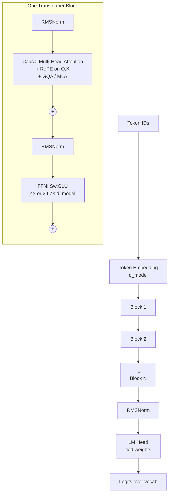
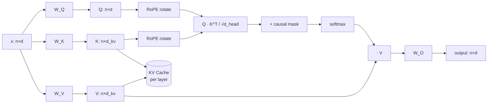
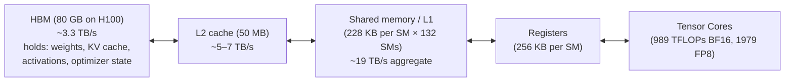
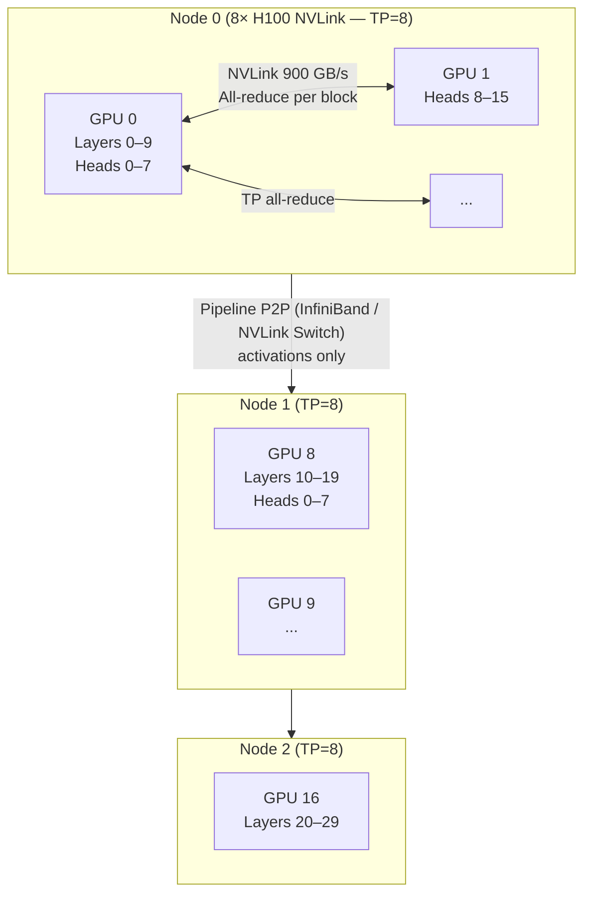

# Transformer

*Evaluated: the decoder-only Transformer as deployed in modern LLMs (Llama 3/4, GPT-5, Qwen 3, DeepSeek-V3, Mistral) circa May 2026. Reference paper: Vaswani et al., "Attention Is All You Need," NeurIPS 2017.*

## Summary

The Transformer is a sequence model whose **entire computational primitive is scaled dot-product attention plus a position-wise feed-forward network (FFN), stacked under residual connections and layer normalization**. It replaced the recurrence of RNN/LSTM (sequential, O(n) state) and the locality of CNNs (fixed receptive field) with a content-addressed, **parallel-over-token** operation, which is what made GPU-era pretraining at 10^12-token scale tractable. Its differentiators are (1) every token pair interacts in a single layer, giving uniform path length and trivially parallel training, and (2) the same architecture serves encoder, decoder, and encoder-decoder roles. Its costs are quadratic compute and memory in sequence length, large KV-cache memory at inference, and weak inductive bias (data-hungry). Pick a Transformer when you have abundant accelerators, abundant data, and need either long-range reasoning or in-context learning; reach for SSMs (Mamba-2), linear-attention RNNs (RWKV-7), or hybrids (Jamba, Zamba-2) when sequence length pushes past ~64k and the workload is dominated by streaming or recall-light tasks.

## Comparison

| Dimension | **Transformer (decoder-only, modern)** | **Mamba-2 / SSM** | **RWKV-7** | **LSTM / GRU** |
|---|---|---|---|---|
| Type / category | Attention-based sequence model | Selective state-space model | Linear-attention RNN | Gated RNN |
| Core architecture | Stacked blocks: multi-head attention + FFN, residual + RMSNorm; full softmax attention over all token pairs | Stacked SSM blocks; input-dependent state-transition matrices; convolutional or recurrent form | Time-mix (linear attention) + channel-mix; fully recurrent at inference | Cell state with input/forget/output gates, hidden state per timestep |
| Primary interfaces | PyTorch / JAX modules; HuggingFace `transformers`; vLLM / TensorRT-LLM / SGLang for serving; ONNX export | `mamba-ssm` PyTorch package; HF integrations; Triton kernels | `rwkv` PyPI; HF `rwkv` integration | Built-in to all frameworks (`torch.nn.LSTM`) |
| Training cost per token | O(n²·d) compute, O(n·d) activation (with FlashAttention) | O(n·d²) compute, O(d²) state | O(n·d²) | O(n·d²) sequential |
| Inference cost per token | O(n·d) attention + O(d²) FFN; **KV cache O(n·d) per layer** | O(d²) per token, **constant state** | O(d²) per token, constant state | O(d²), constant state, but sequential |
| Best fit | Pretraining at scale; in-context learning; multi-hop reasoning; tool-calling agents; vision-language | Very long (>64k) sequences; streaming audio/video; edge inference where KV cache won't fit | Edge inference; constant-memory chat; on-device | Small structured-sequence tasks (forecasting, simple NLP); legacy code |
| Advantages | Parallel training across the full sequence; uniform path length; strong in-context learning; mature ecosystem and tooling; hardware co-design (Tensor Cores, FlashAttention) | Linear-time inference; constant KV memory; competitive perplexity to a same-size Transformer | Fully recurrent inference; tiny KV equivalent (the hidden state); good throughput on CPU/edge | Tiny parameter count; well-understood; trivially deployable |
| Disadvantages | O(n²) attention; KV cache dominates inference memory; weak inductive bias (data hungry); high training capex | Weaker on multi-hop recall and copying tasks; less mature tooling; smaller community | Loses some accuracy on long-range recall vs. softmax attention; smaller ecosystem | Training is sequential (poor GPU utilization); vanishing/exploding gradients on long sequences; capped by ~10² effective context |
| Multi-GPU strategy | TP + PP + DP + EP + CP (Megatron-style); ring/context parallel for long context | DP + TP (less mature); pipelining works | DP; TP work-in-progress | DP only, in practice |
| Quantization support | FP16/BF16/FP8 standard; FP4/MXFP4 in Blackwell-era serving; INT4-AWQ/GPTQ widespread | FP16/BF16 standard; FP8 experimental | FP16/BF16; INT8 community kernels | FP16/INT8 |
| License | Architecture is public; specific weights vary (Apache 2.0, Llama community, OpenAI proprietary, etc.) | Apache 2.0 (reference impl) | Apache 2.0 | Public domain |
| Cost (training, rough) | Frontier dense ~70B model: 1–3M H100-hours (~$3–10M cloud); MoE ~600B (37B active) like DeepSeek-V3: ~2.8M H800-hours (~$5–6M reported) | ~Equal FLOPs to a same-param Transformer at training; fewer published frontier runs | Order-of-magnitude similar at same params; far fewer frontier runs | Negligible relative to the others |
| Cost (inference, rough) | 8×H100 80GB cluster ≈ $150–250k/yr reserved cloud; ~2,500 tok/s on Llama-70B FP8 with vLLM/TensorRT-LLM | Same hardware envelope; lower memory pressure at long context | Runs decently on a single 24 GB consumer GPU at 7B; CPU-viable | Single GPU sufficient for any practical size |

*Cost figures are public-list / rough estimates as of May 2026 — cloud GPU pricing and frontier training costs move quickly. Inference numbers are workload-dependent and drawn from third-party benchmarks of Llama-3.3-70B class models.*

## In-depth report

### 1. Architecture deep-dive

A modern decoder-only Transformer is **N identical blocks** between an input embedding and an output projection that ties back to the vocabulary. Within each block, two sublayers run in series: a causal multi-head attention sublayer and a position-wise FFN. Each sublayer is wrapped in a residual connection with pre-norm (RMSNorm in modern LLMs, replacing the original LayerNorm/post-norm).



**Embedding + un-embedding.** Token IDs index a `[vocab_size, d_model]` table. Modern LLMs typically **tie** the LM head to this same matrix to save parameters (~0.5–1B parameters on a 128k vocab × 8k d_model). Position is encoded **inside attention** via RoPE, not added to the embedding.

**Multi-head attention.** Given input `x ∈ R^{n×d}`, project to `Q, K, V ∈ R^{n×d}` using `W_Q, W_K, W_V`, reshape to `h` heads of dimension `d_head = d/h`, and compute:

```
softmax( (Q · K^T) / sqrt(d_head)  +  causal_mask ) · V
```

Modern decoder-only LLMs differ from the 2017 paper in five places that all matter for performance:

1. **Pre-norm with RMSNorm** instead of post-norm with LayerNorm — RMSNorm drops mean subtraction and the learnable bias `β`, giving a small (~5–15%) end-to-end speedup and more stable deep-stack training.
2. **RoPE** (Rotary Position Embedding) applied to Q and K before the dot product — rotates pairs of dimensions by position-dependent angles, so relative position falls out of the dot product. Replaces additive sinusoidal or learned absolute position embeddings. Enables straightforward context-window extension via base-frequency scaling (YaRN, NTK-aware).
3. **Grouped-Query Attention (GQA)** or **Multi-Head Latent Attention (MLA)** instead of vanilla multi-head attention. GQA gives `g` KV-head groups shared across the `h` query heads, shrinking the KV cache by `h/g` with negligible accuracy loss. Llama 3-70B uses 8 KV heads vs. 64 query heads (8×). DeepSeek-V3's MLA projects K and V into a small latent that is cached and decompressed on the fly, cutting the cache further at the cost of a small extra matmul.
4. **SwiGLU FFN** instead of GELU/ReLU — three linear layers (`W_gate`, `W_up`, `W_down`) with `(SiLU(x·W_gate) ⊙ (x·W_up)) · W_down`. About 50% more FFN params for the same intermediate width but consistently lower perplexity.
5. **Causal masking** is mandatory for decoder-only training/inference; bidirectional encoders drop the mask.



**Mixture-of-Experts variant.** MoE Transformers replace the FFN with `E` parallel expert FFNs and a router that picks the top-`k` (typically k=1 or 2). DeepSeek-V3 has 256 routed experts + 1 shared expert per layer, k=8, yielding 671B total / 37B active parameters per token. Mixtral 8×7B uses 8 experts / k=2 for 46.7B / 12.9B. MoE adds expert-parallel (EP) communication on top of the standard parallelism stack.

### 2. Key design patterns and trade-offs

**Why attention instead of recurrence.** Attention gives every token a direct edge to every other token in *one* layer, so gradient path length is O(1) regardless of sequence length, and the forward pass is fully parallel across the sequence. RNNs/LSTMs have O(n) path length and are forced to compute sequentially, which leaves Tensor Cores idle during training. The trade-off is the well-known O(n²) compute and memory in attention; for the sequence lengths Transformers were originally designed for (≤2048), the wall-clock and memory cost of softmax attention was acceptable, and FlashAttention later pushed that ceiling to 100k+ on a single GPU.

**Why pre-norm + residual.** Post-norm (original paper) requires careful warmup and is fragile beyond ~12 layers; pre-norm with RMSNorm trains stably to 100+ layers. Residual connections give the model an "identity baseline" so layers only learn deltas — critical for very deep stacks.

**Why GQA / MLA.** At long context, the KV cache, not the weights, dominates GPU memory. For a 70B model at 32k context and BF16, a full-MHA cache is ~40 GB; GQA at 8× cuts it to ~5 GB. MLA on DeepSeek-V3 reduces the per-token KV size further to ~70 KB by caching a compressed latent. This is what makes 100k+ context economically viable.

**Why RoPE.** Sinusoidal position embeddings were absolute and additive; the model had to learn how to convert absolute positions into relative ones. RoPE rotates Q/K by an angle proportional to position, so `(R_m Q) · (R_n K)^T = Q · R_{n-m} · K^T` — relative position is *built into* the dot product, parameter-free, and well-behaved under base-frequency interpolation for context-length extension.

**Why SwiGLU.** Gated activations consistently beat unbounded ones (ReLU, GELU) at fixed parameter budgets in the modern recipe; the gain is small but reproduces across labs.

### 3. Numerical and correctness model

- **Training precision.** BF16 weights + FP32 master copy + BF16 activations is the workhorse. FP8 training (E4M3 forward, E5M2 backward) on Hopper/Blackwell saves ~30–50% memory and gives ~1.5–2× throughput; numerical stability requires per-tensor scaling and occasional FP32 fallback in normalization.
- **Determinism.** Strict determinism is rarely achieved: `softmax` over many tokens is reduction-order dependent, FlashAttention reorders blocks, and NCCL collectives have non-deterministic kernels by default. With `TORCH_DETERMINISTIC_OPS=1` and deterministic kernels you pay 10–30% throughput.
- **FlashAttention correctness.** Online softmax tiles the sequence into blocks, keeps running max and sum statistics per block, and combines them at the end. Output is **bit-equivalent** to naive attention in the same dtype up to floating-point reassociation noise — but the IEEE-754 result differs by a small ULP-scale amount.
- **Quantization accuracy.** FP8 weights+activations typically lose <0.5% on standard evals vs. BF16. INT4 weight-only (AWQ, GPTQ) loses 1–3% but cuts memory 4×. Aggressive 2-bit quant (TurboQuant, AQLM) gives 8× weight compression with ~3–8% degradation; only used when memory is the binding constraint.

### 4. Performance characteristics

| Metric | Driver | Typical numbers |
|---|---|---|
| Training throughput | Tensor Core utilization (MFU) | 35–55% MFU on H100 BF16 for a well-tuned 70B run; 50–65% with FP8 |
| TTFT (Time To First Token) | Prefill cost — dominated by attention quadratic and FFN matmuls | ~70 ms at concurrency 1, ~1.4 s at concurrency 100 for Llama-70B FP8 on a single H100 (vLLM, ~512-token prompt) |
| ITL (Inter-Token Latency) | Per-step decode — memory-bandwidth-bound; KV reads grow with context | ~10–20 ms/token at concurrency 1 |
| Decode throughput | Batch size × KV cache fit | ~2,400–2,800 tok/s on a single H100 80GB for Llama-3.3-70B FP8 at concurrency 100 |
| Long-context efficiency | KV cache size, attention compute | Quadratic prefill; attention dominates past ~16k context unless windowed/sparse |

**FLOPs per token.** A rule of thumb: forward pass is `~2 · N` FLOPs per token, where `N` is the (active) parameter count. Training is `~6 · N` per token (forward + backward + optimizer). A 70B dense model processing 10T training tokens therefore costs ~4 × 10^24 FLOPs ≈ 1–2 million H100-hours at BF16.

### 5. How the Transformer maps to a GPU

This is where most of the deployment complexity lives. The Transformer has been **co-designed with the GPU memory hierarchy** since FlashAttention-1 in 2022.

#### 5.1 Single-GPU memory hierarchy



The hot path for one Transformer block:

| Operation | Compute pattern | Bottleneck |
|---|---|---|
| QKV projection (`x · W_QKV`) | GEMM, n×d × d×3d | Tensor Cores (compute-bound at training, memory-bound at decode batch=1) |
| Attention `Q·K^T` then `·V` | Two batched GEMMs + softmax | HBM bandwidth — without fusion, materializes n×n matrix |
| Output projection (`A·W_O`) | GEMM | Same as QKV |
| FFN `W_up`, `W_gate`, `W_down` | Three GEMMs + elementwise SwiGLU | Largest compute; ~⅔ of total per-block FLOPs |
| RMSNorm + residual | Elementwise reduction | HBM bandwidth |

**FlashAttention** is the canonical example of GPU-aware Transformer design. The naive attention kernel reads `Q, K, V` from HBM, materializes the `n×n` attention matrix back into HBM, reads it again for the softmax, writes it again, then reads it for the matmul with `V`. FlashAttention tiles the sequence into blocks that fit in **shared memory (SRAM)**, computes the softmax incrementally with running statistics, and never materializes the full attention matrix to HBM. The result is the same value (up to FP reassociation) at a fraction of the HBM traffic — and because attention at moderate sequence lengths is memory-bound, throughput goes up 2–4× and peak memory drops from O(n²) to O(n).

**FlashAttention-3** (Hopper, July 2024) goes further by exploiting H100-specific features:

- **WGMMA** (warpgroup MMA) — async tensor-core matmuls that overlap with subsequent ops.
- **TMA** (Tensor Memory Accelerator) — dedicated hardware unit that copies tiles between HBM and shared memory without burning registers on address math.
- **Warp specialization** — one warp group handles softmax while another drives WGMMA, so compute and softmax don't serialize.
- **FP8 block quantization + incoherent processing** for accurate low-precision attention.

Reported numbers on H100: **740 TFLOP/s BF16 (~75% Tensor Core utilization)** and **~1.2 PFLOP/s FP8**, 1.5–2.0× over FlashAttention-2.

#### 5.2 Multi-GPU partitioning (Megatron-style)

A frontier model does not fit on one GPU. The standard "5D parallelism" stack:

| Dimension | What it shards | Communication | When to use |
|---|---|---|---|
| **Data Parallel (DP)** | Batch | All-reduce on gradients each step | Always (if model fits) |
| **Tensor Parallel (TP)** | Inside-a-layer matmuls | Two all-reduces per block (attn output, FFN output) — intra-node NVLink | Model doesn't fit on one GPU; up to TP=8 on NVLink |
| **Pipeline Parallel (PP)** | Layers across GPUs | Activations between stages — point-to-point | Beyond TP limit; interleaved (1F1B) to reduce bubble |
| **Expert Parallel (EP)** | MoE experts across GPUs | All-to-all per layer for token routing | MoE models only |
| **Context Parallel (CP)** | Sequence dimension inside attention | Ring all-reduce of KV blocks (ring/striped attention) | Long-context training (>32k) |

Megatron-LM's tensor-parallel decomposition is the textbook example. For the attention block, `W_Q, W_K, W_V` are **column-partitioned** (each GPU owns a slice of heads), the attention computation is fully local *per head*, and the output projection `W_O` is **row-partitioned**, so a single all-reduce at the end of the block reassembles the output. The FFN follows the same pattern: `W_up` and `W_gate` are column-partitioned, `W_down` is row-partitioned, with one all-reduce at the FFN output.



**Why TP stops at 8.** TP all-reduces happen twice per block on the critical path. NVLink within a single 8-GPU H100 server gives ~900 GB/s per GPU; once you cross to InfiniBand at ~400 Gb/s (~50 GB/s), the all-reduce becomes the bottleneck. Hence: **TP ≤ 8 (intra-node), then PP across nodes, then DP across replicas.**

**Context parallelism / ring attention.** For long context (>32k), even the activations of a single block exceed one GPU's memory. Ring attention splits the sequence across `r` GPUs, then rotates K/V blocks around the ring while computing partial attentions; each GPU sees the full sequence over `r` steps without ever materializing it.

**KV cache placement at inference.** Inference doesn't usually use PP (latency-sensitive) — it uses TP within a node and DP across replicas. The KV cache lives in HBM; modern serving engines (vLLM, SGLang, TensorRT-LLM) page it into fixed-size blocks (PagedAttention) so that fragmentation doesn't waste memory at varying sequence lengths.

### 6. Operational model

- **Pretraining.** Megatron-Core / NeMo / DeepSpeed are the dominant frameworks at frontier scale. A 70B run typically uses TP=8, PP=4–8, DP=N for several thousand H100s, BF16 with FP32 master weights, ZeRO-1 optimizer sharding. Mid-2025 onward, FP8 training (transformer engine, MS-AMP) is common for new runs.
- **Post-training.** SFT + DPO/RLHF on ~10⁵–10⁷ examples; LoRA / QLoRA for parameter-efficient fine-tuning on a single node.
- **Inference.** vLLM is the default OSS serving engine; TensorRT-LLM for peak NVIDIA throughput; SGLang for prefix-heavy workloads. See `ai/vllm.md` in this repo.
- **Observability.** Per-block activation norms, gradient norms, attention-entropy probes, loss spike detection. Loss spikes during training usually come from numerical instability in attention softmax — fixed by Z-loss, QK-norm, or careful initialization.

### 7. Security and isolation

- **Prompt injection** is the primary application-level concern; not solved at the architecture layer.
- **Training-data leakage.** Large Transformers memorize verbatim a small fraction of training data (≪1% but non-zero), recoverable by adversarial prompting. Deduplication and DP-SGD reduce but do not eliminate this.
- **Side channels.** Shared multi-tenant inference can leak through timing (KV-cache hits reveal prior prompts). Production serving engines isolate per-tenant block tables to prevent cross-tenant prefix-cache reuse.

### 8. Ecosystem and integrations

- **Training:** PyTorch (FSDP, Megatron-Core), JAX (MaxText, T5X), DeepSpeed.
- **Serving:** vLLM, TensorRT-LLM, SGLang, TGI, llama.cpp (CPU/edge), MLC-LLM.
- **Kernels:** FlashAttention, FlashInfer, xFormers, CUTLASS/CUTE, Triton, ThunderKittens.
- **Hardware vendors:** NVIDIA (CUDA + Tensor Cores), AMD (ROCm + Matrix Cores on MI300X/MI350X), Google (TPU v5e/v6e/v8i with `pallas`/XLA), AWS Trainium/Inferentia, Intel Gaudi 3.
- **Model hubs:** Hugging Face Hub, Modelscope.

### 9. When to pick a Transformer (and when not to)

**Pick a Transformer when:**

- You need **in-context learning** (few-shot, tool use, agentic workflows). No SSM or RNN comes close on this.
- Workload requires **multi-hop reasoning** or **exact recall** from long context (code, document QA).
- You have **abundant accelerators and data** — Transformers reward both nearly linearly.
- You want to leverage the **largest software ecosystem** in ML.

**Avoid (or hybridize with SSM/linear-attention) when:**

- Inference workload is **streaming with very long context** (>100k tokens) and KV cache memory dominates cost — consider Mamba-2, RWKV-7, or Jamba.
- Deployment target is **strictly memory-constrained edge** (phones, embedded) and the model must run with constant memory per token.
- Task is a **simple short-sequence problem** (sub-1k tokens, structured forecasting) where an LSTM at 100× lower cost is sufficient.
- Sequence length is enormous and **content lookup is not required** (e.g., long-form audio generation) — SSMs win on FLOPs and memory.

### 10. TL;DR

The Transformer is the dominant sequence model of 2026 because attention parallelizes perfectly over tokens and maps cleanly onto Tensor Cores, and because eight years of co-design (FlashAttention, RoPE, GQA/MLA, MoE, FP8) have squeezed roughly two orders of magnitude out of the original 2017 design without changing its bones. It pays for that with O(n²) attention compute, large KV caches at long context, and a heavy training capex bill — costs that SSMs (Mamba-2) and linear-attention RNNs (RWKV-7) are credibly chipping at for long-sequence workloads, but neither has yet matched its in-context-learning quality.

## Sources

- [Vaswani et al., "Attention Is All You Need" (arXiv:1706.03762)](https://arxiv.org/abs/1706.03762) — accessed 2026-05
- [Transformer (deep learning architecture) — Wikipedia](https://en.wikipedia.org/wiki/Transformer_(deep_learning_architecture)) — accessed 2026-05
- [Dao et al., "FlashAttention-3: Fast and Accurate Attention with Asynchrony and Low-precision" (arXiv:2407.08608)](https://arxiv.org/abs/2407.08608) — accessed 2026-05
- [FlashAttention-3 — PyTorch blog](https://pytorch.org/blog/flashattention-3/) — accessed 2026-05
- [Tri Dao's blog: FlashAttention-3](https://tridao.me/blog/2024/flash3/) — accessed 2026-05
- [Colfax Research: FlashAttention-3](https://research.colfax-intl.com/flashattention-3-fast-and-accurate-attention-with-asynchrony-and-low-precision/) — accessed 2026-05
- [Dao-AILab/flash-attention (GitHub)](https://github.com/Dao-AILab/flash-attention) — accessed 2026-05
- [Su et al., "RoFormer: Enhanced Transformer with Rotary Position Embedding" (arXiv:2104.09864)](https://arxiv.org/abs/2104.09864) — accessed 2026-05
- [EleutherAI Blog: Rotary Embeddings — A Relative Revolution](https://blog.eleuther.ai/rotary-embeddings/) — accessed 2026-05
- [Ainslie et al., "GQA: Training Generalized Multi-Query Transformer Models" (arXiv:2305.13245)](https://arxiv.org/abs/2305.13245) — accessed 2026-05
- [IBM Think: What is grouped query attention (GQA)?](https://www.ibm.com/think/topics/grouped-query-attention) — accessed 2026-05
- [TensorRT-LLM docs: Multi-Head, Multi-Query, and Group-Query Attention](https://nvidia.github.io/TensorRT-LLM/advanced/gpt-attention.html) — accessed 2026-05
- [NVIDIA/Megatron-LM (GitHub)](https://github.com/NVIDIA/Megatron-LM) — accessed 2026-05
- [Megatron-LM paper (Shoeybi et al., 2019)](https://arxiv.org/abs/1909.08053) — accessed 2026-05
- [Narayanan et al., "Efficient Large-Scale Language Model Training on GPU Clusters Using Megatron-LM"](https://people.eecs.berkeley.edu/~matei/papers/2021/sc_megatron_lm.pdf) — accessed 2026-05
- [Megatron Bridge: Parallelisms Guide (NVIDIA docs)](https://docs.nvidia.com/nemo/megatron-bridge/latest/parallelisms.html) — accessed 2026-05
- [PyTorch Tutorial: Large-Scale Transformer training with Tensor Parallel](https://docs.pytorch.org/tutorials/intermediate/TP_tutorial.html) — accessed 2026-05
- [Gu & Dao, "Mamba: Linear-Time Sequence Modeling with Selective State Spaces" (arXiv:2312.00752)](https://arxiv.org/abs/2312.00752) — accessed 2026-05
- [Goomba Lab: On the Tradeoffs of SSMs and Transformers](https://goombalab.github.io/blog/2025/tradeoffs/) — accessed 2026-05
- [The Gradient: Mamba Explained](https://thegradient.pub/mamba-explained/) — accessed 2026-05
- [DeepSeek-V3 Technical Report (TechRxiv)](https://www.techrxiv.org/users/962529/articles/1331367-unpacking-deepseek-v3-from-architectural-renovations-to-technical-innovations) — accessed 2026-05
- [Cameron Wolfe: Mixture-of-Experts (MoE) LLMs](https://cameronrwolfe.substack.com/p/moe-llms) — accessed 2026-05
- [NVIDIA blog: Mixture of Experts on Blackwell NVL72](https://blogs.nvidia.com/blog/mixture-of-experts-frontier-models/) — accessed 2026-05
- [Sebastian Raschka: Grouped-Query Attention](https://sebastianraschka.com/llms-from-scratch/ch04/04_gqa/) — accessed 2026-05
- [Liu et al., "Ring Attention with Blockwise Transformers" (arXiv:2310.01889)](https://arxiv.org/abs/2310.01889) — accessed 2026-05
- [Zhang & Sennrich, "Root Mean Square Layer Normalization" (arXiv:1910.07467)](https://arxiv.org/abs/1910.07467) — accessed 2026-05
- [Shazeer, "GLU Variants Improve Transformer" (arXiv:2002.05202)](https://arxiv.org/abs/2002.05202) — accessed 2026-05
