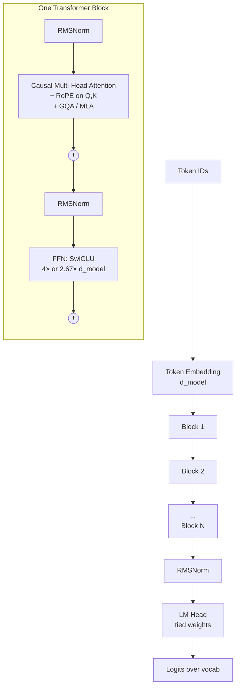
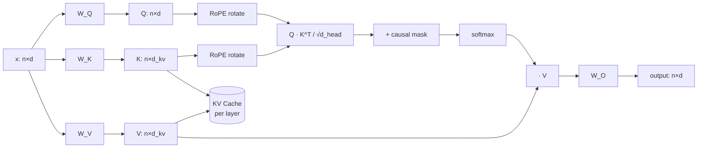
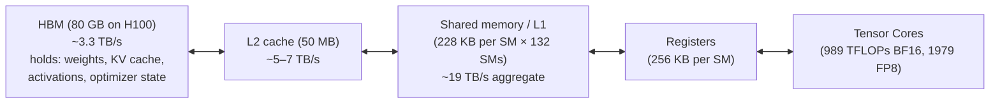
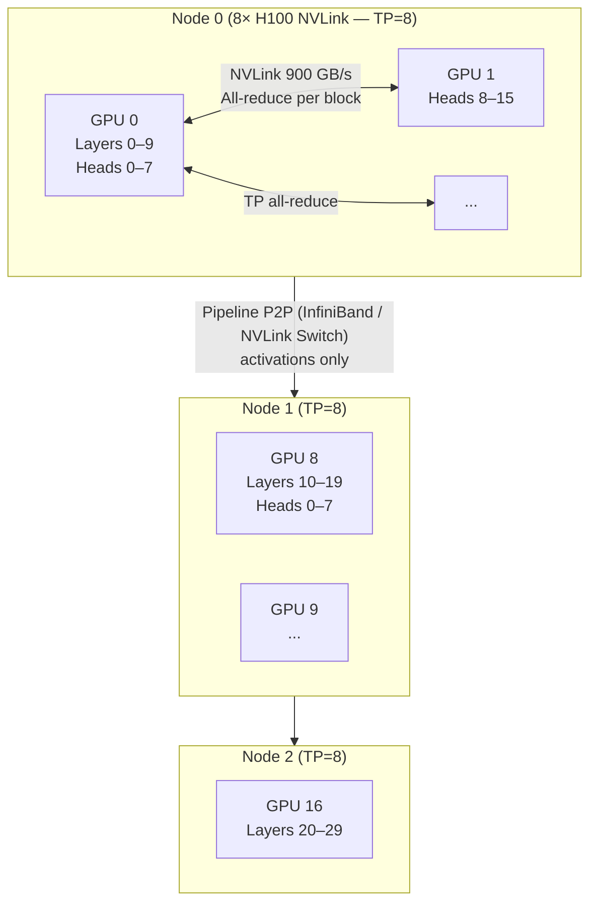

# Transformer

*評估對象：現代 LLM（Llama 3/4、GPT-5、Qwen 3、DeepSeek-V3、Mistral）中部署的 decoder-only Transformer，約 2026 年 5 月。參考論文：Vaswani et al., "Attention Is All You Need," NeurIPS 2017。*

## 摘要

Transformer 是一種序列模型，其**整個計算原語為 scaled dot-product attention 加上 position-wise feed-forward network (FFN)，並在 residual connection 與 layer normalization 之下堆疊而成**。它以一種內容定址、**對 token 平行**的運算，取代了 RNN/LSTM 的遞迴（循序執行、O(n) 狀態）以及 CNN 的局部性（固定感受野），這也正是使 GPU 時代得以在 10^12 token 規模進行預訓練成為可行的關鍵。其差異化特徵在於：(1) 每對 token 在單一層內即可互相互動，提供統一的路徑長度與天然平行的訓練；(2) 同一套架構可同時擔任 encoder、decoder 與 encoder-decoder 角色。代價是序列長度上的二次方計算與記憶體成本、推論時龐大的 KV cache 記憶體，以及較弱的歸納偏置（資料需求大）。當你擁有充裕的加速器、充裕的資料，且需要長距推理或 in-context learning 時，請選擇 Transformer；當序列長度超過約 64k，且工作負載以串流或低回溯需求為主時，請考慮 SSM（Mamba-2）、linear-attention RNN（RWKV-7），或混合架構（Jamba、Zamba-2）。

## 比較

| 維度 | **Transformer (decoder-only, modern)** | **Mamba-2 / SSM** | **RWKV-7** | **LSTM / GRU** |
|---|---|---|---|---|
| 類型／類別 | 基於 attention 的序列模型 | Selective state-space 模型 | Linear-attention RNN | Gated RNN |
| 核心架構 | 堆疊區塊：multi-head attention + FFN，residual + RMSNorm；對所有 token pair 進行完整 softmax attention | 堆疊 SSM 區塊；輸入相依的狀態轉移矩陣；卷積或遞迴形式 | Time-mix（linear attention）+ channel-mix；推論時完全遞迴 | 具有 input/forget/output gate 的 cell state，每個時間步有一個 hidden state |
| 主要介面 | PyTorch / JAX 模組；HuggingFace `transformers`；vLLM / TensorRT-LLM / SGLang 用於服務；ONNX 匯出 | `mamba-ssm` PyTorch 套件；HF 整合；Triton kernel | `rwkv` PyPI；HF `rwkv` 整合 | 內建於所有框架（`torch.nn.LSTM`） |
| 每 token 訓練成本 | O(n²·d) 計算、O(n·d) activation（搭配 FlashAttention） | O(n·d²) 計算、O(d²) 狀態 | O(n·d²) | O(n·d²) 循序 |
| 每 token 推論成本 | O(n·d) attention + O(d²) FFN；**每層 KV cache O(n·d)** | 每 token O(d²)，**常數狀態** | 每 token O(d²)，常數狀態 | O(d²)，常數狀態，但需循序 |
| 最佳適用場景 | 大規模預訓練；in-context learning；multi-hop 推理；tool-calling agent；vision-language | 超長（>64k）序列；串流音訊/影片；KV cache 無法容納的邊緣推論 | 邊緣推論；常數記憶體聊天；裝置端 | 小型結構化序列任務（預測、簡易 NLP）；遺留程式碼 |
| 優點 | 跨整個序列的平行訓練；統一路徑長度；強大的 in-context learning；成熟的生態系與工具；硬體協同設計（Tensor Cores、FlashAttention） | 線性時間推論；常數 KV 記憶體；perplexity 與同規模 Transformer 相當 | 完全遞迴推論；KV 等價物極小（即 hidden state）；CPU/edge 上吞吐量佳 | 參數量極少；理解透徹；部署簡單 |
| 缺點 | O(n²) attention；KV cache 主導推論記憶體；歸納偏置弱（資料需求大）；訓練資本支出高 | 在 multi-hop 回溯與 copying 任務上較弱；工具較不成熟；社群較小 | 與 softmax attention 相比，長距回溯精度略低；生態系較小 | 訓練為循序（GPU 利用率差）；長序列上 vanishing/exploding gradient；有效 context 上限約 10² |
| 多 GPU 策略 | TP + PP + DP + EP + CP（Megatron-style）；長 context 使用 ring/context parallel | DP + TP（較不成熟）；pipelining 可用 | DP；TP 開發中 | 實務上僅 DP |
| 量化支援 | FP16/BF16/FP8 標準；Blackwell 世代服務中採用 FP4/MXFP4；INT4-AWQ/GPTQ 廣泛使用 | FP16/BF16 標準；FP8 實驗中 | FP16/BF16；INT8 社群 kernel | FP16/INT8 |
| 授權 | 架構為公開；具體權重各異（Apache 2.0、Llama community、OpenAI proprietary 等） | Apache 2.0（reference impl） | Apache 2.0 | 公有領域 |
| 成本（訓練，概略） | 前沿 dense ~70B 模型：1–3M H100-hours（約 $3–10M 雲端）；MoE ~600B（37B active）如 DeepSeek-V3：約 2.8M H800-hours（據報約 $5–6M） | 在訓練時 FLOPs 與同參數 Transformer 相近；公開前沿訓練紀錄較少 | 在相同參數下大致同數量級；前沿訓練紀錄遠少 | 相對於其他幾類可忽略 |
| 成本（推論，概略） | 8×H100 80GB 叢集約 $150–250k/年 reserved 雲端；Llama-70B FP8 搭配 vLLM/TensorRT-LLM 約 2,500 tok/s | 相同硬體規格；長 context 下記憶體壓力較低 | 7B 模型可在單張 24 GB 消費級 GPU 上順利運作；CPU 也可行 | 任何實用規模單 GPU 即足夠 |

*成本數字為 2026 年 5 月當下的公開定價／概略估算 — 雲端 GPU 定價與前沿訓練成本變動很快。推論數字與工作負載相關，且取自第三方對 Llama-3.3-70B 等級模型的基準測試。*

## 深入報告

### 1. 架構深入剖析

現代 decoder-only Transformer 由 **N 個相同的區塊**組成，前後分別接一個輸入 embedding 與綁定回 vocabulary 的輸出投影。每個區塊內依序執行兩個子層：causal multi-head attention 子層與 position-wise FFN。每個子層皆套上 residual connection 與 pre-norm（現代 LLM 採用 RMSNorm，取代原先的 LayerNorm/post-norm）。



**Embedding 與 un-embedding。** Token ID 索引一個 `[vocab_size, d_model]` 表。現代 LLM 通常**綁定（tie）**LM head 至同一矩陣以節省參數（在 128k vocab × 8k d_model 上約節省 0.5–1B 參數）。位置資訊在 **attention 內部**透過 RoPE 編碼，而非加到 embedding 上。

**Multi-head attention。** 對於輸入 `x ∈ R^{n×d}`，使用 `W_Q, W_K, W_V` 投影為 `Q, K, V ∈ R^{n×d}`，重塑為 `h` 個維度為 `d_head = d/h` 的 head，並計算：

```
softmax( (Q · K^T) / sqrt(d_head)  +  causal_mask ) · V
```

現代 decoder-only LLM 與 2017 年論文有五處差異，這些差異都影響效能：

1. **採用 RMSNorm 的 pre-norm**，而非 LayerNorm 的 post-norm — RMSNorm 省去平均值減法與可學習偏置 `β`，帶來小幅（約 5–15%）的端到端加速與更穩定的深堆疊訓練。
2. **RoPE**（Rotary Position Embedding）在點積前套用於 Q 與 K — 以與位置相關的角度旋轉成對的維度，使相對位置自然落在點積中。取代加性的 sinusoidal 或學習式絕對位置 embedding。透過 base-frequency scaling（YaRN、NTK-aware）可直接擴展 context window。
3. 使用 **Grouped-Query Attention (GQA)** 或 **Multi-Head Latent Attention (MLA)** 取代原版 multi-head attention。GQA 提供 `g` 個 KV-head 群組共用於 `h` 個 query head，將 KV cache 縮小 `h/g` 倍，且精度損失可忽略。Llama 3-70B 使用 8 個 KV head 對應 64 個 query head（8×）。DeepSeek-V3 的 MLA 將 K 與 V 投影到一個小型 latent，該 latent 被快取並在使用時即時解壓，以額外的小型 matmul 為代價進一步縮減 cache。
4. **SwiGLU FFN** 取代 GELU/ReLU — 由三個線性層（`W_gate`、`W_up`、`W_down`）組成，計算為 `(SiLU(x·W_gate) ⊙ (x·W_up)) · W_down`。相同中間寬度下 FFN 參數約多 50%，但 perplexity 始終較低。
5. **Causal masking** 對 decoder-only 的訓練／推論是必要的；雙向 encoder 則不使用 mask。



**Mixture-of-Experts 變體。** MoE Transformer 將 FFN 替換為 `E` 個並行的 expert FFN，並由一個 router 挑選 top-`k`（通常 k=1 或 2）。DeepSeek-V3 每層有 256 個 routed expert + 1 個 shared expert，k=8，總參數 671B、每個 token 啟用 37B。Mixtral 8×7B 使用 8 個 expert / k=2，總參數 46.7B、啟用 12.9B。MoE 在標準平行化堆疊之上額外加入 expert-parallel (EP) 通訊。

### 2. 關鍵設計模式與取捨

**為何採用 attention 而非 recurrence。** Attention 在*單一*層內即讓每個 token 對所有其他 token 有直接邊，因此無論序列長度多長，梯度路徑長度皆為 O(1)，且前向過程可在整個序列上完全平行。RNN/LSTM 的路徑長度為 O(n)，且被迫循序計算，這在訓練時讓 Tensor Core 閒置。代價是眾所周知的 attention O(n²) 計算與記憶體；以 Transformer 最初設計的序列長度（≤2048）來看，softmax attention 的時間與記憶體成本可接受，後續 FlashAttention 又將此上限在單張 GPU 上推升至 100k+。

**為何採用 pre-norm + residual。** Post-norm（原論文）需要謹慎的 warmup，且在約 12 層後就變得脆弱；採用 RMSNorm 的 pre-norm 可穩定訓練到 100 層以上。Residual connection 提供模型一個「identity baseline」，使各層只需學習 delta — 這對於非常深的堆疊至關重要。

**為何採用 GQA / MLA。** 在長 context 下，是 KV cache 而非權重主導 GPU 記憶體。對於 32k context、BF16 的 70B 模型，full-MHA cache 約為 40 GB；8× GQA 將其縮減至約 5 GB。DeepSeek-V3 上的 MLA 透過快取壓縮後的 latent，將每個 token 的 KV size 進一步降至約 70 KB。這就是使 100k+ context 在經濟上可行的關鍵。

**為何採用 RoPE。** Sinusoidal 位置 embedding 是絕對且加性的；模型必須學會將絕對位置轉換為相對位置。RoPE 按照與位置成比例的角度旋轉 Q/K，因此 `(R_m Q) · (R_n K)^T = Q · R_{n-m} · K^T` — 相對位置*內建*於點積中，無參數，且在 base-frequency 內插下表現良好，可用於 context-length 擴展。

**為何採用 SwiGLU。** 在固定參數預算下，現代配方中 gated activation 始終勝過無界的（ReLU、GELU）；增益雖小但在不同實驗室都可重現。

### 3. 數值與正確性模型

- **訓練精度。** BF16 權重 + FP32 master copy + BF16 activation 是主力配置。在 Hopper/Blackwell 上的 FP8 訓練（前向 E4M3、反向 E5M2）可節省約 30–50% 記憶體並帶來約 1.5–2× 的吞吐量；數值穩定性需要 per-tensor scaling，且 normalization 偶爾需要 FP32 fallback。
- **Determinism。** 嚴格的 determinism 極少達成：對許多 token 的 `softmax` 與 reduction 順序相關，FlashAttention 重新排序 block，且 NCCL collective 預設為非確定性 kernel。設定 `TORCH_DETERMINISTIC_OPS=1` 並使用確定性 kernel 會付出 10–30% 吞吐量。
- **FlashAttention 正確性。** Online softmax 將序列切成 block，每個 block 維持 running 的最大值與總和統計，並於最後合併。輸出在同一 dtype 下與原始 attention **位元等價**，僅有浮點重結合（reassociation）造成的差異 — 但 IEEE-754 結果會有少量 ULP-scale 的差異。
- **量化精度。** FP8 weights+activations 在標準評測上相對 BF16 通常損失 <0.5%。INT4 weight-only（AWQ、GPTQ）損失 1–3% 但記憶體縮減 4×。激進的 2-bit 量化（TurboQuant、AQLM）提供 8× 權重壓縮但有約 3–8% 退化；僅在記憶體成為限制條件時使用。

### 4. 效能特性

| 指標 | 驅動因素 | 典型數字 |
|---|---|---|
| 訓練吞吐量 | Tensor Core 利用率（MFU） | 經過良好調校的 70B 訓練在 H100 BF16 上達 35–55% MFU；FP8 達 50–65% |
| TTFT (Time To First Token) | Prefill 成本 — 由 attention 的二次方與 FFN matmul 主導 | Llama-70B FP8 在單張 H100（vLLM、約 512 token prompt）上於 concurrency 1 約 70 ms，concurrency 100 約 1.4 s |
| ITL (Inter-Token Latency) | 每步 decode — 受記憶體頻寬限制；KV 讀取隨 context 增加 | concurrency 1 時約 10–20 ms/token |
| Decode 吞吐量 | Batch size × KV cache 容納度 | Llama-3.3-70B FP8 在單張 H100 80GB、concurrency 100 下約 2,400–2,800 tok/s |
| 長 context 效率 | KV cache 大小、attention 計算 | Prefill 為二次方；超過約 16k context 後，除非採用 windowed/sparse，attention 即主導 |

**每 token FLOPs。** 一個經驗法則：前向過程每 token 約為 `~2 · N` FLOPs，其中 `N` 為（active）參數量。訓練每 token 為 `~6 · N`（forward + backward + optimizer）。因此一個處理 10T 訓練 token 的 70B dense 模型約耗費 4 × 10^24 FLOPs，於 BF16 下約 1–2 百萬 H100-hours。

### 5. Transformer 如何對應到 GPU

這正是大部分部署複雜性所在之處。自 2022 年 FlashAttention-1 起，Transformer 即與 **GPU 記憶體階層協同設計**。

#### 5.1 單 GPU 記憶體階層



單一 Transformer 區塊的熱路徑：

| 運算 | 計算模式 | 瓶頸 |
|---|---|---|
| QKV 投影（`x · W_QKV`） | GEMM，n×d × d×3d | Tensor Core（訓練時受計算限制；decode batch=1 時受記憶體限制） |
| Attention `Q·K^T` 再 `·V` | 兩個 batched GEMM + softmax | HBM 頻寬 — 未融合時會將 n×n 矩陣物化 |
| 輸出投影（`A·W_O`） | GEMM | 與 QKV 相同 |
| FFN `W_up`、`W_gate`、`W_down` | 三個 GEMM + elementwise SwiGLU | 計算量最大；約佔每區塊 FLOPs 的 ⅔ |
| RMSNorm + residual | Elementwise reduction | HBM 頻寬 |

**FlashAttention** 是 GPU-aware Transformer 設計的典型範例。原始 attention kernel 從 HBM 讀入 `Q, K, V`，將 `n×n` 的 attention 矩陣物化回 HBM，再讀回進行 softmax、再寫回，然後再讀回與 `V` 做 matmul。FlashAttention 將序列切成可容納於 **shared memory (SRAM)** 的 block，使用 running 統計遞增地計算 softmax，且從不將完整 attention 矩陣物化至 HBM。結果在同一 dtype 下值相同（僅有 FP 重結合差異），但 HBM 流量僅佔一小部分 — 而且因為中等序列長度下 attention 受記憶體限制，吞吐量可提升 2–4×，峰值記憶體從 O(n²) 降至 O(n)。

**FlashAttention-3**（Hopper，2024 年 7 月）進一步利用 H100 特定功能：

- **WGMMA**（warpgroup MMA） — 非同步 tensor-core matmul，可與後續運算重疊。
- **TMA**（Tensor Memory Accelerator） — 專用硬體單元，在 HBM 與 shared memory 之間複製 tile，無需在 register 上消耗位址運算。
- **Warp specialization** — 一個 warp group 處理 softmax，另一個驅動 WGMMA，使計算與 softmax 不會序列化。
- **FP8 block quantization + incoherent processing**，提供精確的低精度 attention。

H100 上的報告數字：**740 TFLOP/s BF16（約 75% Tensor Core 利用率）**與**約 1.2 PFLOP/s FP8**，相較 FlashAttention-2 提升 1.5–2.0×。

#### 5.2 多 GPU 分割（Megatron-style）

前沿模型無法塞進單張 GPU。標準的「5D parallelism」堆疊：

| 維度 | 分片對象 | 通訊 | 使用時機 |
|---|---|---|---|
| **Data Parallel (DP)** | Batch | 每步在梯度上 all-reduce | 永遠使用（若模型可塞進） |
| **Tensor Parallel (TP)** | 層內 matmul | 每區塊兩次 all-reduce（attn 輸出、FFN 輸出） — 節點內 NVLink | 模型無法塞進單張 GPU；在 NVLink 上最高 TP=8 |
| **Pipeline Parallel (PP)** | 跨 GPU 的層 | stage 之間的 activation — point-to-point | 超出 TP 上限時；採 interleaved (1F1B) 以減少 bubble |
| **Expert Parallel (EP)** | 跨 GPU 的 MoE expert | 每層 all-to-all 進行 token routing | 僅限 MoE 模型 |
| **Context Parallel (CP)** | Attention 內的序列維度 | KV block 的 ring all-reduce（ring/striped attention） | 長 context 訓練（>32k） |

Megatron-LM 的 tensor-parallel 分解是教科書範例。對於 attention block，`W_Q, W_K, W_V` 採 **column-partitioned**（每張 GPU 擁有一部分 head），attention 計算*在每個 head 內*完全在地，而輸出投影 `W_O` 採 **row-partitioned**，因此區塊結尾只需一次 all-reduce 即可重組輸出。FFN 遵循相同模式：`W_up` 與 `W_gate` 為 column-partitioned，`W_down` 為 row-partitioned，FFN 輸出處一次 all-reduce。



**為何 TP 止於 8。** TP all-reduce 每區塊在關鍵路徑上發生兩次。單一 8-GPU H100 伺服器內 NVLink 提供每張 GPU 約 900 GB/s；一旦跨越到約 400 Gb/s（約 50 GB/s）的 InfiniBand，all-reduce 就會變成瓶頸。因此：**TP ≤ 8（節點內），再以 PP 跨節點，再以 DP 跨副本。**

**Context parallelism / ring attention。** 對於長 context（>32k），即使單一區塊的 activation 也會超出單張 GPU 的記憶體。Ring attention 將序列切分到 `r` 張 GPU 上，再讓 K/V block 沿著環路輪轉，同時計算部分 attention；每張 GPU 在 `r` 步內看到完整序列，且不需將其物化。

**推論時的 KV cache 配置。** 推論通常不使用 PP（對延遲敏感） — 而是節點內使用 TP，跨副本使用 DP。KV cache 駐存於 HBM；現代 serving engine（vLLM、SGLang、TensorRT-LLM）將其分頁成固定大小的 block（PagedAttention），使得在不同序列長度下不會因碎片化而浪費記憶體。

### 6. 運維模型

- **預訓練。** Megatron-Core / NeMo / DeepSpeed 是前沿規模下的主要框架。一個 70B 訓練通常採用 TP=8、PP=4–8、DP=N，搭配數千張 H100，BF16 + FP32 master weight，並使用 ZeRO-1 optimizer 分片。2025 年中期起，FP8 訓練（transformer engine、MS-AMP）在新訓練中已屬常見。
- **後訓練。** 在約 10⁵–10⁷ 範例上進行 SFT + DPO/RLHF；單節點上以 LoRA / QLoRA 進行參數高效微調。
- **推論。** vLLM 為預設 OSS 服務引擎；TensorRT-LLM 用於 NVIDIA 上的峰值吞吐；SGLang 用於 prefix 為主的工作負載。請參見此 repo 中的 `ai/vllm.md`。
- **可觀測性。** 每區塊 activation norm、gradient norm、attention-entropy probe、loss spike 偵測。訓練中的 loss spike 通常源於 attention softmax 的數值不穩定 — 可透過 Z-loss、QK-norm 或謹慎初始化修正。

### 7. 安全與隔離

- **Prompt injection** 是應用層的主要顧慮；架構層並未解決此問題。
- **訓練資料洩漏。** 大型 Transformer 會逐字記憶一小部分（≪1% 但非零）訓練資料，可透過對抗式 prompt 還原。Deduplication 與 DP-SGD 可降低但無法完全消除此風險。
- **Side channel。** 共用的多租戶推論可透過時序洩漏資訊（KV-cache 命中會洩漏先前的 prompt）。正式服務引擎會隔離每個租戶的 block table，以防止跨租戶的 prefix-cache 重用。

### 8. 生態系與整合

- **訓練：** PyTorch（FSDP、Megatron-Core）、JAX（MaxText、T5X）、DeepSpeed。
- **服務：** vLLM、TensorRT-LLM、SGLang、TGI、llama.cpp（CPU/edge）、MLC-LLM。
- **Kernel：** FlashAttention、FlashInfer、xFormers、CUTLASS/CUTE、Triton、ThunderKittens。
- **硬體廠商：** NVIDIA（CUDA + Tensor Core）、AMD（ROCm + MI300X/MI350X 上的 Matrix Core）、Google（搭配 `pallas`/XLA 的 TPU v5e/v6e/v8i）、AWS Trainium/Inferentia、Intel Gaudi 3。
- **模型 hub：** Hugging Face Hub、Modelscope。

### 9. 何時選用 Transformer（與何時不要選）

**選用 Transformer 的時機：**

- 需要 **in-context learning**（few-shot、tool use、agentic workflow）。沒有 SSM 或 RNN 能在此項目上接近。
- 工作負載需要從長 context 中進行 **multi-hop 推理**或**精確回溯**（程式碼、文件問答）。
- 你擁有**充裕的加速器與資料** — Transformer 對兩者的回報幾乎是線性的。
- 想利用 ML 中**最大的軟體生態系**。

**避免（或與 SSM / linear-attention 混合）的時機：**

- 推論工作負載為**極長 context 的串流**（>100k token）且 KV cache 記憶體主導成本 — 考慮 Mamba-2、RWKV-7 或 Jamba。
- 部署目標為**嚴格記憶體受限的 edge**（手機、嵌入式），模型必須以每 token 常數記憶體執行。
- 任務為**簡單的短序列問題**（<1k token、結構化預測），此時成本低 100× 的 LSTM 已足夠。
- 序列長度極長，且**不需內容查找**（例如長篇音訊生成） — SSM 在 FLOPs 與記憶體上勝出。

### 10. TL;DR

Transformer 是 2026 年主導性的序列模型，因為 attention 在 token 上完美平行，並能整潔地對應到 Tensor Core，加上八年來的協同設計（FlashAttention、RoPE、GQA/MLA、MoE、FP8）已從原始 2017 年設計中擠出約兩個數量級的效能，而未動到其骨幹。它為此付出的代價是 O(n²) attention 計算、長 context 下龐大的 KV cache，以及沉重的訓練資本支出 — SSM（Mamba-2）與 linear-attention RNN（RWKV-7）正可信地在長序列工作負載上蠶食這些成本，但兩者在 in-context-learning 品質上尚未追上。

## Sources

- [Vaswani et al., "Attention Is All You Need" (arXiv:1706.03762)](https://arxiv.org/abs/1706.03762) — accessed 2026-05
- [Transformer (deep learning architecture) — Wikipedia](https://en.wikipedia.org/wiki/Transformer_(deep_learning_architecture)) — accessed 2026-05
- [Dao et al., "FlashAttention-3: Fast and Accurate Attention with Asynchrony and Low-precision" (arXiv:2407.08608)](https://arxiv.org/abs/2407.08608) — accessed 2026-05
- [FlashAttention-3 — PyTorch blog](https://pytorch.org/blog/flashattention-3/) — accessed 2026-05
- [Tri Dao's blog: FlashAttention-3](https://tridao.me/blog/2024/flash3/) — accessed 2026-05
- [Colfax Research: FlashAttention-3](https://research.colfax-intl.com/flashattention-3-fast-and-accurate-attention-with-asynchrony-and-low-precision/) — accessed 2026-05
- [Dao-AILab/flash-attention (GitHub)](https://github.com/Dao-AILab/flash-attention) — accessed 2026-05
- [Su et al., "RoFormer: Enhanced Transformer with Rotary Position Embedding" (arXiv:2104.09864)](https://arxiv.org/abs/2104.09864) — accessed 2026-05
- [EleutherAI Blog: Rotary Embeddings — A Relative Revolution](https://blog.eleuther.ai/rotary-embeddings/) — accessed 2026-05
- [Ainslie et al., "GQA: Training Generalized Multi-Query Transformer Models" (arXiv:2305.13245)](https://arxiv.org/abs/2305.13245) — accessed 2026-05
- [IBM Think: What is grouped query attention (GQA)?](https://www.ibm.com/think/topics/grouped-query-attention) — accessed 2026-05
- [TensorRT-LLM docs: Multi-Head, Multi-Query, and Group-Query Attention](https://nvidia.github.io/TensorRT-LLM/advanced/gpt-attention.html) — accessed 2026-05
- [NVIDIA/Megatron-LM (GitHub)](https://github.com/NVIDIA/Megatron-LM) — accessed 2026-05
- [Megatron-LM paper (Shoeybi et al., 2019)](https://arxiv.org/abs/1909.08053) — accessed 2026-05
- [Narayanan et al., "Efficient Large-Scale Language Model Training on GPU Clusters Using Megatron-LM"](https://people.eecs.berkeley.edu/~matei/papers/2021/sc_megatron_lm.pdf) — accessed 2026-05
- [Megatron Bridge: Parallelisms Guide (NVIDIA docs)](https://docs.nvidia.com/nemo/megatron-bridge/latest/parallelisms.html) — accessed 2026-05
- [PyTorch Tutorial: Large-Scale Transformer training with Tensor Parallel](https://docs.pytorch.org/tutorials/intermediate/TP_tutorial.html) — accessed 2026-05
- [Gu & Dao, "Mamba: Linear-Time Sequence Modeling with Selective State Spaces" (arXiv:2312.00752)](https://arxiv.org/abs/2312.00752) — accessed 2026-05
- [Goomba Lab: On the Tradeoffs of SSMs and Transformers](https://goombalab.github.io/blog/2025/tradeoffs/) — accessed 2026-05
- [The Gradient: Mamba Explained](https://thegradient.pub/mamba-explained/) — accessed 2026-05
- [DeepSeek-V3 Technical Report (TechRxiv)](https://www.techrxiv.org/users/962529/articles/1331367-unpacking-deepseek-v3-from-architectural-renovations-to-technical-innovations) — accessed 2026-05
- [Cameron Wolfe: Mixture-of-Experts (MoE) LLMs](https://cameronrwolfe.substack.com/p/moe-llms) — accessed 2026-05
- [NVIDIA blog: Mixture of Experts on Blackwell NVL72](https://blogs.nvidia.com/blog/mixture-of-experts-frontier-models/) — accessed 2026-05
- [Sebastian Raschka: Grouped-Query Attention](https://sebastianraschka.com/llms-from-scratch/ch04/04_gqa/) — accessed 2026-05
- [Liu et al., "Ring Attention with Blockwise Transformers" (arXiv:2310.01889)](https://arxiv.org/abs/2310.01889) — accessed 2026-05
- [Zhang & Sennrich, "Root Mean Square Layer Normalization" (arXiv:1910.07467)](https://arxiv.org/abs/1910.07467) — accessed 2026-05
- [Shazeer, "GLU Variants Improve Transformer" (arXiv:2002.05202)](https://arxiv.org/abs/2002.05202) — accessed 2026-05
