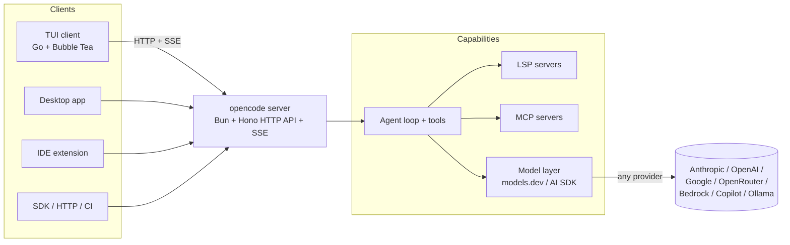

# OpenCode — The Provider-Agnostic Terminal Coding Agent

## Summary

OpenCode is an open-source (MIT), terminal-first AI coding agent maintained by the **SST team** (the entity now operating as Anomaly Innovations, repo `sst/opencode` → `anomalyco/opencode`). It does what Claude Code, Aider, and the former Gemini CLI do — read, edit, and run code in your repo from an agentic loop — but its defining choice is a **client/server split with a fully provider-agnostic model layer**: a long-lived server (TypeScript on Bun, Hono HTTP API + SSE) holds session state and drives the agent loop, while the TUI is just one of several clients (desktop app, IDE extension, CI runner, or any SDK/HTTP caller). Because model access goes through a `models.dev`/AI-SDK abstraction, you point it at Anthropic, OpenAI, Google, OpenRouter, Bedrock, GitHub Copilot, or a local Ollama model with equal ease — there is no single-vendor lock-in, which is the one thing Claude Code structurally cannot offer. It fits teams that want one agent across many models, remote/headless workflows (`opencode serve`, `opencode run`), and a committable `AGENTS.md` convention; it fits less well if you want a vendor-tuned, batteries-included experience with first-party model alignment and the deepest reasoning integration, where Claude Code still leads. Note the naming lineage carefully — this is *not* charmbracelet's "Crush," which split from the same origin in mid-2025.

> Versions/dates as of **May 2026**: OpenCode is MIT-licensed, **150K+ GitHub stars** (exact count varies by source, stale-prone), first publicly launched June 2025, currently shipping **v1.15.x** (v1.15.12, 2026-05-28) at a cadence of multiple releases per week. The TUI is still **Go + Bubble Tea** in production; a migration to the team's in-house **OpenTUI** (a Zig core with TypeScript bindings) is *planned/PoC* per issue #2956 — not yet shipped, so reviews that already call it "Ink/TypeScript" are premature, and ones that call it "a Go CLI" are describing the server/CLI inaccurately (the CLI/server are TypeScript on Bun; only the TUI binary is Go). GitHub added official OpenCode support via Copilot subscriptions in January 2026. Google retired the comparison peer **Gemini CLI** at I/O on 2025-05-19, succeeded by **Antigravity CLI** (Gemini CLI stops serving ~2026-06-18). Cost figures below are model-API estimates, not OpenCode license fees (there are none).

## Feature & Comparison Table

| Dimension | **OpenCode** | **Claude Code** | **Aider** | **Gemini CLI → Antigravity CLI** |
|---|---|---|---|---|
| **Type / category** | TUI + client/server coding agent | TUI/CLI coding agent | CLI pair-programming agent | CLI coding agent |
| **Maker** | SST team / Anomaly Innovations | Anthropic | Paul Gauthier + community | Google |
| **Core architecture** | Bun/TypeScript server (Hono, SSE) + detachable clients (TUI, desktop, IDE, SDK) | Single agent process, Anthropic-tuned harness | Single Python process, git-centric edit loop | Single agent process |
| **Language / runtime** | TS on Bun (server/CLI); **Go + Bubble Tea** TUI today (OpenTUI/Zig migration planned) | TS/Node | Python | TS/Node |
| **Model / provider support** | **Provider-agnostic, 75+ providers** via models.dev/AI SDK; local via Ollama | **Anthropic Claude only** | Any LLM via LiteLLM | Google Gemini (+ some others in Antigravity) |
| **Model lock-in** | None — bring any key or run local | Vendor-locked to Claude | None | Google-centric |
| **Headless / non-interactive** | `opencode run`, `opencode serve` (remote) | `claude -p` / print mode | scriptable / `--message` | scriptable |
| **Context / repo intelligence** | LSP auto-config; `AGENTS.md`; sessions persist across disconnects | CLAUDE.md; strong context mgmt; subagents | repo-map; auto-commits each edit | GEMINI.md |
| **MCP support** | Yes (`mcp` config key) | Yes | Limited/community | Yes |
| **Sessions / sharing** | Persistent server sessions; share via link; multi-parallel sessions | Sessions; resume | per-invocation; git is the record | sessions |
| **Plan vs build modes** | Built-in **Build** (full tools) and **Plan** (read-only) primary agents | Plan mode + normal | no formal mode split | varies |
| **License** | **MIT** | Proprietary (free tier + paid) | Apache-2.0 | Proprietary |
| **Cost** | $0 tool; pay model API tokens, or reuse a Claude/Copilot subscription | Free tier; Pro/Max/API token cost | $0 tool; pay model tokens | Free generous tier |

> All "cost" entries are about the *model* you drive, not the tool. OpenCode, Aider are free OSS; Claude Code and Antigravity are vendor tools with free tiers. Figures are rough, dated May 2026. ✅/❌ avoided — most cells are qualitative.

## In-Depth Implementation Report

### 1. Architecture deep-dive: why the client/server split is the whole point

Most terminal coding agents are a single process: the UI, the agent loop, the tool executor, and the model client all live in one binary tied to your terminal session. OpenCode deliberately breaks that apart.



- **Server.** A persistent process (`opencode serve`) written in TypeScript on the **Bun** runtime, exposing an HTTP API (default port **4096**) and streaming real-time events over **Server-Sent Events**, with session persistence in **SQLite (Drizzle ORM)**. It owns the agent loop, tool execution, and session state, and exposes routes like `/session`, `/provider`, `/mcp`, `/lsp`, `/event` (SSE), `/file`. Because state lives server-side, **sessions survive terminal disconnects, SSH drops, and laptop sleep** — you reconnect and resume. This is the structural feature single-process agents cannot match.
- **Clients.** The TUI is the primary client but not the only one: the same server backs a desktop app (beta), IDE extensions, GitHub Actions / GitLab CI runners, and any program using the JS/TS SDK or raw HTTP. "`opencode serve` on a box, SDK client from your laptop" is a supported remote-dev pattern.
- **TUI implementation — a moving target.** OpenCode's TUI is a **Go + Bubble Tea** binary (its charm-adjacent origin; see §2) that the TypeScript CLI spawns after bootstrapping the server. As of May 2026 the Go TUI is still the production default. A migration to the team's own **OpenTUI** — a native terminal-UI core written in **Zig** with TypeScript bindings — is laid out in issue #2956 but remains *planned/PoC*, with a Go-TUI fallback during transition. So reviews that already describe an "Ink/TypeScript TUI" are premature, and ones calling the whole thing "a Go CLI" mislabel the server/CLI (those are TypeScript on Bun).
- **Model layer.** Provider access is abstracted through the **Models.dev** catalog + the **Vercel AI SDK**, so adding a provider is config, not code, and models are referenced as `providerID/modelID`. This is what makes "75+ providers" real rather than marketing — the same agent loop runs against Claude, GPT, Gemini, OpenRouter-routed models, Bedrock, Copilot-subscription models, the vendor's own **OpenCode Zen** pay-as-you-go service, or a local Ollama endpoint.

### 2. The naming lineage — get this right

There are two terminal agents tracing to one origin, and conflating them is the most common factual error:

- OpenCode was originally created by **Kujtim Hoxha**. **Charm (charmbracelet)** brought him on and moved the repo into their org. Major contributors — notably **Dax** and **Adam** of the **SST** team, who had driven much of the UI and popularity — objected, and there were allegations of rewritten git history and banned contributors.
- Resolution (mid-2025): **Charm rebranded their version as "Crush"**, and the **SST team kept the "OpenCode" name**. So today: **`charmbracelet/crush`** (Go, Charm ecosystem) and **`sst`/`anomalyco`'s `opencode`** (the subject of this report) are *separate* projects with a shared ancestor. When you read "opencode," confirm which one — the SST/Anomaly one is the actively-hyped, provider-agnostic, client/server design.

### 3. How to use it

**Install** (pick one):

```bash
# curl installer
curl -fsSL https://opencode.ai/install | bash

# npm
npm install -g opencode-ai

# Homebrew
brew install anomalyco/tap/opencode
```

Go install, Docker, and from-source are also supported.

**Authenticate.** Run the interactive provider setup:

```bash
opencode auth login
```

Credentials are stored locally in `~/.local/share/opencode/auth.json`. You can authenticate with raw API keys for any provider, or via browser **OAuth** for providers that support it (in-TUI `/connect`). Subscriptions can be reused as the backend — a **GitHub Copilot** subscription has official support since Jan 2026, and **Anthropic Claude Pro/Max** sign-in is offered, though reusing subscription tokens leans on community OAuth plugins and sits in a ToS grey area (Anthropic scopes subscription tokens to official clients) — verify before relying on it.

**Run it.** From inside a repo:

```bash
opencode            # launch the TUI in the current project
opencode /init      # analyze the repo and generate AGENTS.md (commit it)
```

`/init` writes an **`AGENTS.md`** at the project root — the equivalent of `CLAUDE.md`/`GEMINI.md`: shared, committable project context that every interface (TUI, CLI, desktop, CI) reads.

**Modes / agents.** OpenCode ships two built-in *primary* agents:
- **Build** — full tool access (read, write, run shell).
- **Plan** — read-only: it reads, reasons, and proposes a plan but cannot write files or run commands. Use it to review intent before letting the agent touch the tree.

You can define your own primary agents and **subagents** (the `mode` option is `primary`, `subagent`, or `all`); tool access is gated per-agent via permissions.

**Headless / scripted use.** The same server backs non-interactive runs:

```bash
opencode run "fix the failing test in src/auth" --mode build
opencode serve     # start a remote server; drive it from the SDK/HTTP
```

**Configuration.** Project config lives in **`opencode.json`** (and `~/.config/opencode/` for global). Key blocks:
- **`mcp`** — register MCP servers (`type`, `command`, env) to extend tools.
- **`command`** — custom slash-commands for repetitive tasks; also definable as `.opencode/command/*.md` files with frontmatter (`description`, `agent`, `model`, `subtask`).
- Per-directory layout under `.opencode/` and `~/.config/opencode/`: `agents/`, `commands/`, `modes/`, `plugins/`, `skills/`, `tools/`, `themes/`.

**Code intelligence.** OpenCode auto-configures **LSP** servers for the languages in your repo and exposes that intelligence to the model, so edits are type/symbol-aware rather than pure text.

### 4. Where it fits vs. the peers

**vs. Claude Code.** The trade is *flexibility vs. vendor integration*. OpenCode runs any model and detaches the UI from the engine; Claude Code is locked to Anthropic's Claude but ships a vendor-tuned harness with the deepest reasoning integration (Opus on SWE-bench Verified remains the strongest single result as of early 2026) and is the consensus "reach for it when the problem is hard" tool. If you must use multiple providers, run local models, or need persistent remote sessions, OpenCode wins; if you want one well-aligned model and the least friction, Claude Code wins.

**vs. Aider.** Aider is git-first: every edit is auto-committed with a descriptive message, so your history *is* the audit trail, and it pairs well with cheap backends (DeepSeek/Qwen) via LiteLLM. OpenCode is heavier and more featureful (TUI, sessions, LSP, MCP, clients) but does not make git the centerpiece. Pick Aider for minimal, auditable, low-cost automation; OpenCode for a richer interactive agent.

**vs. Gemini CLI / Antigravity.** Gemini CLI was the free, generous-limit Google option; it was retired at I/O 2025-05-19 and replaced by **Antigravity CLI** (Gemini CLI stops serving ~2026-06-18). If you were on Gemini CLI for the free tier, Antigravity is the migration path; OpenCode is the route if you want to keep Gemini models *and* other providers under one tool.

### 5. Honest weaknesses

- **Release churn.** Multiple releases per week (v1.15.7→v1.15.12 across one week of May 2026) means features reportedly break between versions, and the in-flight Go-TUI → OpenTUI migration adds instability risk. Documentation, blog posts, and muscle memory drift; third-party guides frequently describe an older or premature architecture. Expect the fastest-moving surface of the four tools here.
- **Resource use.** Reports of 1 GB+ RAM for the TUI, CPU spikes, and occasional hung sessions appear in GitHub issues. Note also that some of the harshest critiques (runaway token billing, telemetry-for-title-generation) target the third-party "Oh My Opencode" config layer, *not* core OpenCode — don't conflate the two.
- **Lineage confusion.** The Crush/OpenCode split actively misleads users and search results; onboarding teammates requires explaining which project you mean.
- **Operational surface.** A persistent Bun server plus clients is more moving parts than a single binary; remote/headless power comes with more to run and secure (the server speaks HTTP — mind exposure).
- **Provider quirks.** Provider-agnosticism is real but uneven: prompt-tuning, tool-call reliability, and context handling vary by model, and you inherit each provider's rough edges rather than a single vendor-tuned path.
- **Not the deepest reasoning harness.** For the hardest problems, practitioners still report falling back to Claude Code; OpenCode's advantage is breadth and architecture, not a model edge.

### 6. When to pick it / when not to

- **Pick OpenCode** if: you want one agent across many providers (incl. local models); you need persistent or remote/headless sessions (`serve` + SDK); you value an OSS MIT tool with `AGENTS.md`, LSP, and MCP; or you want to reuse a Claude/Copilot subscription without being boxed into one UI.
- **Don't pick it** if: you want a single, vendor-aligned, minimal-friction experience (Claude Code); your workflow is git-commit-per-edit on a tight budget (Aider); or you need a frozen, stable surface and can't absorb the rewrite churn.

## Sources

- [OpenCode — official site](https://opencode.ai/) — accessed 2026-05
- [OpenCode docs — Intro](https://opencode.ai/docs/) — accessed 2026-05
- [OpenCode docs — CLI](https://opencode.ai/docs/cli/) — accessed 2026-05
- [OpenCode docs — Agents (Build/Plan, subagents)](https://opencode.ai/docs/agents/) — accessed 2026-05
- [OpenCode docs — Config (opencode.json, MCP, commands)](https://opencode.ai/docs/config/) — accessed 2026-05
- [OpenCode docs — TUI](https://opencode.ai/docs/tui/) — accessed 2026-05
- [GitHub — anomalyco/opencode](https://github.com/anomalyco/opencode/) — accessed 2026-05
- [GitHub — anomalyco/opentui (Zig + TS terminal UI core)](https://github.com/anomalyco/opentui) — accessed 2026-05
- [DeepWiki — sst/opencode architecture](https://deepwiki.com/sst/opencode) — accessed 2026-05
- [Medium — How OpenCode Actually Works (architecture, source-backed)](https://medium.com/@maclarensg_50191/how-opencode-actually-works-an-architecture-guide-backed-by-source-code-939811f0434f) — accessed 2026-05
- [charmbracelet/crush — "difference between this and opencode?" discussion](https://github.com/charmbracelet/crush/discussions/360) — accessed 2026-05
- [BigGo — Charm's "Crush" emerges from OpenCode controversy](https://biggo.com/news/202507310715_Charm_Crush_AI_Coding_Agent) — accessed 2026-05
- [sanj.dev — Aider vs OpenCode vs Claude Code (2026)](https://sanj.dev/post/comparing-ai-cli-coding-assistants/) — accessed 2026-05
- [Tembo — 2026 Guide to Coding CLI Tools](https://www.tembo.io/blog/coding-cli-tools-comparison) — accessed 2026-05
- [NxCode — How to Install OpenCode (2026)](https://www.nxcode.io/resources/news/opencode-install-guide-step-by-step-2026) — accessed 2026-05
- [DEV — OpenCode Quickstart (install/config/use)](https://dev.to/rosgluk/opencode-quickstart-install-configure-and-use-the-terminal-ai-coding-agent-4kcb) — accessed 2026-05
- [OpenAIToolsHub — OpenCode Review (75+ models)](https://www.openaitoolshub.org/en/blog/opencode-review-terminal-ai-coding) — accessed 2026-05
