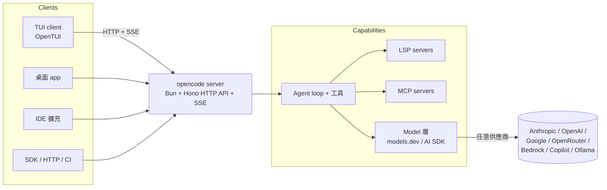

# OpenCode — 與供應商無關的終端機程式設計代理

## 摘要

OpenCode 是一個開源（MIT）、以終端機為先的 AI 程式設計代理，由 **SST 團隊** 維護（目前以 Anomaly Innovations 名義運作，repo 由 `sst/opencode` → `anomalyco/opencode`）。它所做的事與 Claude Code、Aider 及已退役的 Gemini CLI 相同——以 agentic loop 在你的 repo 中讀取、編輯與執行程式碼——但其決定性選擇是 **client/server 分離搭配完全與供應商無關的 model 層**：一個長駐的 server（TypeScript on Bun，Hono HTTP API + SSE）持有 session 狀態並驅動 agent loop，而 TUI 只是眾多 client 之一（桌面 app、IDE 擴充套件、CI runner，或任何 SDK/HTTP 呼叫端）。由於 model 存取透過 `models.dev`/AI-SDK 抽象層,你可以同樣輕鬆地把它指向 Anthropic、OpenAI、Google、OpenRouter、Bedrock、GitHub Copilot 或本地的 Ollama model——沒有單一供應商鎖定,而這正是 Claude Code 在結構上無法提供的一點。它適合想要「一個代理跨多個 model」的團隊、遠端/headless 工作流（`opencode serve`、`opencode run`),以及可提交（committable）的 `AGENTS.md` 慣例;若你想要的是廠商調校、開箱即用、具備第一方 model 對齊與最深推理整合的體驗,則較不適合——在那方面 Claude Code 仍領先。請仔細留意命名脈絡——這 *不是* charmbracelet 的「Crush」,後者在 2025 年中從相同源頭分出。

> 版本/日期以 **2026 年 5 月** 為準：OpenCode 採 MIT 授權,約 15 萬 GitHub star,首次發布於 2025 年 6 月。TUI 最初以 Go + Bubble Tea 起步,之後遷移至團隊自研的 **OpenTUI**（Zig 核心 + TypeScript/SolidJS 綁定）;部分第三方文章仍稱其為「Go CLI」——請視為過時。GitHub 於 2026 年 1 月透過 Copilot 訂閱加入官方 OpenCode 支援。比較對象 **Gemini CLI** 已於 I/O（2025-05-19）退役,由 **Antigravity CLI** 接替（Gemini CLI 約於 2026-06-18 停止服務）。下方成本數字為 model API 估計,並非 OpenCode 授權費（並無此費用）。

## 功能與比較表

| 面向 | **OpenCode** | **Claude Code** | **Aider** | **Gemini CLI → Antigravity CLI** |
|---|---|---|---|---|
| **類型 / 類別** | TUI + client/server 程式設計代理 | TUI/CLI 程式設計代理 | CLI 結對程式設計代理 | CLI 程式設計代理 |
| **製作者** | SST 團隊 / Anomaly Innovations | Anthropic | Paul Gauthier + 社群 | Google |
| **核心架構** | Bun/TypeScript server（Hono、SSE）+ 可分離 client（TUI、桌面、IDE、SDK） | 單一 agent 行程,Anthropic 調校 harness | 單一 Python 行程,以 git 為中心的編輯迴圈 | 單一 agent 行程 |
| **語言 / runtime** | server 為 TS on Bun;TUI 為 OpenTUI（Zig + TS/SolidJS） | TS/Node | Python | TS/Node |
| **Model / 供應商支援** | **與供應商無關,75+ 供應商**,透過 models.dev/AI SDK;本地經 Ollama | **僅 Anthropic Claude** | 經 LiteLLM 支援任意 LLM | Google Gemini（Antigravity 另加部分） |
| **Model 鎖定** | 無——自帶任意 key 或跑本地 | 鎖定 Claude 廠商 | 無 | 以 Google 為中心 |
| **Headless / 非互動** | `opencode run`、`opencode serve`（遠端） | `claude -p` / print 模式 | 可腳本化 / `--message` | 可腳本化 |
| **Context / repo 智慧** | LSP 自動設定;`AGENTS.md`;session 跨斷線保留 | CLAUDE.md;強 context 管理;subagent | repo-map;每次編輯自動 commit | GEMINI.md |
| **MCP 支援** | 有（`mcp` config key） | 有 | 有限/社群 | 有 |
| **Session / 分享** | 持久 server session;以連結分享;多重平行 session | session;resume | 每次呼叫;以 git 為紀錄 | session |
| **Plan vs build 模式** | 內建 **Build**（全工具）與 **Plan**（唯讀）primary agent | Plan 模式 + 一般 | 無正式模式區分 | 視情況 |
| **授權** | **MIT** | 專有（免費級 + 付費） | Apache-2.0 | 專有 |
| **成本** | 工具 $0;付 model API token,或沿用 Claude/Copilot 訂閱 | 免費級;Pro/Max/API token 成本 | 工具 $0;付 model token | 免費級額度大方 |

> 所有「成本」項目指的是你驅動的 *model*,而非工具本身。OpenCode、Aider 為免費 OSS;Claude Code 與 Antigravity 為具免費級的廠商工具。數字為粗估,日期 2026 年 5 月。此處不使用 ✅/❌——多數格為定性描述。

## 深入實作報告

### 1. 架構深入：為何 client/server 分離是重點所在

多數終端機程式設計代理是單一行程：UI、agent loop、工具執行器與 model client 全住在一個綁定終端機 session 的 binary 裡。OpenCode 刻意把這拆開。



- **Server。** 一個持久行程（`opencode serve`),以 TypeScript 寫成、跑在 **Bun** runtime 上,透過 **Hono** 框架提供 HTTP API,並以 **Server-Sent Events** 串流即時事件。它擁有 agent loop、工具執行與 session 狀態。由於狀態存於 server 端,**session 可在終端機斷線、SSH 中斷、筆電休眠後續存**——你重新連線即可接續。這是單一行程代理無法比擬的結構性特性。
- **Clients。** TUI 是主要 client 但非唯一：同一個 server 也支撐桌面 app（beta）、IDE 擴充、GitHub Actions / GitLab CI runner,以及任何使用 JS/TS SDK 或原始 HTTP 的程式。「在一台機器上 `opencode serve`、從筆電用 SDK client 連」是受支援的遠端開發模式。
- **TUI 實作——持續變動的目標。** OpenCode 的 TUI 原本使用 **Go + Bubble Tea**（其與 charm 相近的源頭;見 §2）。之後遷移至團隊自研的 **OpenTUI**,一個以 **Zig** 寫成、附 **TypeScript/SolidJS** 綁定的原生終端 UI 核心,用於反應式、事件驅動的渲染。仍稱 OpenCode 為「Go CLI」的獨立評論描述的是舊狀態;請對照現行 repo 查核。
- **Model 層。** 供應商存取透過 **models.dev** + AI SDK 抽象,因此新增供應商是設定、而非寫程式。這讓「75+ 供應商」名副其實而非行銷詞——同一個 agent loop 可對 Claude、GPT、Gemini、OpenRouter 路由的 model、Bedrock、Copilot 訂閱 model,或本地 Ollama 端點執行。

### 2. 命名脈絡——務必弄對

有兩個終端機代理源自同一起點,把它們混為一談是最常見的事實錯誤：

- OpenCode 最初由 **Kujtim Hoxha** 建立。**Charm（charmbracelet）** 延攬了他並把 repo 移入其組織。主要貢獻者——尤其是 **SST** 團隊的 **Dax** 與 **Adam**,他們推動了大量 UI 與人氣——提出異議,並有改寫 git 歷史與封禁貢獻者的指控。
- 結果（2025 年中）：**Charm 將其版本更名為「Crush」**,而 **SST 團隊保留「OpenCode」名稱**。因此今日：**`charmbracelet/crush`**（Go、Charm 生態）與 **`sst`/`anomalyco` 的 `opencode`**（本報告主題）是 *各自獨立*、共享祖先的專案。當你讀到「opencode」時,請確認指的是哪一個——SST/Anomaly 那個才是當前被熱議、與供應商無關、採 client/server 設計者。

### 3. 如何使用

**安裝**（擇一）：

```bash
# curl 安裝器
curl -fsSL https://opencode.ai/install | bash

# npm
npm install -g opencode-ai

# Homebrew
brew install anomalyco/tap/opencode
```

亦支援 Go install、Docker 與從原始碼建置。

**驗證。** 執行互動式供應商設定：

```bash
opencode auth login
```

憑證存於本地 `~/.local/share/opencode/auth.json`。你可用任意供應商的原始 API key 驗證,或沿用訂閱——**Anthropic Claude Pro/Max**,以及自 2026 年 1 月起的 **GitHub Copilot** 訂閱,皆可作為 model 後端。

**執行。** 在 repo 內：

```bash
opencode            # 在當前專案啟動 TUI
opencode /init      # 分析 repo 並產生 AGENTS.md（請 commit）
```

`/init` 會在專案根目錄寫入 **`AGENTS.md`**——相當於 `CLAUDE.md`/`GEMINI.md`：共享、可提交的專案 context,每個介面（TUI、CLI、桌面、CI）都會讀取。

**模式 / agent。** OpenCode 內建兩個 *primary* agent：
- **Build**——完整工具存取（讀、寫、執行 shell）。
- **Plan**——唯讀：它讀取、推理並提出計畫,但無法寫檔或執行命令。用它在放手讓代理動樹之前先審視意圖。

你可自訂自己的 primary agent 與 **subagent**（`mode` 選項為 `primary`、`subagent` 或 `all`);工具存取則以權限逐 agent 控管。

**Headless / 腳本化使用。** 同一個 server 也支撐非互動執行：

```bash
opencode run "fix the failing test in src/auth" --mode build
opencode serve     # 啟動遠端 server;以 SDK/HTTP 驅動
```

**設定。** 專案設定置於 **`opencode.json`**（全域則為 `~/.config/opencode/`）。關鍵區塊：
- **`mcp`**——註冊 MCP server（`type`、`command`、env）以擴充工具。
- **`command`**——針對重複任務的自訂 slash 命令;也可定義為 `.opencode/command/*.md` 檔,搭配 frontmatter（`description`、`agent`、`model`、`subtask`）。
- `.opencode/` 與 `~/.config/opencode/` 下的逐目錄佈局：`agents/`、`commands/`、`modes/`、`plugins/`、`skills/`、`tools/`、`themes/`。

**程式碼智慧。** OpenCode 會為 repo 中的語言自動設定 **LSP** server,並把該智慧暴露給 model,使編輯具備型別/符號感知,而非純文字操作。

### 4. 與同類工具的定位比較

**vs. Claude Code。** 取捨在於 *彈性 vs. 廠商整合*。OpenCode 可跑任意 model 並將 UI 與引擎分離;Claude Code 鎖定 Anthropic 的 Claude,但提供廠商調校的 harness、最深的推理整合（截至 2026 年初,Opus 在 SWE-bench Verified 仍是最強的單一結果),並且是公認「遇到難題就拿出來」的工具。若你必須使用多供應商、跑本地 model,或需要持久遠端 session,OpenCode 勝出;若你想要單一對齊良好的 model 與最少摩擦,Claude Code 勝出。

**vs. Aider。** Aider 以 git 為先：每次編輯都自動以描述性訊息 commit,因此你的歷史 *即* 稽核軌跡,並能透過 LiteLLM 搭配廉價後端（DeepSeek/Qwen）。OpenCode 較重、功能較多（TUI、session、LSP、MCP、多 client),但不以 git 為核心。要極簡、可稽核、低成本的自動化選 Aider;要功能更豐富的互動代理選 OpenCode。

**vs. Gemini CLI / Antigravity。** Gemini CLI 是免費、額度大方的 Google 選項;它於 I/O（2025-05-19）退役,由 **Antigravity CLI** 接替（Gemini CLI 約於 2026-06-18 停止服務）。若你當初是為免費級而用 Gemini CLI,Antigravity 是遷移路徑;若你想同時保留 Gemini model *與* 其他供應商於同一工具,OpenCode 是該走的路。

### 5. 誠實的弱點

- **改寫帶來的變動。** Go-TUI → OpenTUI（Zig/TS）的遷移使文件、部落格與肌肉記憶失準;第三方指南常描述較舊的架構。預期它是這四個工具中變動最快的表面。
- **脈絡混淆。** Crush/OpenCode 的分裂實際上會誤導使用者與搜尋結果;帶新同事上手得先解釋你指的是哪個專案。
- **維運表面。** 一個持久 Bun server 加上多 client,比單一 binary 有更多活動元件;遠端/headless 的威力伴隨更多需運行與保護之物（server 講 HTTP,留意暴露面）。
- **供應商怪癖。** 與供應商無關是真的,但不均：prompt 調校、tool-call 可靠度與 context 處理因 model 而異,你承接的是各供應商的粗糙邊角,而非單一廠商調校過的路徑。
- **並非最深的推理 harness。** 對最難的問題,實務者仍回報退回 Claude Code;OpenCode 的優勢在廣度與架構,而非 model 上的優勢。

### 6. 何時選它 / 何時不選

- **選 OpenCode**：你想要一個代理跨多供應商（含本地 model）;你需要持久或遠端/headless session（`serve` + SDK）;你重視具 `AGENTS.md`、LSP 與 MCP 的 OSS MIT 工具;或你想沿用 Claude/Copilot 訂閱而不被綁進單一 UI。
- **不要選它**：你想要單一、與廠商對齊、最少摩擦的體驗（Claude Code）;你的工作流是預算吃緊下的每次編輯一 commit（Aider）;或你需要凍結穩定的表面,無法吸收改寫帶來的變動。

## Sources

- [OpenCode — official site](https://opencode.ai/) — accessed 2026-05
- [OpenCode docs — Intro](https://opencode.ai/docs/) — accessed 2026-05
- [OpenCode docs — CLI](https://opencode.ai/docs/cli/) — accessed 2026-05
- [OpenCode docs — Agents (Build/Plan, subagents)](https://opencode.ai/docs/agents/) — accessed 2026-05
- [OpenCode docs — Config (opencode.json, MCP, commands)](https://opencode.ai/docs/config/) — accessed 2026-05
- [OpenCode docs — TUI](https://opencode.ai/docs/tui/) — accessed 2026-05
- [GitHub — anomalyco/opencode](https://github.com/anomalyco/opencode/) — accessed 2026-05
- [GitHub — anomalyco/opentui (Zig + TS terminal UI core)](https://github.com/anomalyco/opentui) — accessed 2026-05
- [DeepWiki — sst/opencode architecture](https://deepwiki.com/sst/opencode) — accessed 2026-05
- [Medium — How OpenCode Actually Works (architecture, source-backed)](https://medium.com/@maclarensg_50191/how-opencode-actually-works-an-architecture-guide-backed-by-source-code-939811f0434f) — accessed 2026-05
- [charmbracelet/crush — "difference between this and opencode?" discussion](https://github.com/charmbracelet/crush/discussions/360) — accessed 2026-05
- [BigGo — Charm's "Crush" emerges from OpenCode controversy](https://biggo.com/news/202507310715_Charm_Crush_AI_Coding_Agent) — accessed 2026-05
- [sanj.dev — Aider vs OpenCode vs Claude Code (2026)](https://sanj.dev/post/comparing-ai-cli-coding-assistants/) — accessed 2026-05
- [Tembo — 2026 Guide to Coding CLI Tools](https://www.tembo.io/blog/coding-cli-tools-comparison) — accessed 2026-05
- [NxCode — How to Install OpenCode (2026)](https://www.nxcode.io/resources/news/opencode-install-guide-step-by-step-2026) — accessed 2026-05
- [DEV — OpenCode Quickstart (install/config/use)](https://dev.to/rosgluk/opencode-quickstart-install-configure-and-use-the-terminal-ai-coding-agent-4kcb) — accessed 2026-05
- [OpenAIToolsHub — OpenCode Review (75+ models)](https://www.openaitoolshub.org/en/blog/opencode-review-terminal-ai-coding) — accessed 2026-05
