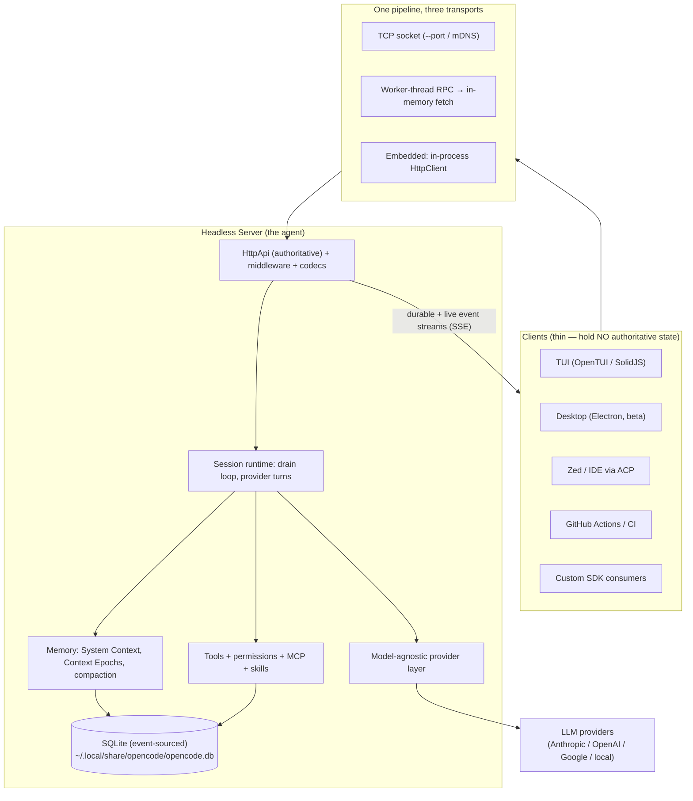
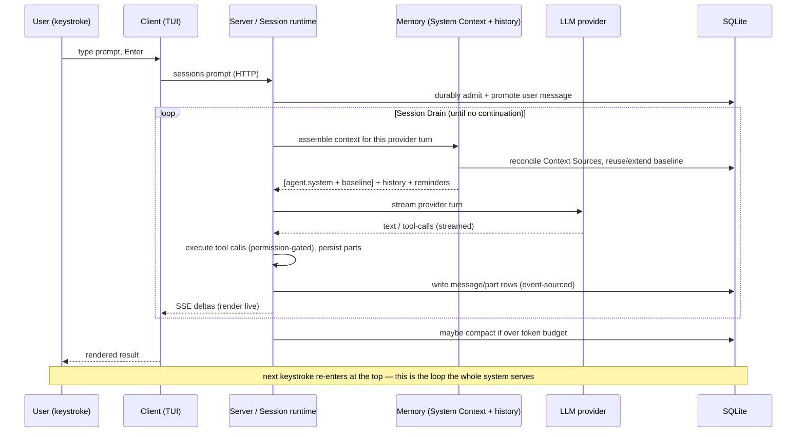
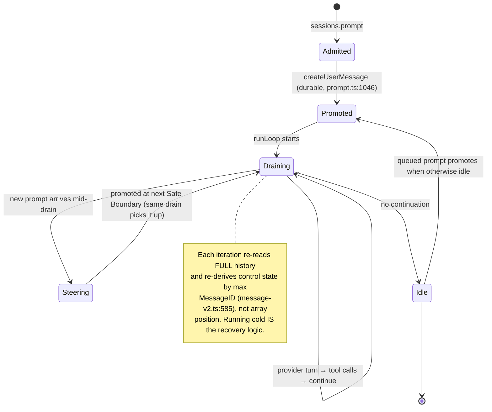
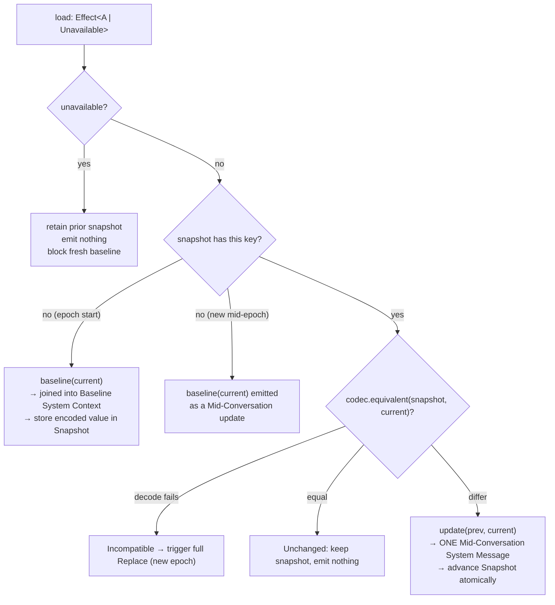
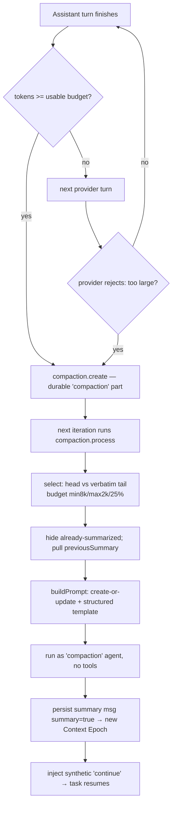
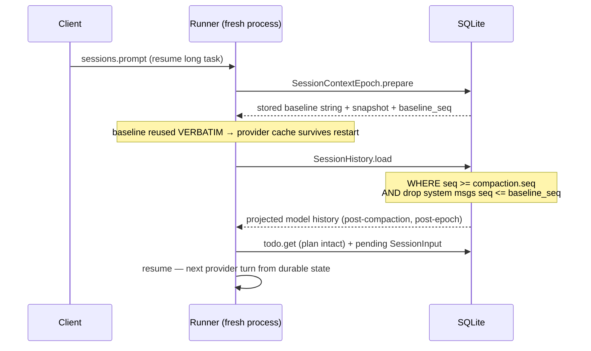
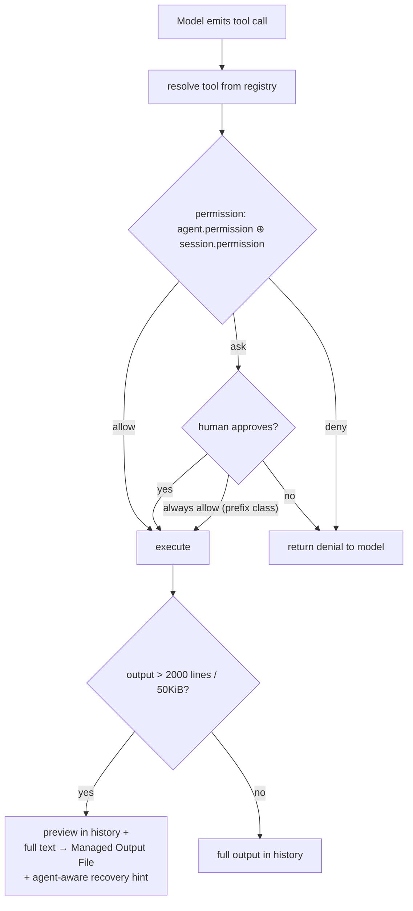
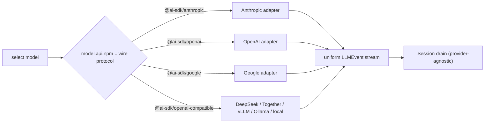

# OpenCode — Deep Architecture Analysis

> An architectural study of [`anomalyco/opencode`](https://github.com/anomalyco/opencode), the open-source AI coding agent. Special focus: **how the agent processes a user prompt with its short-term and long-term memory before calling an LLM, and how it persists memory so a long-running task doesn't drift.**
>
> Analysis depth: **Deep** (≥90% coverage of core modules, 8 parallel sub-agent passes over the codebase). Every claim is anchored to `path:line` in the source. Code is ground truth.

---

## 1. Project at a glance (concise)

OpenCode is **the open-source AI coding agent built for the terminal**, by the team formerly known as **SST** (the repo recently moved `sst/opencode` → `anomalyco/opencode`). It's TypeScript, runs on **Bun**, is **model-agnostic** (Claude, GPT, Gemini, Grok, local Ollama, ~75 providers), and is one of the most-starred dev tools in existence (~180k stars, MIT). ([anomalyco/opencode](https://github.com/anomalyco/opencode), [morphllm leaderboard](https://www.morphllm.com/best-ai-coding-agents-2026))

**Lineage worth knowing:** the name "opencode" originated with an earlier project (Kujtim Hoxha / opencode-ai). After a 2025 split, one lineage became **Charm's Crush**; the other — the TypeScript-on-Bun rewrite by the SST team (Dax Raad et al.) — is *this* repo. ([Grokipedia: OpenCode](https://grokipedia.com/page/opencode), [HN discussion](https://news.ycombinator.com/item?id=46552218))

### Where it sits vs. the field

| Tool | Core thesis | Memory / persistence posture |
|---|---|---|
| **opencode** | Headless model-agnostic server; many clients; terminal-first | **Event-sourced SQLite, durable Context Epochs, recovery-by-projection** (this report) |
| Claude Code | Anthropic-first, deep autonomy | Per-turn prompt rebuild; transcript-based |
| Aider | Git-native, every change a commit | Git history *is* the memory |
| Cursor | IDE-embedded | Editor-managed context |
| Crush (Charm) | TUI-first, multi-model | Sibling lineage to opencode |

Sources: [sanj.dev comparison](https://sanj.dev/post/comparing-ai-cli-coding-assistants/), [Pinggy: open-source CLI agents](https://pinggy.io/blog/best_open_source_cli_coding_agents/).

The differentiator this report cares about: opencode treats **memory and context as a durable, typed, recoverable subsystem** rather than a string it rebuilds each turn. That choice is the spine of the whole architecture.

### Scale (relevant LOC, tests/generated excluded)

| Package | LOC | Role |
|---|---:|---|
| `packages/opencode` | ~80,700 | The agent runtime (session loop, tools, providers) — **V1** |
| `packages/core` | ~33,200 | Shared domain, the **V2** session/memory engine |
| `packages/tui` | ~26,800 | Terminal UI client (OpenTUI) |
| `packages/sdk` | ~30,300 | Generated SDKs |
| `packages/server`, `client`, `protocol`, `schema` | ~6,800 | The HTTP contract spine |

---

## 2. Architecture overview: a headless server with many thin clients

The single most load-bearing fact about opencode: **the agent loop *is* a local headless server, and everything a human touches — the TUI, the desktop app, the Zed/IDE bridge, GitHub Actions, the SDK — is a client over an HTTP + event API.** (Module A.)



**Why this shape?** Three payoffs:

1. **One brain, many faces.** The exact same `streamText`/tool/permission/memory pipeline runs whether you're in a terminal, an editor, or CI. New clients are integration work, not re-implementation. The `HttpApi` boundary *is* the product's extensibility surface.
2. **Crash-recovery and multi-client come for free** because clients hold no authoritative state — they're projections of server state (Module H proves this in the TUI). Your terminal can die and reattach; two clients can watch the same session.
3. **Embedding is the trivial case of the same idea.** `sdk-next` runs the V2 router *in-process* by injecting a web-handler-backed `fetch` as the Effect `HttpClient` transport (`sdk-next/src/opencode.ts:8-41`). Only the transport differs; the full middleware/codec/auth pipeline is preserved. Compare to tools that bolt on an "API mode" later — opencode made the server the *primary* artifact and the CLI a client of it.

Two more structural bets define the codebase:

- **Built on Effect (effect-ts).** Layers, scoped resources, fibers, typed errors. Every DB access, every provider call, every tool is an interruptible, traced `Effect`. This is what makes interruption (`AbortController` acquire/release, `llm.ts:361`) and resource cleanup uniform. The cost: a steep wall for contributors not fluent in Effect.
- **Strict, physically-enforced package layering** (`AGENTS.md`): Schema → Core & Protocol → Server; **Client may depend on Schema+Protocol but never Core or Server**. The root client is browser-safe and zero-Effect; `/effect` opts into Effect; only `sdk-next` composes Client+Core+Server. This buys browser safety, dual-runtime SDKs, and SDK type-stability against Core churn. SDKs are generated from a single **"SDK Contract IR"** (`httpapi-codegen`), never hand-edited.

### End-to-end data flow (the cycle the whole architecture serves)



Sections 3–4 are the heart of your question. Sections 5–8 cover the surrounding machinery. Section 9 is the honest evaluation.

---

## 3. ★ How a prompt becomes bytes: short-term + long-term memory

This is the section you asked for. Before reading it, internalize one thing the codebase makes unavoidable: **opencode is mid-migration between two memory designs, and the contrast is the whole insight.**

- **V1** (`packages/opencode`, what ships today): every provider turn re-runs the loaders and **string-concatenates a fresh system prompt from scratch** (`session/prompt.ts:1256-1285`). This is the "naive rebuild" — exactly what Claude Code, Aider, and Cursor do.
- **V2** (`packages/core/src/system-context/`, the future, specified verbatim in `CONTEXT.md`): models long-term memory as **typed, diffable, durable "Context Sources"** rendered into an **immutable per-epoch baseline**, with changes appended as chronological updates.

V2's complexity only makes sense as a *reaction* to V1's cost and correctness gaps. I'll explain the memory model the way the architecture intends it (V2), and note where V1 falls short.

### 3.0 The agentic loop that drives it all (the "Session Drain")

First, the loop that calls memory assembly each turn. A surprise the code reveals: **the loop is not in `session.ts`.** `session.ts` (37 KB) is pure persistence/CRUD + token accounting. The actual agentic loop — what `CONTEXT.md` calls a **Session Drain** — lives in `runLoop` (`prompt.ts:1081-1340`), coordinated by a `Runner` primitive (`effect/runner.ts`) and a process-local `Map<SessionID, Runner>` registry (`run-state.ts:38`). (Module B.)



Three design choices here matter for "not going sideways":

- **The drain holds almost no state.** Each `while` iteration re-reads the full history and re-derives "what's the latest user message / has this been answered" via `MessageV2.latest` *by max MessageID, not array index* (`message-v2.ts:585`). This statelessness *is* the crash-recovery mechanism: running the stop-condition cold after a restart reconstructs exactly where the task was.
- **The drain has no durable identity** (`CONTEXT.md:104`). There is no "task object" to lose. This is a deliberate inversion of how most agent frameworks work (which hold an in-memory run object).
- **Steering vs. queued prompts are emergent, not branched.** There are no separate code paths. `Runner.ensureRunning` coalesces concurrent prompts into one drain; because the new user message is already *persisted*, the running drain picks it up at its next Safe Provider-Turn Boundary. That's "steering" (interrupt-and-redirect a running task), for free (`runner.ts:122`). A *queued* prompt simply waits until the drain would otherwise go idle.

Each iteration of that loop hits one decision point: *assemble the context for this provider turn.* That assembly is memory.

### 3.1 Short-term memory = conversation + just-in-time reminders

Short-term memory is the **chronological conversation** plus **synthetic nudges injected at exactly the right moment**. Two mechanisms, both in `session/reminders.ts` and the read tool:

- **`SessionReminders.apply`** (`reminders.ts:15`) does *not* touch the system prompt. It finds the last user message and **pushes synthetic text parts onto it** (`synthetic: true`) so they ride into the conversation at the correct chronological spot (`reminders.ts:23`). Cases: plan-mode entry (`reminders.ts:27-36`), plan→build switch ("you previously planned, now execute", `reminders.ts:37-47`), and an experimental plan-file variant (`reminders.ts:51-89`). Invoked once per loop iteration, right before the assistant message is created (`prompt.ts:1180`).
- **Nested AGENTS.md on read** (`instruction.resolve`, called from `tool/read.ts:300`): when the model reads a file, opencode walks *upward from that file* toward the project root, finds any `AGENTS.md`/`CLAUDE.md`/`CONTEXT.md`, and attaches its content **once per message** (deduped via a `claims` map, `instruction.ts:70-77`). This is "just-in-time long-term memory" — directory-local rules surface as the agent navigates into that directory.

**The architectural point:** a reminder is *the same kind of text* as a system instruction, but **where you inject it — conversation stream vs. stable baseline — is what makes it short-term vs. long-term.** A reminder is relevant *now*, at this chronological position ("you were just switched to build mode"); baking it into a frozen baseline would be both wrong and cache-hostile (see §3.4).

### 3.2 Long-term / ambient memory = the System Context

Long-term memory is the **ambient facts the model needs regardless of where it is in the conversation**: who am I, what directory, what date, what project instructions, what skills exist. `CONTEXT.md` names the whole bundle **System Context**, and each fact a **Context Source**. The contents:

1. **Base model prompt** — selected by model family (`system.ts:26-40`): `anthropic.txt` for Claude, `gpt.txt`/`beast.txt`/`codex.txt` for OpenAI, `gemini.txt`, `kimi.txt`, else `default.txt`. The agent's *persona and tool-discipline* — standing instructions identical across all sessions for that model. (Selected by substring on the wire model id, so Claude-via-Bedrock/Vertex all correctly get `anthropic.txt`.)
2. **Environment** (`system.ts:58-94`): model id, working directory, worktree root, git-or-not, platform, **today's date** (`system.ts:72`).
3. **Instructions** — the AGENTS.md aggregate (below).
4. **MCP instructions** — per-server guidance for permitted MCP tools (`system.ts:110-126`).
5. **Skills guidance** — names+descriptions only; bodies stay behind the permission-checked `skill` tool (`system.ts:96-108`).

**AGENTS.md discovery (the most important long-term loader)** — `instruction.ts`:

- **Global** (`instruction.ts:115-120`): `~/.config/opencode/AGENTS.md`, then `~/.claude/CLAUDE.md`. *First match wins.*
- **Project-upward** (`instruction.ts:123-133`): walks up from the working directory to the worktree root looking for `AGENTS.md` → `CLAUDE.md` → `CONTEXT.md`. *First file-type that matches wins* — "so we don't stack AGENTS.md/CLAUDE.md from every ancestor" (`instruction.ts:122`). Honors `OPENCODE_DISABLE_PROJECT_CONFIG`.
- **Config-declared** (`instruction.ts:135-150`): explicit `config.instructions` globs, plus `http(s)://` instruction URLs (5s timeout).

Each file is rendered with a provenance header (`Instructions from: {path}\n{content}`) so the model knows *which* file a rule came from — critical when project-local rules contradict global ones.

### 3.3 V2's leap: each ambient fact is a typed Context Source

V2's thesis is that string-concatenating these every turn is wrong. Each becomes a `Source<A>` (`system-context/index.ts:32-39`):

```
interface Source<A> {
  key:      Key                       // stable, namespaced, e.g. "core/instructions"
  codec:    Schema.Codec<A, Json>     // encode / compare / store the typed value
  load:     Effect<A | Unavailable>   // infallible observation (or "couldn't see it")
  baseline: (current) => string       // render when first introduced
  update:   (prev, current) => string // render when it CHANGED mid-conversation
  removed?: (prev) => string          // render when it disappears
}
```

Built-ins (`builtins.ts`, `instruction-context.ts`, `skill/guidance.ts`): `core/environment`, `core/date`, `core/instructions` (value type `ReadonlyArray<File>`), `core/skill-guidance`, `core/reference-guidance`. The registry loads all producers concurrently, **sorts by key for determinism**, and combines them; duplicate keys fail composition hard (`registry.ts:39-44`, `index.ts:314-320`).

A subtle but load-bearing distinction: **`unavailable` ≠ absent** (`index.ts:27-30`). If a *previously discovered* AGENTS.md transiently fails to read, the loader returns `unavailable`; the runtime **retains its prior state and emits nothing**, and **blocks creating a fresh baseline** rather than freezing an incomplete one (`index.ts:198-206`). This is stale-while-revalidate for memory — it prevents a transient `stat` failure from telling the model "your project instructions were deleted."



### 3.4 The deep "why": the Context Epoch and the immutable cache prefix

Here is the question that justifies the *entire* snapshot/epoch machine: **why freeze the baseline for an epoch instead of just rebuilding the system prompt each turn?**

The answer is **provider prompt caching (KV-cache reuse), and it is a ~10x cost-and-latency lever.**

Anthropic/OpenAI/etc. reuse the attention KV-cache for an **exact, identical prefix**. The system prompt is the prefix of *every* request. So if you mutate it even slightly between turns — the date string ticks, the skills list re-sorts, `new Date()` is recomputed — you've **changed the prefix and blown the cache for the entire conversation, every turn.** V1 has *no guarantee* of prefix stability: it rebuilds `system[]` from scratch each turn (`prompt.ts:1256-1268`), and any incidental string wobble silently 10x's the token bill with nothing noticing.

V2's **Context Epoch** (`SessionContextEpochTable`, `session/sql.ts:168`) *guarantees* prefix stability:

- At epoch start, `initialize` renders the **Baseline System Context** once and **stores the exact joined text durably** (`sql.ts:174`), reused **verbatim across process restarts**.
- Every provider turn for the whole epoch sends that exact stored baseline as the prefix (`runner/llm.ts:192-205`: `system: [agent.system, system.baseline]`). The prefix never changes → maximum cache hits. The cache key is the session id (`runner/llm.ts:199`), so the cache namespace survives restarts too.
- When a fact genuinely changes, V2 does **not** mutate the baseline. It appends **one Mid-Conversation System Message** into history (`context-epoch.ts:72-76`) — e.g. "Today's date is now X." The stable prefix is preserved; the new fact arrives as a later chronological turn the cache simply extends past.

**The history-projection trick that ties it together** (`history.ts:24-53`): given the epoch's `baselineSeq`, system messages with `seq <= baselineSeq` are **excluded** (they were folded into the baseline; replaying would double-count), and those with `seq > baselineSeq` **are replayed**. So a request is exactly `[baseline prefix] + [conversation] + [post-baseline system updates, chronological]`. No duplication, stable prefix, evolving awareness. This is the single most elegant idea in the codebase.

### 3.5 The full assembly pipeline (the centerpiece diagram)

```mermaid
flowchart TB
  USER["User prompt admitted to inbox"]
  subgraph BND["Safe Provider-Turn Boundary (runner/llm.ts:168)"]
    PROMOTE["Promote pending input → Session History"]
    LOAD["loadSystemContext(agent):<br/>registry.load() + skillGuidance + referenceGuidance<br/>→ SystemContext.combine"]
    EPOCH{"Context Epoch exists?"}
  end
  USER --> PROMOTE --> EPOCH
  LOAD --> EPOCH
  EPOCH -- "no" --> INIT["initialize(): render every source baseline,<br/>join → BASELINE, store baseline+snapshot durably"]
  EPOCH -- "compaction newer" --> REPLACE["replace(): fresh baseline = NEW epoch"]
  EPOCH -- "normal" --> RECON["reconcile(value, snapshot)"]
  RECON -- "Unchanged" --> REUSE["reuse stored BASELINE verbatim"]
  RECON -- "Updated" --> MIDMSG["emit ONE Mid-Conversation System Message<br/>(persisted to history), advance snapshot atomically"]
  INIT --> REUSE
  REPLACE --> REUSE
  MIDMSG --> REUSE
  subgraph REQ["LLM request (runner/llm.ts:200)"]
    P1["system = [agent.system, BASELINE]  ← STABLE CACHE PREFIX"]
    P2["messages = history + post-baseline system updates + reminders on last user msg"]
    P3["providerOptions.promptCacheKey = session id"]
  end
  REUSE --> P1
  MIDMSG --> P2
  P1 --> PROVIDER["Provider call (llm.stream)"]
  P2 --> PROVIDER
  P3 --> PROVIDER
```



**The answer to your question, in one paragraph.** At each Safe Provider-Turn Boundary, opencode loads its Context Sources (long-term/ambient memory: persona prompt, environment, date, AGENTS.md instructions, skill guidance) and combines them. At epoch start they render an **immutable Baseline System Context** stored durably; thereafter they're **reconciled by codec equivalence**, and any change emits **one Mid-Conversation System Message appended to history** rather than mutating the baseline. The request is `[agent.system, baseline]` (the stable cache prefix for the whole epoch) + the conversation + post-baseline system updates + the user's prompt, with **short-term reminders pushed onto the latest user message** at their correct chronological spot. The frozen-baseline + diff-and-append design exists to keep the provider's KV-cache prefix byte-stable across a long, restartable session while keeping the model aware of evolving facts — a guarantee naive per-turn rebuilding (V1, and most competing agents) cannot make.

### 3.6 Why typed sources beat string concatenation — and the honest cost

Five reasons V2's framework earns its complexity, each with the failure mode it prevents:

1. **Cache stability** (§3.4) — a frozen baseline *guarantees* the prefix never wobbles; naive rebuild silently 10x's your bill.
2. **Determinism / diffability** — a codec + structural `equivalent` makes "did this change?" a precise typed comparison, not a fragile string diff; the registry sorts by key for stable order. You render a *purpose-built* update message ("Today's date is now X"), not a raw text diff.
3. **Durability across restarts** — baseline + snapshot persist in SQLite (`sql.ts:172-175`); a restart reproduces the *exact* cache prefix and comparison state. String-rebuild on a fresh process recomputes `new Date()`, re-stats files, re-sorts — possibly a different prefix, losing the cache.
4. **Correct evolving awareness** — the model is told *new effective state* as a chronological event, at the right point, exactly once. Naive rebuild either changes facts silently under the model or re-states everything every turn.
5. **Plugin extensibility** — `Source<A>` is a uniform contract; new ambient facts register without touching assembly code and auto-introduce themselves via a mid-conversation baseline.

**The honest tradeoff:** V2 is materially more machinery — a registry, codecs, snapshots, an epoch table, reconcile/replace state, history-projection arithmetic. For a toy agent it's over-engineering. The bet is that for *long, restartable, cache-sensitive coding sessions* the payoff dominates. Given opencode is a multi-process, model-agnostic system where one task spans hours and many turns, the bet is well-placed. Competitors get away with naive rebuild because their sessions are shorter-lived and single-process.

---

## 4. ★ Why a long task doesn't go sideways: compaction, persistence, recovery

Your second question is harder than one turn. A long task — "refactor this service, run the tests, fix what breaks" — overflows the model's window and likely spans process restarts. The agent must keep acting from a *coherent* picture of intent, decisions, and progress even after the literal conversation no longer fits and the originating process is gone. Four failure modes, four mechanisms (Module D):

| Failure mode | Mechanism | Where |
|---|---|---|
| Conversation grows past the window; model forgets | **Compaction** (LLM summarizes, new epoch) | `session/compaction.ts` |
| The summary itself loses intent/state/next-steps | **Structured summary template** | `core/session/compaction.ts:16-51` |
| Process crashes; in-memory state evaporates | **Event-sourced persistence** | `core/session/projector.ts` |
| Agent loses the plan across compaction/restart | **TODO list** (own table, survives both) | `session/todo.ts` |
| Agent's *edits* go wrong, must be undone | **Shadow-git snapshot + revert** | `snapshot/index.ts` |

### 4.1 When compaction fires

Two independent triggers in the runner loop:

- **Proactive token threshold** (`prompt.ts:1161-1168`): after a turn finishes, if its token usage crossed the *usable* budget — context window **minus a 20k reserve** (`overflow.ts:8-20`) — compact now. The reserve exists so there's always room for the model's *response* and for the summarizer itself to run; it fires while ~20k tokens of slack remain, not at the hard ceiling. `auto:false` disables it — compaction is policy, not law.
- **Reactive provider overflow** (`prompt.ts:1318-1327`): the provider hard-rejects the request as too large; the processor returns the sentinel `"compact"`. The `overflow` flag triggers extra work (strip media, replay the triggering prompt — §4.3).

Critically, `compaction.create` does **not** summarize immediately (`compaction.ts:513-536`): it durably writes a user message carrying a `compaction` part and `continue`s. The *next* loop iteration sees the pending task and runs it. So compaction is itself a durable, recoverable step — die between "decided to compact" and "did compact" and the work resumes from disk.

### 4.2 What compaction does — surgical, not amnesiac

`processCompaction` (`compaction.ts:289-511`):

1. **Keep a verbatim tail.** History is split into a **head** (summarized) and a **tail** (recent turns kept *exactly*). The tail is the last `DEFAULT_TAIL_TURNS = 2` turns, capped by a token budget `min(8k, max(2k, 25% of usable))` (`compaction.ts:188-239`, `:80-85`). *Why:* the most recent exchanges are where the agent's immediate working context lives — the exact error it's mid-fixing. Summarizing those is self-sabotage. **Old → lossy summary; recent → kept exactly.** This is the single most important "don't go sideways" choice.
2. **Incremental, not cumulative.** Already-summarized turns are hidden; the previous summary is pulled out and *merged* (`compaction.ts:62-78`). You summarize the *new* span and merge into the prior summary — you don't re-read all history every time.
3. **Run the summary as a real assistant turn** with `agent:"compaction"`, no tools, media stripped, tool output capped at 2k chars (`compaction.ts:351-402`). A dedicated compaction agent can use a cheaper/faster model than the main task. If even the stripped summary doesn't fit → honest `ContextOverflowError`, not silent truncation.
4. **Start a new epoch.** The summary message (`summary:true`) is what history projection keys on to cut the head from the model's view (but it stays on disk as audit history).
5. **Auto-continue** so the task doesn't stall: inject a synthetic "Continue if you have next steps…" user message (`compaction.ts:451-502`).



### 4.3 The summary template — the actual "won't go sideways" guarantee

This is half your question, so here is the literal structure the summarizer must emit (`core/session/compaction.ts:16-51`):

```
## Goal — single-sentence task summary
## Constraints & Preferences — user constraints/specs, or (none)
## Progress
### Done / ### In Progress / ### Blocked
## Key Decisions — decision AND why
## Next Steps — ordered next actions
## Critical Context — errors, open questions, technical facts
## Relevant Files — path: why it matters
```

with rules: *keep every section even when empty; terse bullets; **preserve exact file paths, commands, error strings, identifiers**; don't mention that compaction happened.*

Read this as a **specification for what a long task must not lose** — every section maps to a derailment mode:

- **Goal** → the agent forgets *what it was asked to do* and drifts.
- **Constraints** → forgets "TypeScript, no new deps, match style" → correct-but-rejected work.
- **Progress (tri-state)** → **redoes finished work** or **re-attempts a known blocker** — the classic post-compaction failure; the explicit Done/InProgress/Blocked split prevents it.
- **Key Decisions … and why** → silently *reverses* an earlier decision because the rationale was lost. Capturing the *why* is deliberate.
- **Next Steps (ordered)** → loses the plan (mirrored by the TODO table, §4.5).
- **Critical Context / Relevant Files** → preserves the exact error string it's debugging and the working set, so it doesn't re-discover the codebase.

The "anchored summary … merge in new facts" framing (`:166-173`) makes this a **living document edited across compactions**, not a one-shot lossy snapshot. The instruction to preserve *exact* identifiers directly counters the most damaging failure: an LLM paraphrasing `src/auth/session.ts:142` into "the session file" and the agent then editing the wrong thing. **This template is the load-bearing wall of the entire guarantee** — everything else is plumbing to trigger and place it.

### 4.4 Event-sourced persistence: rows are the only truth

The defining durability decision (`sync/README.md`): **opencode is event-sourced with a single writer.** Mutations don't write the DB directly — they *publish an event*, and **projectors** apply it.

```ts
// session.ts:634 — updateMessage only PUBLISHES
yield* events.publish(SessionV1.Event.MessageUpdated, { sessionID, info: msg })

// core/session/projector.ts:262 — a projector does the idempotent write
db.insert(MessageTable).values({...})
  .onConflictDoUpdate({ target: MessageTable.id, set: { data } })   // replay-safe upsert
```

Key facts:
- **Each part is its own row** in `PartTable` (`sql.ts:83-101`), body stored as a JSON column. This parts-as-rows model (confirmed independently by Modules B and D) is what makes streaming, partial-crash recovery, and in-history compaction fall out naturally — versus v1's fat single-blob message.
- **Total ordering by a single `seq` integer** incremented by one per event (`sync/README.md`): with one writer there's no need for vector clocks. That integer is the backbone of both recovery and the Context Epoch cutoffs.
- **`onConflictDoUpdate` makes it crash-safe**: replaying an already-applied event is a no-op, so crash-then-rerun converges to the same state.
- **Storage:** SQLite via Bun's native `bun:sqlite` + Drizzle at `~/.local/share/opencode/opencode.db`, with `journal_mode=WAL`, `synchronous=NORMAL`, `busy_timeout=5000`, `foreign_keys=ON` (`database.ts:21-27`). WAL + NORMAL is the right agent tradeoff: you can lose the *last few* commits on a hard power-cut but never corrupt, and you're not `fsync`-bottlenecked on every streamed token-delta. (A legacy JSON store exists and is being migrated away from.)

### 4.5 The TODO list — a lossless plan outside the lossy channel

`session/todo.ts` is small but strategically central. The TODO list lives in its **own table** (`TodoTable`, `sql.ts:103`), updated via a transactional delete-all-then-reinsert (`todo.ts:29-51`). The key property: **it lives outside the conversation transcript, so compaction never touches it.** The agent's plan persists across every compaction and restart with **zero summarization loss**. The summary's `## Next Steps` is a *redundant, lossy backup*; the TODO table is the *lossless primary*. Even if a summarizer mangles the next steps, the structured rows are intact and re-injected. This is the cleanest long-term memory in the system — a small structured scratchpad, immune to context pressure, that keeps "step 4 of 9" meaningful after the conversation defining those steps has been summarized away.

### 4.6 Shadow-git snapshots — checkpointing the *world*

The other memory: the filesystem the agent is mutating. `snapshot/index.ts` (807 lines) uses **a shadow git repository** — separate from the user's `.git` — at `~/.local/share/opencode/snapshot/{projectID}/{hash}`. `track()` `git add --all`s the worktree and `git write-tree`s, returning a tree hash that *is* the checkpoint id, recorded in `step-start`/`step-finish` parts.

The engineering is unusually careful, and the comments say why:
- It **seeds the shadow repo's object DB from the real repo via git `alternates`** (`index.ts:198-233`) — "on huge repos like chromium … `git add --all` can take minutes. By doing this we eliminate this." It reuses already-computed blob hashes.
- Honors the source `.gitignore`, excludes files >2MB, tunes the index for huge worktrees, GCs hourly.

**Why a shadow repo, not the user's git?** Isolation. The agent's checkpoints must never pollute the user's commit history, staging area, or reflog, and must work even when the worktree isn't a git repo or is mid-rebase. `session/revert.ts` then composes a **filesystem rewind** (`git checkout {hash} -- {file}`) with **conversation truncation** (drop message/part rows after the revert point) to the same point — both durable, both undoable (`unrevert`).

### 4.7 Recovery: resuming after a crash

The payoff. There is **no in-memory "task" object to restore** — by design. Recovery is pure re-derivation from durable rows:



- **Model history** is rebuilt by `SessionHistory.load` (`history.ts:66-80`) with two SQL cutoffs: keep `seq >= compaction.seq` (head folded away), drop system messages `seq <= baseline_seq` (already in baseline). A resumed turn is **byte-identical** to what it would have been had the process never died — recomputed from rows + two integers.
- **Baseline** is read back and reused *verbatim* (`context-epoch.ts:46-77`), so the provider prompt-cache survives the restart — resuming a long task is cheap, not a full re-prime.
- **Everything else falls out of rows:** the TODO list, pending **Admitted Prompts** in `SessionInputTable` (admitted-but-not-promoted survive — this is why `sessions.prompt` can be "admit-only"), filesystem checkpoints in part rows.

**The unifying principle, and the right one:** the runtime owns *no durable identity of "the task"* — only durable facts and pure projection rules. Intent is preserved by the *summary template*; state by *rows*; the plan by the *TODO table*; the world by *shadow git*. **A crash is just a gap between two event replays.**

---


## 5. The action layer: tools, permissions, MCP, skills

Memory is inert; to make progress the agent must *act* — and every action is gated. (Module E.)

**Tools are pure capabilities; authorization is a turn-binding boundary.** A `Tool.Def` knows nothing about who may call it. `session/tools.ts:78-86` closes every tool's `ctx.ask` over `Permission.merge(agent.permission, session.permission)`, binding the **effective agent at turn-resolution time**. There is no mutable global "current agent" — authorization is a closure. This implements `CONTEXT.md`'s rule that "local tool authorization retains the effective agent of the provider turn that issued the call," and avoids a whole class of TOCTOU/ambient-authority bugs.

**plan vs build is the same tool surface with `edit` denied** (`agent/agent.ts:156-181`), not a separate code path. Read-only mode is therefore *tamper-proof* — enforced at the capability layer, not by asking the prompt nicely. The only escape is `plan_exit`, which asks the human then injects a synthetic message flipping the agent to `build`.



Three more design notes:
- **Tool-output bounding** (`tool/truncate.ts:85-141`): output over 2000 lines / 50 KiB keeps a bounded preview in history and spills the full text to an on-disk **Managed Output File**, with an agent-aware hint ("delegate to the explore subagent if you have `task`, else Grep/Read with offset+limit"). *Why:* history replays every turn, so unbounded tool output would blow the context budget.
- **Bash "arity" table** (`permission/arity.ts`): "always allow" approves a *prefix class* (`git checkout`, `npm run dev`) parsed via tree-sitter, not the exact string — the difference between usable and prompt-on-every-keystroke. File ops outside the worktree raise a separate `external_directory` prompt.
- **Skills = progressive disclosure as token economy *and* security**: name+description in the prompt (permission-filtered), body loaded only via the `skill` tool behind a `skill` permission check. Same "pointer in shared context, payload behind a gate" pattern as tool-output bounding and MCP resources. **MCP tools become indistinguishable from built-ins** once merged (namespaced, default-ask, same truncation). **Subagents can't escalate**: a child inherits the parent's *denies* and external-directory rules, never its allows (`subagent-permissions.ts`).

## 6. Model-agnostic: the provider/LLM layer

opencode's headline feature is running on Claude, GPT, Gemini, Grok, or local models interchangeably. The trick (Module F) is **protocol-collapsing, not universal abstraction**: everything keys off `model.api.npm` — the AI-SDK *package name*, which equals the wire protocol — not the provider id. DeepSeek/Together/Cerebras/vLLM/local all collapse onto `@ai-sdk/openai-compatible` and share one code path (`provider.ts:1197`). Provider quirks are quarantined in exactly two zones: `transform.ts` (request shaping) and `ai-sdk.ts`/protocol files (wire/events). Everything upstream sees a uniform `LLMEvent` stream.



- **Two runtimes coexist.** Default = Vercel AI SDK `streamText` (~25 bundled providers + dynamic npm-install for anything else, `provider.ts:107`). Opt-in native = opencode's own `@opencode-ai/llm` protocol adapters (`experimentalNativeLlm`). Both converge on the same event stream. The endgame (`DESIGN.md`) is `@opencode-ai/ai` providing the *one-provider-turn* primitive — explicitly **not** a turnkey agent loop, because opencode already *is* the loop.
- **The Catalog** (models.dev) supplies context-window, pricing, and capability metadata that drives the compaction thresholds of §4 and request-option partitioning.
- **Native Continuation Metadata** is the subtlest correctness concern. Anthropic signs thinking blocks; OpenAI uses encrypted reasoning content. These are provider-scoped and *untranslatable*, so on a model switch (`message-v2.ts:245`) visible reasoning lowers to plain text and all opaque metadata is dropped. Conservative, lossy, and correct — you cannot replay one provider's signed reasoning into another.
- **Request Options (provider-semantic) vs Generation Controls (neutral)** are partitioned so dynamic provider choice stays cache-stable; a `variants` system maps one neutral "effort" knob onto per-provider bodies. **Auth** is a flat `0o600 auth.json` for storage plus a cloud-account device-code OAuth; with `store:false` + stateless replay the posture is effectively zero-retention.

## 7. Agent identity, config, plugins, event bus

The glue that composes providers + tools + memory into a concrete agent (Module G).

- **An agent is a plain data record whose load-bearing field is `permission`** (a `Ruleset`), not its prompt. `build` and `plan` are *the same agent with different permissions*; precedence is "last rule wins" (`findLast`) merging defaults < agent built-ins < user config. Custom agents come from JSON or markdown frontmatter+body. This is why read-only mode is non-escapable — it's a capability fact, not a prompt suggestion.
- **Config** resolves through ~10 sources (`config/config.ts`): project overrides global, MDM-managed preferences override everything. The `export * as Config from "./config"` self-export pattern makes each *file* a namespace, giving the whole codebase a uniform `Namespace.Service/use` shape.
- **Plugins** expose a v1 hook surface (custom tools, auth/provider, chat-param shaping, `permission.ask`, lifecycle) via a sequential `trigger` that mutates a shared output. A v2 effect-domain model with a `reference` hook is the seam for the "plugin-defined Context Sources" that `CONTEXT.md` flags as a follow-up.
- **Event bus, two layers:** `EventV2` (core) is the event-sourced *durable* bus with transactional publish and in-transaction projectors — the durability substrate of §4. `GlobalBus` is a bare EventEmitter for ephemeral lifecycle signals. `EventV2Bridge` stamps location onto events and re-emits to GlobalBus, which the per-instance SSE handler filters by directory — the exact seam to the client event streams of §2.
- **Project/worktree:** `InstanceState` is a `ScopedCache` keyed by directory, resolved via an ambient `InstanceRef` — the "location-scoped services" trick that lets singleton services transparently hold per-directory state. Git worktrees give true filesystem + instance isolation for parallel sessions on one repo.

## 8. The human layer: TUI + OpenTUI

Everything above runs headless; the human experiences it through the TUI — and the TUI is **just a client** (Module H), even when the server runs in-process. `cli/cmd/tui.ts` spawns the server in a **Worker thread** and proxies `fetch` into the *same Hono app* a remote browser would hit (`tui/worker.ts:42`); `--port` switches to a real socket transparently; `opencode attach <url>` points the identical TUI at any running server.

**The thin-client thesis is provable in the code.** `context/sync.tsx` is a re-fetchable SolidJS-store *replica* keyed by id, patched via binary-search + `reconcile()`, bounded to the last 100 messages; token streaming is a literal `existing + delta` append with zero round-trips. The prompt's `submitInner()` does **not** optimistically render — the user's own message appears only after the server emits it back. Crash recovery is free because nothing local needs recovering.

**The OpenTUI bet (the headline engineering decision):** they threw away a working Go/Bubbletea TUI for **SolidJS reactivity + Zig native rendering**. Why?
- **Solid's fine-grained signals** decide *which component* recomputes — no VDOM diffing tax (the Ink problem) for a UI whose dominant workload is fast streaming, syntax-highlighted text and diffs.
- **Zig native renderables** (`<markdown>`, `<code>`, `<diff>`) do parsing, syntax highlighting (a native `SyntaxStyle`, *not* shiki), diff layout, and cell-buffering off the JS thread.
- **Language unification as architecture:** one TypeScript codebase means the TUI is a first-class SDK consumer, sharing types, events, config, and plugins with the server. The Go TUI could never be that.


The loop closes: the user's next keystroke re-enters the server at §2 — the cycle the whole architecture serves. The same server also drives Zed via ACP (`cli/cmd/acp.ts`), bridging the identical event stream to JSON-RPC-over-stdio.

---

## 9. Evaluation: what's excellent, what's risky, what you can steal

### What's genuinely ahead of the field
- **The memory model is the real moat.** For long, restartable, cache-sensitive sessions, the Context-Epoch + event-sourcing + recovery-by-projection design is meaningfully more principled than the per-turn-rebuild approach of Claude Code/Aider/Cursor. Most agents leave provider-cache money on the table and have no story for byte-identical resume after a crash.
- **The compaction summary template is a quietly excellent artifact.** Decisions-*with-why*, tri-state Progress, and "preserve exact identifiers" are precisely the things naive compaction prompts omit. You can copy it wholesale.
- **TODO-table-outside-the-lossy-channel** is the kind of design that looks obvious only in hindsight. The plan should never be summarizable.
- **Shadow-git with alternates-seeding** is careful, chromium-scale engineering for zero-blast-radius checkpoints.
- **Capability-over-prompt** (plan mode = edit denied) is the right way to build a trustworthy read-only mode.

### Honest risks and rough edges
- **Two parallel implementations (V1 `opencode` / V2 `core`).** This is the dominant tax. The compaction *trigger* lives in V1 while the *summary template* lives in V2, coupled by a single `buildPrompt` import — a real drift risk (Module D flags it). New contributors must constantly ask "which path runs here?"
- **The short-term/long-term boundary has one leak:** nested-AGENTS.md-on-read is *non-durable* today (it rides tool output). `CONTEXT.md:116` admits it should become a durable Context Source. Until then, directory-local instructions don't survive compaction the way ambient ones do.
- **High conceptual entry cost.** `CONTEXT.md`'s vocabulary (Context Epoch, Safe Provider-Turn Boundary, Admitted Prompt…) is rigorous but academic; Effect-everywhere is powerful but a steep wall. This is infrastructure-grade code, not a weekend hack — onboarding is real work.
- **Native Continuation Metadata loss** on model switch is correct but a genuine limitation: switch models mid-task and you lose signed reasoning.

### If I were redesigning
- **Finish the V2 migration and delete the V1 string-concat path.** The dual path is the single biggest source of complexity and risk.
- **Consolidate compaction** so trigger + selection + template live in one place.
- **Promote nested-AGENTS.md to a durable Context Source** (already spec'd) to close the short-term leak.
- **Consider Fastify-style declared dependencies** for plugin Context Sources so the registry can auto-order them rather than relying on key-sort.

### Transferable lessons (what to take to your own agent)
1. **Let provider prompt caching shape your context assembly.** A byte-stable prefix is a ~10x lever most agents ignore. Freeze a baseline; append deltas as chronological messages; never mutate the prefix mid-conversation.
2. **Event-source your session with a single writer and idempotent projectors.** Recovery becomes "re-derive from rows," and a crash becomes "a gap between two replays."
3. **Compact surgically:** keep a verbatim recent tail, summarize only the old head, merge into a living anchored summary, and force a structured template that preserves intent, decisions-with-why, and exact identifiers.
4. **Externalize the plan** (a TODO table) out of the lossy summarization channel.
5. **Checkpoint the world with a shadow git repo** for zero-blast-radius, reversible edits.
6. **Make read-only a capability, not a prompt.**

---

## Appendix: coverage

Eight parallel sub-agents read the codebase at Deep depth. Core-file coverage was ≥90% on every module's designated files; the two memory centerpieces (§3, §4) were read at ~100% on all core files. Partial reads were confined to generated SDK code, deep stream-plumbing owned by an adjacent module, and large driver files where identity (not every line) was the goal. Every claim above is anchored to `path:line` in `anomalyco/opencode` as of the `dev` branch, June 2026.

**Sources (external):** [anomalyco/opencode](https://github.com/anomalyco/opencode) · [opencode.ai/docs](https://opencode.ai/docs/) · [Grokipedia: OpenCode](https://grokipedia.com/page/opencode) · [HN: org move](https://news.ycombinator.com/item?id=46552218) · [sanj.dev: Aider vs OpenCode vs Claude Code](https://sanj.dev/post/comparing-ai-cli-coding-assistants/) · [Pinggy: open-source CLI agents](https://pinggy.io/blog/best_open_source_cli_coding_agents/) · [morphllm leaderboard](https://www.morphllm.com/best-ai-coding-agents-2026)
