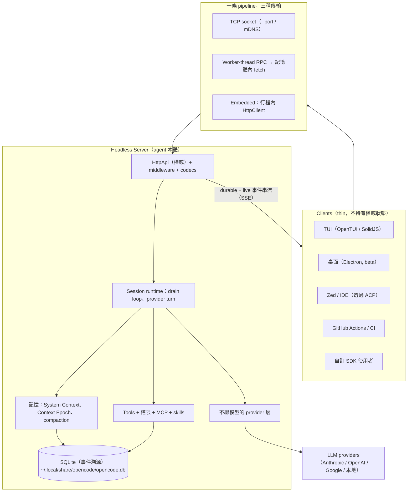
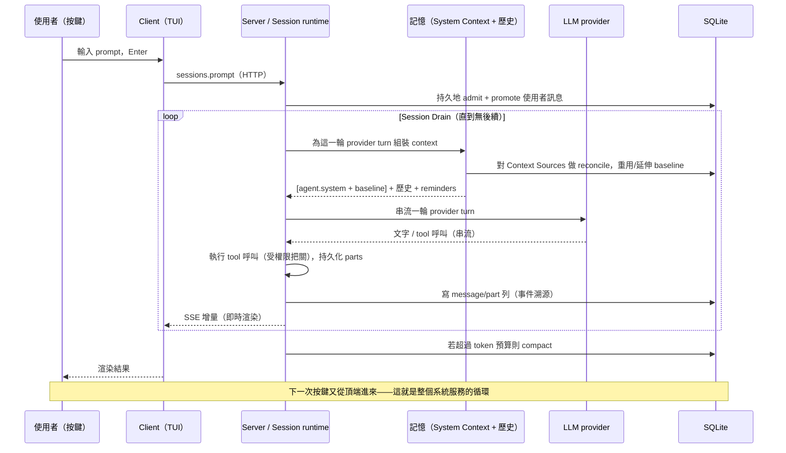
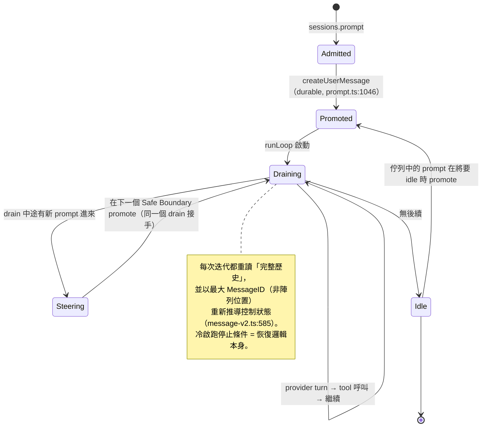
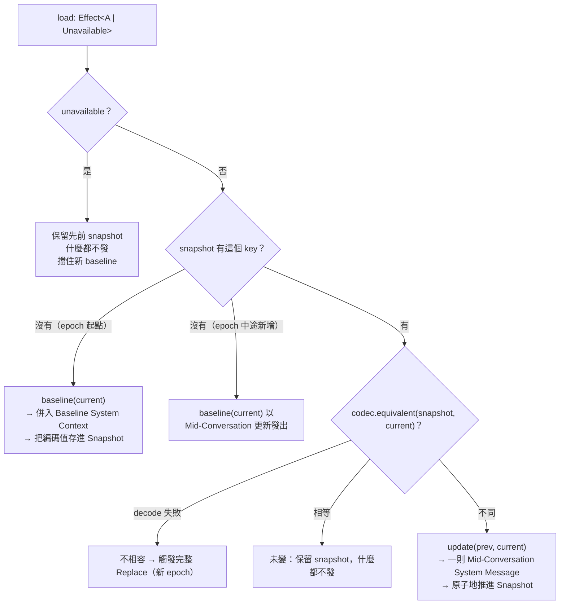
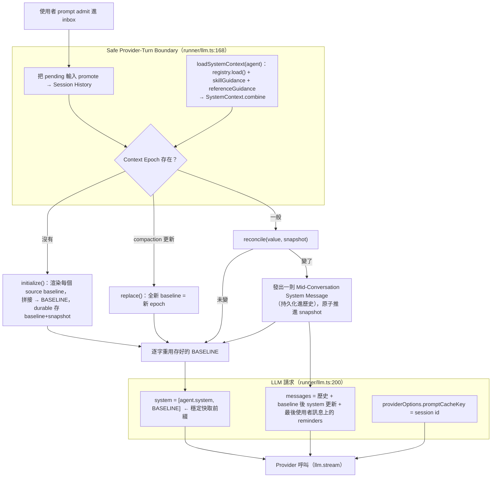
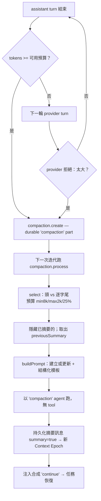
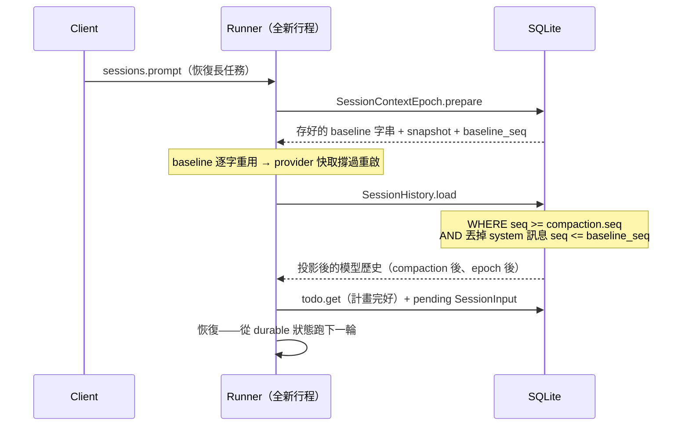
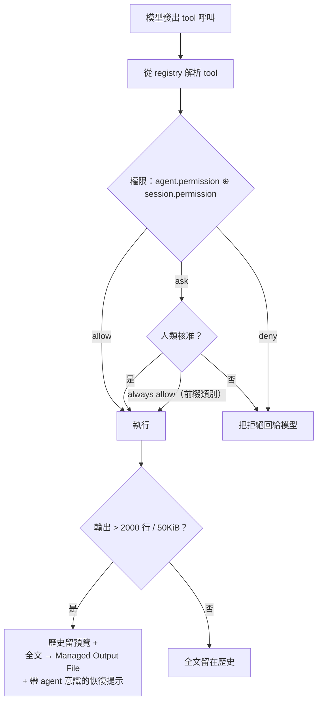
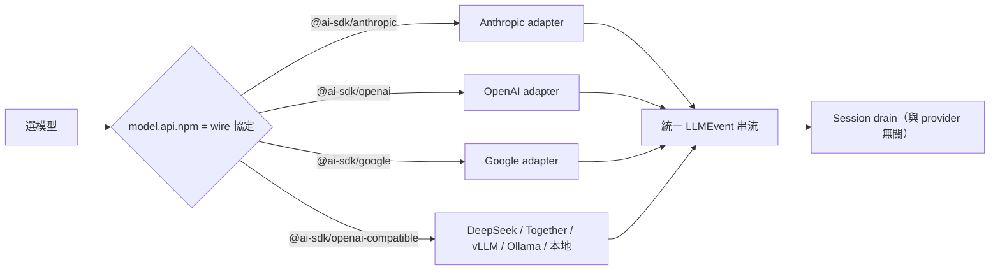
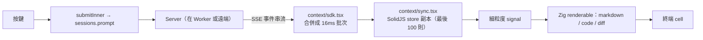

# OpenCode — 深度架構分析

> 對 [`anomalyco/opencode`](https://github.com/anomalyco/opencode)（開源 AI 編碼 agent）的架構研究。特別聚焦：**agent 如何將使用者的 prompt 與它的「短期記憶」「長期記憶」一起處理後送進 LLM，以及它如何持久化記憶，讓長時間任務不會「跑偏」（go sideways）。**
>
> 分析深度：**深度**（核心模組覆蓋率 ≥90%，以 8 個並行 sub-agent 掃過整個 codebase）。每個結論都標註 `檔案路徑:行號`，以程式碼為準。

---

## 1. 專案全景（精簡）

OpenCode 是**為終端機打造的開源 AI 編碼 agent**，由原 **SST** 團隊開發（倉庫近期從 `sst/opencode` 搬到 `anomalyco/opencode`）。它以 TypeScript 撰寫、跑在 **Bun** 上、**model-agnostic（不綁特定模型）**（Claude、GPT、Gemini、Grok、本地 Ollama，約 75 家 provider），是現存星數最高的開發工具之一（約 18 萬星，MIT 授權）。([anomalyco/opencode](https://github.com/anomalyco/opencode)、[morphllm 排行榜](https://www.morphllm.com/best-ai-coding-agents-2026))

**值得知道的血緣：** 「opencode」這名字源自更早的專案（Kujtim Hoxha / opencode-ai）。在 2025 年的一次分裂後，一條血脈成了 **Charm 的 Crush**；另一條——由 SST 團隊（Dax Raad 等）以 TypeScript-on-Bun 重寫的版本——就是*本倉庫*。([Grokipedia: OpenCode](https://grokipedia.com/page/opencode)、[HN 討論](https://news.ycombinator.com/item?id=46552218))

### 與同類的定位差異

| 工具 | 核心主張 | 記憶 / 持久化策略 |
|---|---|---|
| **opencode** | headless、不綁模型的 server；多 client；終端優先 | **事件溯源 SQLite、durable Context Epoch、靠投影恢復**（本報告主題） |
| Claude Code | Anthropic 優先、深度自主 | 每輪重建 prompt；以 transcript 為主 |
| Aider | Git 原生，每次改動都 commit | Git 歷史*就是*記憶 |
| Cursor | 內嵌 IDE | 由編輯器管理 context |
| Crush（Charm） | TUI 優先、多模型 | 與 opencode 同源的兄弟專案 |

來源：[sanj.dev 比較](https://sanj.dev/post/comparing-ai-cli-coding-assistants/)、[Pinggy: 開源 CLI agent](https://pinggy.io/blog/best_open_source_cli_coding_agents/)。

本報告在意的差異化點：opencode 把**記憶與 context 當作一個「durable、typed、可恢復」的子系統**，而非每輪重新拼接的字串。這個選擇是整個架構的脊椎。

### 規模（有效 LOC，排除測試/產生碼）

| 套件 | LOC | 角色 |
|---|---:|---|
| `packages/opencode` | ~80,700 | agent runtime（session loop、tools、providers）— **V1** |
| `packages/core` | ~33,200 | 共享 domain，**V2** session/記憶引擎 |
| `packages/tui` | ~26,800 | 終端 UI client（OpenTUI） |
| `packages/sdk` | ~30,300 | 產生的 SDK |
| `packages/server`、`client`、`protocol`、`schema` | ~6,800 | HTTP 契約脊椎 |

---

## 2. 架構總覽：一個 headless server，多個 thin client

關於 opencode 最關鍵的一個事實：**agent loop 本身*就是*一個本地 headless server，而人類接觸到的一切——TUI、桌面 App、Zed/IDE 橋接、GitHub Actions、SDK——都是透過 HTTP + 事件 API 連上來的 client。**（模組 A）



**為什麼是這個形狀？** 三個回報：

1. **一個大腦、多張臉。** 不管你在終端、編輯器還是 CI，跑的都是同一條 `streamText`/tool/權限/記憶 pipeline。新 client 是整合工作，不是重寫。`HttpApi` 邊界*就是*產品的擴展面。
2. **崩潰恢復與多 client 都是免費的**，因為 client 不持有權威狀態——它們只是 server 狀態的投影（模組 H 在 TUI 裡證明了這點）。你的終端可以掛掉再 reattach；兩個 client 可以同時看同一個 session。
3. **Embedding 只是同一概念的退化特例。** `sdk-next` 把 V2 router 跑在*行程內*，方式是把一個由 web-handler 支撐的 `fetch` 注入成 Effect `HttpClient` 的傳輸層（`sdk-next/src/opencode.ts:8-41`）。只有傳輸不同；完整的 middleware/codec/auth pipeline 原封不動。對比那些後期才硬塞「API mode」的工具——opencode 一開始就把 server 當*主產物*、把 CLI 當它的 client。

還有兩個結構性賭注定義了這個 codebase：

- **建構在 Effect（effect-ts）之上。** Layers、scoped resources、fibers、typed errors。每一次 DB 存取、每一次 provider 呼叫、每一個 tool 都是可中斷、可追蹤的 `Effect`。這讓「中斷」（`AbortController` acquire/release，`llm.ts:361`）與資源清理變得一致。代價：對不熟 Effect 的貢獻者來說門檻很高。
- **嚴格且由實體強制的套件分層**（`AGENTS.md`）：Schema → Core & Protocol → Server；**Client 可依賴 Schema+Protocol，但永遠不能依賴 Core 或 Server**。根 client 是瀏覽器安全且 zero-Effect 的；`/effect` 才選擇性引入 Effect；只有 `sdk-next` 同時組合 Client+Core+Server。這換來瀏覽器安全、雙 runtime 的 SDK，以及 SDK 型別不受 Core 變動牽連。SDK 由單一 **「SDK Contract IR」**（`httpapi-codegen`）產生，從不手改。

### 端到端資料流（整個架構服務的那個循環）



第 3、4 節是你問題的核心。第 5–8 節覆蓋周邊機制。第 9 節是誠實的評價。

---

## 3. ★ 一個 prompt 如何變成位元組：短期 + 長期記憶

這就是你指定要的那一節。讀之前先把 codebase 逼你面對的一件事內化：**opencode 正處在兩種記憶設計的遷移途中，而這個對比本身就是全部的洞見。**

- **V1**（`packages/opencode`，今天實際出貨的）：每一輪 provider turn 都重跑 loader 並**從零字串拼接出一份新的 system prompt**（`session/prompt.ts:1256-1285`）。這就是「天真重建」——正是 Claude Code、Aider、Cursor 在做的事。
- **V2**（`packages/core/src/system-context/`，未來、被 `CONTEXT.md` 逐字規格化的）：把長期記憶建模成**有型別、可比對、durable 的「Context Source」**，渲染成一份**每個 epoch 不可變的 baseline**，變動以時序更新的形式追加。

V2 的複雜度，只有把它當成對 V1 成本與正確性缺陷的*反應*才講得通。我會照架構的本意（V2）來講記憶模型，並指出 V1 的不足。

### 3.0 驅動這一切的 agent loop（「Session Drain」）

先看每輪呼叫記憶組裝的那個 loop。程式碼揭露的一個意外：**loop 不在 `session.ts` 裡。** `session.ts`（37 KB）純粹是持久化/CRUD + token 計帳。真正的 agent loop——`CONTEXT.md` 稱之為 **Session Drain**——住在 `runLoop`（`prompt.ts:1081-1340`），由一個 `Runner` 原語（`effect/runner.ts`）與一個行程內的 `Map<SessionID, Runner>` registry（`run-state.ts:38`）協調。（模組 B）



這裡有三個對「不跑偏」很關鍵的設計選擇：

- **drain 幾乎不持有狀態。** 每次 `while` 迭代都重讀完整歷史，並以 `MessageV2.latest` *依最大 MessageID（非陣列索引）* 重新推導「最新的使用者訊息是什麼／是否已回覆」（`message-v2.ts:585`）。這種無狀態性*就是*崩潰恢復機制：重啟後冷啟跑一次停止條件，就能精確重建任務當時走到哪。
- **drain 沒有 durable 身分**（`CONTEXT.md:104`）。沒有「任務物件」可以丟失。這是對多數 agent 框架（持有一個記憶體內 run 物件）的刻意反轉。
- **steering 與 queued prompt 是「湧現」的，不是分支出來的。** 沒有獨立程式碼路徑。`Runner.ensureRunning` 把並發進來的 prompt 合併進同一個 drain；因為新使用者訊息已*持久化*，正在跑的 drain 會在它的下一個 Safe Provider-Turn Boundary 撿起它。這就是「steering」（中途插話、改向一個正在跑的任務），免費（`runner.ts:122`）。而*佇列中*的 prompt 只是單純等到 drain 要進 idle 才動。

那個 loop 的每次迭代都會撞上一個決策點：*為這一輪 provider turn 組裝 context*。這個組裝就是記憶。

### 3.1 短期記憶 = 對話 + 即時注入的 reminders

短期記憶是**時序對話**加上**在恰當時機注入的合成提醒**。兩個機制，都在 `session/reminders.ts` 與 read tool 裡：

- **`SessionReminders.apply`**（`reminders.ts:15`）*不碰* system prompt。它找到最後一則使用者訊息，把合成文字 part **推到它身上**（`synthetic: true`），讓它們在對話中正確的時序位置乘載進去（`reminders.ts:23`）。情境：進入 plan 模式（`reminders.ts:27-36`）、plan→build 切換（「你先前規劃過，現在執行」，`reminders.ts:37-47`）、以及一個實驗性的 plan-file 變體（`reminders.ts:51-89`）。它在每次 loop 迭代、建立 assistant 訊息前被呼叫一次（`prompt.ts:1180`）。
- **讀檔時的巢狀 AGENTS.md**（`instruction.resolve`，由 `tool/read.ts:300` 呼叫）：當模型讀一個檔案，opencode 從*那個檔案*往專案根目錄逐層往上走，找到任何 `AGENTS.md`/`CLAUDE.md`/`CONTEXT.md`，把內容**每則訊息附一次**（用 `claims` map 去重，`instruction.ts:70-77`）。這是「即時長期記憶」——目錄區域的規則隨著 agent 走進該目錄而浮現。

**架構上的重點：** 一條 reminder 跟 system instruction 是*同一種文字*，但**你把它注入到哪裡——對話串流 vs. 穩定 baseline——才決定了它是短期還是長期。** 一條 reminder 只在*當下*、這個時序位置相關（「你剛被切到 build 模式」）；把它烤進凍結的 baseline，既不對、也對快取有害（見 §3.4）。

### 3.2 長期 / 環境記憶 = System Context

長期記憶是**不管對話走到哪都需要的環境事實**：我是誰、哪個目錄、今天幾號、有哪些專案指示、有哪些 skill。`CONTEXT.md` 把整包叫 **System Context**，每個事實叫一個 **Context Source**。內容：

1. **基礎模型 prompt** — 依模型家族選擇（`system.ts:26-40`）：Claude 用 `anthropic.txt`，OpenAI 用 `gpt.txt`/`beast.txt`/`codex.txt`，`gemini.txt`、`kimi.txt`，否則 `default.txt`。這是 agent 的*人格與 tool 紀律*——對該模型所有 session 都相同的常駐指示。（依 wire 模型 id 的子字串選，所以走 Bedrock/Vertex 的 Claude 也都正確拿到 `anthropic.txt`。）
2. **環境**（`system.ts:58-94`）：模型 id、工作目錄、worktree root、是否 git、平台、**今天的日期**（`system.ts:72`）。
3. **指示** — AGENTS.md 聚合（下述）。
4. **MCP 指示** — 各 server 對允許的 MCP tool 的引導（`system.ts:110-126`）。
5. **Skill 引導** — 只有名稱+描述；body 留在受權限把關的 `skill` tool 後面（`system.ts:96-108`）。

**AGENTS.md 探索（最重要的長期 loader）** — `instruction.ts`：

- **全域**（`instruction.ts:115-120`）：`~/.config/opencode/AGENTS.md`，再來 `~/.claude/CLAUDE.md`。*第一個命中者勝*。
- **專案往上**（`instruction.ts:123-133`）：從工作目錄往 worktree root 逐層找 `AGENTS.md` → `CLAUDE.md` → `CONTEXT.md`。*第一個命中的檔案類型勝*——「這樣才不會把每個祖先目錄的 AGENTS.md/CLAUDE.md 疊起來」（`instruction.ts:122`）。遵守 `OPENCODE_DISABLE_PROJECT_CONFIG`。
- **config 宣告**（`instruction.ts:135-150`）：明確的 `config.instructions` glob，外加 `http(s)://` 指示 URL（5 秒逾時）。

每個檔案都渲染成帶來源標頭（`Instructions from: {path}\n{content}`），讓模型知道某條規則*來自哪個檔案*——當專案區域規則跟全域規則衝突時，這很關鍵。

### 3.3 V2 的躍進：每個環境事實都是一個有型別的 Context Source

V2 的論點是：每輪字串拼接這些東西是錯的。每個都變成一個 `Source<A>`（`system-context/index.ts:32-39`）：

```
interface Source<A> {
  key:      Key                       // 穩定、有命名空間，例如 "core/instructions"
  codec:    Schema.Codec<A, Json>     // 編碼 / 比較 / 儲存型別值
  load:     Effect<A | Unavailable>   // 不會失敗的觀測（或「看不到」）
  baseline: (current) => string       // 首次引入時渲染
  update:   (prev, current) => string // 對話中途「變了」時渲染
  removed?: (prev) => string          // 消失時渲染
}
```

內建（`builtins.ts`、`instruction-context.ts`、`skill/guidance.ts`）：`core/environment`、`core/date`、`core/instructions`（值型別 `ReadonlyArray<File>`）、`core/skill-guidance`、`core/reference-guidance`。registry 並發載入所有 producer、**依 key 排序以求 determinism**、再合併；重複 key 直接讓 composition 失敗（`registry.ts:39-44`、`index.ts:314-320`）。

一個細微但承重的區分：**`unavailable` ≠ 不存在**（`index.ts:27-30`）。若一個*先前已發現*的 AGENTS.md 暫時讀不到，loader 回傳 `unavailable`；runtime **保留先前狀態、什麼都不發**，並**擋住建立新 baseline**，而不是凍結一份不完整的（`index.ts:198-206`）。這是記憶版的 stale-while-revalidate——避免一次暫時的 `stat` 失敗去告訴模型「你的專案指示被刪了」。



### 3.4 深層的「為什麼」：Context Epoch 與不可變的快取前綴

這是替*整套* snapshot/epoch 機制辯護的問題：**為什麼要把 baseline 在一個 epoch 內凍結，而不是像 V1（像大家）每輪重建 system prompt？**

答案是 **provider 的 prompt 快取（KV-cache 重用），而且這是個約 10 倍的成本與延遲槓桿。**

Anthropic/OpenAI 等會對**逐位元組完全相同的前綴**重用注意力的 KV-cache。system prompt 是*每個*請求的前綴。所以你只要在兩輪之間稍微改動它——日期字串跳了、skill 清單重排了、`new Date()` 重算了——你就**改了前綴，把整段對話、每一輪的快取全部打掉。** V1 對前綴穩定性*毫無保證*：它每輪從零重建 `system[]`（`prompt.ts:1256-1268`），任何附帶的字串抖動都會悄悄讓 token 帳單 10 倍化，而沒人察覺。

V2 的 **Context Epoch**（`SessionContextEpochTable`，`session/sql.ts:168`）*保證*前綴穩定：

- epoch 起點，`initialize` 渲染一次 **Baseline System Context**，並**把那串確切的拼接文字 durable 地存起來**（`sql.ts:174`），**跨行程重啟逐字重用**。
- 整個 epoch 的每一輪 provider turn 都送出那串存好的 baseline 當前綴（`runner/llm.ts:192-205`：`system: [agent.system, system.baseline]`）。前綴永不改變 → 最大化快取命中。快取 key 是 session id（`runner/llm.ts:199`），所以快取命名空間也撐過重啟。
- 當某個事實真的變了，V2 **不**改 baseline。它把**一則 Mid-Conversation System Message** 追加進歷史（`context-epoch.ts:72-76`）——例如「今天的日期現在是 X」。穩定前綴保留；新事實以一個較晚的時序 turn 抵達，快取直接往後延伸越過它。

**把這一切綁起來的歷史投影技巧**（`history.ts:24-53`）：給定 epoch 的 `baselineSeq`，`seq <= baselineSeq` 的 system 訊息被**排除**（它們已被併入 baseline，重播會重複計），而 `seq > baselineSeq` 的**被重播**。所以一個請求恰好是 `[baseline 前綴] + [對話] + [baseline 之後的 system 更新，依時序]`。零重複、穩定前綴、與時俱進的覺察。這是整個 codebase 裡最優雅的一個點子。

### 3.5 完整的組裝管線（核心圖）



**你的問題，一段話作答。** 在每個 Safe Provider-Turn Boundary，opencode 載入它的 Context Sources（長期/環境記憶：人格 prompt、環境、日期、AGENTS.md 指示、skill 引導）並合併。epoch 起點它們渲染一份 durable 存好的**不可變 Baseline System Context**；其後以 **codec 等價性 reconcile**，任何變動發出**一則追加進歷史的 Mid-Conversation System Message**，而不是改動 baseline。請求是 `[agent.system, baseline]`（整個 epoch 的穩定快取前綴）+ 對話 + baseline 後的 system 更新 + 使用者 prompt，並把**短期 reminders 推到最新使用者訊息上**的正確時序位置。這套「凍結 baseline + 比對後追加」的設計，是為了在一個長時間、可重啟的 session 裡讓 provider 的 KV-cache 前綴維持逐位元組穩定，同時讓模型對演進中的事實保持覺察——這是天真的每輪重建（V1，以及多數競品）給不出的保證。

### 3.6 為什麼 typed source 勝過字串拼接——以及誠實的代價

V2 的框架值得它的複雜度，五個理由，各自對應它防住的失敗模式：

1. **快取穩定**（§3.4）——凍結 baseline *保證*前綴不抖；天真重建悄悄讓你的帳單 10 倍化。
2. **determinism / 可比對性**——codec + 結構化 `equivalent` 讓「這變了嗎？」成為精確的 typed 比較，而非脆弱的字串 diff；registry 依 key 排序確保穩定順序。你渲染*專門打造*的更新訊息（「今天的日期現在是 X」），而非生的文字 diff。
3. **跨重啟的 durability**——baseline + snapshot 存在 SQLite（`sql.ts:172-175`）；重啟重現*確切*的快取前綴與比較狀態。新行程上的字串重建會重算 `new Date()`、重新 stat 檔案、重排——可能產生不同前綴，丟掉快取。
4. **正確的演進覺察**——模型被以時序事件、在正確的點、恰好一次告知*新生效狀態*。天真重建要嘛在模型底下悄悄改事實，要嘛每輪重述全部。
5. **plugin 可擴展**——`Source<A>` 是統一契約；新環境事實無需動組裝程式碼就能註冊，並透過一則 mid-conversation baseline 自我介紹。

**誠實的取捨：** V2 明顯是更多機制——一個 registry、codec、snapshot、一張 epoch 表、reconcile/replace 狀態、歷史投影算術。對玩具 agent 這是過度設計。賭注是：對*長時間、可重啟、對快取敏感的*編碼 session，回報壓過成本。鑑於 opencode 是一個多行程、不綁模型的系統，一個任務跨越數小時與許多輪，這個賭注下得很好。競品能靠天真重建蒙混，是因為它們的 session 較短命且單行程。

---

## 4. ★ 為什麼長任務不會跑偏：compaction、持久化、恢復

你的第二個問題比「一輪」難。一個長任務——「重構這個 service、跑測試、修壞掉的東西」——會溢出模型的視窗，而且很可能跨越行程重啟。即使字面對話已塞不下、即使啟動它的行程已不在，agent 仍必須從一幅*連貫的*意圖、決策、進度圖像繼續行動。四個失敗模式、四個機制（模組 D）：

| 失敗模式 | 機制 | 位置 |
|---|---|---|
| 對話長過視窗；模型開始遺忘 | **Compaction**（LLM 摘要、開新 epoch） | `session/compaction.ts` |
| 摘要本身丟失意圖/狀態/下一步 | **結構化摘要模板** | `core/session/compaction.ts:16-51` |
| 行程崩潰；記憶體內狀態蒸發 | **事件溯源持久化** | `core/session/projector.ts` |
| agent 跨 compaction/重啟丟失計畫 | **TODO 清單**（獨立表，兩者都活著） | `session/todo.ts` |
| agent 的*編輯*出錯，必須撤銷 | **影子 git 快照 + revert** | `snapshot/index.ts` |

### 4.1 compaction 何時觸發

runner loop 裡兩個獨立觸發：

- **主動 token 門檻**（`prompt.ts:1161-1168`）：一輪結束後，若其 token 用量越過了*可用*預算——context 視窗**減去 2 萬的保留**（`overflow.ts:8-20`）——就現在 compact。保留是為了永遠留空間給模型的*回應*以及 summarizer 自己跑；它在還剩約 2 萬 token 餘裕時觸發，而非撞到硬上限才動。`auto:false` 可關閉——compaction 是政策，不是法律。
- **被動 provider 溢出**（`prompt.ts:1318-1327`）：provider 直接拒絕請求太大；processor 回傳哨兵值 `"compact"`。`overflow` 旗標觸發額外工作（剝除 media、重播觸發的 prompt——§4.3）。

關鍵是，`compaction.create` **不**立即摘要（`compaction.ts:513-536`）：它持久寫一則帶 `compaction` part 的使用者訊息然後 `continue`。*下一次* loop 迭代看到待辦任務才跑它。所以 compaction 本身是個 durable、可恢復的步驟——在「決定 compact」與「做了 compact」之間死掉，工作會從磁碟恢復。

### 4.2 compaction 做什麼——外科手術，不是失憶

`processCompaction`（`compaction.ts:289-511`）：

1. **保留逐字尾巴。** 歷史切成**頭**（被摘要）與**尾**（最近數輪*原樣*保留）。尾巴是最後 `DEFAULT_TAIL_TURNS = 2` 輪，受 token 預算 `min(8k, max(2k, 可用的 25%))` 上限（`compaction.ts:188-239`、`:80-85`）。*為什麼：* 最近的交換是 agent 當下工作 context 所在——它正在修的那個確切錯誤。摘要掉它們是自我破壞。**舊 → 有損摘要；近 → 原樣保留。** 這是「不跑偏」最重要的單一選擇。
2. **增量，非累積。** 已摘要的輪被隱藏；前一份摘要被取出並*合併*（`compaction.ts:62-78`）。你摘要*新*的那段並併進前一份摘要——不是每次重讀全部歷史。
3. **把摘要當成真正的 assistant turn 跑**，`agent:"compaction"`、無 tool、剝除 media、tool 輸出上限 2k 字元（`compaction.ts:351-402`）。專屬的 compaction agent 可用比主任務更便宜/更快的模型。若連剝除後的摘要都塞不下 → 誠實的 `ContextOverflowError`，而非默默截斷。
4. **開新 epoch。** 摘要訊息（`summary:true`）正是歷史投影用來把頭從模型視圖切掉的依據（但它仍留在磁碟當稽核歷史）。
5. **自動續跑**讓任務不停擺：注入一則合成的「若有下一步就繼續……」使用者訊息（`compaction.ts:451-502`）。



### 4.3 摘要模板——「不跑偏」的真正保證

這是你問題的一半，所以這裡放 summarizer 必須輸出的確切結構（`core/session/compaction.ts:16-51`）：

```
## Goal — 單句任務摘要
## Constraints & Preferences — 使用者約束/規格，或 (none)
## Progress
### Done / ### In Progress / ### Blocked
## Key Decisions — 決策「以及為什麼」
## Next Steps — 有序的下一步行動
## Critical Context — 錯誤、開放問題、技術事實
## Relevant Files — 路徑：為何重要
```

規則：*保留每個段落（即使空）；簡短條列；**保留確切的檔案路徑、命令、錯誤字串、識別符**；不要提到發生過 compaction。*

把它讀成一份**「長任務絕不能丟失什麼」的規格**——每個段落都對應一種跑偏模式：

- **Goal** → agent 忘記*被要求做什麼*而漂移。
- **Constraints** → 忘記「用 TypeScript、不加新依賴、配合既有風格」→ 正確但被退回的工作。
- **Progress（三態）** → **重做已完成的工作**或**重試已知的阻塞**——典型的 compaction 後失敗；明確的 Done/InProgress/Blocked 切分防住它。
- **Key Decisions … 以及為什麼** → 因為理由丟了而默默*推翻*先前決策。捕捉*為什麼*是刻意的。
- **Next Steps（有序）** → 丟失計畫（由 TODO 表鏡像，§4.5）。
- **Critical Context / Relevant Files** → 保留它正在 debug 的確切錯誤字串與工作集，這樣它不必從頭重新摸索 codebase。

「anchored summary … 併入新事實」的框架（`:166-173`）讓這成為一份**跨多次 compaction 編輯的活文件**，而非一次性的有損快照。保留*確切*識別符的指示，直接反制最具破壞性的失敗：LLM 把 `src/auth/session.ts:142` 改寫成「那個 session 檔案」，然後 agent 改錯東西。**這個模板是整個保證的承重牆**——其餘一切只是觸發與安放它的水電。

### 4.4 事件溯源持久化：列（row）是唯一的真相

定義 durability 的決策（`sync/README.md`）：**opencode 是單一寫入者的事件溯源系統。** 變更不直接寫 DB——而是*發布一個事件*，由**projector** 套用它。

```ts
// session.ts:634 — updateMessage 只「發布」
yield* events.publish(SessionV1.Event.MessageUpdated, { sessionID, info: msg })

// core/session/projector.ts:262 — projector 做冪等寫入
db.insert(MessageTable).values({...})
  .onConflictDoUpdate({ target: MessageTable.id, set: { data } })   // 可安全重播的 upsert
```

關鍵事實：
- **每個 part 是自己一列**，在 `PartTable`（`sql.ts:83-101`），body 以 JSON 欄位存。這個 parts-as-rows 模型（模組 B、D 各自獨立證實）正是讓串流、部分崩潰恢復、與「歷史內 compaction」自然湧現的關鍵——相對於 v1 的肥單體訊息。
- **以單一 `seq` 整數做全序**，每事件加一（`sync/README.md`）：單寫入者就不需要向量時鐘。那個整數是恢復與 Context Epoch 切點的骨幹。
- **`onConflictDoUpdate` 讓它崩潰安全**：重播已套用的事件是 no-op，所以崩潰後重跑會收斂到同一狀態。
- **儲存：** SQLite 經 Bun 原生 `bun:sqlite` + Drizzle，位於 `~/.local/share/opencode/opencode.db`，`journal_mode=WAL`、`synchronous=NORMAL`、`busy_timeout=5000`、`foreign_keys=ON`（`database.ts:21-27`）。WAL + NORMAL 是對 agent 正確的取捨：硬斷電可能丟*最後幾個* commit，但永不損毀，且不會在每個串流 token 增量上被 `fsync` 卡住。（另有一個 legacy JSON store，正在被遷移淘汰。）

### 4.5 TODO 清單——在有損通道之外的無損計畫

`session/todo.ts` 小但戰略上居中。TODO 清單住在它**自己的表**（`TodoTable`，`sql.ts:103`），以交易式 delete-all-then-reinsert 更新（`todo.ts:29-51`）。關鍵性質：**它住在對話 transcript 之外，所以 compaction 永不碰它。** agent 的計畫以**零摘要損失**撐過每次 compaction 與重啟。摘要的 `## Next Steps` 是*冗餘、有損的備份*；TODO 表是*無損的主本*。即使 summarizer 把下一步搞砸了，結構化的列仍完整並會被重新注入。這是系統裡最乾淨的長期記憶——一個小小的、結構化的、對 context 壓力免疫的便箋，在定義那些步驟的對話被摘要掉之後，仍讓「9 步裡的第 4 步」保有意義。

### 4.6 影子 git 快照——對*世界*做檢查點

另一種記憶：agent 正在改動的檔案系統。`snapshot/index.ts`（807 行）用**一個影子 git 倉庫**——與使用者的 `.git` 分離——位於 `~/.local/share/opencode/snapshot/{projectID}/{hash}`。`track()` 對 worktree `git add --all` 再 `git write-tree`，回傳一個 tree hash，那*就是*檢查點 id，記在 `step-start`/`step-finish` part 裡。

工程相當細緻，註解說明了為什麼：
- 它**透過 git `alternates` 從真倉庫播種影子倉的物件 DB**（`index.ts:198-233`）——「在像 chromium 的巨型 repo 上，`git add --all` 可能要幾分鐘。這麼做就把它消掉了。」它重用已算好的 blob hash。
- 遵守來源 `.gitignore`、排除 >2MB 檔案、為巨型 worktree 調 index、每小時 GC。

**為什麼用影子倉而非使用者的 git？** 隔離。agent 的檢查點絕不能污染使用者的 commit 歷史、暫存區或 reflog，且必須在 worktree 不是 git repo 或處於 rebase 中途時仍可運作。`session/revert.ts` 接著把**檔案系統倒回**（`git checkout {hash} -- {file}`）與**對話截斷**（丟掉 revert 點之後的 message/part 列）組合到同一點——兩者都 durable、都可撤銷（`unrevert`）。

### 4.7 恢復：崩潰後恢復任務

回報來了。**沒有記憶體內的「任務」物件要還原**——刻意如此。恢復純粹是從 durable 列重新推導：



- **模型歷史**由 `SessionHistory.load`（`history.ts:66-80`）以兩個 SQL 切點重建：保留 `seq >= compaction.seq`（頭已被折疊），丟掉 system 訊息 `seq <= baseline_seq`（已在 baseline 裡）。一個恢復的 turn 與行程從未死過時會看到的**逐位元組相同**——從列 + 兩個整數確定性重算。
- **baseline** 被讀回並*逐字*重用（`context-epoch.ts:46-77`），所以 provider 的 prompt 快取撐過重啟——恢復長任務很便宜，不是整段重新預熱。
- **其餘一切都從列掉出來：** TODO 清單、`SessionInputTable` 裡的 pending **Admitted Prompt**（admit 了但未 promote 的存活——這正是為何 `sessions.prompt` 可以「只 admit」）、part 列裡的檔案系統檢查點。

**統一原則，且是對的那個：** runtime *不持有「任務」的任何 durable 身分*——只有 durable 事實與純投影規則。意圖由*摘要模板*保留；狀態由*列*；計畫由*TODO 表*；世界由*影子 git*。**一次崩潰，只是兩次事件重播之間的一道縫。**

---

## 5. 行動層：tools、權限、MCP、skills

記憶是惰性的；要有進展，agent 必須*行動*——而每個行動都被把關。（模組 E）

**tool 是純能力；授權是一個「綁定到該輪」的邊界。** 一個 `Tool.Def` 完全不知道誰可以呼叫它。`session/tools.ts:78-86` 把每個 tool 的 `ctx.ask` 閉包在 `Permission.merge(agent.permission, session.permission)` 之上，綁定**該輪 turn 解析時的有效 agent**。沒有可變的全域「目前 agent」——授權是一個閉包。這實作了 `CONTEXT.md` 的規則「本地 tool 授權保留發出該呼叫的那一輪 provider turn 的有效 agent」，並避開一整類 TOCTOU/環境權威 bug。

**plan vs build 是同一個 tool 面，只是 `edit` 被 deny**（`agent/agent.ts:156-181`），不是另一條程式碼路徑。所以唯讀模式是*防竄改的*——在能力層強制，而非靠好聲好氣地拜託 prompt。唯一出口是 `plan_exit`，它先問人類、再注入一則合成訊息把 agent 翻成 `build`。



另外三個設計註記：
- **tool 輸出限界**（`tool/truncate.ts:85-141`）：超過 2000 行 / 50 KiB 的輸出在歷史保留有界預覽，把全文溢出到磁碟上的 **Managed Output File**，並帶一個有 agent 意識的提示（「若你有 `task` 就委派給 explore subagent，否則用 Grep/Read 加 offset+limit」）。*為什麼：* 歷史每輪重播，所以無界 tool 輸出會炸掉 context 預算。
- **Bash「arity」表**（`permission/arity.ts`）：「always allow」核准一個*前綴類別*（`git checkout`、`npm run dev`），用 tree-sitter 解析，而非確切字串——這是「可用」與「每次敲鍵都跳提示」的差別。worktree 外的檔案操作會另外觸發 `external_directory` 提示。
- **skills = 漸進揭露，既是 token 經濟也是安全**：名稱+描述在 prompt 裡（經權限過濾），body 只透過 `skill` tool、在 `skill` 權限檢查後載入。和 tool 輸出限界、MCP 資源是同一個「共享 context 放指標、payload 放閘門後」的模式。**MCP tool 一旦併入就與內建無從區分**（加命名空間、預設 ask、相同截斷）。**subagent 無法提權**：子代繼承父代的*deny* 與 external-directory 規則，從不繼承其 allow（`subagent-permissions.ts`）。

## 6. 不綁模型：provider/LLM 層

opencode 的招牌功能是可互換地跑在 Claude、GPT、Gemini、Grok 或本地模型上。訣竅（模組 F）是**「協定塌縮」而非通用抽象**：一切都以 `model.api.npm`——AI-SDK 的*套件名*，亦即 wire 協定——為鍵，而非 provider id。DeepSeek/Together/Cerebras/vLLM/本地全塌縮到 `@ai-sdk/openai-compatible` 並共用一條路徑（`provider.ts:1197`）。provider 怪癖被隔離在恰好兩處：`transform.ts`（請求塑形）與 `ai-sdk.ts`/協定檔（wire/事件）。上游一切都看到統一的 `LLMEvent` 串流。



- **兩個 runtime 並存。** 預設 = Vercel AI SDK `streamText`（約 25 家內建 provider + 對其他任何家動態 npm-install，`provider.ts:107`）。選擇性的原生 = opencode 自家的 `@opencode-ai/llm` 協定 adapter（`experimentalNativeLlm`）。兩者匯流到同一事件串流。終局（`DESIGN.md`）是 `@opencode-ai/ai` 提供*單輪 provider turn* 的原語——明確**不是**一個現成的 agent loop，因為 opencode 自己*就是*那個 loop。
- **Catalog**（models.dev）供應 context 視窗、定價、能力的中繼資料，驅動 §4 的 compaction 門檻與請求選項分割。
- **Native Continuation Metadata** 是最微妙的正確性關注。Anthropic 對 thinking block 簽章；OpenAI 用加密 reasoning 內容。這些是 provider 範疇且*無法翻譯*，所以切換模型時（`message-v2.ts:245`）可見的 reasoning 降為純文字、所有不透明 metadata 被丟棄。保守、有損、而正確——你無法把一家 provider 的簽章 reasoning 重播進另一家。
- **Request Options（provider 語意）vs Generation Controls（中性）** 被分割，讓動態選 provider 仍維持快取穩定；一個 `variants` 系統把一個中性的「effort」旋鈕映射到各 provider 的 body。**Auth** 是 `0o600 auth.json` 平檔儲存加上雲端帳號的 device-code OAuth；配上 `store:false` + 無狀態重播，姿態實質上是零留存。

## 7. Agent 身分、config、plugin、event bus

把 provider + tool + 記憶組合成一個具體 agent 的膠水（模組 G）。

- **一個 agent 是一筆純資料記錄，其承重欄位是 `permission`**（一個 `Ruleset`），而非它的 prompt。`build` 與 `plan` 是*同一個 agent、不同權限*；優先序是「最後規則勝」（`findLast`），合併順序為 預設 < agent 內建 < 使用者設定。自訂 agent 來自 JSON 或 markdown frontmatter+body。這正是唯讀模式無法逃逸的原因——它是能力事實，不是 prompt 建議。
- **Config** 透過約 10 個來源解析（`config/config.ts`）：專案覆寫全域，MDM 受管偏好覆寫一切。`export * as Config from "./config"` 的自我匯出模式讓每個*檔案*成為一個命名空間，給整個 codebase 統一的 `Namespace.Service/use` 形狀。
- **Plugin** 暴露 v1 hook 面（自訂 tool、auth/provider、chat 參數塑形、`permission.ask`、生命週期），透過一個會改動共享輸出的循序 `trigger` 派發。一個帶 `reference` hook 的 v2 effect-domain 模型，正是 `CONTEXT.md` 標為後續的「plugin 定義的 Context Source」的接縫。
- **Event bus，兩層：** `EventV2`（core）是事件溯源的 *durable* bus，帶交易式 publish 與交易內 projector——§4 的 durability 基底。`GlobalBus` 是裸 EventEmitter，給短暫的生命週期訊號。`EventV2Bridge` 把 location 蓋章到事件上並重發到 GlobalBus，由 per-instance 的 SSE handler 依目錄過濾——正是通往 §2 client 事件串流的接縫。
- **Project/worktree：** `InstanceState` 是一個以目錄為鍵的 `ScopedCache`，透過環境中的 `InstanceRef` 解析——這個「location-scoped 服務」技巧讓單例服務透明地持有 per-directory 狀態。git worktree 給同一 repo 上的並行 session 真正的檔案系統 + instance 隔離。

## 8. 人機層：TUI + OpenTUI

上面一切都跑在 headless；人類透過 TUI 體驗它——而 TUI **只是一個 client**（模組 H），即使 server 跑在行程內。`cli/cmd/tui.ts` 在一個 **Worker 執行緒**裡生出 server，並把 `fetch` 代理進*同一個 Hono app*（遠端瀏覽器會打的那個，`tui/worker.ts:42`）；`--port` 透明切換成真 socket；`opencode attach <url>` 把同一個 TUI 指向任一個正在跑的 server。

**thin-client 論點在程式碼裡可證。** `context/sync.tsx` 是一個可重抓的 SolidJS-store *副本*，以 id 為鍵，用二分搜尋 + `reconcile()` patch，限制在最後 100 則訊息；token 串流就是字面的 `existing + delta` append，零來回。prompt 的 `submitInner()` **不**樂觀渲染——使用者自己的訊息要等 server 把它發回來才出現。崩潰恢復是免費的，因為本地沒有東西需要恢復。

**OpenTUI 賭注（招牌工程決策）：** 他們丟掉一個能用的 Go/Bubbletea TUI，換成 **SolidJS 反應式 + Zig 原生渲染**。為什麼？
- **Solid 的細粒度 signal** 決定*哪個元件*重算——對一個主要工作量是「快速串流、語法高亮的文字與 diff」的 UI 而言，沒有 VDOM diffing 稅（Ink 的問題）。
- **Zig 原生 renderable**（`<markdown>`、`<code>`、`<diff>`）在 JS 執行緒之外做解析、語法高亮（一個原生 `SyntaxStyle`，*不是* shiki）、diff 佈局、cell 緩衝。
- **語言統一即架構：** 一個 TypeScript codebase 意味著 TUI 是一等的 SDK 使用者，與 server 共享型別、事件、config、plugin。Go TUI 永遠做不到這點。



循環就此閉合：使用者的下一次按鍵又從 §2 重新進入 server——整個架構服務的那個循環。同一個 server 也透過 ACP（`cli/cmd/acp.ts`）驅動 Zed，把同一條事件串流橋接成 stdio 上的 JSON-RPC。

---

## 9. 評價：哪裡卓越、哪裡有風險、你能偷學什麼

### 真正領先同類之處
- **記憶模型是真正的護城河。** 對長時間、可重啟、對快取敏感的 session，Context-Epoch + 事件溯源 + 靠投影恢復的設計，比 Claude Code/Aider/Cursor 的每輪重建有原則得多。多數 agent 把 provider 快取的錢留在桌上，且對崩潰後逐位元組相同的恢復毫無故事。
- **compaction 摘要模板是個低調卓越的工件。** 決策*帶為什麼*、三態 Progress、「保留確切識別符」，正是天真 compaction prompt 會漏掉的東西。你可以整套照抄。
- **TODO 表放在有損通道之外**是那種事後看才顯而易見的設計。計畫永遠不該是可被摘要的。
- **影子 git 配 alternates 播種**是為零波及檢查點所做的細緻、chromium 規模的工程。
- **能力優先於 prompt**（plan 模式 = edit deny）是建立可信賴唯讀模式的正確方式。

### 誠實的風險與粗糙處
- **兩套並行實作（V1 `opencode` / V2 `core`）。** 這是最主要的稅。compaction 的*觸發*在 V1，而*摘要模板*在 V2，靠單一 `buildPrompt` import 耦合——真實的漂移風險（模組 D 標出）。新貢獻者得不斷問「這裡跑的是哪條路徑？」
- **短期/長期邊界有一個漏點：** 讀檔時的巢狀 AGENTS.md 今天是*非 durable* 的（它乘載在 tool 輸出上）。`CONTEXT.md:116` 承認它應該變成一個 durable 的 Context Source。在此之前，目錄區域指示無法像環境指示那樣撐過 compaction。
- **概念入門成本高。** `CONTEXT.md` 的詞彙（Context Epoch、Safe Provider-Turn Boundary、Admitted Prompt……）嚴謹但學術；Effect-everywhere 強大但門檻陡。這是基礎設施級的程式碼，不是週末小品——onboarding 是真功夫。
- **切換模型時的 Native Continuation Metadata 損失**雖正確，卻是真實限制：任務中途換模型，你會丟失簽章 reasoning。

### 如果讓我重新設計
- **完成 V2 遷移、刪掉 V1 字串拼接路徑。** 雙路徑是複雜度與風險的單一最大來源。
- **整併 compaction**，讓觸發 + 選擇 + 模板住在同一處。
- **把巢狀 AGENTS.md 升級成 durable Context Source**（規格已有），補上短期漏點。
- **替 plugin 的 Context Source 考慮 Fastify 式的相依宣告**，讓 registry 自動排序，而非倚賴 key 排序。

### 可遷移的教訓（帶回你自己的 agent）
1. **讓 provider 的 prompt 快取去塑形你的 context 組裝。** 逐位元組穩定的前綴是個約 10 倍的槓桿，多數 agent 忽略它。凍結一份 baseline；把 delta 以時序訊息追加；對話中途絕不改動前綴。
2. **用單一寫入者 + 冪等 projector 對你的 session 做事件溯源。** 恢復變成「從列重新推導」，崩潰變成「兩次重播之間的一道縫」。
3. **外科式 compact：** 保留逐字的最近尾巴、只摘要舊頭、併進一份活的 anchored summary，並強制一個保留意圖、決策帶為什麼、確切識別符的結構化模板。
4. **把計畫外部化**（一張 TODO 表）到有損摘要通道之外。
5. **用影子 git 倉對世界做檢查點**，達成零波及、可逆的編輯。
6. **讓唯讀成為一種能力，而非一句 prompt。**

---

## 附錄：覆蓋率

八個並行 sub-agent 以深度檔次讀過 codebase。各模組指定檔案的核心覆蓋率皆 ≥90%；兩個記憶核心節（§3、§4）對所有核心檔案讀到約 100%。部分讀取僅限於：產生的 SDK 碼、由相鄰模組擁有的深層串流水電、以及只需確認「身分」（而非逐行）的大型 driver 檔。上文每個結論都標註到 `anomalyco/opencode`（`dev` 分支，2026 年 6 月）的 `檔案路徑:行號`。

**外部來源：** [anomalyco/opencode](https://github.com/anomalyco/opencode) · [opencode.ai/docs](https://opencode.ai/docs/) · [Grokipedia: OpenCode](https://grokipedia.com/page/opencode) · [HN: 組織搬遷](https://news.ycombinator.com/item?id=46552218) · [sanj.dev: Aider vs OpenCode vs Claude Code](https://sanj.dev/post/comparing-ai-cli-coding-assistants/) · [Pinggy: 開源 CLI agent](https://pinggy.io/blog/best_open_source_cli_coding_agents/) · [morphllm 排行榜](https://www.morphllm.com/best-ai-coding-agents-2026)
