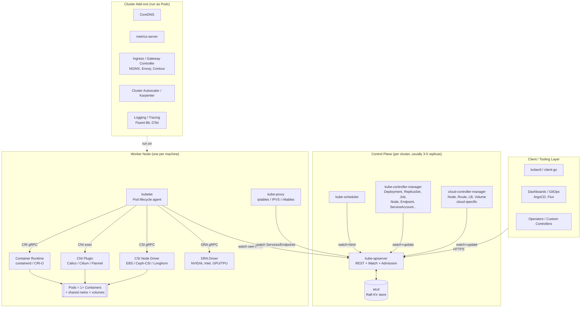

# Kubernetes — Container Orchestration

*Evaluated against Kubernetes v1.36.1 (released 2026-05-13). As of 2026-05.*

## Summary

Kubernetes is an open-source container orchestrator that runs application containers across a fleet of machines as a single logical cluster. Its defining design choice is a **declarative, controller-driven model**: clients submit desired state to an API server backed by a strongly-consistent key-value store (etcd), and a collection of independent controllers continuously reconcile the live cluster toward that state. This separates *what should be true* from *how to make it true*, and makes the system extensible — every layer (runtime, network, storage, devices, schedulers, even resources themselves) is a pluggable interface. Kubernetes is the right pick when you need multi-team, multi-tenant workload management at the scale of dozens of services or more, on any cloud or on-prem hardware; it is overkill for a handful of containers on a single host, where Docker Compose or HashiCorp Nomad are operationally cheaper. The trade-off is well-known: enormous ecosystem and portability in exchange for a steep learning curve and a non-trivial day-2 operations bill.

## Comparison with peer orchestrators

| Dimension | **Kubernetes 1.36** | **HashiCorp Nomad 1.10** | **Docker Swarm (Mode)** | **Red Hat OpenShift 4.18** |
|---|---|---|---|---|
| Type / category | General-purpose container orchestrator | General-purpose workload scheduler (containers + VMs + binaries) | Container orchestrator bundled with Docker Engine | Opinionated enterprise Kubernetes distribution |
| Core architecture | Declarative API server + etcd + reconciling controllers + per-node kubelet | Single Go binary (server/client), Raft-replicated state, plugin-based task drivers | Manager/worker nodes, Raft for manager quorum, integrated with Docker daemon | Kubernetes upstream + Operators + integrated registry, CI/CD, RBAC, SDN |
| Primary interfaces | Kubernetes REST API (CRDs), `kubectl`, CRI, CNI, CSI, DRA, Gateway API | HCL job spec, HTTP API, CLI; native integration with Consul/Vault | Docker CLI / Compose v3, Docker API | `oc` CLI, Kubernetes API, OpenShift Console, Operator Hub |
| Best fit | Multi-team microservices, hybrid/multi-cloud, ML/AI infra, platform engineering | Heterogeneous workloads (batch + service + legacy binaries), small ops teams | Small clusters, Docker-native teams, simple HA web tier | Regulated enterprises needing curated platform + Red Hat support |
| Advantages | Largest ecosystem; portable across clouds; extensible at every layer; deep autoscaling | Operationally simple (one binary); flexible workload types; predictable scheduling | Trivial to learn if you already use Docker Compose; almost zero day-2 ops | Out-of-box CI/CD, monitoring, ingress, registry; vendor-supported lifecycle |
| Disadvantages | Steep learning curve; many moving parts; YAML/CRD sprawl; etcd is an operational hotspot | Smaller ecosystem; networking/storage rely on Consul + external CSI; fewer community modules | Effectively in maintenance mode since 2019; limited scheduling features; weak multi-tenancy | Expensive subscription per core; tightly coupled to Red Hat tooling; slower to track upstream |
| License / acquisition | Apache 2.0 (CNCF) | MPL 2.0 (community) / BSL for enterprise features | Apache 2.0 (bundled with Docker Engine) | Commercial subscription (Red Hat); built on Apache 2.0 upstream |
| Cost (rough, 2026) | Software free; managed (EKS/GKE/AKS) ≈ $0.10/hr/cluster + node + LB + egress. 3-node control plane self-hosted ≈ infra only. | Free OSS; Nomad Enterprise from ~$0.25/node/hr list | Free with Docker CE; Mirantis support adds per-node fees | List ~$0.04–$0.10/core/hr (≈ $4–9k/year per 16-core node) plus infra |

*Cost figures are public-list approximations as of 2026-05 and vary heavily with commit, region, and contract.*

## In-depth report

### 1. Architecture deep-dive

A Kubernetes cluster has two physical roles — **control plane nodes** (sometimes called masters) and **worker nodes** — connected by the Kubernetes API. Logically, the system is better understood as a stack of layers, each with a clean interface to the layer below.

The **data path** for a typical "create a Deployment" request:

1. `kubectl apply` POSTs the Deployment object to the **API server**.
2. The API server runs **admission** (mutating + validating webhooks, policy engines like Kyverno/OPA), then writes the object to **etcd** under a versioned key.
3. The **Deployment controller** (inside `kube-controller-manager`) sees the new object via a watch, creates a ReplicaSet; the **ReplicaSet controller** creates `N` Pod objects with `nodeName=""`.
4. The **scheduler** watches for unbound Pods, runs predicates (resource fit, taints/tolerations, topology spread, affinity) and scoring, then writes a binding back to the API server.
5. On the chosen node, **kubelet** sees a Pod assigned to it. It calls **CSI** to attach/mount volumes, **CNI** to set up the network namespace, then **CRI** to ask the runtime (containerd / CRI-O) to pull images and start containers.
6. **kube-proxy** programs iptables/IPVS/nftables (or eBPF, via Cilium) so the Pod's IP is reachable through Service VIPs; **CoreDNS** resolves Service names to those VIPs.

The **control path** is uniformly built on the API server's *list+watch* protocol: every component is a thin client of the API. There is no point-to-point coupling between controllers and the scheduler or between kubelet and the scheduler — they coordinate only via mutations on shared API objects. This is the single most important architectural property of Kubernetes.

### 2. Major components by layer

**Layer 0 — Persistence**
- **etcd** — Raft-replicated, strongly consistent KV store. Holds every API object. Typically deployed as a 3- or 5-node cluster, often co-located with the control plane but supported standalone. Sensitive to disk fsync latency; SSDs are mandatory. Single source of cluster truth; backup/restore of etcd is backup/restore of the cluster.

**Layer 1 — Control plane**
- **kube-apiserver** — Stateless REST front end. Authentication (mTLS, OIDC, service-account tokens), authorization (RBAC, ABAC, Node, Webhook), admission control (built-in admission plugins + dynamic mutating/validating webhooks), schema validation, conversion between API versions, and the watch cache that fans out etcd changes to clients. Horizontally scalable.
- **kube-scheduler** — Watches unscheduled Pods, runs the two-phase scheduling framework (**Filter** plugins eliminate infeasible nodes; **Score** plugins rank the survivors) and writes a Pod→Node binding. Plugins include `NodeResourcesFit`, `PodTopologySpread`, `InterPodAffinity`, `TaintToleration`, `VolumeBinding`, `DynamicResources` (DRA). Custom schedulers can run alongside the default.
- **kube-controller-manager** — Bundles dozens of controllers in a single binary using leader election: Deployment, ReplicaSet, StatefulSet, DaemonSet, Job/CronJob, Node, Endpoint/EndpointSlice, ServiceAccount, Namespace, GarbageCollector, HPA, PersistentVolume binder, and more. Each is a tight observe-diff-act loop.
- **cloud-controller-manager (CCM)** — Carved out of the controller manager so cloud-specific code (LoadBalancer provisioning, route programming, Node lifecycle tied to cloud VM state, in-tree volume reconciliation) lives separately and can be released on the cloud vendor's cadence.

**Layer 2 — Node agents (per worker)**
- **kubelet** — The node's local PID-1 for Pods. Pulls assigned PodSpecs from the API server, drives the container runtime via **CRI**, runs probes (liveness/readiness/startup), enforces resource limits via cgroups, reports node status. Owns the **device manager**, **topology manager**, and **memory manager** for NUMA-aware placement.
- **kube-proxy** — Programs Service VIP-to-Pod-IP rules on each node. Backends: `iptables` (default, legacy), `ipvs` (better at high Service count), `nftables` (newer, GA in 1.33), or **none** when an eBPF CNI (Cilium) replaces it.
- **Container runtime** — Implements **CRI**. The two production choices are **containerd** (default in most distros) and **CRI-O** (RHEL/OpenShift). Docker shim was removed in 1.24.

**Layer 3 — Pluggable interfaces**
- **CRI (Container Runtime Interface)** — gRPC contract between kubelet and the runtime. Decouples Kubernetes from any single runtime.
- **CNI (Container Network Interface)** — Spec for assigning a Pod its network namespace, IPAM, and routes. Implementations: **Cilium** (eBPF, gaining default status in many distros), **Calico** (BGP + eBPF mode), **Flannel** (simple overlay), cloud-native ones like AWS VPC CNI / Azure CNI / GKE Dataplane v2.
- **CSI (Container Storage Interface)** — Out-of-tree storage drivers. Components per driver: **controller plugin** (provision/attach) and **node plugin** (mount). Examples: EBS CSI, Ceph-CSI, Longhorn, Portworx, OpenEBS.
- **DRA (Dynamic Resource Allocation)** — GA-track interface (beta in 1.32, advancing in 1.36) for first-class management of accelerators (GPUs, TPUs, FPGAs, NICs). Replaces the older device-plugin model for AI workloads.
- **Gateway API** — Successor to Ingress; richer L4/L7 routing, role-separated resources (GatewayClass / Gateway / HTTPRoute), portable across implementations (Envoy Gateway, Istio, Contour, NGINX Gateway Fabric).

**Layer 4 — Workload API objects (what users actually write)**
- **Pod** — Smallest deployable unit; one or more containers sharing network namespace and volumes.
- **Controllers over Pods** — **Deployment** (stateless, rolling updates), **StatefulSet** (stable identity + ordered rollout for databases), **DaemonSet** (one Pod per node, e.g. log shippers), **Job / CronJob** (batch).
- **Service** — Stable VIP + DNS name in front of a Pod set; types `ClusterIP`, `NodePort`, `LoadBalancer`, `ExternalName`.
- **Ingress / Gateway / HTTPRoute** — L7 routing into the cluster.
- **ConfigMap / Secret** — Configuration and credentials, mounted as files or env.
- **PersistentVolume / PersistentVolumeClaim / StorageClass** — Storage abstraction; dynamic provisioning via CSI.
- **Namespace, ResourceQuota, LimitRange, NetworkPolicy, RBAC (Role/RoleBinding)** — Multi-tenancy primitives.
- **CustomResourceDefinition (CRD) + Operator** — User-defined APIs reconciled by user-supplied controllers; the foundation of the operator ecosystem (cert-manager, Prometheus Operator, ArgoCD, Crossplane).

**Layer 5 — Cluster add-ons (Pods that ship with most clusters)**
- **CoreDNS** — In-cluster DNS for Service and Pod resolution.
- **metrics-server** — Lightweight CPU/memory metrics for HPA / `kubectl top`.
- **Ingress / Gateway controller** — NGINX, Envoy, HAProxy, Traefik, Contour.
- **Cluster Autoscaler / Karpenter** — Adds/removes nodes based on pending Pods.
- **Horizontal/Vertical/In-place Pod Autoscaler** — Scales replicas or right-sizes a Pod. **In-place vertical scaling** (no restart) graduated through beta in 2025–26.
- **Observability stack** — Prometheus, OpenTelemetry Collector, Fluent Bit / Loki, Jaeger / Tempo.
- **Policy / admission** — Kyverno or OPA Gatekeeper; image-signature verification (Sigstore / cosign).

### 3. Key design patterns and trade-offs

- **Declarative + reconciliation, not orchestration scripts.** Every controller is an idempotent loop driving observed state toward desired state. Failures are recovered by *re-running the loop*, not by retry logic in a workflow engine. Docker Swarm's command-driven model loses this self-healing property.
- **API server as the only writer to etcd.** All other components read the API server. This both protects schema evolution (the API server handles version conversion) and makes the entire cluster trivially observable — anything you can `kubectl get` is the actual source of truth.
- **Plugin interfaces at every layer.** CRI, CNI, CSI, DRA, the scheduler framework, admission webhooks, CRDs. The cost is an integration matrix (CNI × CSI × cloud × runtime), but it is the reason Kubernetes won the standard war.
- **Watch-based eventual consistency between components.** Cheap to scale, but means *any* component can lag behind etcd briefly. Code that assumes "I created a Pod, so it must be visible in the listing" is wrong; you must wait on a watch or rely on the controller pattern.
- **One Pod IP, flat network.** Every Pod is directly addressable from every other Pod with no NAT. This pushes complexity into the CNI but gives applications a clean network model — a sharp contrast to Docker Swarm's overlay-by-default with per-service VIPs.

### 4. Correctness model

- **etcd** uses Raft; reads can be linearizable (default for the API server) or stale. Writes commit only after a quorum fsync. Losing more than `(N-1)/2` etcd members halts writes.
- **API server** mediates optimistic concurrency via `resourceVersion`. Two controllers updating the same object race; the loser retries on conflict.
- **Pods are not durable.** They have no identity guarantees by themselves; identity comes from a controller (StatefulSet for stable identity, Deployment for fungible replicas).
- **Failure domains**: a Pod survives container crash (kubelet restarts); a node failure causes the Node controller to mark Pods for eviction after `--pod-eviction-timeout` (default ~5 min) — *not* instantly. Applications that need sub-second failover need application-level HA, not just kubelet.

### 5. Performance and scale envelope

Upstream's published targets (as of v1.36): **5,000 nodes per cluster, 150,000 Pods, 300,000 containers, 100 Pods per node**, with scheduler throughput in the hundreds of Pods/sec on a tuned control plane. Real-world large clusters routinely hit etcd write-amp before they hit these limits; sharding (multi-cluster + Karmada / Cluster API / ClusterAPI Inventory) is the standard answer beyond ~3–5k nodes. eBPF dataplanes (Cilium) materially improve Service-rule scaling vs. iptables once you exceed ~1,000 Services.

### 6. Operational model

- **Install**: managed (EKS / GKE / AKS / OKE) for almost everyone; self-hosted via kubeadm, kOps, Cluster API, or distribution installers (Rancher RKE2, k0s, OpenShift installer, Talos Linux).
- **Upgrade**: rolling, one minor version at a time (1.34 → 1.35 → 1.36). Skip-version upgrades are unsupported. API deprecations follow a multi-release policy.
- **Day-2**: certificate rotation (kubeadm handles), etcd backup (`etcdctl snapshot save`), node OS patching (cordon + drain + replace), CRD/Operator lifecycle.
- **Observability**: Prometheus scrape of `/metrics` on every component; structured logs via klog; events on the API; distributed tracing via the API server's OTLP exporter (alpha → beta in recent releases).
- **Common failure modes**: etcd disk saturation, API server OOM under list-storm from buggy controllers, CNI IP exhaustion, NodeNotReady cascades from kubelet ↔ runtime version skew.

### 7. Security and multi-tenancy

- **Authentication**: mTLS client certs, OIDC, service-account tokens (bound + projected since 1.22).
- **Authorization**: RBAC is the production default; ABAC and Webhook exist for special cases.
- **Admission**: Pod Security Admission (replacing PSP since 1.25), validating/mutating webhooks, policy engines (Kyverno, OPA Gatekeeper).
- **Runtime isolation**: Linux namespaces + cgroups by default; gVisor, Kata Containers, or Firecracker for stronger isolation. **User Namespaces** graduated to GA in 1.36 — container root no longer maps to host root.
- **Network policy**: `NetworkPolicy` for L3/L4; Cilium / Calico for L7 and identity-aware policies.
- **Secrets**: stored in etcd; **must enable encryption-at-rest** (KMS provider) and ideally use an external manager (Vault, AWS Secrets Manager via External Secrets Operator).
- **Multi-tenancy** is *not* a first-class primitive — Namespaces give isolation only to the extent RBAC + NetworkPolicy + ResourceQuota + PodSecurity + node-isolation guards are correctly configured. Hard multi-tenant designs typically use cluster-per-tenant or vCluster.

### 8. Ecosystem and integrations

- **Hyperscaler equivalents**: AWS EKS, GCP GKE, Azure AKS, OCI OKE, IBM Cloud Kubernetes Service, Alibaba ACK. All are upstream-conformant; differences live in addons (CNI default, LB controller, secrets store CSI).
- **GitOps**: ArgoCD, Flux.
- **Service mesh**: Istio, Linkerd, Cilium Service Mesh.
- **CI/CD**: Tekton, Jenkins X, ArgoCD, GitHub Actions runners.
- **AI/ML**: Kubeflow, KServe, Ray on Kubernetes, vLLM Production Stack — all benefit from DRA for GPU/TPU.

### 9. When to pick it / when not to

**Pick Kubernetes when:**
- You run many services across multiple teams and need a shared platform substrate.
- You need portability across clouds or cloud + on-prem.
- You need autoscaling, declarative config, and a rich operator ecosystem (databases, queues, ML).
- You expect to grow beyond ~10 nodes or ~50 services.

**Skip Kubernetes when:**
- You run a handful of containers on one or two hosts — Docker Compose or Nomad will save weeks of operator effort.
- Your workload is non-containerized (long-running JVMs, Windows-only binaries) and you have no plan to containerize — Nomad is more honest.
- You have no operator capacity for a managed control plane and no budget for a managed offering.
- Your latency SLA requires sub-second failover at the orchestrator level — application-level HA on bare metal will be simpler.

## Sources

- [Kubernetes Components — kubernetes.io](https://kubernetes.io/docs/concepts/overview/components/) — accessed 2026-05
- [Cluster Architecture — kubernetes.io](https://kubernetes.io/docs/concepts/architecture/) — accessed 2026-05
- [Releases — kubernetes.io](https://kubernetes.io/releases/) — accessed 2026-05
- [Kubernetes v1.36 Released: Security Defaults Tighten as AI Workload Support Matures — InfoQ](https://www.infoq.com/news/2026/05/kubernetes-1-36-released/) — accessed 2026-05
- [Kubernetes Architecture Explained (2026 Updated Edition) — DevOpsCube](https://devopscube.com/kubernetes-architecture-explained/) — accessed 2026-05
- [Inside Kubernetes — The 2026 Architecture Breakdown — CloudOptimo](https://www.cloudoptimo.com/blog/inside-kubernetes-the-2026-architecture-breakdown/) — accessed 2026-05
- [Kubernetes architecture: control plane, data plane, and 11 core components explained — Spot.io](https://spot.io/resources/kubernetes-architecture/11-core-components-explained/) — accessed 2026-05
- [Understanding Kubernetes Interfaces: CRI, CNI, and CSI — DZone](https://dzone.com/articles/understanding-kubernetes-interfaces-cri-cni-amp-cs) — accessed 2026-05
- [Deep Dive into Kubernetes CNI, CRI, CSI Components](https://nsddd.top/posts/deep-dive-into-the-components-of-kubernetes-cni-csi-cri/) — accessed 2026-05
- [Docker Swarm vs Kubernetes vs Nomad: Container Orchestration in 2026 — index.dev](https://www.index.dev/skill-vs-skill/devops-kubernetes-vs-docker-swarm-vs-nomad) — accessed 2026-05
- [Kubernetes Vs. Docker Vs. OpenShift: A 2026 Shootout — CloudZero](https://www.cloudzero.com/blog/kubernetes-vs-docker/) — accessed 2026-05
- [Top 13 Kubernetes Alternatives for Containers in 2026 — Spacelift](https://spacelift.io/blog/kubernetes-alternatives) — accessed 2026-05
- [What's the Current Kubernetes Version? A 2026 Guide — Plural.sh](https://www.plural.sh/blog/current-kubernetes-version-update/) — accessed 2026-05
- [Cluster Services — EKS Best Practices Guides (AWS)](https://aws.github.io/aws-eks-best-practices/scalability/docs/cluster-services/) — accessed 2026-05
- [Autoscale the DNS Service in a Cluster — kubernetes.io](https://kubernetes.io/docs/tasks/administer-cluster/dns-horizontal-autoscaling/) — accessed 2026-05
