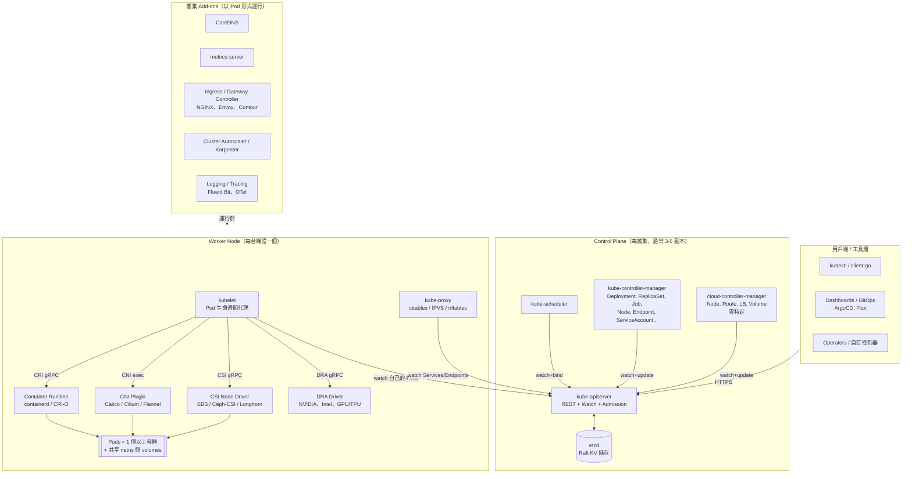

# Kubernetes — 容器編排平台

*評估版本：Kubernetes v1.36.1（2026-05-13 釋出）。資料日期：2026-05。*

## 摘要

Kubernetes 是一個開源的容器編排器，將多台機器組成的叢集視為單一邏輯叢集來運行應用容器。它最具決定性的設計選擇是**宣告式、控制器驅動（controller-driven）模型**：用戶端把期望狀態提交給以強一致性 KV 儲存（etcd）為後盾的 API server，再由一群獨立的控制器持續調諧（reconcile）叢集實際狀態趨近期望。這把「應該長什麼樣」和「怎麼做到」徹底分離，也讓系統可被擴充——每一層（runtime、網路、儲存、裝置、排程器、甚至資源本身）都是可插拔的介面。當你要在任意雲或機房上，為多團隊、多租戶管理數十個以上服務時，Kubernetes 是合適的選擇；但若只是一台主機上跑幾個容器，Docker Compose 或 HashiCorp Nomad 在維運成本上更便宜。代價也很明確：以龐大的生態與可攜性，換來陡峭的學習曲線與非平凡的 day-2 維運工作量。

## 與同類編排器比較

| 維度 | **Kubernetes 1.36** | **HashiCorp Nomad 1.10** | **Docker Swarm (Mode)** | **Red Hat OpenShift 4.18** |
|---|---|---|---|---|
| 類型 / 分類 | 通用容器編排器 | 通用工作負載排程器（容器 + VM + 二進位） | 內建於 Docker Engine 的容器編排器 | 帶觀點的企業級 Kubernetes 發行版 |
| 核心架構 | 宣告式 API server + etcd + 調諧控制器 + 每節點 kubelet | 單一 Go 二進位（server/client），Raft 複製狀態，外掛式 task driver | manager / worker 節點，manager 以 Raft 達成多數，與 Docker daemon 整合 | Kubernetes upstream + Operator + 整合式 registry、CI/CD、RBAC、SDN |
| 主要介面 | Kubernetes REST API（含 CRD）、`kubectl`、CRI、CNI、CSI、DRA、Gateway API | HCL job spec、HTTP API、CLI；與 Consul/Vault 原生整合 | Docker CLI / Compose v3、Docker API | `oc` CLI、Kubernetes API、OpenShift Console、Operator Hub |
| 最佳適配 | 多團隊微服務、混合 / 多雲、ML/AI 基礎設施、平台工程 | 異質工作負載（batch + service + 既有二進位），維運人力少的團隊 | 小型叢集、原本就用 Docker 的團隊、簡單的 HA Web 層 | 受規範產業、需要被認證平台與 Red Hat 商業支援的企業 |
| 優勢 | 生態最龐大；跨雲可攜；每一層可擴充；自動擴縮成熟 | 維運簡單（一支二進位）；工作負載類型彈性；排程行為可預測 | 若已熟 Docker Compose 幾乎沒學習成本；day-2 工作量趨近零 | 開箱即用 CI/CD、監控、ingress、registry；廠商支援的生命週期管理 |
| 劣勢 | 學習曲線陡；元件繁多；YAML/CRD 氾濫；etcd 是維運熱點 | 生態較小；網路與儲存仰賴 Consul + 外部 CSI；社群模組少 | 自 2019 起進入維護模式；排程功能有限；多租戶支援薄弱 | 每核心訂閱費用高；與 Red Hat 工具耦合深；追隨 upstream 較慢 |
| 授權 / 取得 | Apache 2.0（CNCF） | MPL 2.0（社群版）／企業功能採 BSL | Apache 2.0（隨 Docker Engine 提供） | Red Hat 商業訂閱；底層 upstream 為 Apache 2.0 |
| 成本概略（2026） | 軟體免費；託管（EKS/GKE/AKS）約 $0.10/hr/叢集 + 節點 + LB + egress。3 節點自架 control plane 僅基礎設施成本。 | OSS 免費；Nomad Enterprise 起跳約 $0.25/節點/小時 list | 隨 Docker CE 免費；Mirantis 商業支援另計 | 公定價約 $0.04–$0.10/核心/小時（16 核節點約 $4–9k/年）外加基礎設施 |

*成本為 2026-05 公開定價之估算，實際依承諾用量、區域與合約大幅變動。*

## 深度報告

### 1. 架構深入剖析

一個 Kubernetes 叢集在實體上分為兩種角色——**control plane 節點**（有時稱 master）與 **worker 節點**——透過 Kubernetes API 串接。但邏輯上，把它視為一疊分層、每層對下層有清楚介面的系統，會更容易理解。

典型「建立一個 Deployment」請求的**資料路徑**：

1. `kubectl apply` 把 Deployment 物件 POST 給 **API server**。
2. API server 執行 **admission**（mutating + validating webhooks、Kyverno/OPA 等政策引擎），然後把物件以版本化 key 寫入 **etcd**。
3. **Deployment controller**（於 `kube-controller-manager` 內）透過 watch 看到新物件，建立 ReplicaSet；**ReplicaSet controller** 接著建出 `N` 個 `nodeName=""` 的 Pod。
4. **scheduler** 監聽未綁定 Pod，跑 predicate（資源 fit、taint/toleration、topology spread、affinity）與 score，把 binding 寫回 API server。
5. 在被選中的節點上，**kubelet** 看到指派給自己的 Pod，呼叫 **CSI** 連接 / 掛載 volume、**CNI** 建立網路 namespace，再透過 **CRI** 請 runtime（containerd / CRI-O）拉 image、啟動容器。
6. **kube-proxy** 在每個節點寫入 iptables/IPVS/nftables（或 Cilium 的 eBPF）規則，讓 Pod IP 透過 Service VIP 可達；**CoreDNS** 把 Service 名稱解析為這些 VIP。

**控制路徑**完全建構在 API server 的 *list+watch* 協定上：每個元件都是 API 的薄客戶端。控制器與排程器之間、kubelet 與排程器之間並沒有點對點耦合——它們只透過對共享 API 物件的變更來協調。這是 Kubernetes 最重要的單一架構特性。

### 2. 各層主要元件

**第 0 層 — 持久化**
- **etcd** — Raft 複製、強一致性的 KV 儲存。所有 API 物件都存在這裡。通常以 3 或 5 節點叢集部署，常與 control plane 共置，也支援獨立部署。對磁碟 fsync 延遲非常敏感，SSD 是必要條件。它是叢集真相的唯一來源；備份／還原 etcd 等於備份／還原叢集。

**第 1 層 — Control plane**
- **kube-apiserver** — 無狀態的 REST 前端。處理認證（mTLS、OIDC、service-account token）、授權（RBAC、ABAC、Node、Webhook）、admission control（內建 + 動態 mutating/validating webhook）、schema 驗證、API 版本轉換，並透過 watch cache 把 etcd 變更展開給 client。可水平擴展。
- **kube-scheduler** — 監聽未排程 Pod，跑兩階段 scheduling framework（**Filter** plugin 排除不可行節點；**Score** plugin 對倖存者打分），再把 Pod→Node binding 寫回 API。內建 plugin 包括 `NodeResourcesFit`、`PodTopologySpread`、`InterPodAffinity`、`TaintToleration`、`VolumeBinding`、`DynamicResources`（DRA）。自訂排程器可與預設排程器並存。
- **kube-controller-manager** — 以單一二進位內藏數十個控制器，透過 leader election 運行：Deployment、ReplicaSet、StatefulSet、DaemonSet、Job/CronJob、Node、Endpoint/EndpointSlice、ServiceAccount、Namespace、GarbageCollector、HPA、PersistentVolume binder 等。每一個都是緊湊的 observe-diff-act 迴圈。
- **cloud-controller-manager（CCM）** — 從 controller manager 拆出，讓雲廠商特定程式碼（LoadBalancer provisioning、route 設定、與雲端 VM 生命週期綁定的 Node 邏輯、in-tree volume 調諧）獨立存在，並能依雲廠商節奏發版。

**第 2 層 — 節點代理（每個 worker）**
- **kubelet** — 節點上 Pod 的本地 PID-1。從 API server 拉取指派給自己的 PodSpec，透過 **CRI** 驅動 container runtime，執行 probe（liveness / readiness / startup），以 cgroups 強制資源上限，回報節點狀態。同時負責 **device manager**、**topology manager**、**memory manager**，做 NUMA-aware 配置。
- **kube-proxy** — 在每個節點上設定 Service VIP 到 Pod IP 的規則。後端可選 `iptables`（預設，傳統）、`ipvs`（Service 數量多時表現較好）、`nftables`（較新，1.33 GA），或當使用 eBPF CNI（Cilium）取代時可**完全不部署**。
- **Container runtime** — 實作 **CRI**。生產環境的兩個選擇是 **containerd**（多數發行版的預設）與 **CRI-O**（RHEL / OpenShift）。Docker shim 已於 1.24 移除。

**第 3 層 — 可插拔介面**
- **CRI（Container Runtime Interface）** — kubelet 與 runtime 之間的 gRPC 合約，把 Kubernetes 從任何單一 runtime 中解耦。
- **CNI（Container Network Interface）** — 為 Pod 指派網路 namespace、IPAM 與路由的規範。實作包含 **Cilium**（eBPF，多家發行版正逐步以其為預設）、**Calico**（BGP + eBPF 模式）、**Flannel**（簡單 overlay），以及雲原生方案如 AWS VPC CNI / Azure CNI / GKE Dataplane v2。
- **CSI（Container Storage Interface）** — 樹外（out-of-tree）儲存 driver。每個 driver 由 **controller plugin**（provision / attach）與 **node plugin**（mount）組成。例：EBS CSI、Ceph-CSI、Longhorn、Portworx、OpenEBS。
- **DRA（Dynamic Resource Allocation）** — GA 路線上的介面（1.32 beta，1.36 持續推進），把加速器（GPU、TPU、FPGA、NIC）當作一等資源管理。AI 工作負載用它取代舊的 device-plugin 模型。
- **Gateway API** — Ingress 的繼任者；提供更豐富的 L4/L7 路由、角色分離的資源（GatewayClass / Gateway / HTTPRoute），跨實作可攜（Envoy Gateway、Istio、Contour、NGINX Gateway Fabric）。

**第 4 層 — 工作負載 API 物件（使用者實際寫的東西）**
- **Pod** — 最小可部署單位；一個以上的容器共享網路 namespace 與 volume。
- **Pod 之上的控制器** — **Deployment**（無狀態、滾動更新）、**StatefulSet**（穩定身分 + 有序 rollout，適合資料庫）、**DaemonSet**（每節點一個 Pod，例如 log shipper）、**Job / CronJob**（批次）。
- **Service** — 一組 Pod 前的固定 VIP + DNS 名稱；類型有 `ClusterIP`、`NodePort`、`LoadBalancer`、`ExternalName`。
- **Ingress / Gateway / HTTPRoute** — L7 進入叢集的路由。
- **ConfigMap / Secret** — 設定與憑證，以檔案或 env 掛載。
- **PersistentVolume / PersistentVolumeClaim / StorageClass** — 儲存抽象；透過 CSI 動態 provision。
- **Namespace、ResourceQuota、LimitRange、NetworkPolicy、RBAC（Role / RoleBinding）** — 多租戶基礎元件。
- **CustomResourceDefinition（CRD）+ Operator** — 使用者自定義 API，由使用者提供的控制器調諧；整個 operator 生態（cert-manager、Prometheus Operator、ArgoCD、Crossplane）都建構在此之上。

**第 5 層 — 叢集 add-ons（幾乎所有叢集都會帶的 Pod）**
- **CoreDNS** — 叢集內 DNS，負責 Service 與 Pod 名稱解析。
- **metrics-server** — 提供 CPU / 記憶體輕量指標，供 HPA 與 `kubectl top` 使用。
- **Ingress / Gateway controller** — NGINX、Envoy、HAProxy、Traefik、Contour。
- **Cluster Autoscaler / Karpenter** — 依未排程 Pod 增刪節點。
- **Horizontal / Vertical / In-place Pod Autoscaler** — 調整副本數或調整 Pod 大小。**In-place vertical scaling**（不需重啟）已於 2025–26 期間走完 beta。
- **可觀測性堆疊** — Prometheus、OpenTelemetry Collector、Fluent Bit / Loki、Jaeger / Tempo。
- **政策 / admission** — Kyverno 或 OPA Gatekeeper；image 簽章驗證（Sigstore / cosign）。

### 3. 關鍵設計模式與取捨

- **宣告式 + 調諧，而非編排腳本。** 每個控制器都是冪等的迴圈，把觀察狀態推向期望狀態。錯誤靠*重跑迴圈*回復，而非工作流程引擎裡的 retry 邏輯。Docker Swarm 的命令驅動模型失去了這項自癒特性。
- **API server 是 etcd 的唯一寫入者。** 其他所有元件只讀 API server。這既保護了 schema 演進（由 API server 處理版本轉換），又讓整個叢集天然可觀測——只要 `kubectl get` 得到的就是真相。
- **每一層都是 plugin 介面。** CRI、CNI、CSI、DRA、scheduler framework、admission webhook、CRD。代價是整合矩陣（CNI × CSI × cloud × runtime），但這正是 Kubernetes 贏得標準之戰的原因。
- **元件間以 watch 的最終一致性協作。** 易於擴充，但任何元件都可能短暫落後 etcd。「我剛建了一個 Pod，所以列表應該看得到」是錯誤假設；要嘛 watch，要嘛靠控制器模式。
- **每個 Pod 一個 IP、扁平網路。** 任一 Pod 都能不經 NAT 直接定址其他 Pod。複雜度被推給 CNI，但應用拿到的是乾淨網路模型——這與 Docker Swarm 預設 overlay 加 per-service VIP 形成鮮明對比。

### 4. 正確性模型

- **etcd** 用 Raft；讀取可線性化（API server 預設）或允許 stale。寫入只在 quorum fsync 後才 commit。超過 `(N-1)/2` 個 etcd 成員失聯時寫入會停止。
- **API server** 透過 `resourceVersion` 實作樂觀並行。兩個控制器更新同一物件會競爭；輸家在衝突時 retry。
- **Pod 並不持久。** 它本身沒有身分保證；身分由控制器提供（StatefulSet 提供穩定身分、Deployment 提供可替換副本）。
- **失敗域**：容器當機時 Pod 仍存活（kubelet 重啟它）；節點失效時 Node controller 在 `--pod-eviction-timeout`（預設約 5 分鐘）後標記 Pod 驅逐——*不是*立刻。需要次秒級 failover 的應用必須在應用層做 HA，僅靠 kubelet 不夠。

### 5. 效能與規模上限

upstream 公開目標（v1.36）：**每叢集 5,000 節點、150,000 Pod、300,000 容器、每節點 100 Pod**，調校過的 control plane 上排程器 throughput 可達數百 Pod/秒。實務上的大叢集常先撞到 etcd 寫放大，才碰到這些上限；超過約 3–5k 節點後標準解法是分片（多叢集 + Karmada / Cluster API / ClusterAPI Inventory）。Service 規則數超過約 1,000 後，eBPF 資料平面（Cilium）相對於 iptables 有顯著的擴展優勢。

### 6. 維運模型

- **安裝**：絕大多數人用託管（EKS / GKE / AKS / OKE）；自架可用 kubeadm、kOps、Cluster API，或發行版安裝器（Rancher RKE2、k0s、OpenShift installer、Talos Linux）。
- **升級**：滾動式，一次一個 minor 版本（1.34 → 1.35 → 1.36），不支援跳版本。API 棄用遵循多版本政策。
- **Day-2**：憑證輪替（kubeadm 處理）、etcd 備份（`etcdctl snapshot save`）、節點 OS 打 patch（cordon + drain + replace）、CRD / Operator 生命週期。
- **可觀測性**：每個元件提供 Prometheus `/metrics`；klog 結構化日誌；API 上有 event；分散式追蹤透過 API server 的 OTLP exporter（近期版本 alpha → beta）。
- **常見故障模式**：etcd 磁碟飽和、bug 控制器引發 list-storm 導致 API server OOM、CNI IP 耗盡、kubelet ↔ runtime 版本歪斜引起的 NodeNotReady 連鎖。

### 7. 安全與多租戶

- **認證**：mTLS client cert、OIDC、service-account token（自 1.22 起為 bound + projected）。
- **授權**：生產環境預設用 RBAC；ABAC 與 Webhook 留給特例。
- **Admission**：Pod Security Admission（自 1.25 取代 PSP）、validating / mutating webhook、政策引擎（Kyverno、OPA Gatekeeper）。
- **Runtime 隔離**：預設為 Linux namespace + cgroups；要更強隔離可用 gVisor、Kata Containers 或 Firecracker。**User Namespaces** 於 1.36 GA——容器 root 不再對應到 host root。
- **網路政策**：`NetworkPolicy` 處理 L3/L4；Cilium / Calico 提供 L7 與身分感知政策。
- **Secret**：存放於 etcd；**必須啟用 encryption-at-rest**（KMS provider），最好搭配外部管理（Vault、AWS Secrets Manager 透過 External Secrets Operator）。
- **多租戶**並非一等公民——Namespace 只在 RBAC + NetworkPolicy + ResourceQuota + PodSecurity + 節點隔離全部設對時才能算隔離。硬性多租戶通常採每租戶一叢集或 vCluster。

### 8. 生態與整合

- **公有雲等價物**：AWS EKS、GCP GKE、Azure AKS、OCI OKE、IBM Cloud Kubernetes Service、Alibaba ACK。全部相容 upstream；差異在 addon（預設 CNI、LB controller、secrets store CSI）。
- **GitOps**：ArgoCD、Flux。
- **Service mesh**：Istio、Linkerd、Cilium Service Mesh。
- **CI/CD**：Tekton、Jenkins X、ArgoCD、GitHub Actions runner。
- **AI/ML**：Kubeflow、KServe、Ray on Kubernetes、vLLM Production Stack——皆能受惠於 DRA 對 GPU/TPU 的支援。

### 9. 何時該用、何時不該用

**該選 Kubernetes 的時候：**
- 跨多團隊運行多服務，需要共享平台底座。
- 需要跨雲或雲+地端的可攜性。
- 需要自動擴縮、宣告式設定、豐富 operator 生態（資料庫、佇列、ML）。
- 預期成長超過約 10 節點或約 50 個服務。

**該跳過 Kubernetes 的時候：**
- 一兩台主機上只跑幾個容器——Docker Compose 或 Nomad 能省下數週維運工時。
- 工作負載非容器化（長壽 JVM、Windows 專屬二進位）且沒有容器化打算——Nomad 更誠實。
- 沒有人力照顧 control plane，又沒預算採用託管。
- 延遲 SLA 要求編排層次秒級 failover——直接在裸機上做應用層 HA 會更簡單。

## Sources

- [Kubernetes Components — kubernetes.io](https://kubernetes.io/docs/concepts/overview/components/) — accessed 2026-05
- [Cluster Architecture — kubernetes.io](https://kubernetes.io/docs/concepts/architecture/) — accessed 2026-05
- [Releases — kubernetes.io](https://kubernetes.io/releases/) — accessed 2026-05
- [Kubernetes v1.36 Released: Security Defaults Tighten as AI Workload Support Matures — InfoQ](https://www.infoq.com/news/2026/05/kubernetes-1-36-released/) — accessed 2026-05
- [Kubernetes Architecture Explained (2026 Updated Edition) — DevOpsCube](https://devopscube.com/kubernetes-architecture-explained/) — accessed 2026-05
- [Inside Kubernetes — The 2026 Architecture Breakdown — CloudOptimo](https://www.cloudoptimo.com/blog/inside-kubernetes-the-2026-architecture-breakdown/) — accessed 2026-05
- [Kubernetes architecture: control plane, data plane, and 11 core components explained — Spot.io](https://spot.io/resources/kubernetes-architecture/11-core-components-explained/) — accessed 2026-05
- [Understanding Kubernetes Interfaces: CRI, CNI, and CSI — DZone](https://dzone.com/articles/understanding-kubernetes-interfaces-cri-cni-amp-cs) — accessed 2026-05
- [Deep Dive into Kubernetes CNI, CRI, CSI Components](https://nsddd.top/posts/deep-dive-into-the-components-of-kubernetes-cni-csi-cri/) — accessed 2026-05
- [Docker Swarm vs Kubernetes vs Nomad: Container Orchestration in 2026 — index.dev](https://www.index.dev/skill-vs-skill/devops-kubernetes-vs-docker-swarm-vs-nomad) — accessed 2026-05
- [Kubernetes Vs. Docker Vs. OpenShift: A 2026 Shootout — CloudZero](https://www.cloudzero.com/blog/kubernetes-vs-docker/) — accessed 2026-05
- [Top 13 Kubernetes Alternatives for Containers in 2026 — Spacelift](https://spacelift.io/blog/kubernetes-alternatives) — accessed 2026-05
- [What's the Current Kubernetes Version? A 2026 Guide — Plural.sh](https://www.plural.sh/blog/current-kubernetes-version-update/) — accessed 2026-05
- [Cluster Services — EKS Best Practices Guides (AWS)](https://aws.github.io/aws-eks-best-practices/scalability/docs/cluster-services/) — accessed 2026-05
- [Autoscale the DNS Service in a Cluster — kubernetes.io](https://kubernetes.io/docs/tasks/administer-cluster/dns-horizontal-autoscaling/) — accessed 2026-05
