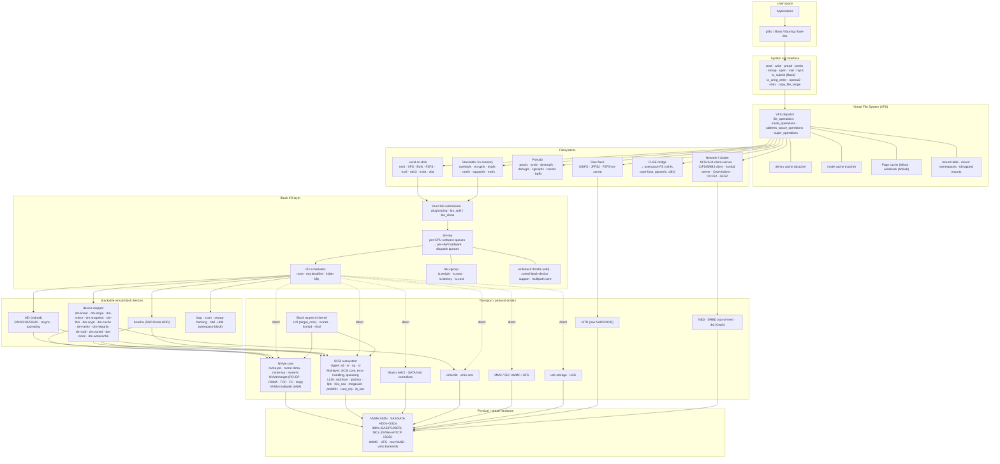

# Linux Kernel Storage Stack — Architecture Overview

*Kernel reference: 6.18 mainline, as of May 2026. Diagrams and component lists track the storage-stack layout as documented at kernel.org/doc and the Thomas-Krenn Linux Storage Stack Diagram v6.9 (2024-05) brought forward to mainline 6.18.*

## 1. Summary

The Linux storage stack is a strict top-to-bottom layered design: applications make file or block syscalls into the **VFS**, the VFS dispatches into a concrete **filesystem** (ext4/XFS/Btrfs/NFS/FUSE/etc.), the filesystem builds **bio** structures and pushes them through the **block layer** (`blk-mq` plus an I/O scheduler), optional **stackable virtual block devices** (device-mapper, MD, bcache) rewrite or fan those bios out, and finally a **transport driver** (NVMe, SCSI, libata, virtio-blk, MMC, MTD) carries the request to hardware. The non-obvious things that make this stack distinctive versus FreeBSD/Windows/Illumos peers are: a unified **page cache built on folios** that sits *above* the filesystem rather than inside it, a single **multi-queue block layer** (`blk-mq`) shared by every block device since 5.0, and a fast **io_uring** path that can bypass much of the block layer entirely via NVMe passthrough (`IORING_OP_URING_CMD`). The stack is the most heterogeneous and the most pluggable of any production kernel — at the cost of being the most complex to reason about end-to-end.

## 2. Comparison with peer kernels

Compared at the level of "how is the storage stack organised."

| Dimension | **Linux 6.18** | **FreeBSD 14** | **Windows 11 / Server 2025** | **illumos / OmniOS** |
|---|---|---|---|---|
| **Block stacking model** | `blk-mq` + bios; device-mapper / MD stack *above* the request queue | **GEOM** stackable transforms above **CAM** | Storage stack of filter drivers above Storport/Stornvme | ZFS-centric; SVM/ZVOL above SCSA |
| **Per-device queueing** | Multi-queue (`blk-mq`), per-CPU sw queues → per-HW hw queues | Per-disk geom_disk queue, no general multi-queue scheduler | StorPort multi-queue (Windows 8.1+) | Multi-path I/O via MPxIO; serial dispatch per LUN |
| **VFS / filesystem coupling** | Common VFS (`struct file_operations`, `struct inode_operations`); page cache *outside* the FS | Common VFS + UFS/ZFS-aware vnode ops | IRP-based I/O Manager + Filter Manager (minifilters) | VFS + DNLC; ZFS owns its own ARC instead of the page cache |
| **Page / buffer caching** | Single **page cache** in folios, shared by all FSes (ZFS-on-Linux excepted) | **Unified Buffer Cache** (UBC) | System cache (`Cc`) above Mm | **ARC** (ZFS), separate VM page cache for UFS |
| **Primary userspace I/O APIs** | `read/write/pread/pwrite/mmap`, **`io_uring`**, legacy `libaio`, `splice/sendfile` | `read/write/aio_*`, `kqueue` (poll-only), `sendfile` | `ReadFile/WriteFile`, IOCP, `ReadFileScatter` | `read/write`, `aio_*`, `event ports` |
| **Block schedulers** | `none`, `mq-deadline`, `kyber`, `bfq` (plug-in) | One scheduler (CAM-level), pluggable I/O policies | StorPort built-in | ZFS I/O scheduler internal to ZIO |
| **Local FS options** | ext4, XFS, Btrfs, F2FS, ntfs3, exfat, tmpfs (bcachefs out-of-tree since 6.17) | UFS2, ZFS | NTFS, ReFS | ZFS, UFS |
| **Network FS in kernel** | NFSv3/v4.x client+server, SMB3 (cifs client + **ksmbd** server), Ceph kernel client | NFSv3/v4 | SMB (server + client), NFS | NFSv3/v4, SMB |
| **Stackable block features** | Device-mapper (linear, stripe, mirror, snapshot, **thin**, **crypt**, **cache**, **verity**, **integrity**, **raid**), MD, bcache | GEOM modules (gmirror, gstripe, geli, gconcat, gvinum, gjournal) | Storage Spaces (above virtual disk), BitLocker filter | SVM (legacy), ZFS internal |
| **Transports** | NVMe (PCIe + NVMe-oF over **RDMA/TCP/FC**), SCSI (sas/fc/iscsi), libata, virtio, MMC/SD, MTD, USB, NBD, ublk | NVMe, CAM/SCSI, ATA, virtio, USB | StorNVMe, Storport (SAS/FC), USB, SDPort | NVMe, scsi_vhci, FC, iSCSI |
| **Userspace-FS bridge** | **FUSE** (mature, used by gluster/ceph-fuse/sshfs); **ublk** for userspace block devices | FUSE (port) | None upstream; WinFsp third-party | FUSE (port) |
| **License** | GPLv2 (kernel); BSD/MIT for some firmware | BSD | Proprietary | CDDL |
| **Cost** | Free; cost lives in HBAs/SSDs and ops staffing | Free | Per-seat Windows licensing | Free (OmniOS Community); commercial OmniOS support exists |

*Costs and version numbers are rough public-list information as of 2026-05; verify against current vendor pages before planning a procurement.*

## 3. Architecture deep-dive

### 3.1 The full stack, end to end

A few non-obvious paths worth calling out on the diagram:

- **mmap and DAX skip the block layer for reads/writes** of mapped pages: faults populate the page cache directly (or, with DAX on persistent memory / CXL.mem, map storage pages straight into the process address space).
- **`io_uring` + NVMe passthrough (`IORING_OP_URING_CMD`)** sits beside the normal `SC → VFS → FS → BLK` path: a submitted SQE is translated by the NVMe driver into a native NVMe command and pushed to a hardware submission queue, bypassing `blk-mq` queueing and the FS. This is the path that achieves 10M+ IOPS on a single device.
- **NVMe-oF and iSCSI initiators come *up* through the block layer** — the network is a transport, not a filesystem. The corresponding `nvmet`/LIO **targets** sit at the *bottom* of another kernel's stack, exporting bdevs/files back out over the wire.
- **Network filesystems do not use the block layer**: NFS and SMB build RPCs over sockets; their cache is the page cache, their writeback is the bdi machinery, but there is no `bio`.

### 3.2 Layer-by-layer component inventory

This is the comprehensive list you can use as a checklist when reading code or capacity-planning a host.

**(A) User-space I/O surface**

- POSIX file I/O: `open/openat/openat2`, `read/write`, `pread/pwrite`, `readv/writev`, `preadv2/pwritev2` (with `RWF_*` flags).
- Memory mapping: `mmap`, `msync`, `madvise`, `mlock`.
- Async I/O: legacy POSIX `aio_*` (glibc), Linux `libaio` (`io_setup/io_submit/io_getevents`), and `io_uring` (`io_uring_setup/_enter/_register`).
- Zero-copy / kernel data movement: `sendfile`, `splice`, `tee`, `copy_file_range`.
- Metadata: `stat/statx/fstatat`, `getdents64`, `fadvise`, `fallocate`.
- Notifications: `inotify`, `fanotify`, `fsnotify`.
- ioctl-based control: `BLKDISCARD`, `BLKZEROOUT`, `FICLONE`/`FICLONERANGE`, `FIDEDUPERANGE`, `FS_IOC_*` flags.

**(B) System-call & VFS layer**

- Syscall dispatch table (`fs/read_write.c`, `fs/open.c`, `fs/io_uring/*`).
- `struct file`, `struct inode`, `struct dentry`, `struct super_block`, `struct vfsmount` — the canonical objects.
- Operation tables: `file_operations`, `inode_operations`, `address_space_operations`, `super_operations`, `dquot_operations`.
- Caches: dentry cache (with rcu-walk), inode cache, **page cache** in folios (`struct folio` replaces page-by-page bookkeeping; multi-order folios are routine in 6.18).
- Writeback infrastructure: per-bdi `bdi_writeback`, dirty page accounting, `vm.dirty_*` knobs.
- Mount machinery: mount table, mount namespaces, **idmapped mounts**, **fsopen/fsconfig/fsmount** new-mount-API.
- Security hooks: LSM (`security_*`), capability checks.
- Time: multi-grain timestamps (mainlined again in 6.13).

**(C) Filesystem layer**

- **Local on-disk (mainline):** ext4 (journaled, the conservative default), **XFS** (allocation-group, online grow, reflink), **Btrfs** (CoW, snapshots, send/receive, in-fs RAID 0/1/10; RAID5/6 still warned), **F2FS** (log-structured, flash-friendly, zoned), ext2, **ntfs3** (Paragon driver, replaces ntfs-3g for RW), **exfat**, **vfat**, **tmpfs**, **squashfs**, **erofs** (read-only, container-oriented).
- **Removed / out-of-tree:** **bcachefs** was excised from mainline at 6.17 and ships as DKMS / out-of-tree thereafter; **ZFS** is permanent out-of-tree (CDDL/GPL incompatibility) via OpenZFS.
- **Network / clustered:** NFSv3/4.x **client and server (`nfsd`)**, **cifs**/SMB3 client, **ksmbd** in-kernel SMB3 server, **Ceph** (`ceph` kernel client and `rbd` block client), **OCFS2**, **GFS2**, **OrangeFS** (client).
- **Pseudo:** procfs, sysfs, devtmpfs, debugfs, **cgroup**fs/cgroup2, tracefs, bpffs, configfs, pstore.
- **Stackable:** **overlayfs** (the container workhorse), **ecryptfs** (legacy; fscrypt is now preferred in-FS), **fscrypt** (per-file encryption built into ext4/F2FS/UBIFS), **fsverity** (file-level integrity, used by Android and ChromeOS).
- **Raw-flash:** **UBIFS** over **UBI** over **MTD**, JFFS2.
- **Userspace bridge:** **FUSE** (with `virtio-fs` for VM passthrough); **ublk** for userspace **block** device implementations (zero-copy, multi-queue, used by Cloud Hypervisor / TigerBeetle / SPDK-userland integrations).

**(D) Page cache & writeback**

- Folio-based page cache (`mapping->i_pages` xarray) shared by every cached FS.
- Readahead heuristics (`page_cache_async_readahead`, `force_readahead`).
- Dirty tracking and writeback workers per backing-device-info (bdi), throttled by `wbt` and `vm.dirty_*`.
- Direct I/O path (`O_DIRECT`) bypasses the page cache and uses `iomap`/`dio` to build bios directly.
- **DAX** (`-o dax`) maps storage pages straight into user address spaces, used with PMEM and CXL.mem-backed FSes.

**(E) Block I/O layer**

- `struct bio` and `struct request` — the units of work; `bio_split`, `bio_clone`, `bio_chain` enable layering.
- **`blk-mq`** core: per-CPU **software staging queues** funnel into per-HW-context **hardware dispatch queues**. Single-queue legacy `blk-sq` is gone since 5.0.
- **I/O schedulers:** `none` (default for NVMe), **`mq-deadline`** (default for SATA/SAS rotational), **`kyber`** (latency-oriented, low overhead), **`bfq`** (fair-share, desktop/proportional).
- **`blk-cgroup`** v2 controllers: `io.weight` (BFQ/iocost), `io.max` (throttle), `io.latency`, `io.cost` (iocost), `io.pressure` (PSI).
- **Writeback throttling (`wbt`)**, **zoned-block-device** support (`blk-zoned`, SMR / ZNS), **multipath core** (`blk-mq` aware; NVMe uses native ANA, SCSI uses `dm-multipath` or `scsi_dh_*`).
- **Plugging** (`blk_plug`) for request batching across syscalls.

**(F) Stackable block — device-mapper and friends**

- **device-mapper** targets, all composable: `dm-linear`, `dm-stripe`, `dm-mirror`, `dm-snapshot`, **`dm-thin`** (thin pools used by Docker/LVM), **`dm-crypt`** (FDE, LUKS), **`dm-cache`** (SSD cache), **`dm-verity`** (read-only integrity, Android verified boot), **`dm-integrity`** (per-sector checksums), **`dm-raid`** (md-backed), **`dm-zoned`** (translate conventional to zoned), **`dm-clone`** (efficient cloning), **`dm-writecache`**, `dm-delay`, `dm-flakey`, `dm-era`, `dm-log-writes`. Userspace tooling: `dmsetup`, **LVM2**, **cryptsetup**.
- **MD (mdraid):** software RAID 0/1/4/5/6/10 with optional write-journaling and bitmap.
- **bcache:** SSD-as-cache-for-HDD, separate from `dm-cache`.
- Misc virtual: `loop`, `zram` (in-memory compressed swap/disk), `zswap` (compressed swap cache), `nbd`, **`ublk`**.

**(G) Transport / protocol drivers**

- **SCSI subsystem (`drivers/scsi/`)**
  - Upper layer: `sd` (disk), `sr` (CD/DVD), `sg` (generic), `st` (tape).
  - Mid-layer: SCSI core, error handler, queue handling, transport classes (FC/SAS/iSCSI/SRP).
  - Low-level drivers (HBAs): `mpt3sas`, `qla2xxx` (QLogic FC), `lpfc` (Emulex FC), `hisi_sas`, `megaraid_sas`, `pm8001`, `aacraid`, `mvsas`, `smartpqi`.
  - Software SCSI transports: `iscsi_tcp`, `ib_iser` (iSER over RDMA), `iscsi_target_mod` (LIO target).
- **NVMe (`drivers/nvme/`)**
  - Host: `nvme-core` + `nvme-pci`, `nvme-rdma`, `nvme-tcp`, `nvme-fc`, `nvme-apple`, `nvme-loop`.
  - Multipath: native ANA-aware multipath inside `nvme-core` (preferred over `dm-multipath` for NVMe).
  - **Target (`nvmet`)**: exports namespaces back out over PCI EP / RDMA / TCP / FC / loop.
  - Passthrough: `nvme-ioctl`, `io_uring` `IORING_OP_URING_CMD` for `NVME_IOCTL_IO_CMD`.
- **libata (`drivers/ata/`)** for SATA/PATA, including AHCI and many SoC controllers; ATA commands ride on top of SCSI translation.
- **virtio** block transports: `virtio-blk`, `virtio-scsi`, `virtio-fs` (FS-level), `vhost-user-blk` (bypass).
- **MMC/SD/eMMC and UFS** (`drivers/mmc/`, `drivers/ufs/`).
- **USB Mass Storage** (`usb-storage`) and **UAS** (USB Attached SCSI).
- **MTD** (raw NAND/NOR) for embedded.
- **Network block:** **NBD** (kernel client/server), **rbd** (Ceph block), DRBD (out-of-tree).
- **In-kernel targets:** **LIO** (`target_core_mod`) exports SCSI LUNs over iSCSI/FC/FCoE/SRP/vhost-scsi; **nvmet** is the NVMe-oF target; **ksmbd** is the SMB3 server; **nfsd** is the NFS server.

**(H) Hardware abstraction & adjacent subsystems**

- **PCI/PCIe** and **MSI-X** plumbing for queue-per-CPU NVMe interrupts.
- **DMA mapping API** and **IOMMU** (intel-iommu, amd-iommu, ARM SMMU) — affects performance on bare metal and is mandatory for virtio passthrough / SR-IOV.
- **scsi_dh_*** (device handlers) for active/passive arrays.
- **NUMA-aware** queue assignment in `blk-mq` and NVMe (irqbalance, `nohz_full`, `isolcpus` interact heavily here).
- **fscache / cachefiles** for caching network FS content on local block storage.

### 3.3 Hot-path walk-through: `pread(O_DIRECT)` to an NVMe SSD

1. `pread` → `sys_pread64` → VFS `vfs_read` → `file->f_op->read_iter` (e.g., `ext4_file_read_iter`).
2. `O_DIRECT` enters the **iomap DIO** path: the FS provides a block mapping (`iomap_apply`) and the DIO core builds a `struct bio` chain that points directly at user pages (after `iov_iter_get_pages`).
3. `submit_bio` → block layer → `blk-mq` picks a software queue (per current CPU), then a hardware dispatch queue (one of the NVMe submission queues mapped to that CPU).
4. NVMe driver writes an NVMe **submission queue entry** into a per-CPU SQ ring in shared DMA memory and rings the doorbell.
5. SSD DMAs data into the user pages (via the IOMMU). On completion, it posts a CQE; an MSI-X interrupt or polled completion wakes the waiter.
6. `bio_endio` → DIO completion → user pages are populated; `pread` returns.

Same call via `io_uring` with a **registered buffer** shortcuts step 2's page pinning (pages are pre-pinned at `io_uring_register` time), and via **`IORING_OP_URING_CMD` passthrough** it skips the FS+bio path entirely.

### 3.4 Key design patterns and trade-offs

- **VFS owns the cache, not the filesystem.** The page cache is shared across every cached FS, simplifying mmap and unified writeback — but it forces filesystems with their own cache (notably **ZFS-on-Linux's ARC** and **bcachefs's btree node cache**) to fight with the page cache for memory and to disable parts of the standard path. This is the single biggest reason ZFS-on-Linux has always felt grafted on.
- **Block layer is a hard contract, even for layers above the block layer.** `bio_split`/`bio_clone` exist because device-mapper and MD have to fan a single FS `bio` into multiple device-level bios. This composability is what allows `LVM(thin) → dm-crypt → MD-RAID6 → NVMe` to "just stack" — but every layer pays a ~hundred-cycles overhead per bio.
- **`blk-mq` everywhere, even for SATA.** Multi-queue was designed for NVMe, but the legacy single-queue path was removed entirely in 5.0. The mq-deadline scheduler hides the fact that SATA has one hardware queue. Net effect: one code path to maintain, lower per-IO latency on SSDs, and a slight regression for some rotational-disk corner cases that was patched up in the BFQ and mq-deadline schedulers.
- **`io_uring` is a parallel I/O plane.** Rather than fixing `libaio`'s pain (no buffered I/O, fixed-size completion ring, kernel/user context switches), `io_uring` added a new ring-based interface that grew to subsume almost every storage syscall plus opcodes like `IORING_OP_URING_CMD` for NVMe passthrough. Tasks the block layer used to mediate now happen in the driver. The trade-off is **a second control surface** with its own bug class (`io_uring` accounts for a disproportionate share of recent CVEs) — some hardened distros disable it for unprivileged users.
- **Filesystems do their own integrity, often.** Btrfs and bcachefs checksum data themselves; ext4/XFS rely on `dm-integrity` or device-level T10 PI for end-to-end protection. This is why "should I run on top of `dm-integrity`?" depends entirely on which FS you chose.
- **`device-mapper` vs. native FS features.** LVM-thin + ext4 vs. Btrfs subvolumes; `dm-crypt`+LUKS vs. **fscrypt**; `dm-raid` vs. Btrfs RAID. The kernel offers both because filesystems disagree on which features belong to them — and `dm-*` is the answer when the FS does not provide a feature.

### 3.5 Correctness, durability, and failure model

- **Crash consistency** is the responsibility of the **filesystem**: ext4/XFS use a journal (metadata, optionally data); Btrfs/F2FS use copy-on-write; tmpfs has no durability.
- **`fsync` semantics** require the FS to flush its journal/CoW root *and* issue a **`REQ_OP_FLUSH`** down through `blk-mq` to the device. `REQ_FUA` provides per-write force-unit-access where the device supports it.
- **Barriers and ordering** are now expressed as `REQ_PREFLUSH`/`REQ_FUA` flags on bios; the historical "barrier" API was removed long ago.
- **Failure domains:** disk failures are handled by MD/dm-raid/Btrfs depending on stack; transport failures (NVMe path-down, FC link drop) by NVMe ANA multipath or `dm-multipath`; HBA failures fall to `scsi_eh` error-handler escalation (host reset → bus reset → device reset).
- **Memory pressure** is handled by writeback workers and (if persistent dirty data) the OOM killer; the **PSI** (`/proc/pressure/io`) interface exposes the saturation signal for autotuners.

### 3.6 Performance characteristics

- **`blk-mq` ceiling:** north of 15M IOPS on a multi-socket server with high-end NVMe and `none` scheduler, when interrupt steering is correct (per-CPU NVMe queues, ideally polled completions on hot cores).
- **`io_uring` + passthrough** lifts individual-device throughput past **10M IOPS** because the FS, page cache, and most of `blk-mq` are bypassed; current Linux 6.16+ added **FDP write streams** on NVMe via `io_uring`/block which materially improves SSD WAF for write-heavy multi-tenant workloads.
- **Latency floors:** dozens of µs for a buffered ext4 4 KiB read from cache, sub-10 µs for an `io_uring`-polled NVMe direct read on a tuned host, ~50 µs typical NVMe-TCP RTT inside a datacentre. Quoted as ballparks; reproduce on your hardware before you cite them in a design.
- **Scaling cliffs:** `dm-crypt` was historically single-threaded per device until 5.9 made it multi-queue (`no_read_workqueue`, `no_write_workqueue`, then full per-CPU workers). Btrfs RAID5/6 still recovers slowly under pressure. NFS client small-file ops scale poorly without `nconnect=`. Page cache reclaim with multi-TB caches can stall on a single LRU lock under contention; folios alleviated some of this.

### 3.7 Operational model

- **Inspect:** `lsblk`, `blkid`, `findmnt`, `df -h`, `lsof`, `iostat -xz 1`, `iotop`, `bpftrace`/`bcc` scripts (`biolatency`, `biosnoop`, `xfsslower`, `ext4slower`).
- **Tune:** scheduler via `/sys/block/$dev/queue/scheduler`; queue depth (`nr_requests`); `read_ahead_kb`; writeback knobs (`vm.dirty_*`); blk-cgroup v2 (`io.weight`, `io.max`, `io.latency`).
- **Trace:** `blktrace`/`blkparse`, `perf trace -e 'block:*'`, `ftrace` events under `block/`, `nvme list`/`nvme smart-log`, `smartctl`.
- **Day-2 failures:** `dmesg | grep -i 'I/O error'`, `journalctl -u nfsd`, `multipath -ll`, `mdadm --detail`, `lvs -a -o +seg_le_ranges`, `xfs_repair`, `e2fsck`, `btrfs check`/`btrfs scrub`.
- **Upgrades:** kernel rev controls everything in this stack — there is **no userspace shim** that can move you to a newer block layer or VFS contract. Plan distro upgrades around storage-relevant LTS kernels (currently 6.6, 6.12, and the in-flight 6.18 series).

### 3.8 Security & multi-tenancy

- **At-rest encryption:** `dm-crypt` (block-level, LUKS2), **`fscrypt`** (per-file, per-directory key in ext4/F2FS/UBIFS — what Android uses).
- **Integrity:** **`dm-verity`** (read-only roots, Android verified boot, CoreOS-style immutable images), **`dm-integrity`** (per-sector authenticated checksums), **`fsverity`** (per-file Merkle tree).
- **Isolation:** mount namespaces, idmapped mounts, user namespaces, blk-cgroup v2, **device cgroup**, SELinux/AppArmor LSM hooks at VFS entry.
- **Audit:** `fanotify` permission events, `audit` subsystem rules on filesystem syscalls.
- **Boundary concerns:** FUSE/`ublk` move privileged operations into userspace daemons — good for blast-radius, bad for cgroup accounting and latency. **`io_uring`** is powerful enough that several distros gate it behind a sysctl for unprivileged users.

### 3.9 Ecosystem & integrations

- **Containers:** overlayfs for image layering, fuse-overlayfs/composefs as alternatives, cgroup v2 io controllers, idmapped mounts for rootless.
- **Virtualization:** virtio-blk / virtio-scsi / virtio-fs for guests; `vhost-user-blk`, `ublk`, and SPDK for userspace bypass paths.
- **Kubernetes:** **CSI** drivers terminate inside the host's storage stack — CSI presents block (mapped via `dm-multipath` or NVMe-oF) or filesystem (NFS/CIFS/CephFS); the kernel layers above are the same as any other host.
- **Backup/DR:** LVM/`dm-thin` snapshots, Btrfs send/receive, XFS reflink + `cp --reflink`, NFSv4 named snapshots from the server.
- **Observability stacks:** Prometheus `node_exporter` block stats, eBPF-based dashboards (`pixie`, `parca`), `blktrace` for forensic-level traces.

### 3.10 When to invest in this stack — and when not to

**Pick the in-kernel Linux storage path when…**

- You need the **widest hardware and transport coverage** in any kernel (NVMe-oF/TCP/FC/RDMA, SAS, SATA, virtio, MMC, MTD, USB, NBD, ublk).
- You want **composable virtual block devices** (`dm-thin` + `dm-crypt` + `MD-raid` + arbitrary FS) without third-party software.
- You need **container-native** stacking (overlayfs, idmapped mounts, blk-cgroup v2).
- You are building **performance-critical** software that can use **`io_uring` + NVMe passthrough** — there is nothing equivalent in other kernels.
- You want **kernel-resident NFS / SMB / iSCSI / NVMe-oF targets** out of the box (`nfsd`, `ksmbd`, LIO, `nvmet`).

**Look elsewhere (or augment) when…**

- You need **ZFS as a first-class citizen** with the page cache cooperating — Illumos/FreeBSD remain the cleaner home; OpenZFS-on-Linux works but pays the ARC-vs-page-cache tax.
- You need **bcachefs in mainline** — that ship sailed at 6.17; you now run DKMS, which is awkward in regulated environments.
- You need a **single-vendor end-to-end** stack with one throat to choke — proprietary appliances (NetApp ONTAP, PowerStore, Pure) abstract a lot of the per-layer tuning Linux exposes.
- You need **strict, audited POSIX semantics** on a shared filesystem — kernel NFSv4 client edge cases (delegation revoke, locking under partitions) still bite; many shops use a userspace client (Ceph FUSE, Lustre client) for stricter behaviour.

## Sources

- [Multi-Queue Block IO Queueing Mechanism (blk-mq) — kernel.org](https://www.kernel.org/doc/html/latest/block/blk-mq.html) — accessed 2026-05
- [Linux Storage Stack Diagram (Thomas-Krenn wiki, v6.9)](https://www.thomas-krenn.com/en/wiki/Linux_Storage_Stack_Diagram) — accessed 2026-05
- [Linux Storage Stack Diagram v6.9 (PDF)](https://www.thomas-krenn.com/de/wikiDE/images/a/ad/Linux-storage-stack-diagram_v6.9.pdf) — accessed 2026-05
- [Overview of the Linux Virtual File System — kernel.org](https://docs.kernel.org/filesystems/vfs.html) — accessed 2026-05
- [Linux Multi-Grain Timestamps (LWN.net article)](https://lwn.net/Articles/940758/) — accessed 2026-05
- [Linux multi-grain timestamp lands in 6.13](https://blog.linuxnews.dev/p/linux-multi-grain-timestamp) — accessed 2026-05
- [Large folios for the page cache (kernelnewbies)](https://kernelnewbies.org/MatthewWilcox/LargeFolios) — accessed 2026-05
- [Bcachefs sends in "the last big on-disk format upgrade" for 6.14 (Phoronix)](https://www.phoronix.com/news/Bcachefs-Linux-6.14) — accessed 2026-05
- [Bcachefs removed from mainline kernel (Linux Journal)](https://www.linuxjournal.com/content/bcachefs-ousted-mainline-kernel-move-dkms-and-what-it-means) — accessed 2026-05
- [Linux 6.18 to ship without Bcachefs (Linuxiac)](https://linuxiac.com/linux-kernel-6-18-to-ship-without-bcachefs/) — accessed 2026-05
- [NVMe FDP block write streams, io_uring DMA-BUF zero-copy land in 6.16 (Phoronix)](https://www.phoronix.com/news/Linux-6.16-Block-IO_uring) — accessed 2026-05
- [Upstreaming a Flexible and Efficient I/O Path in Linux (FAST '24, Joshi et al.)](https://www.usenix.org/system/files/fast24-joshi.pdf) — accessed 2026-05
- [io_uring + NVMe passthrough (LPC 2022 slides)](https://lpc.events/event/16/contributions/1382/attachments/1119/2151/LPC2022_uring-passthru.pdf) — accessed 2026-05
- [Device mapper (Wikipedia)](https://en.wikipedia.org/wiki/Device_mapper) — accessed 2026-05
- [dm-crypt — kernel.org admin guide](https://docs.kernel.org/admin-guide/device-mapper/dm-crypt.html) — accessed 2026-05
- [Device-mapper resource page (sourceware.org)](https://sourceware.org/dm/) — accessed 2026-05
- [NVMe over Fabrics — ArchWiki](https://wiki.archlinux.org/title/NVMe_over_Fabrics) — accessed 2026-05
- [Configuring NVMe/TCP — Red Hat Enterprise Linux 9 docs](https://docs.redhat.com/en/documentation/red_hat_enterprise_linux/9/html/managing_storage_devices/configuring-nvme-over-fabrics-using-nvme-tcp_managing-storage-devices) — accessed 2026-05
- [NVMe PCI Endpoint Function Target — kernel.org](https://docs.kernel.org/nvme/nvme-pci-endpoint-target.html) — accessed 2026-05
- [FreeBSD Handbook: GEOM modular disk transformation framework](https://docs.freebsd.org/en/books/handbook/geom/) — accessed 2026-05
- [GEOM (Wikipedia)](https://en.wikipedia.org/wiki/GEOM) — accessed 2026-05
