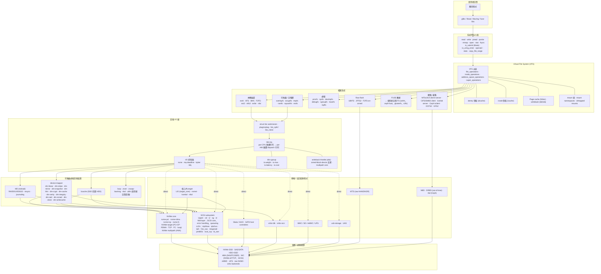

# Linux 核心儲存堆疊 — 架構總覽

*核心版本參考：mainline 6.18，截至 2026 年 5 月。圖示與元件清單係依 kernel.org 官方文件與 Thomas-Krenn 維護的 Linux Storage Stack Diagram v6.9 (2024-05) 為基礎，並對齊 mainline 6.18 的現狀。*

## 1. 總結

Linux 儲存堆疊是嚴格由上而下的分層設計：應用程式透過檔案或區塊相關 syscall 進入 **VFS**，VFS 把呼叫派送到實際的**檔案系統** (ext4/XFS/Btrfs/NFS/FUSE 等)，檔案系統建立 **bio** 結構並送進**區塊層** (`blk-mq` 加上 I/O scheduler)，可選的**可堆疊虛擬區塊裝置** (device-mapper、MD、bcache) 會在中間重寫或扇出這些 bio，最後由**傳輸驅動程式** (NVMe、SCSI、libata、virtio-blk、MMC、MTD) 把請求送到硬體。讓這個堆疊和 FreeBSD/Windows/Illumos 同類產品最不一樣的幾個關鍵設計是：一個以 folios 為基礎、置於**檔案系統之上**的統一 **page cache**；自 5.0 起所有區塊裝置共用的單一**多佇列區塊層** (`blk-mq`)；以及一條能透過 `IORING_OP_URING_CMD` NVMe passthrough 幾乎完全繞過區塊層的 **io_uring** 快路徑。它是所有正式投產核心當中最異質、最可外掛的儲存堆疊——代價是端到端推理也最複雜。

## 2. 與同類核心的比較

以「儲存堆疊如何組織」為比較層級。

| 維度 | **Linux 6.18** | **FreeBSD 14** | **Windows 11 / Server 2025** | **illumos / OmniOS** |
|---|---|---|---|---|
| **區塊堆疊模型** | `blk-mq` + bio；device-mapper / MD 堆疊在 request queue 之*上* | **GEOM** 可堆疊轉換器位於 **CAM** 之上 | Storport/Stornvme 之上的 storage filter driver 堆疊 | 以 ZFS 為中心；SVM/ZVOL 位於 SCSA 之上 |
| **每裝置佇列模型** | 多佇列 (`blk-mq`)，per-CPU 軟體佇列 → per-HW 硬體佇列 | 每盤 geom_disk 佇列，沒有通用多佇列排程器 | StorPort 多佇列 (Windows 8.1+) | 透過 MPxIO 多路徑；每個 LUN 序列派送 |
| **VFS / 檔案系統耦合度** | 通用 VFS (`file_operations`、`inode_operations`)；page cache 在 FS *之外* | 通用 VFS + UFS/ZFS 感知的 vnode ops | 以 IRP 為單位的 I/O Manager + Filter Manager (minifilters) | VFS + DNLC；ZFS 自帶 ARC，不走 page cache |
| **頁面 / 緩衝快取** | 單一 **page cache**，以 folios 為單位，所有快取型 FS 共用 (ZFS-on-Linux 例外) | **Unified Buffer Cache** (UBC) | system cache (`Cc`) 位於 Mm 之上 | **ARC** (ZFS)，UFS 另走 VM page cache |
| **主要使用者空間 I/O API** | `read/write/pread/pwrite/mmap`、**`io_uring`**、傳統 `libaio`、`splice/sendfile` | `read/write/aio_*`、`kqueue` (僅 poll)、`sendfile` | `ReadFile/WriteFile`、IOCP、`ReadFileScatter` | `read/write`、`aio_*`、`event ports` |
| **區塊排程器** | `none`、`mq-deadline`、`kyber`、`bfq` (可外掛) | 單一排程器 (CAM 層)，可外掛 I/O policy | StorPort 內建 | ZFS I/O scheduler 內建於 ZIO |
| **本機 FS 選項** | ext4、XFS、Btrfs、F2FS、ntfs3、exfat、tmpfs (bcachefs 自 6.17 移出主線) | UFS2、ZFS | NTFS、ReFS | ZFS、UFS |
| **核心內網路 FS** | NFSv3/v4.x client+server、SMB3 (cifs client + **ksmbd** server)、Ceph 核心 client | NFSv3/v4 | SMB (server + client)、NFS | NFSv3/v4、SMB |
| **可堆疊區塊功能** | device-mapper (linear、stripe、mirror、snapshot、**thin**、**crypt**、**cache**、**verity**、**integrity**、**raid**)、MD、bcache | GEOM 模組 (gmirror、gstripe、geli、gconcat、gvinum、gjournal) | Storage Spaces (在 virtual disk 之上)、BitLocker filter | SVM (legacy)、ZFS 內建 |
| **傳輸層** | NVMe (PCIe + NVMe-oF 跑 **RDMA/TCP/FC**)、SCSI (sas/fc/iscsi)、libata、virtio、MMC/SD、MTD、USB、NBD、ublk | NVMe、CAM/SCSI、ATA、virtio、USB | StorNVMe、Storport (SAS/FC)、USB、SDPort | NVMe、scsi_vhci、FC、iSCSI |
| **使用者空間 FS 橋接** | **FUSE** (成熟，gluster/ceph-fuse/sshfs 在用)；**ublk** 提供使用者空間區塊裝置 | FUSE (移植) | 上游無；WinFsp 為第三方 | FUSE (移植) |
| **授權** | GPLv2 (核心)；部分韌體 BSD/MIT | BSD | 商用授權 | CDDL |
| **成本** | 免費；成本落在 HBA/SSD 與運維人力 | 免費 | Windows per-seat 授權 | 免費 (OmniOS Community)；OmniOS 商業支援另計 |

*成本與版本號為 2026-05 概略市場資訊；採購前請以原廠當下頁面為準。*

## 3. 深入剖析

### 3.1 整條堆疊：由上至下

幾條圖上不太明顯、值得強調的路徑：

- **mmap 與 DAX 對映射頁面的 read/write 會跳過區塊層**：page fault 直接填 page cache，DAX 在 PMEM / CXL.mem 上甚至把儲存頁面直接映射進使用者位址空間。
- **`io_uring` + NVMe passthrough (`IORING_OP_URING_CMD`)** 是和正常 `SC → VFS → FS → BLK` 平行的另一條路徑：送進去的 SQE 被 NVMe 驅動翻成原生 NVMe 指令，直接送到硬體提交佇列，繞過 `blk-mq` 排隊與 FS。這就是單一裝置可以打到 10M+ IOPS 的那條路。
- **NVMe-oF 與 iSCSI initiator 是「向上」穿過區塊層**——網路在這裡只是傳輸層，不是 FS。相對應的 `nvmet`/LIO **target** 反過來蹲在另一個核心堆疊的最底層，把 bdev/file 從線上反輸出去。
- **網路檔案系統不走區塊層**：NFS、SMB 把 RPC 包在 socket 上送；它們的快取仍是 page cache、writeback 仍是 bdi 機制，但完全沒有 `bio`。

### 3.2 逐層元件清單

可當作讀程式碼或容量規劃時的對照表使用。

**(A) 使用者空間 I/O 介面**

- POSIX 檔案 I/O：`open/openat/openat2`、`read/write`、`pread/pwrite`、`readv/writev`、`preadv2/pwritev2` (搭配 `RWF_*` 旗標)。
- 記憶體映射：`mmap`、`msync`、`madvise`、`mlock`。
- 非同步 I/O：傳統 POSIX `aio_*` (glibc)、Linux `libaio` (`io_setup/io_submit/io_getevents`)、`io_uring` (`io_uring_setup/_enter/_register`)。
- 零拷貝 / 核心內搬移：`sendfile`、`splice`、`tee`、`copy_file_range`。
- 中繼資料：`stat/statx/fstatat`、`getdents64`、`fadvise`、`fallocate`。
- 通知：`inotify`、`fanotify`、`fsnotify`。
- 以 ioctl 為主的控制：`BLKDISCARD`、`BLKZEROOUT`、`FICLONE`/`FICLONERANGE`、`FIDEDUPERANGE`、`FS_IOC_*`。

**(B) Syscall 與 VFS 層**

- Syscall 派送表 (`fs/read_write.c`、`fs/open.c`、`fs/io_uring/*`)。
- 核心物件：`struct file`、`struct inode`、`struct dentry`、`struct super_block`、`struct vfsmount`。
- 操作表：`file_operations`、`inode_operations`、`address_space_operations`、`super_operations`、`dquot_operations`。
- 快取：dentry 快取 (含 rcu-walk)、inode 快取、以 folios 為單位的 **page cache** (`struct folio` 取代 page-by-page 簿記；6.18 已普遍採用多 order folios)。
- Writeback 基礎建設：per-bdi `bdi_writeback`、髒頁面計帳、`vm.dirty_*` 旋鈕。
- Mount 機制：mount 表、mount namespaces、**idmapped mounts**、**fsopen/fsconfig/fsmount** 新版 mount API。
- 安全鉤點：LSM (`security_*`)、capability 檢查。
- 時間：multi-grain timestamps (在 6.13 再次合入主線)。

**(C) 檔案系統層**

- **本機磁碟 (主線)：** ext4 (journaled、保守預設)、**XFS** (allocation-group、線上擴容、reflink)、**Btrfs** (CoW、snapshots、send/receive、FS 內 RAID 0/1/10；RAID5/6 仍有警告)、**F2FS** (log-structured、flash 友善、支援 zoned)、ext2、**ntfs3** (Paragon 驅動，取代 ntfs-3g 做 RW)、**exfat**、**vfat**、**tmpfs**、**squashfs**、**erofs** (唯讀、容器導向)。
- **已移除 / 主線外：** **bcachefs** 在 6.17 從主線移除，之後以 DKMS / out-of-tree 提供；**ZFS** 因 CDDL/GPL 衝突永久主線外，由 OpenZFS 維護。
- **網路 / 叢集：** NFSv3/4.x **client 與 server (`nfsd`)**、**cifs**/SMB3 client、**ksmbd** 核心內 SMB3 server、**Ceph** (`ceph` 核心 client 與 `rbd` 區塊 client)、**OCFS2**、**GFS2**、**OrangeFS** (client)。
- **虛擬 FS：** procfs、sysfs、devtmpfs、debugfs、**cgroup**fs/cgroup2、tracefs、bpffs、configfs、pstore。
- **可堆疊：** **overlayfs** (容器主力)、**ecryptfs** (傳統用法，現在較常以 FS 內 fscrypt 取代)、**fscrypt** (ext4/F2FS/UBIFS 內建的逐檔加密)、**fsverity** (檔案級完整性，用於 Android 與 ChromeOS)。
- **Raw flash：** **UBIFS** 跑在 **UBI** 跑在 **MTD** 上、JFFS2。
- **使用者空間橋接：** **FUSE** (含給 VM 用的 `virtio-fs`)；**ublk** 讓使用者空間實作**區塊**裝置 (零拷貝、多佇列，Cloud Hypervisor / TigerBeetle / SPDK 用戶層整合都用)。

**(D) Page cache 與 writeback**

- 以 folio 為單位的 page cache (`mapping->i_pages` xarray)，所有快取型 FS 共用。
- Readahead 啟發式 (`page_cache_async_readahead`、`force_readahead`)。
- 髒頁面追蹤與 per-bdi writeback worker，由 `wbt` 與 `vm.dirty_*` 調節。
- Direct I/O 路徑 (`O_DIRECT`) 繞過 page cache，由 `iomap`/`dio` 直接組 bio。
- **DAX** (`-o dax`) 把儲存頁面直接映射進使用者位址空間，搭配 PMEM 與 CXL.mem 後端 FS。

**(E) 區塊 I/O 層**

- `struct bio` 與 `struct request` 是工作單位；`bio_split`、`bio_clone`、`bio_chain` 提供分層能力。
- **`blk-mq`** 核心：per-CPU **軟體 staging 佇列** 匯流入 per-HW-context **硬體 dispatch 佇列**；單佇列傳統 `blk-sq` 自 5.0 已徹底移除。
- **I/O 排程器：** `none` (NVMe 預設)、**`mq-deadline`** (SATA/SAS 旋轉碟預設)、**`kyber`** (低延遲取向)、**`bfq`** (公平比例、桌面/比例分配)。
- **`blk-cgroup`** v2 controllers：`io.weight` (BFQ/iocost)、`io.max` (硬上限)、`io.latency`、`io.cost` (iocost)、`io.pressure` (PSI)。
- **Writeback throttling (`wbt`)**、**zoned-block-device** 支援 (`blk-zoned`、SMR / ZNS)、**multipath core** (`blk-mq` 感知；NVMe 用原生 ANA，SCSI 用 `dm-multipath` 或 `scsi_dh_*`)。
- **Plugging** (`blk_plug`) 跨 syscall 批次化 request。

**(F) 可堆疊區塊 — device-mapper 與夥伴**

- **device-mapper** 目標，可組合：`dm-linear`、`dm-stripe`、`dm-mirror`、`dm-snapshot`、**`dm-thin`** (Docker/LVM 用的 thin pool)、**`dm-crypt`** (全磁碟加密、LUKS)、**`dm-cache`** (SSD 快取)、**`dm-verity`** (唯讀完整性、Android verified boot)、**`dm-integrity`** (逐 sector 校驗碼)、**`dm-raid`** (背靠 MD)、**`dm-zoned`** (傳統轉 zoned)、**`dm-clone`** (高效複製)、**`dm-writecache`**、`dm-delay`、`dm-flakey`、`dm-era`、`dm-log-writes`。使用者空間工具：`dmsetup`、**LVM2**、**cryptsetup**。
- **MD (mdraid)：** 軟體 RAID 0/1/4/5/6/10，可選 write journaling 與 bitmap。
- **bcache：** SSD 當 HDD 快取，與 `dm-cache` 是不同的子系統。
- 其他虛擬：`loop`、`zram` (記憶體壓縮 swap/碟)、`zswap` (壓縮 swap 快取)、`nbd`、**`ublk`**。

**(G) 傳輸 / 協定驅動程式**

- **SCSI subsystem (`drivers/scsi/`)**
  - Upper：`sd` (碟)、`sr` (CD/DVD)、`sg` (generic)、`st` (磁帶)。
  - Mid-layer：SCSI core、錯誤處理、queue 處理、transport classes (FC/SAS/iSCSI/SRP)。
  - Low-level drivers (HBA)：`mpt3sas`、`qla2xxx` (QLogic FC)、`lpfc` (Emulex FC)、`hisi_sas`、`megaraid_sas`、`pm8001`、`aacraid`、`mvsas`、`smartpqi`。
  - 軟體 SCSI 傳輸：`iscsi_tcp`、`ib_iser` (iSER over RDMA)、`iscsi_target_mod` (LIO target)。
- **NVMe (`drivers/nvme/`)**
  - Host：`nvme-core` + `nvme-pci`、`nvme-rdma`、`nvme-tcp`、`nvme-fc`、`nvme-apple`、`nvme-loop`。
  - Multipath：`nvme-core` 內建 ANA-aware multipath (NVMe 建議使用，優於 `dm-multipath`)。
  - **Target (`nvmet`)：** 從 PCI EP / RDMA / TCP / FC / loop 把 namespace 輸出。
  - Passthrough：`nvme-ioctl`、`io_uring` 的 `IORING_OP_URING_CMD` (`NVME_IOCTL_IO_CMD`)。
- **libata (`drivers/ata/`)** 處理 SATA/PATA、AHCI 與許多 SoC 控制器；ATA 指令是經由 SCSI translation 跑的。
- **virtio** 區塊傳輸：`virtio-blk`、`virtio-scsi`、`virtio-fs` (FS 層級)、`vhost-user-blk` (bypass)。
- **MMC/SD/eMMC、UFS** (`drivers/mmc/`、`drivers/ufs/`)。
- **USB Mass Storage** (`usb-storage`) 與 **UAS** (USB Attached SCSI)。
- **MTD** (raw NAND/NOR)，用於嵌入式。
- **網路區塊：** **NBD** (核心 client/server)、**rbd** (Ceph 區塊)、DRBD (主線外)。
- **核心內 target：** **LIO** (`target_core_mod`) 經 iSCSI/FC/FCoE/SRP/vhost-scsi 輸出 SCSI LUN；**nvmet** 是 NVMe-oF target；**ksmbd** 是 SMB3 server；**nfsd** 是 NFS server。

**(H) 硬體抽象與相鄰子系統**

- **PCI/PCIe** 與 **MSI-X**：NVMe per-CPU 佇列 IRQ 配線的基礎。
- **DMA mapping API** 與 **IOMMU** (intel-iommu、amd-iommu、ARM SMMU)：影響裸機效能，並且 virtio passthrough / SR-IOV 必備。
- **scsi_dh_*** (device handlers)：active/passive 陣列的存取邏輯。
- **NUMA-aware** 的 `blk-mq` 與 NVMe 佇列配線 (irqbalance、`nohz_full`、`isolcpus` 在這裡影響很大)。
- **fscache / cachefiles**：用本地區塊儲存快取網路 FS 內容。

### 3.3 熱路徑示例：對 NVMe SSD 做 `pread(O_DIRECT)`

1. `pread` → `sys_pread64` → VFS `vfs_read` → `file->f_op->read_iter` (例如 `ext4_file_read_iter`)。
2. `O_DIRECT` 進入 **iomap DIO** 路徑：FS 提供 block mapping (`iomap_apply`)，DIO core 建一條指向使用者頁面的 `struct bio` 鏈 (透過 `iov_iter_get_pages`)。
3. `submit_bio` → 區塊層 → `blk-mq` 挑一條軟體佇列 (依當前 CPU)，再對應到一條硬體 dispatch 佇列 (其中一條對映到該 CPU 的 NVMe submission queue)。
4. NVMe 驅動把 NVMe **submission queue entry** 寫進 DMA 共享記憶體中的 per-CPU SQ ring，敲門鈴。
5. SSD 透過 IOMMU 把資料 DMA 到使用者頁面。完成後寫 CQE；MSI-X 中斷或 polled completion 喚醒等待者。
6. `bio_endio` → DIO completion → 使用者頁面已填好；`pread` 回傳。

同樣的呼叫透過 **registered buffer** 的 `io_uring` 可以省掉第 2 步的 page pinning (頁面在 `io_uring_register` 時就 pin 住)；再透過 **`IORING_OP_URING_CMD` passthrough** 則完全跳過 FS+bio 路徑。

### 3.4 關鍵設計取捨

- **快取屬於 VFS，不屬於檔案系統。** Page cache 被所有快取型 FS 共用，mmap 與統一 writeback 因此變得單純——但這也逼著自帶快取的檔案系統 (尤其 **ZFS-on-Linux 的 ARC** 與 **bcachefs 的 btree node cache**) 要和 page cache 搶記憶體並關掉一部分標準路徑。這是 ZFS-on-Linux 始終覺得「外掛感重」最直接的原因。
- **區塊層是硬性合約，連區塊層之上的層也得遵守。** `bio_split`/`bio_clone` 之所以存在，正是為了讓 device-mapper 與 MD 能把單一 FS bio 扇出成多顆裝置層 bio。這種可組合性讓 `LVM(thin) → dm-crypt → MD-RAID6 → NVMe` 能直接堆疊起來——代價是每層大約多一百個 cycle 的 per-bio 額外開銷。
- **連 SATA 也走 `blk-mq`。** 多佇列原本是為 NVMe 設計的，但 5.0 整路把舊的單佇列移除，由 mq-deadline 排程器幫 SATA 隱藏「只有一條硬體佇列」的事實。淨效果是只有一條程式碼路徑要維護、SSD 的 per-IO 延遲降低，而少數旋轉碟 corner case 在 BFQ 與 mq-deadline 排程器中再做修補。
- **`io_uring` 是一條平行的 I/O 平面。** 與其修補 `libaio` 的痛點 (不支援 buffered I/O、completion ring 固定長度、頻繁 user/kernel context switch)，`io_uring` 直接加一條新的 ring 介面，並逐步吸收幾乎所有儲存 syscall，再加上 `IORING_OP_URING_CMD` 做 NVMe passthrough。原本由區塊層仲介的工作現在發生在驅動。代價是**多了一個控制面**並帶來自己的 bug 類別 (`io_uring` 在近期 CVE 統計中佔比明顯偏高)，有些強化版 distro 對未特權使用者直接停用它。
- **檔案系統常常自己做完整性。** Btrfs 與 bcachefs 自己 checksum 資料；ext4/XFS 則靠 `dm-integrity` 或裝置層 T10 PI 來做端到端保護。所以「要不要疊一層 `dm-integrity`」完全看你選了哪個 FS。
- **`device-mapper` vs. FS 原生功能。** LVM-thin + ext4 vs. Btrfs subvolumes；`dm-crypt`+LUKS vs. **fscrypt**；`dm-raid` vs. Btrfs RAID。核心同時提供兩種選擇，是因為檔案系統對於哪些功能該歸自己有分歧——而 FS 不提供時，`dm-*` 就成為答案。

### 3.5 正確性、永續性與故障模型

- **崩潰一致性**是**檔案系統**的責任：ext4/XFS 走 journal (中繼資料，data 可選)、Btrfs/F2FS 走 copy-on-write、tmpfs 無永續性。
- **`fsync` 語意**要求 FS 把 journal/CoW root 寫穩，並下發一道 **`REQ_OP_FLUSH`** 經 `blk-mq` 到裝置。`REQ_FUA` 在支援 FUA 的裝置上提供 per-write 的 force-unit-access。
- **Barrier 與順序**現在以 bio 上的 `REQ_PREFLUSH`/`REQ_FUA` 表達；舊的 "barrier" API 多年前就已移除。
- **故障域：** 磁碟故障依堆疊由 MD/dm-raid/Btrfs 處理；傳輸故障 (NVMe path-down、FC link drop) 由 NVMe ANA multipath 或 `dm-multipath` 處理；HBA 故障落到 `scsi_eh` 錯誤處理升級 (host reset → bus reset → device reset)。
- **記憶體壓力**由 writeback worker 處理；若髒資料無法落盤則啟動 OOM killer。**PSI** (`/proc/pressure/io`) 把飽和訊號暴露給自動調適器。

### 3.6 效能特性

- **`blk-mq` 上限：** 多 socket server 搭高階 NVMe 並關掉排程器 (`none`) 時，可超過 15M IOPS，前提是 IRQ steering 正確 (per-CPU NVMe 佇列，最好在熱核做 polled completion)。
- **`io_uring` + passthrough** 把單裝置吞吐推過 **10M IOPS**，因為 FS、page cache 與大部分 `blk-mq` 都被繞過；Linux 6.16+ 起在 NVMe 上透過 `io_uring`/區塊層新增 **FDP write streams**，對寫入吃重的多租戶場景顯著降低 SSD WAF。
- **延遲底線：** 從 cache 讀 4 KiB buffered ext4 大概數十 µs；調好的主機上 `io_uring`-polled NVMe direct read 可到 10 µs 以下；資料中心內 NVMe-TCP 約 50 µs RTT。皆為概略值，正式引用前請在目標硬體重做。
- **擴展瓶頸：** `dm-crypt` 早期 per-device 單執行緒，5.9 才改成多佇列 (`no_read_workqueue`、`no_write_workqueue`，後續加上 per-CPU worker)。Btrfs RAID5/6 在壓力下重建仍偏慢。NFS client 小檔操作沒 `nconnect=` 擴展不佳。多 TB cache 在 page cache 回收時，LRU lock 在競爭下可能 stall；folios 緩解了一部分。

### 3.7 維運模型

- **觀察：** `lsblk`、`blkid`、`findmnt`、`df -h`、`lsof`、`iostat -xz 1`、`iotop`、`bpftrace`/`bcc` 腳本 (`biolatency`、`biosnoop`、`xfsslower`、`ext4slower`)。
- **調整：** 排程器透過 `/sys/block/$dev/queue/scheduler`；佇列深度 (`nr_requests`)；`read_ahead_kb`；writeback 旋鈕 (`vm.dirty_*`)；blk-cgroup v2 (`io.weight`、`io.max`、`io.latency`)。
- **追蹤：** `blktrace`/`blkparse`、`perf trace -e 'block:*'`、`ftrace` 下 `block/` 事件、`nvme list`/`nvme smart-log`、`smartctl`。
- **Day-2 故障：** `dmesg | grep -i 'I/O error'`、`journalctl -u nfsd`、`multipath -ll`、`mdadm --detail`、`lvs -a -o +seg_le_ranges`、`xfs_repair`、`e2fsck`、`btrfs check`/`btrfs scrub`。
- **升級：** 核心版本決定整條堆疊——**沒有任何使用者空間 shim** 可以把你升到較新的區塊層或 VFS 合約。Distro 升級節奏要對齊與儲存相關的 LTS 核心 (目前 6.6、6.12，以及進行中的 6.18 系列)。

### 3.8 安全與多租戶

- **At-rest 加密：** `dm-crypt` (區塊層、LUKS2)、**`fscrypt`** (ext4/F2FS/UBIFS 內建的逐檔/逐目錄金鑰——Android 用的就是這個)。
- **完整性：** **`dm-verity`** (唯讀根、Android verified boot、CoreOS 風格不可變映像)、**`dm-integrity`** (per-sector 帶認證的校驗碼)、**`fsverity`** (per-file Merkle tree)。
- **隔離：** mount namespaces、idmapped mounts、user namespaces、blk-cgroup v2、**device cgroup**、SELinux/AppArmor 在 VFS 進入點掛 LSM 鉤點。
- **稽核：** `fanotify` 權限事件、`audit` 子系統的檔案系統 syscall 規則。
- **邊界注意事項：** FUSE/`ublk` 把特權操作搬到使用者空間 daemon ——對 blast-radius 有利，但對 cgroup 計帳與延遲不利。**`io_uring`** 因為威力太大，多個 distro 用 sysctl 對未特權使用者把它關起來。

### 3.9 生態系與整合

- **容器：** overlayfs 做映像層疊；fuse-overlayfs / composefs 為替代；cgroup v2 io controllers；idmapped mounts 給 rootless。
- **虛擬化：** virtio-blk / virtio-scsi / virtio-fs 給 guest；`vhost-user-blk`、`ublk`、SPDK 提供使用者空間 bypass 路徑。
- **Kubernetes：** **CSI** 驅動最終收斂到主機儲存堆疊——CSI 對外提供 block (透過 `dm-multipath` 或 NVMe-oF) 或 filesystem (NFS/CIFS/CephFS)；核心以上各層與一般主機相同。
- **備份 / DR：** LVM/`dm-thin` snapshot、Btrfs send/receive、XFS reflink + `cp --reflink`、NFSv4 server 端 named snapshot。
- **可觀測性：** Prometheus `node_exporter` 區塊指標、eBPF dashboards (`pixie`、`parca`)、`blktrace` 做鑑識級追蹤。

### 3.10 何時投資這套堆疊，何時不要

**在以下情況選擇核心內 Linux 儲存路徑：**

- 需要**最廣的硬體與傳輸支援** (NVMe-oF/TCP/FC/RDMA、SAS、SATA、virtio、MMC、MTD、USB、NBD、ublk)。
- 想要**可組合的虛擬區塊裝置** (`dm-thin` + `dm-crypt` + `MD-raid` + 任意 FS) 而不依賴第三方軟體。
- 需要**容器原生**堆疊 (overlayfs、idmapped mounts、blk-cgroup v2)。
- 在做**高效能關鍵**軟體，能利用 **`io_uring` + NVMe passthrough**——其他核心沒有對等品。
- 想要**核心內建** NFS / SMB / iSCSI / NVMe-oF target (`nfsd`、`ksmbd`、LIO、`nvmet`)。

**以下情況考慮別的方案 (或補強)：**

- 需要 **ZFS 作為一等公民**，且讓 page cache 真的配合：Illumos/FreeBSD 仍是更乾淨的家；OpenZFS-on-Linux 可用，但要付 ARC vs. page cache 的稅。
- 需要 **bcachefs 在主線**：6.17 以後就沒這選項了，得跑 DKMS，在受規管環境裡很不順手。
- 想要**單一廠商端到端**的堆疊、有一個窗口可以咬：商用 appliance (NetApp ONTAP、PowerStore、Pure) 把 Linux 開放給你調的 per-layer 旋鈕都抽象掉了。
- 需要**嚴格、可稽核的共用 FS POSIX 語意**：核心 NFSv4 client 的邊角情況 (delegation revoke、partition 中的 locking) 仍會咬人；很多場合改用 userspace client (Ceph FUSE、Lustre client) 以求更嚴格的行為。

## Sources

- [Multi-Queue Block IO Queueing Mechanism (blk-mq) — kernel.org](https://www.kernel.org/doc/html/latest/block/blk-mq.html) — accessed 2026-05
- [Linux Storage Stack Diagram (Thomas-Krenn wiki, v6.9)](https://www.thomas-krenn.com/en/wiki/Linux_Storage_Stack_Diagram) — accessed 2026-05
- [Linux Storage Stack Diagram v6.9 (PDF)](https://www.thomas-krenn.com/de/wikiDE/images/a/ad/Linux-storage-stack-diagram_v6.9.pdf) — accessed 2026-05
- [Overview of the Linux Virtual File System — kernel.org](https://docs.kernel.org/filesystems/vfs.html) — accessed 2026-05
- [Linux Multi-Grain Timestamps (LWN.net article)](https://lwn.net/Articles/940758/) — accessed 2026-05
- [Linux multi-grain timestamp lands in 6.13](https://blog.linuxnews.dev/p/linux-multi-grain-timestamp) — accessed 2026-05
- [Large folios for the page cache (kernelnewbies)](https://kernelnewbies.org/MatthewWilcox/LargeFolios) — accessed 2026-05
- [Bcachefs sends in "the last big on-disk format upgrade" for 6.14 (Phoronix)](https://www.phoronix.com/news/Bcachefs-Linux-6.14) — accessed 2026-05
- [Bcachefs removed from mainline kernel (Linux Journal)](https://www.linuxjournal.com/content/bcachefs-ousted-mainline-kernel-move-dkms-and-what-it-means) — accessed 2026-05
- [Linux 6.18 to ship without Bcachefs (Linuxiac)](https://linuxiac.com/linux-kernel-6-18-to-ship-without-bcachefs/) — accessed 2026-05
- [NVMe FDP block write streams, io_uring DMA-BUF zero-copy land in 6.16 (Phoronix)](https://www.phoronix.com/news/Linux-6.16-Block-IO_uring) — accessed 2026-05
- [Upstreaming a Flexible and Efficient I/O Path in Linux (FAST '24, Joshi et al.)](https://www.usenix.org/system/files/fast24-joshi.pdf) — accessed 2026-05
- [io_uring + NVMe passthrough (LPC 2022 slides)](https://lpc.events/event/16/contributions/1382/attachments/1119/2151/LPC2022_uring-passthru.pdf) — accessed 2026-05
- [Device mapper (Wikipedia)](https://en.wikipedia.org/wiki/Device_mapper) — accessed 2026-05
- [dm-crypt — kernel.org admin guide](https://docs.kernel.org/admin-guide/device-mapper/dm-crypt.html) — accessed 2026-05
- [Device-mapper resource page (sourceware.org)](https://sourceware.org/dm/) — accessed 2026-05
- [NVMe over Fabrics — ArchWiki](https://wiki.archlinux.org/title/NVMe_over_Fabrics) — accessed 2026-05
- [Configuring NVMe/TCP — Red Hat Enterprise Linux 9 docs](https://docs.redhat.com/en/documentation/red_hat_enterprise_linux/9/html/managing_storage_devices/configuring-nvme-over-fabrics-using-nvme-tcp_managing-storage-devices) — accessed 2026-05
- [NVMe PCI Endpoint Function Target — kernel.org](https://docs.kernel.org/nvme/nvme-pci-endpoint-target.html) — accessed 2026-05
- [FreeBSD Handbook: GEOM modular disk transformation framework](https://docs.freebsd.org/en/books/handbook/geom/) — accessed 2026-05
- [GEOM (Wikipedia)](https://en.wikipedia.org/wiki/GEOM) — accessed 2026-05
