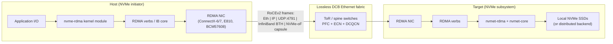

# NVMe over RoCE (NVMe/RDMA on Converged Ethernet)

## Summary

NVMe-over-RoCE is the deployment of the NVM Express over Fabrics (NVMe-oF) RDMA transport binding (NVMe over RDMA Transport Specification, **Revision 1.2, ratified 1 August 2025**) on top of **RDMA over Converged Ethernet v2 (RoCEv2)** — i.e. NVMe queue pairs are mapped one-to-one onto RDMA queue pairs that traverse a routable, UDP-encapsulated Ethernet fabric instead of InfiniBand. The point of the design is to keep the kernel-bypass, zero-copy, hardware-offloaded semantics that NVMe drives expect, while running on standard 100/200/400/800 GbE switches that any data-center already has — at the cost of needing a **lossless** L2/L3 path tuned with PFC, ECN, and (in practice) DCQCN. End-to-end I/O latency is typically in the **single-digit to low-tens of microseconds added on top of the SSD**, vs. ~300–500 µs for NVMe/TCP and ~10–30 µs for NVMe over InfiniBand on equivalent hardware (Western Digital OpenFlex/Data24 white paper; vendor benchmarks 2024–2025). RoCEv2 displaced RoCEv1 because v1 was L2-only; in 2026 "NVMe-RoCE" effectively means NVMe over RoCEv2. Pick it for greenfield all-flash arrays, AI/ML scratch, and HFT where the latency budget is hard; reach for NVMe/TCP instead if you cannot guarantee end-to-end PFC/ECN hygiene, and keep InfiniBand only where you already own an IB fabric for HPC.

## Comparison: NVMe/RoCE vs. the other NVMe-oF transports

| Dimension | **NVMe/RoCE (v2)** | **NVMe/TCP** | **NVMe/iWARP** | **NVMe over InfiniBand** | **FC-NVMe** |
|---|---|---|---|---|---|
| Type / category | NVMe-oF over RDMA on routable Ethernet (UDP/IP) | NVMe-oF over TCP on standard Ethernet | NVMe-oF over RDMA layered on TCP | NVMe-oF over RDMA on InfiniBand fabric | NVMe-oF mapped onto Fibre Channel FC-4 |
| Core architecture | NVMe queues ↔ RDMA QPs over UDP/IP (port 4791); zero-copy, kernel-bypass | NVMe queues ↔ TCP connections (port 4420); kernel TCP stack | NVMe queues ↔ RDMA QPs but RDMA carried by TCP, congestion-controlled | NVMe queues ↔ IB QPs; native IB transport, switched fabric | NVMe-oF Capsules in FCP frames on a Fibre Channel fabric |
| Network requirement | Lossless DCB Ethernet (PFC + ECN, usually DCQCN); routable across IP subnets | Any TCP/IP network; no special fabric tuning | Any TCP/IP network (lossless not required); RDMA NICs must support iWARP | InfiniBand fabric (lossless by design) | Fibre Channel fabric (BB_credit lossless) |
| Latency added by fabric (vendor figures, 2024-2025) | ~1–5 µs at the NIC; ~5–20 µs end-to-end above the SSD | ~50–150 µs typical above the SSD; 300–500 µs storage latency in real deployments | ~10–25 µs end-to-end (TCP retransmit adds tail) | ~3–10 µs end-to-end above the SSD | ~10–25 µs end-to-end above the SSD |
| Host CPU per I/O | Very low (hardware offload, kernel bypass) | Moderate to high (software TCP); SmartNIC offload optional | Low (RDMA offload, but RDMA-on-TCP adds some) | Very low | Low (HBA offloads framing) |
| Routability | L3 routable (UDP/IP) — works across pods and racks | L3 routable — works across anything that has TCP/IP | L3 routable | Within an IB subnet; cross-subnet via routers, uncommon | Within an FC fabric (zoning) |
| Best fit | Greenfield all-flash arrays in a single DC; AI training data plane; HFT | Default block protocol for new arrays; clouds; brownfield Ethernet | Sites that want RDMA without DCB headaches; AWS EFA-class workloads | Existing HPC/IB sites; AI training fabrics built on IB | Mission-critical enterprise databases with existing FC investment |
| Advantages | Lowest-latency Ethernet block transport; minimal CPU; routable | No fabric tuning; runs on any switch; near-universal OS support | RDMA semantics without PFC/DCB; resilient to congestion | Lowest absolute latency; deterministic; mature in HPC | Deterministic latency; existing FC tooling; air-gapped SAN |
| Disadvantages | DCB tuning is non-trivial; PFC pause-storms and deadlock; vendor-specific DCQCN tuning; cross-vendor NIC/switch interop is fragile | Higher latency than RDMA variants; CPU cost without offload | Smallest NIC ecosystem (Chelsio dominant); throughput trails RoCEv2 in benchmarks | Separate, expensive fabric; cross-subnet routing rare; vendor concentration (NVIDIA) | HBAs, FC switches, optics, separate skill set; market share contracting |
| License / standards | Open standard (NVM Express + IBTA RoCEv2 Annex A17) | Open standard (NVMe-oF) | Open standard (NVMe-oF + IETF iWARP) | Open standard (NVMe-oF + IBTA) | Open standard (NVMe-oF + INCITS T11 FC-NVMe-2) |
| Hardware cost (rough public list, May 2026) | RDMA NICs (NVIDIA ConnectX-6/7, Intel E810, Broadcom BCM57608): $700–$2500/port; switches with deep buffer + PFC: $200–$700/port | Same NICs as iSCSI; commodity switches $50–$200/port | Chelsio T7 / T6 NICs $500–$1500/port; any switch | ConnectX-7 / Quantum-2 IB; $1k–$3k/port NIC, $400–$1500/port switch | 32G/64G FC HBAs $1.5–4k each, FC switches $30–80k for 48-port 64G class |
| Status (May 2026) | Production-mature on Linux ≥5.0, ESXi 7.0u3+, Windows Server 2022+; spec rev 1.2 ratified Aug 2025 | Production-mature; the default new-build choice | Niche; still shipping but adoption flat | Production in HPC and AI training | Production-mature in enterprise; FC-NVMe widely shipping |

> Latency, throughput, and price figures above are public-list / vendor-benchmark estimates as of May 2026; production numbers depend heavily on NIC firmware, switch ASIC, and DCB configuration. Treat ranges as orders of magnitude.

## In-depth implementation report

### 1. Architecture deep-dive

A working NVMe/RoCE deployment has four cooperating layers — the spec gets short, the operational reality does not.



**Layer breakdown:**

- **NVMe-oF protocol layer.** The host driver (`nvme-rdma` on Linux, `vmnvme` on ESXi, in-box Windows NVMe-oF initiator) exchanges *NVMe-oF Capsules* with the target. Capsules carry the same NVMe Submission Queue Entry (64 B) and Completion Queue Entry (16 B) used by local PCIe NVMe — only the framing changes. The Discovery Service (Discovery Controller, NQN `nqn.2014-08.org.nvmexpress.discovery`) lists which subsystems are reachable.
- **RDMA verbs layer.** Each NVMe submission/completion queue is bound to an RDMA Queue Pair (QP). Submission queue entries are `RDMA_SEND`s; data transfers are `RDMA_READ` / `RDMA_WRITE`; completions ride `RDMA_SEND_WITH_INV` or `IBV_WC_*`. The host pre-registers memory regions, so data lands in application buffers with zero copies on either end.
- **RoCEv2 framing.** The IBTA RoCEv2 spec (Annex A17, 2014) wraps the InfiniBand Base Transport Header (BTH) in a UDP datagram with destination port **4791**, then in an IP packet, then in an Ethernet frame. The source UDP port is a hash of the QP — switches see it as flow entropy and ECMP-spread reliably.
- **Lossless DCB fabric.** RoCEv2 expects an essentially loss-free path. Standard practice in 2026:
  - **PFC (IEEE 802.1Qbb)** on a dedicated traffic class (typically priority 3, marked by `pcp` on 802.1Q frames or by DSCP for L3); switches pause upstream when their per-class buffer is filling.
  - **ECN (RFC 3168 + DCTCP)** marks packets when queues fill, before PFC ever fires.
  - **DCQCN** (Microsoft/Mellanox, 2015) on the NICs reacts to ECN-CE marks by rate-limiting the source QPs, so PFC is the safety net and ECN does the real work. ECN threshold must be *lower* than PFC threshold or you get unnecessary pauses.

State that matters operationally:

- **No retransmit.** RoCE assumes the lower layer does not drop. A single packet loss on a QP triggers a "go-back-N" retransmit from the last ACKed PSN (Packet Sequence Number) and a measurable latency spike. RDMA NICs since ConnectX-5 also support a "selective repeat" mode that mitigates this, but it is not universal.
- **Head-of-line blocking on QPs.** A single QP processes work requests in order; throughput across many small I/Os depends on having multiple QPs, which NVMe-oF supplies automatically because each NVMe queue gets its own QP.
- **Memory registration cost.** The host has to register data buffers with the RDMA NIC before they can be the target of `RDMA_READ` / `RDMA_WRITE`. Linux `nvme-rdma` uses FRWR (Fast Registration Work Request) per-I/O; this adds a few hundred nanoseconds and is invisible to the application.

### 2. Key design patterns and trade-offs

- **NVMe queue → RDMA QP, not NVMe queue → TCP socket.** The NVMe submission/completion queue model was designed for PCIe doorbells; an RDMA QP is the closest network analogue (independent in-order channel with a doorbell-like post mechanism), so the mapping is almost mechanical. NVMe/TCP had to invent multiple-TCP-connection logic to undo head-of-line blocking; RoCE gets it for free.
- **UDP encapsulation instead of a new EtherType.** RoCEv1 used a custom EtherType (0x8915) and was therefore L2-only. RoCEv2 swallowed the cost of a UDP header (8 bytes) to get IP routing and standard 5-tuple ECMP. Almost every modern deployment uses v2; v1 survives only in legacy IB-to-Ethernet bridges.
- **Hop-by-hop PFC instead of end-to-end congestion control.** RDMA hardware historically expected the link to never drop, so PFC was added. Pure PFC is fragile: head-of-line blocking can propagate, and circular dependencies in PFC pauses can cause deadlock. DCQCN was the answer — let ECN do the smart end-to-end work and reserve PFC for last-resort. The alternative trade-off taken by **iWARP** is to put a TCP-like reliability layer inside RDMA itself; iWARP works on lossy Ethernet but is more complex on the NIC and historically had a smaller vendor footprint.
- **Hardware-offloaded transport, not kernel-software transport.** RoCE pushes the entire protocol stack into the NIC, which is why CPU usage and latency are both an order of magnitude better than NVMe/TCP. The price is that bugs are now in NIC firmware — and that NIC firmware revisions need to match across the fleet or you see asymmetric loss.
- **No native authentication or encryption (until recently).** Classic RoCEv2 has no built-in crypto; production deployments isolated by VLAN/VRF or used MACsec at L2. NVMe spec rev 2.x added in-band TLS as a transport option for NVMe/TCP, but for RDMA the canonical answer is RDMA-on-IPsec or hardware-offloaded line-rate IPsec on the NIC. NVMe DH-HMAC-CHAP (TP 8006) gives authentication regardless of transport.

### 3. Correctness model

- **Per-queue order.** Each NVMe queue is in-order; the RDMA QP carrying it is in-order; PSNs detect reordering. The host application sees the same ordering guarantees as a local PCIe NVMe SSD.
- **End-to-end data integrity.** NVMe protocol-level CRC (NVMe Reservations + the NVM Express End-to-End Protection Information, T10 PI) covers logical-block content across the fabric if both ends opt in. The RoCEv2 layer adds IBTA ICRC + Ethernet FCS — two independent CRCs cover the wire path.
- **Failure modes.**
  - **PFC pause storm.** A misconfigured downstream port pauses upstream, which pauses further upstream, eventually the entire fabric for the lossless class freezes. Mitigation: PFC watchdog timers on every switch port (NVIDIA Spectrum default 200 ms).
  - **Silent reorder under ECMP.** A flow whose UDP source port hashes to two equal-cost paths can re-order; PSN-based reorder detection catches it but triggers retransmit. Mitigation: per-QP entropy, ECMP hash on UDP src port.
  - **NIC firmware divergence.** Two ConnectX-6 NICs on different firmware can negotiate features differently. Mitigation: fleet-pin firmware.
- **Multi-volume consistency.** Like every other NVMe-oF transport, RoCE is per-subsystem; crash-consistent multi-namespace snapshots require the target array to implement them.

### 4. Performance characteristics

Numbers are vendor- and config-dependent; the order of magnitude is consistent across published material:

| Metric | NVMe/RoCEv2 | NVMe/TCP | NVMe/IB | Source |
|---|---|---|---|---|
| Fabric-added latency (above SSD) | ~5–20 µs | ~50–150 µs | ~3–10 µs | Western Digital OpenFlex Data24 WP; vendor benchmarks 2024 |
| 4K random read IOPS (single host, single 100 GbE port) | 2.5–3.5 M | 1.5–2.5 M | 3–4 M | Storage vendor benchmarks 2024–2025 |
| 4K random read latency at QD=1 | ~25–40 µs | ~80–150 µs | ~20–35 µs | Same |
| Host CPU per 1 M IOPS | ~0.5 core | ~2–4 cores (software stack); ~1 core with SmartNIC | ~0.5 core | Vendor reports |
| Throughput on 200 GbE | ~22–24 GB/s line-rate | ~16–20 GB/s | n/a | Vendor reports |

What drives the numbers in real deployments:

- **NIC capability.** ConnectX-6 / -7 with Dynamically Connected Transport (DCT) is materially better at large-fan-in workloads than older ConnectX-4 LX.
- **Switch buffer depth and PFC tuning.** Shallow-buffer switches (Tomahawk-class) require aggressive ECN marking; deep-buffer (Jericho-class) tolerate larger bursts.
- **MTU.** 9000-byte jumbo frames cut framing overhead by ~5× for sequential workloads; mismatched MTU silently drops packets.
- **Per-host queue count.** `nvme-rdma` defaults to one I/O queue per online CPU; lower than that bottlenecks at the host.

### 5. Operational model

- **Install (Linux host).**
  ```
  modprobe nvme-rdma
  nvme discover -t rdma -a <target_ip> -s 4420
  nvme connect -t rdma -n <target_NQN> -a <target_ip> -s 4420
  ```
- **Install (Linux target).** `nvmet-rdma` + `configfs` (`/sys/kernel/config/nvmet/`); SPDK NVMe-oF target for user-space high-performance.
- **Install (ESXi).** Configure RDMA adapter + vmkernel; add NVMe-oF storage adapter; rescan.
- **Discovery.** Discovery Controller (mDNS-advertised since spec 2.0); Centralized Discovery Controller (CDC) is the cross-fabric directory; per-host nvme-cli supports auto-connect from `/etc/nvme/discovery.conf`.
- **Fabric tuning (the part that bites).**
  - Pick a priority (3 by default), mark RoCEv2 with DSCP 26 or 802.1p 3, enable PFC on that priority on every switch port and on the NICs.
  - Enable ECN on the same priority and set ECN min/max thresholds *below* PFC thresholds.
  - Enable DCQCN on the NICs (`mlnx_qos -i <iface> --trust dscp` on NVIDIA; equivalent vendor-specific on Intel/Broadcom).
  - PFC watchdog on switches (`priority-flow-control watchdog` on Arista/Cisco) to break pause-storm deadlocks.
- **Observability.** Linux: `nvme list-subsys`, `nvme io-passthru`, ConnectX `ethtool -S` counters (`rx_prio3_pause`, `np_cnp_sent`, etc.), `ibdev2netdev` to map RDMA dev to NIC. Switch side: per-port PFC TX/RX counters, ECN-marked-packet counters.
- **Common failure modes.**
  - **PFC enabled on host but not on switch (or vice versa).** Asymmetric pause → throughput collapse or retransmit storm.
  - **ECN configured but DSCP markings stripped at L3 boundary.** RDMA NICs ignore ECN marks if DSCP is rewritten.
  - **Asymmetric ECMP path lengths.** Same-flow reorder → PSN mismatch → go-back-N. Fix: enable adaptive routing or pin QPs to deterministic paths.
  - **Firmware mismatch.** ConnectX firmware on host vs. target negotiates a lower feature set than expected; tail latencies regress. Fix: pin and validate.
  - **MTU drift.** A single 1500-MTU hop in a 9000-MTU path drops oversize frames silently; manifests as 100% packet loss on large I/Os only. Fix: end-to-end `ping -M do -s 8972`.

### 6. Security & multi-tenancy

- **Authentication.** Subsystem NQN + Host NQN access list on the target; NVMe DH-HMAC-CHAP (TP 8006) for cryptographic host auth, transport-agnostic — works on RoCE just like on TCP. RoCEv2 itself has no native auth.
- **Encryption.** RoCEv2 has no built-in encryption. Options in 2026:
  - **MACsec (IEEE 802.1AE)** at L2 between ToR and host — supported by ConnectX-7 and recent Intel/Broadcom NICs with hardware offload, line-rate.
  - **IPsec** with NIC offload (ConnectX-6 Dx and later).
  - **Trusted fabric** isolation: dedicated VLAN/VRF, no egress to general LAN.
  - NVMe-over-TLS exists for NVMe/TCP only; RoCE has no equivalent in-band TLS.
- **Tenant isolation.** ACLs on subsystem (target side) plus VLAN/VRF (fabric side); there is no namespace ACL inside the protocol below the subsystem boundary.
- **Audit.** Connect/disconnect events in target dmesg / `nvmetcli`; switches log PFC events. There is no per-I/O audit (and you would not want one at these rates).

### 7. Ecosystem & integrations

- **OS support.** Linux ≥4.8 (in-tree `nvme-rdma`), ESXi 7.0u3+ (NVMe-oF RDMA fully supported), Windows Server 2022+ (in-box initiator), FreeBSD has community support, recent kernels production-ready.
- **NICs.** NVIDIA Mellanox ConnectX-5/6/7 (the reference RoCE platform), Intel E810, Broadcom BCM57608/Thor-2, AMD/Pensando DSC. Choose by firmware support and PFC behavior, not list price.
- **Switches.** Arista 7050X/7060X/7280R (Jericho, deep-buffer for AI); Cisco Nexus 9000; NVIDIA Spectrum-3/4; Juniper QFX5230. All major vendors document RoCE deployment guides — read them; defaults are rarely right.
- **Storage arrays.** Dell PowerStore / PowerMax, Pure FlashArray, NetApp ONTAP (NVMe-oF/RoCE since ONTAP 9.10), HPE Alletra MP, Vast Data, Pure FlashBlade, IBM FlashSystem. Many also support NVMe/TCP and FC-NVMe simultaneously.
- **Kubernetes.** CSI drivers from each array vendor; the node DaemonSet executes `nvme connect`/`nvme disconnect`. Lossless fabric must be configured by the platform team — outside CSI's scope.
- **AI training fabrics.** RoCEv2 is the de facto choice for AI back-end networks at hyperscale (Meta RSC, Microsoft Maia, ByteDance, etc.) — same fabric used for both GPU-to-GPU NCCL and NVMe/RoCE storage. AWS EFA on the inference path is iWARP-derived rather than RoCE; Google JNI / NCCL+IB on TPU pods uses IB.
- **Adjacent specs.**
  - **NVMe-oF + TLS (TP 8011)** — TCP only; no RoCE binding yet.
  - **NVMe Boot Specification** — supports NVMe/RoCE for diskless boot.
  - **Centralized Discovery Controller (CDC)** — manageability layer many vendors implement (Dell SmartFabric Storage Software, Pure, NetApp).

### 8. When to pick NVMe/RoCE

Pick it when:

- You are building a **greenfield all-flash block tier in a single data center** and you can dictate ToR switch model and configuration.
- Your workload's **end-to-end latency budget is single-digit microseconds above the SSD** (HFT, GPU dataloader hot path, in-memory DB checkpointing).
- You already operate **a lossless DCB fabric for AI training** and want to layer storage on the same NICs and switches (the common Meta/Microsoft/ByteDance pattern).
- You can guarantee **homogeneous NICs and firmware** across initiators and targets, or you have a vendor on contract who will guarantee interop.

Pick something else when:

- You **cannot guarantee lossless DCB** end-to-end — pick NVMe/TCP. The latency cost is real but the operational fragility of half-configured PFC is worse.
- You are spread across **multiple data centers or cloud regions** — RoCE is L3-routable in theory but lossless DCB across a WAN is not realistic. Use NVMe/TCP.
- You already run **InfiniBand for HPC** and have IB-attached storage — keep NVMe over IB; do not introduce a second fabric.
- You are a regulated tier-1 enterprise with a **mature FC SAN** — FC-NVMe gives RDMA-class latency without retraining the SAN team.

### 9. Closing TL;DR

NVMe/RoCEv2 is the lowest-latency, lowest-CPU way to put NVMe block storage on standard Ethernet — vendor benchmarks consistently show ~5–20 µs fabric-added latency vs. 50–150 µs for NVMe/TCP, with one-tenth the host CPU per million IOPS — and it is the same fabric AI training already wants, which is why it dominates hyperscale AI-storage back ends in 2026. The catch is everything the spec does not cover: PFC + ECN + DCQCN must be configured consistently across every NIC and switch port in the path, MTU and DSCP must survive any L3 hop, and firmware mismatches between ConnectX generations are a real cause of tail-latency regressions. Choose it when you control the fabric and need the latency; choose NVMe/TCP when you cannot guarantee end-to-end DCB hygiene or when you are crossing a WAN.

## Sources

- [NVM Express — NVMe over RDMA Transport Specification Rev 1.2 (1 Aug 2025)](https://nvmexpress.org/wp-content/uploads/NVM-Express-NVMe-over-RDMA-Transport-Specification-Revision-1.2-2025.08.01-Ratified.pdf) — accessed 2026-05
- [NVM Express — Base Specification Rev 2.3 (31 Jul 2025)](https://nvmexpress.org/wp-content/uploads/NVM-Express-Base-Specification-Revision-2.3-2025.08.01-Ratified.pdf) — accessed 2026-05
- [NVM Express — Specifications page](https://nvmexpress.org/specifications/) — accessed 2026-05
- [Western Digital — NVMe/TCP vs RDMA with RoCEv2 white paper (OpenFlex Data24)](https://documents.westerndigital.com/content/dam/doc-library/en_us/assets/public/western-digital/collateral/white-paper/white-paper-open-flex-data24-roce-vs-tcp.pdf) — accessed 2026-05
- [Simplyblock — NVMe/TCP vs NVMe/RoCE comparison](https://simplyblock.io/blog/nvme-tcp-vs-nvme-roce/) — accessed 2026-05
- [Simplyblock — What Is NVMe over RoCE?](https://www.simplyblock.io/glossary/what-is-nvme-over-roce/) — accessed 2026-05
- [Intelligent Visibility — NVMe-oF: TCP vs RDMA for Ethernet storage](https://intelligentvisibility.com/nvme-over-fabrics-ethernet-comparison) — accessed 2026-05
- [Intelligent Visibility — RDMA for Storage Ethernet: RoCE vs iWARP](https://intelligentvisibility.com/rdma-roce-iwarp-guide) — accessed 2026-05
- [VMware (Broadcom) docs — Configuring NVMe over RDMA (RoCE v2) on ESXi](https://techdocs.broadcom.com/us/en/vmware-cis/vsphere/vsphere/8-0/vsphere-storage/about-vmware-nvme-storage/configuring-nvme-over-rdma-roce-v2-on-esxi.html) — accessed 2026-05
- [NVIDIA Enterprise Support — Configuring RoCE over a lossless fabric (PFC + ECN)](https://enterprise-support.nvidia.com/s/article/how-to-configure-roce-over-a-lossless-fabric--pfc---ecn--end-to-end-using-connectx-4-and-spectrum--trust-l2-x) — accessed 2026-05
- [Arista / Broadcom — Lossless Network for AI/ML/Storage/HPC with RDMA deployment guide](https://www.arista.com/assets/data/pdf/Broadcom-RoCE-Deployment-Guide.pdf) — accessed 2026-05
- [Cisco — NVMeoF with RoCEv2 in ESXi (Intersight Managed Mode)](https://www.cisco.com/c/en/us/td/docs/unified_computing/Intersight/IMM-RoCE-Configuration-Guide/b-imm-rdma-over-converged-ethernet--roce--v2/m-configuring-nvmeof-with-rocev2-in-esxi.html) — accessed 2026-05
- [Cisco — RoCE Storage Implementation over NX-OS VXLAN Fabrics](https://www.cisco.com/c/en/us/td/docs/dcn/whitepapers/roce-storage-implementation-over-nxos-vxlan-fabrics.html) — accessed 2026-05
- [Juniper — DCQCN configuration for RDMA traffic on NICs](https://www.juniper.net/documentation/us/en/software/jvd/jvd-ai-dc-apstra-amd/dcqcn_configuration_for_rdma_traffic_on_nics.html) — accessed 2026-05
- [Intel — DCQCN configuration for E810-series NIC](https://edc.intel.com/content/www/us/en/design/products/ethernet/800-series-linux-flow-control-configuration-guide-for-rdma-use-c/dcqcn/) — accessed 2026-05
- [WWT — Using PFC and ECN to create lossless fabrics for AI/ML](https://www.wwt.com/article/using-pfc-and-ecn-queuing-methods-to-create-lossless-fabrics-for-aiml) — accessed 2026-05
- [UNH InterOperability Lab — NVMe-oF testing program](https://www.iol.unh.edu/testing/storage/nvme-of) — accessed 2026-05
- [FreeBSD Foundation — NVMe over Fabrics in FreeBSD](https://freebsdfoundation.org/our-work/journal/browser-based-edition/storage-and-filesystems/nvme-over-fabrics-in-freebsd-2/) — accessed 2026-05
