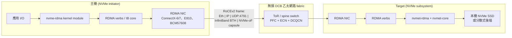

# NVMe over RoCE (NVMe/RDMA on Converged Ethernet)

## 摘要

NVMe-over-RoCE 是把 NVM Express over Fabrics (NVMe-oF) 的 RDMA transport binding (NVMe over RDMA Transport Specification,**Rev 1.2,於 2025 年 8 月 1 日批准**) 部署在 **RDMA over Converged Ethernet v2 (RoCEv2)** 上 — 也就是把 NVMe queue pair 一對一映射到 RDMA queue pair,並讓它走可路由、用 UDP 封裝的乙太網路,而不是 InfiniBand。設計的目的是保留 NVMe 磁碟所期待的 kernel-bypass、zero-copy、硬體 offload 語意,同時跑在資料中心已經有的標準 100/200/400/800 GbE 交換器上 — 代價是 L2/L3 路徑必須是**無損 (lossless)**,需以 PFC、ECN 以及 (實務上) DCQCN 仔細調校。端到端 I/O 延遲通常是**在 SSD 之上多加個位數到低十微秒**,相較之下 NVMe/TCP 約 300–500 µs,NVMe over InfiniBand 在等價硬體上約 10–30 µs (Western Digital OpenFlex/Data24 白皮書;2024–2025 廠商基準)。RoCEv2 取代了僅限 L2 的 RoCEv1;2026 年所謂「NVMe-RoCE」實際上指的就是 NVMe over RoCEv2。當你做全新 all-flash 陣列、AI/ML scratch、HFT 等延遲預算極緊的場景時選它;若你無法保證端到端 PFC/ECN 衛生則改用 NVMe/TCP;只有當你已經為 HPC 擁有 IB fabric 時才保留 InfiniBand。

## 比較:NVMe/RoCE vs. 其他 NVMe-oF transport

| 維度 | **NVMe/RoCE (v2)** | **NVMe/TCP** | **NVMe/iWARP** | **NVMe over InfiniBand** | **FC-NVMe** |
|---|---|---|---|---|---|
| 類型 / 分類 | 可路由乙太網路 (UDP/IP) 上的 NVMe-oF RDMA | 標準乙太網路上的 NVMe-oF TCP | RDMA 疊在 TCP 上的 NVMe-oF | InfiniBand fabric 上的 NVMe-oF RDMA | Fibre Channel FC-4 上的 NVMe-oF |
| 核心架構 | NVMe 佇列 ↔ RDMA QP 透過 UDP/IP (port 4791);zero-copy、kernel-bypass | NVMe 佇列 ↔ TCP 連線 (port 4420);走 kernel TCP stack | NVMe 佇列 ↔ RDMA QP,但 RDMA 跑在 TCP 上、含壅塞控制 | NVMe 佇列 ↔ IB QP;原生 IB transport、switched fabric | NVMe-oF Capsule 包進 FC fabric 上的 FCP frame |
| 網路需求 | 無損 DCB 乙太網路 (PFC + ECN,通常加 DCQCN);可跨 IP subnet 路由 | 任何 TCP/IP 網路;無需特殊 fabric 調校 | 任何 TCP/IP 網路 (不需無損);RDMA NIC 需支援 iWARP | InfiniBand fabric (天生無損) | Fibre Channel fabric (BB_credit 無損) |
| Fabric 增加的延遲 (廠商數據,2024–2025) | NIC ~1–5 µs;SSD 之上端到端 ~5–20 µs | SSD 之上 ~50–150 µs;實際部署儲存延遲 300–500 µs | 端到端 ~10–25 µs (TCP 重傳會加長尾) | 端到端 ~3–10 µs | 端到端 ~10–25 µs |
| 每 I/O 主機 CPU | 極低 (硬體 offload + kernel bypass) | 中至高 (軟體 TCP);可選 SmartNIC offload | 低 (RDMA offload,但 RDMA-on-TCP 多吃一些) | 極低 | 低 (HBA 接管 framing) |
| 可路由性 | L3 routable (UDP/IP) — 跨 pod 與 rack 都行 | L3 routable — 任何有 TCP/IP 的地方都通 | L3 routable | 同一 IB subnet 內;跨 subnet 需要 IB router,罕見 | 在 FC fabric 內 (zoning) |
| 最適用途 | 單一 DC 內的全新 all-flash 陣列;AI 訓練資料層;HFT | 新陣列預設 block 協定;雲端;棕地乙太網路 | 想要 RDMA 但不想處理 DCB 的站點;AWS EFA 級工作負載 | 既有 HPC/IB 站點;以 IB 建構的 AI 訓練 fabric | 有既有 FC 投資的任務關鍵企業資料庫 |
| 優點 | 乙太網路 block 傳輸中延遲最低;CPU 極省;可路由 | 不需 fabric 調校;任何 switch 都能跑;OS 支援度幾乎全面 | 不需 PFC/DCB 也能有 RDMA 語意;對壅塞有韌性 | 絕對延遲最低;確定性高;在 HPC 已成熟 | 確定性延遲;沿用既有 FC 工具鏈;air-gap SAN |
| 缺點 | DCB 調校不簡單;PFC pause storm 與 deadlock;DCQCN 廠商相關;跨廠 NIC/switch 互通脆弱 | 比 RDMA 變體延遲高;無 offload 時 CPU 開銷大 | NIC 生態最小 (以 Chelsio 為主);基準中吞吐略落後 RoCEv2 | 獨立、昂貴的 fabric;跨 subnet 路由少見;廠商集中 (NVIDIA) | HBA、FC switch、optic、獨立技能;市佔縮減中 |
| 授權 / 標準 | 開放標準 (NVM Express + IBTA RoCEv2 Annex A17) | 開放標準 (NVMe-oF) | 開放標準 (NVMe-oF + IETF iWARP) | 開放標準 (NVMe-oF + IBTA) | 開放標準 (NVMe-oF + INCITS T11 FC-NVMe-2) |
| 硬體成本 (公開定價粗估,2026 年 5 月) | RDMA NIC (NVIDIA ConnectX-6/7、Intel E810、Broadcom BCM57608):每 port $700–$2500;深 buffer + PFC 的 switch:每 port $200–$700 | 與 iSCSI 同 NIC;商規 switch 每 port $50–$200 | Chelsio T7 / T6 NIC 每 port $500–$1500;任何 switch | ConnectX-7 / Quantum-2 IB;NIC 每 port $1k–$3k、switch 每 port $400–$1500 | 32G/64G FC HBA 每張 $1.5–4k;48-port 64G FC switch $30–80k |
| 狀態 (2026 年 5 月) | 在 Linux ≥5.0、ESXi 7.0u3+、Windows Server 2022+ 上生產級成熟;Rev 1.2 規範 2025 年 8 月批准 | 生產級成熟;新建專案的預設 | 小眾;仍有出貨但採用面平緩 | HPC 與 AI 訓練可投入生產 | 企業生產級成熟;FC-NVMe 廣泛出貨 |

> 上表的延遲、吞吐與價格為 2026 年 5 月的公開定價/廠商基準估計;實際生產數字高度受 NIC 韌體、switch ASIC 與 DCB 設定影響。範圍只代表數量級。

## 深入實作報告

### 1. 架構深度剖析

可運作的 NVMe/RoCE 部署有四個協作層 — 規範很短,維運現實不然。



**逐層拆解:**

- **NVMe-oF 協定層。** 主機驅動 (Linux 的 `nvme-rdma`、ESXi 的 `vmnvme`、Windows in-box NVMe-oF initiator) 與 target 交換 *NVMe-oF Capsule*。Capsule 承載與本機 PCIe NVMe 相同的 NVMe Submission Queue Entry (64 B) 與 Completion Queue Entry (16 B) — 只是 framing 不同。Discovery Service (Discovery Controller,NQN `nqn.2014-08.org.nvmexpress.discovery`) 列出哪些 subsystem 可達。
- **RDMA verbs 層。** 每個 NVMe submission/completion 佇列綁到一個 RDMA Queue Pair (QP)。Submission queue entry 是 `RDMA_SEND`;資料傳輸用 `RDMA_READ` / `RDMA_WRITE`;completion 走 `RDMA_SEND_WITH_INV` 或 `IBV_WC_*`。主機事先註冊 memory region,因此資料兩端皆零拷貝直達應用 buffer。
- **RoCEv2 framing。** IBTA RoCEv2 規範 (Annex A17,2014) 把 InfiniBand Base Transport Header (BTH) 包進目的 UDP port **4791** 的 UDP datagram,再包進 IP 封包,最後是 Ethernet frame。Source UDP port 是 QP 的雜湊值 — switch 把它當成 flow entropy 做 ECMP 散流,十分穩定。
- **無損 DCB fabric。** RoCEv2 假設底層幾乎不掉包。2026 年的標準作法:
  - **PFC (IEEE 802.1Qbb)** 開在一個專用 traffic class (通常是 priority 3,802.1Q 用 `pcp` 標記,L3 用 DSCP);當該 class 的 per-port buffer 即將填滿時 switch 對上游 pause。
  - **ECN (RFC 3168 + DCTCP)** 在 queue 變滿時就先標記封包,而非等到 PFC 啟動。
  - **DCQCN** (Microsoft/Mellanox,2015) 由 NIC 對 ECN-CE 標記做反應,對源端 QP 限速,讓 PFC 成為安全網、ECN 才做真工。ECN 門檻必須*低於* PFC 門檻,否則會出現不必要的 pause。

維運上會踩到的狀態:

- **不重傳。** RoCE 假設下層不丟包。QP 上一個封包遺失會觸發從上一個被 ACK 的 PSN (Packet Sequence Number) 起的「go-back-N」重傳,延遲毛刺可量測。ConnectX-5 之後的 RDMA NIC 也支援 "selective repeat" 模式減輕影響,但並非普遍。
- **QP 上的 head-of-line blocking。** 單一 QP 的 work request 依序處理;對眾多小 I/O 的吞吐取決於 QP 數量 — NVMe-oF 會自動配給,因為每個 NVMe 佇列各自配一個 QP。
- **Memory registration 成本。** 主機在發 `RDMA_READ` / `RDMA_WRITE` 之前必須先向 RDMA NIC 註冊 buffer。Linux `nvme-rdma` 採每 I/O FRWR (Fast Registration Work Request);多了幾百奈秒,對應用不可見。

### 2. 關鍵設計模式與權衡

- **NVMe 佇列 → RDMA QP,而非 NVMe 佇列 → TCP socket。** NVMe submission/completion 佇列模型本就為 PCIe doorbell 而設計;RDMA QP 是其最接近的網路類比 (各自獨立、按序、有 doorbell-like post 機制),映射近乎機械。NVMe/TCP 得發明「多條 TCP 連線」邏輯來抵銷 head-of-line blocking;RoCE 天生免費。
- **UDP 封裝而非新 EtherType。** RoCEv1 採自訂 EtherType (0x8915),因此僅限 L2。RoCEv2 多花 8 byte UDP header 換到 IP 路由與標準 5-tuple ECMP。幾乎所有現代部署用 v2;v1 只殘存於 legacy IB-to-Ethernet bridge。
- **逐跳 PFC 取代端到端壅塞控制。** RDMA 硬體傳統上預期鏈路不掉包,因此加上 PFC。但純 PFC 脆弱:head-of-line blocking 會傳播,PFC pause 之間若形成迴圈會 deadlock。DCQCN 是解法 — 讓 ECN 做端到端聰明的事,PFC 作為最後保險。**iWARP** 走另一條路:在 RDMA 內部塞 TCP 風格的可靠性層;iWARP 能跑 lossy 乙太網路,但 NIC 上更複雜,歷史上廠商生態較小。
- **硬體 offload 的 transport,而非 kernel 軟體 transport。** RoCE 把整個協定堆疊推到 NIC,因此 CPU 使用率與延遲都比 NVMe/TCP 好上一個量級。代價是 bug 現在在 NIC 韌體裡 — 而機隊中 NIC 韌體版本必須一致,否則會看到不對稱的丟包。
- **沒有原生 auth 或 encryption (直到最近)。** 經典 RoCEv2 沒有內建加密;生產部署靠 VLAN/VRF 隔離或 L2 MACsec。NVMe 2.x 規範把 in-band TLS 加進 NVMe/TCP,但 RDMA 沒有對應綁定,正規解是 RDMA-on-IPsec 或 NIC 上硬體 offload 的線速 IPsec。NVMe DH-HMAC-CHAP (TP 8006) 提供與 transport 無關的認證。

### 3. 正確性模型

- **每佇列順序。** 每條 NVMe 佇列依序;承載它的 RDMA QP 依序;PSN 偵測重排。主機應用看到的順序保證等同本機 PCIe NVMe SSD。
- **端到端資料完整性。** NVMe 協定層 CRC (NVMe Reservation + NVM Express End-to-End Protection Information、T10 PI) 若兩端皆啟用便涵蓋邏輯區塊內容跨 fabric。RoCEv2 層另加 IBTA ICRC + Ethernet FCS — 兩個獨立 CRC 共同覆蓋線路路徑。
- **故障模式。**
  - **PFC pause storm。** 下游某 port 設錯就 pause 上游,進一步上游也被 pause,最終整個 fabric 對該 lossless class 凍結。緩解:每個 switch port 設 PFC watchdog (NVIDIA Spectrum 預設 200 ms)。
  - **ECMP 下的靜默重排。** 若某 flow 的 UDP source port 雜湊到兩條等價路徑,可能重排;PSN-based 重排偵測會抓到但會觸發重傳。緩解:per-QP entropy、ECMP hash 用 UDP src port。
  - **NIC 韌體分歧。** 兩張 ConnectX-6 用不同韌體可能協商出不同的功能集。緩解:全機隊鎖韌體版本。
- **多 volume 一致性。** 與其他 NVMe-oF transport 一樣,RoCE 是 per-subsystem;跨 namespace 的 crash-consistent 快照需要 target 陣列實作。

### 4. 效能特性

數字會隨廠商與設定變動,但量級在公開資料中相當一致:

| 指標 | NVMe/RoCEv2 | NVMe/TCP | NVMe/IB | 來源 |
|---|---|---|---|---|
| Fabric 增加的延遲 (SSD 之上) | ~5–20 µs | ~50–150 µs | ~3–10 µs | Western Digital OpenFlex Data24 WP;2024 廠商基準 |
| 4K 隨機讀 IOPS (單主機、單 100 GbE port) | 2.5–3.5 M | 1.5–2.5 M | 3–4 M | 2024–2025 廠商基準 |
| QD=1 4K 隨機讀延遲 | ~25–40 µs | ~80–150 µs | ~20–35 µs | 同上 |
| 每 1 M IOPS 主機 CPU | ~0.5 core | ~2–4 core (軟體 stack);有 SmartNIC 約 ~1 core | ~0.5 core | 廠商報告 |
| 200 GbE 上吞吐 | ~22–24 GB/s 線速 | ~16–20 GB/s | n/a | 廠商報告 |

實際部署中決定性因素:

- **NIC 能力。** 帶 Dynamically Connected Transport (DCT) 的 ConnectX-6 / -7 在大 fan-in 工作負載下顯著優於較舊的 ConnectX-4 LX。
- **Switch buffer 深度與 PFC 調校。** 淺 buffer (Tomahawk 等級) 需要更積極的 ECN 標記;深 buffer (Jericho 等級) 可吸收較大 burst。
- **MTU。** 9000 byte jumbo frame 對循序工作負載可減少約 5× framing overhead;MTU 不一致會靜默丟包。
- **每主機佇列數。** `nvme-rdma` 預設每顆 online CPU 一條 I/O 佇列;少於這個會在主機端瓶頸。

### 5. 維運模型

- **安裝 (Linux host)。**
  ```
  modprobe nvme-rdma
  nvme discover -t rdma -a <target_ip> -s 4420
  nvme connect -t rdma -n <target_NQN> -a <target_ip> -s 4420
  ```
- **安裝 (Linux target)。** `nvmet-rdma` + `configfs` (`/sys/kernel/config/nvmet/`);若要 user-space 高效能可用 SPDK NVMe-oF target。
- **安裝 (ESXi)。** 設定 RDMA adapter + vmkernel;新增 NVMe-oF storage adapter;rescan。
- **Discovery。** Discovery Controller (規範 2.0 起以 mDNS 廣告);Centralized Discovery Controller (CDC) 是跨 fabric 的目錄服務;主機 nvme-cli 支援以 `/etc/nvme/discovery.conf` 自動連線。
- **Fabric 調校 (會踩雷的部分)。**
  - 選一個 priority (預設 3),用 DSCP 26 或 802.1p 3 標記 RoCEv2,在每個 switch port 與 NIC 上對該 priority 開 PFC。
  - 對同 priority 開 ECN,並把 ECN 最小/最大門檻設在 PFC 門檻*之下*。
  - 在 NIC 上開 DCQCN (NVIDIA 用 `mlnx_qos -i <iface> --trust dscp`;Intel/Broadcom 對應的廠商命令)。
  - Switch 開 PFC watchdog (Arista/Cisco 的 `priority-flow-control watchdog`) 以打破 pause storm deadlock。
- **可觀測性。** Linux:`nvme list-subsys`、`nvme io-passthru`、ConnectX 的 `ethtool -S` counter (`rx_prio3_pause`、`np_cnp_sent` 等)、`ibdev2netdev` 對映 RDMA 裝置到 NIC。Switch 端:per-port PFC TX/RX counter、ECN-marked 封包計數。
- **常見故障模式。**
  - **PFC 在 host 上開但 switch 沒開 (或反之)。** 不對稱 pause → 吞吐崩潰或重傳風暴。
  - **ECN 已設但 DSCP 標記在 L3 邊界被改寫。** RDMA NIC 若 DSCP 被改寫便會忽略 ECN 標記。
  - **ECMP 路徑長度不對稱。** 同 flow 重排 → PSN mismatch → go-back-N。修法:啟用 adaptive routing 或把 QP 釘在確定性路徑上。
  - **韌體不一致。** 主機與 target 的 ConnectX 韌體不同 → 協商出較低功能集;尾延遲退化。修法:鎖版本並驗證。
  - **MTU 漂移。** 9000 MTU 路徑中有單一 1500 MTU 跳會靜默丟超大 frame;只在大 I/O 上呈現 100% 丟包。修法:全路徑 `ping -M do -s 8972`。

### 6. 安全與多租戶

- **認證。** Target 上的 Subsystem NQN + Host NQN ACL;NVMe DH-HMAC-CHAP (TP 8006) 提供 transport 無關的密碼學認證,在 RoCE 上與 TCP 一致可用。RoCEv2 本身無原生 auth。
- **加密。** RoCEv2 無內建加密。2026 年的選項:
  - **MACsec (IEEE 802.1AE)** 在 L2 (ToR 到主機) — ConnectX-7 與較新的 Intel/Broadcom NIC 提供硬體 offload、線速。
  - **IPsec** 帶 NIC offload (ConnectX-6 Dx 起)。
  - **可信 fabric** 隔離:獨立 VLAN/VRF、無對外 LAN 出口。
  - NVMe-over-TLS 僅針對 NVMe/TCP;RoCE 無對應 in-band TLS。
- **租戶隔離。** Target 端的 subsystem ACL 加 fabric 端的 VLAN/VRF;subsystem 邊界以下的協定本身不含 namespace ACL。
- **稽核。** Target 的 dmesg / `nvmetcli` 記錄 connect/disconnect 事件;switch 記錄 PFC 事件。沒有每 I/O 稽核 (這種速率你也不會想要)。

### 7. 生態與整合

- **OS 支援。** Linux ≥4.8 (in-tree `nvme-rdma`)、ESXi 7.0u3+ (完整支援 NVMe-oF RDMA)、Windows Server 2022+ (內建 initiator)、FreeBSD 有社群支援,較新核心已可投入生產。
- **NIC。** NVIDIA Mellanox ConnectX-5/6/7 (RoCE 的參考平台)、Intel E810、Broadcom BCM57608/Thor-2、AMD/Pensando DSC。選擇依韌體支援與 PFC 行為,而非定價。
- **Switch。** Arista 7050X/7060X/7280R (Jericho、為 AI 設計的深 buffer);Cisco Nexus 9000;NVIDIA Spectrum-3/4;Juniper QFX5230。所有主流廠商都有 RoCE 部署指南 — 讀它,預設值幾乎不對。
- **儲存陣列。** Dell PowerStore / PowerMax、Pure FlashArray、NetApp ONTAP (ONTAP 9.10 起支援 NVMe-oF/RoCE)、HPE Alletra MP、Vast Data、Pure FlashBlade、IBM FlashSystem。許多同時支援 NVMe/TCP 與 FC-NVMe。
- **Kubernetes。** 各陣列廠商的 CSI 驅動;節點 DaemonSet 執行 `nvme connect`/`nvme disconnect`。無損 fabric 需平台團隊負責配置 — 在 CSI 範疇之外。
- **AI 訓練 fabric。** RoCEv2 是超大規模 AI 後端網路的事實標準 (Meta RSC、Microsoft Maia、ByteDance 等) — GPU 對 GPU NCCL 與 NVMe/RoCE 儲存共用同一 fabric。AWS EFA 用於推論路徑,源自 iWARP 而非 RoCE;Google TPU pod 走 JNI / NCCL+IB。
- **鄰近規範。**
  - **NVMe-oF + TLS (TP 8011)** — 僅 TCP;RoCE 尚無對應綁定。
  - **NVMe Boot Specification** — 支援以 NVMe/RoCE diskless boot。
  - **Centralized Discovery Controller (CDC)** — 多家廠商實作的可管理層 (Dell SmartFabric Storage Software、Pure、NetApp)。

### 8. 何時選 NVMe/RoCE

選 NVMe/RoCE,當:

- 你在**單一資料中心建造全新 all-flash block 層**,並能指定 ToR 交換器型號與設定。
- 工作負載**端到端延遲預算是 SSD 之上的個位數微秒** (HFT、GPU dataloader 熱路徑、in-memory DB checkpointing)。
- 你已經**為 AI 訓練營運一個無損 DCB fabric**,想把儲存疊到同一組 NIC 與 switch 上 (Meta/Microsoft/ByteDance 的典型作法)。
- 你能在 initiator 與 target 之間保證**同質的 NIC 與韌體**,或有廠商以合約保證互通。

不要選 NVMe/RoCE,當:

- **無法端到端保證無損 DCB** — 選 NVMe/TCP。延遲代價真實存在,但半套 PFC 設定的維運脆弱性更糟。
- 你橫跨**多個資料中心或雲端區域** — RoCE 理論上 L3 routable,但跨 WAN 的無損 DCB 不切實際。改用 NVMe/TCP。
- 你已為 HPC 跑 **InfiniBand** 且儲存接在 IB 上 — 保留 NVMe over IB;別引入第二張 fabric。
- 你是有**成熟 FC SAN** 的法規 tier-1 企業 — FC-NVMe 提供 RDMA 等級延遲,且不必重訓 SAN 團隊。

### 9. Closing TL;DR

NVMe/RoCEv2 是在標準乙太網路上跑 NVMe block 儲存的最低延遲、最省 CPU 路徑 — 廠商基準一致顯示 fabric 增加 ~5–20 µs (NVMe/TCP 為 50–150 µs),每百萬 IOPS 主機 CPU 約十分之一 — 且它正是 AI 訓練本來就要的 fabric,這也是它在 2026 年支配超大規模 AI 儲存後端的原因。代價是規範未涵蓋的所有事:PFC + ECN + DCQCN 必須在路徑上每張 NIC 與每個 switch port 上一致設定,MTU 與 DSCP 必須在任何 L3 hop 都倖存,ConnectX 各世代之間的韌體差異是尾延遲退化的真實成因。當你能掌握 fabric 且需要這個延遲時選它;當你無法保證端到端 DCB 衛生或要跨 WAN 時改用 NVMe/TCP。

## Sources

- [NVM Express — NVMe over RDMA Transport Specification Rev 1.2 (1 Aug 2025)](https://nvmexpress.org/wp-content/uploads/NVM-Express-NVMe-over-RDMA-Transport-Specification-Revision-1.2-2025.08.01-Ratified.pdf) — accessed 2026-05
- [NVM Express — Base Specification Rev 2.3 (31 Jul 2025)](https://nvmexpress.org/wp-content/uploads/NVM-Express-Base-Specification-Revision-2.3-2025.08.01-Ratified.pdf) — accessed 2026-05
- [NVM Express — Specifications page](https://nvmexpress.org/specifications/) — accessed 2026-05
- [Western Digital — NVMe/TCP vs RDMA with RoCEv2 white paper (OpenFlex Data24)](https://documents.westerndigital.com/content/dam/doc-library/en_us/assets/public/western-digital/collateral/white-paper/white-paper-open-flex-data24-roce-vs-tcp.pdf) — accessed 2026-05
- [Simplyblock — NVMe/TCP vs NVMe/RoCE comparison](https://simplyblock.io/blog/nvme-tcp-vs-nvme-roce/) — accessed 2026-05
- [Simplyblock — What Is NVMe over RoCE?](https://www.simplyblock.io/glossary/what-is-nvme-over-roce/) — accessed 2026-05
- [Intelligent Visibility — NVMe-oF: TCP vs RDMA for Ethernet storage](https://intelligentvisibility.com/nvme-over-fabrics-ethernet-comparison) — accessed 2026-05
- [Intelligent Visibility — RDMA for Storage Ethernet: RoCE vs iWARP](https://intelligentvisibility.com/rdma-roce-iwarp-guide) — accessed 2026-05
- [VMware (Broadcom) docs — Configuring NVMe over RDMA (RoCE v2) on ESXi](https://techdocs.broadcom.com/us/en/vmware-cis/vsphere/vsphere/8-0/vsphere-storage/about-vmware-nvme-storage/configuring-nvme-over-rdma-roce-v2-on-esxi.html) — accessed 2026-05
- [NVIDIA Enterprise Support — Configuring RoCE over a lossless fabric (PFC + ECN)](https://enterprise-support.nvidia.com/s/article/how-to-configure-roce-over-a-lossless-fabric--pfc---ecn--end-to-end-using-connectx-4-and-spectrum--trust-l2-x) — accessed 2026-05
- [Arista / Broadcom — Lossless Network for AI/ML/Storage/HPC with RDMA deployment guide](https://www.arista.com/assets/data/pdf/Broadcom-RoCE-Deployment-Guide.pdf) — accessed 2026-05
- [Cisco — NVMeoF with RoCEv2 in ESXi (Intersight Managed Mode)](https://www.cisco.com/c/en/us/td/docs/unified_computing/Intersight/IMM-RoCE-Configuration-Guide/b-imm-rdma-over-converged-ethernet--roce--v2/m-configuring-nvmeof-with-rocev2-in-esxi.html) — accessed 2026-05
- [Cisco — RoCE Storage Implementation over NX-OS VXLAN Fabrics](https://www.cisco.com/c/en/us/td/docs/dcn/whitepapers/roce-storage-implementation-over-nxos-vxlan-fabrics.html) — accessed 2026-05
- [Juniper — DCQCN configuration for RDMA traffic on NICs](https://www.juniper.net/documentation/us/en/software/jvd/jvd-ai-dc-apstra-amd/dcqcn_configuration_for_rdma_traffic_on_nics.html) — accessed 2026-05
- [Intel — DCQCN configuration for E810-series NIC](https://edc.intel.com/content/www/us/en/design/products/ethernet/800-series-linux-flow-control-configuration-guide-for-rdma-use-c/dcqcn/) — accessed 2026-05
- [WWT — Using PFC and ECN to create lossless fabrics for AI/ML](https://www.wwt.com/article/using-pfc-and-ecn-queuing-methods-to-create-lossless-fabrics-for-aiml) — accessed 2026-05
- [UNH InterOperability Lab — NVMe-oF testing program](https://www.iol.unh.edu/testing/storage/nvme-of) — accessed 2026-05
- [FreeBSD Foundation — NVMe over Fabrics in FreeBSD](https://freebsdfoundation.org/our-work/journal/browser-based-edition/storage-and-filesystems/nvme-over-fabrics-in-freebsd-2/) — accessed 2026-05
