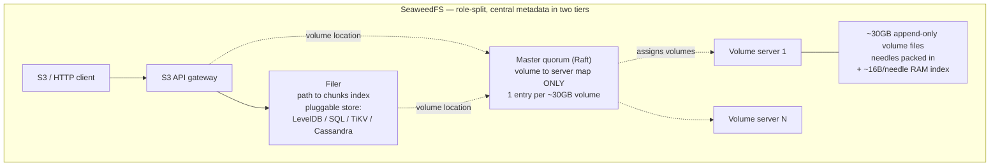
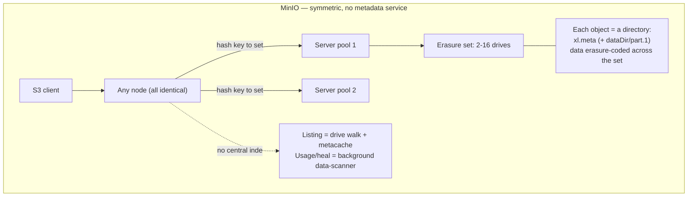
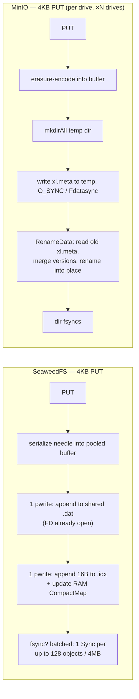
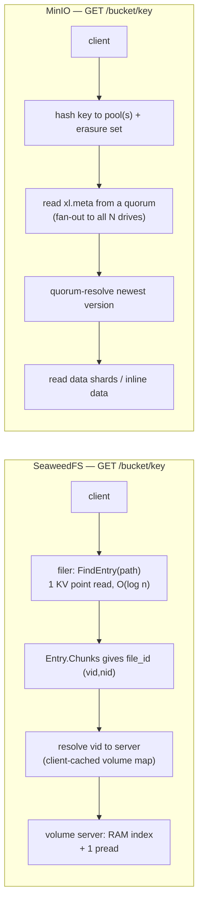
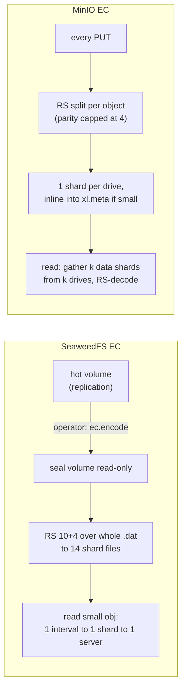

# SeaweedFS vs MinIO — Architecture Comparison for Multiple Billions of Small Objects

*Analysis date: 2026-05-20. Sources: `seaweedfs/seaweedfs` and `minio/minio` master branches (shallow-cloned), read at the code level. Every quantitative claim is cited as `path.go:line` and was cross-checked against source by the main agent (see §6, Validation).*

This report compares the two storage engines for one specific workload: **multiple billions of objects smaller than 64 KB, many smaller than 4 KB.** It is deliberately not a feature checklist — it focuses on how each system's *architecture* determines read latency, write throughput, storage overhead, metadata scalability, erasure-coding behavior, and day-2 operations at that scale.

---

## 1. The one-sentence framing

SeaweedFS is an implementation of Facebook's **Haystack** idea — pack many tiny files into a few large append-only "volume" files and keep a tiny in-RAM index — so the small-file workload is its *design center*. MinIO is a **single-binary, symmetric, S3-native object store** that makes the POSIX filesystem itself the database (one directory per object, no central metadata service) — elegant and operationally simple, but the billions-of-tiny-objects workload is its *hardest case*.

Everything below is downstream of that one difference.

---

## 2. Executive summary table

The table is the headline deliverable. Each row is justified in the deep-dive sections (§4) and verified in §6.

### 2.1 Architecture

| Dimension | SeaweedFS | MinIO |
|---|---|---|
| Origin idea | Facebook Haystack — blob packing | Cloud-native S3-compatible object store |
| Roles | Master (Raft) + Volume servers + Filer + S3 gateway — one `weed` binary, several modes | One symmetric binary; every node identical |
| Unit of storage | A **needle** appended into a shared ~30 GB volume file | One **object = one on-disk directory** (`xl.meta` + part data) |
| Central metadata service | Yes, two-tier: tiny volume map (master) + path index (filer) | **None** — `xl.meta` colocated with the object |
| Topology growth | Add a volume server → auto-joins | Add a whole new **server pool** (restart) |

### 2.2 Small-object performance (<64 KB, many <4 KB)

| Dimension | SeaweedFS | MinIO | Who wins for tiny objects |
|---|---|---|---|
| **Read latency (4 KB GET)** | 1 RAM index lookup + **1 disk seek**; volume FDs held open (0 file opens) | Read `xl.meta` from a quorum of drives (fan-out to all N); decode needs *k* data shards; OS path-resolution is not O(1) on a cold cache | **SeaweedFS** |
| **Write IOPS (4 KB PUT)** | ~2 `pwrite` on persistent FDs; fsync **batched** up to 128 req / 4 MB (`volume_write.go:299`) | Per object per drive: `mkdirAll` + temp write + `O_SYNC`/`Fdatasync` + ≥2 `rename`; **no fsync batching** | **SeaweedFS** |
| **Per-object metadata overhead** | ~42 B + key/mime in the needle; 16 B in `.idx`; 8-byte aligned, packed — **no FS block rounding** | `xl.meta` (few hundred B–1 KB+) is its own file → consumes a full FS block + inode, **×N drives** | **SeaweedFS** |
| **RAM cost per object** | ~16 B/needle resident index (`NeedleMapEntrySize`, `needle_types.go:61`) → ~16 GB per 1 B objects, sharded across volume servers | ~0 resident; cost shifts to the OS dentry/inode cache (involuntary, thrashes at scale) | **MinIO** (on RAM only) |
| **Inode / dentry pressure** | ~**0 inodes per object** (a volume is a handful of files) | **2–4 inodes per object per drive** (dir + `xl.meta` [+ dataDir + `part.1`]) | **SeaweedFS** (decisive) |
| **Deletes / space reclaim** | O(1) tombstone append; space leaks until a **full-volume vacuum rewrite** (auto, ~14 min loop) | In-place `unlink`/`rmdir` ×N drives — immediate, no fragmentation, but a metadata-IOPS storm | Trade-off |

### 2.3 Erasure coding

| Dimension | SeaweedFS | MinIO |
|---|---|---|
| Granularity | **Per-volume**, offline batch (`weed shell ec.encode`) on a *sealed* 30 GB volume | **Per-object**, inline on **every** PUT |
| Reed-Solomon default | **10 data + 4 parity** → **1.40×** fixed (`ec_encoder.go:20-22`) | parity **capped at 4** (`storage-class.go:355-368`): 12-drive set 8+4 ≈ **1.5×**, 16-drive 12+4 ≈ **1.33×**, only tiny sets reach 2× |
| Hot-data protection | Replication only; **EC volumes get no protection until `ec.encode` runs** | Always-on from the first byte |
| Read amplification, 4 KB object | EC read still touches **~1 shard on ~1 server** (`ec_locate.go`, single interval) | Decode always gathers **k data shards from k drives** |
| EC of a tiny object | Amortized across the whole volume → flat 1.4×, no per-object cost | Splits 4 KB into *k* sub-512-byte fragments; real cost is the per-object `xl.meta` ×N drives — inefficient |
| Mutability after EC | EC volume is **read-only**; deletes journaled to `.ecj` | Fully mutable, per object |
| Recovery unit | A whole shard (~3 GB) via `ec.rebuild` (manual) | One object/part via auto-heal |

### 2.4 Day-2 operations

| Operation | SeaweedFS | MinIO |
|---|---|---|
| Operating philosophy | **Explicit, operator-driven** `weed shell` commands, dry-run by default | **Continuous, automatic** background machinery |
| Cost scaling axis | **Bytes / volume count** | **Object count** |
| Rebalance | `volume.balance` — manual; moves ~30 GB volume files | `mc admin rebalance` — re-reads/re-encodes **every object** |
| Healing | `volume.fix.replication`, `ec.rebuild` — **manual trigger**, volume/shard granular | data-scanner + auto disk-heal + MRF — **automatic**, per-object |
| Decommission | `volumeServer.evacuate` one node — volume-granular | `mc admin decommission` a whole **pool** — re-PUTs every object, self-verifying |
| GC / compaction | **Auto** vacuum (~14 min master loop), full-volume rewrite | None needed (delete-in-place); scanner does usage accounting |
| Bit-rot scrub | `volume.scrub` / `ec.scrub` — manual, detect-only | data-scanner deep-scan — automatic, detect+heal |
| At billions of small objects | Costs bounded by **bytes & disk count** → predictable; but durability waits on a human | Costs scale with **object count** → heal/rebalance/scan become long, opaque jobs |

**One-line takeaway:** for *this* workload SeaweedFS's architecture is the better-matched design on latency, IOPS, storage density, inode pressure, and day-2 cost scaling; MinIO wins on operational automation, always-on durability, S3 fidelity, and zero resident-index RAM. The deciding question is whether your team would rather *operate a metadata tier* (SeaweedFS) or *pay a permanent O(n) listing/scan tax* (MinIO).

---

## 3. Architecture at a glance

The SeaweedFS diagram has a service the MinIO diagram does not: a metadata tier. That box is simultaneously SeaweedFS's biggest scaling advantage (it makes lookups and listings indexed operations) and its biggest operational liability (it is another distributed system to run). MinIO's diagram is simpler by one whole subsystem — and that simplicity is exactly what costs it at listing and scan time. The rest of the report is, in effect, an accounting of that trade.

---

## 4. Deep comparison

### 4.1 Storage engine & on-disk layout — the small-object core

This is where the billions-of-tiny-objects question is won or lost, so it comes first.

#### How one 4 KB object lands on disk

**SeaweedFS — a needle appended into a shared volume.** A volume is a tiny number of large files: `<id>.dat` (data, capped at 32 GB with the default 4-byte offset, `types/offset_4bytes.go:14`) plus `<id>.idx` (index). A 4 KB object becomes a **needle** — a variable-length record *appended* into the shared `.dat`. Its header is 16 bytes (`NeedleHeaderSize = Cookie 4 + Id 8 + Size 4`, `needle_types.go:59`); with the data, a CRC, a v3 timestamp, and 8-byte padding, fixed overhead is **~42 bytes plus the object key and mime string** (`needle/README.md`, `needle_write_v3.go`). Crucially the needle is *not its own file* — so it costs **no inode and no filesystem block rounding**.

Every needle also gets one entry in the volume's in-memory `CompactMap` and one 16-byte record in `.idx` (`NeedleMapEntrySize = NeedleIdSize 8 + OffsetSize 4 + SizeSize 4 = 16`, `needle_types.go:61`). That is the famous Haystack number: **~16 bytes of RAM per object**.

**MinIO — one directory per object.** Each object version is its own directory tree on every drive: `bucket/object/xl.meta` plus, if not inlined, a `<dataDir-uuid>/part.1` (`xl-storage-format-v2.go:90-102`). `xl.meta` is a msgpack structure carrying the full version list, the Reed-Solomon descriptor, part tables, and the user/system metadata maps. For objects whose **per-shard** size is ≤ 128 KiB (≤ 16 KiB on a *versioned* bucket — `ShouldInline`, `storage-class.go:278-294`), the erasure shards are written *inside* `xl.meta` instead of a separate `part.1`, so a small inlined object is just `bucket/object/xl.meta` on each drive — **but still ≥1 directory + 1 file = ≥2 inodes per object per drive**, and a sub-KB `xl.meta` still consumes a full 4 KB filesystem block.

#### Why this matters at billions of objects

| Cost | SeaweedFS | MinIO |
|---|---|---|
| Syscalls per 4 KB write | ~2 `pwrite` (data + idx) on persistent FDs; 0 `open`, 0 `mkdir` | ~8–15 per drive: `open`/`stat`/`mkdirAll`/`O_SYNC` write/`rename` — **×N drives** |
| fsync amortization | Batched: one `Sync()` per ≤128 objects or 4 MB (`volume_write.go:299`) | One `O_SYNC`/`Fdatasync` **per object per drive** — no batching |
| Disk seeks per 4 KB read | **1** (index already in RAM; volume FD open) | ≥1 `open`+`read` per drive across a quorum, plus OS path-walk on a cold cache |
| Inodes per object | ~0 (a volume = a handful of files) | 2–4 **per drive** → billions of dirs, tens of billions of inodes per cluster |
| Resident index RAM | ~16 B/object (`CompactMap`) — ~16 GB per 1 B objects, sharded across volume servers | ~0 — but the OS dentry cache cannot cover a billion-object namespace and thrashes |

SeaweedFS's append-only volume is a near-perfect match for the workload: writes are sequential, reads are a single seek, and the per-object tax is ~16 bytes of RAM and ~42 bytes on disk. Its two real costs are (a) the resident index growing linearly with object count — mitigated, at a latency price, by the LevelDB-backed needle map (`needle_map.go:18-21`) — and (b) the default write path being page-cache-durable only unless the caller opts into the (batched) fsync path.

MinIO's one-directory-per-object model is what makes it operationally simple and crash-safe (temp-file + atomic `rename`), but it is the structural reason billions of tiny objects are hard: inode/dentry exhaustion, filesystem block rounding on sub-KB `xl.meta`, and a per-object fsync that is multiplied by every drive in the erasure set. Worse, **versioning halves the inline threshold to 16 KiB** (`storage-class.go:290-292`), so on the versioned buckets most production deployments use, many 16–128 KB objects that *would* inline instead spill to a separate `part.1` — restoring the 4-inode cost and a second file open on every read.

> **Honest counterpoint.** SeaweedFS pays for this density with a *deletes-leak-space* model: a delete is a cheap tombstone append, and dead bytes are reclaimed only by a full-volume vacuum rewrite (§4.4). MinIO never accumulates dead space — a delete frees it immediately. For a delete-heavy small-object workload, that vacuum I/O is real and must be budgeted.

---

### 4.2 Metadata architecture & scalability — the dimension you flagged as most important

#### Where "name → data location" lives

**SeaweedFS splits metadata into two tiers.** The **master** holds *only* the volume→server map: one entry per ~30 GB volume (`topology/volume_layout.go:128`, `vid2location`), so a 30 TB / 1-billion-tiny-object cluster is ~1,000 map entries — **object count is completely invisible to the master**. The only Raft-replicated state is a monotonic `MaxVolumeId` counter (`cluster_commands.go`); the full map is rebuilt from volume-server heartbeats.

The per-object index lives in the **filer**, a separate stateless server backed by a *pluggable* store (`FilerStore` interface, `filer/filerstore.go`; 22 backends registered — LevelDB default, plus MySQL/Postgres/Redis/Cassandra/TiKV/FoundationDB/MongoDB/HBase…). The filer maps full path → `Entry{Attr, Chunks[]}` — roughly **200–400 bytes per object**, stored once. LevelDB keys are `dir\x00name` (`leveldb/leveldb_store.go`), so a directory's children are physically contiguous in the LSM.

**MinIO has no metadata service at all.** Object location is *computed*: hash the key → pool → erasure set → the object is a directory on that set. Per-object metadata is the `xl.meta` file itself. There is no name→location index to query — which means *listing* must be *reconstructed* by walking drives.

#### Single-object lookup and listing

- **Point lookup.** SeaweedFS ≈ **1 metadata IO** (filer KV, O(log n) with a bloom filter) **+ 1 data IO** (volume `pread`); the volume map is client-cached and broadcast, so resolving the volume is normally free. MinIO ≈ **N parallel `xl.meta` reads** (fan-out to the set, quorum-resolved) and **nothing is cached at the metadata layer** — every cold `HEAD` re-reads `xl.meta` from disk.
- **Listing.** This is the decisive gap. SeaweedFS lists a prefix as **one ordered range scan** of the filer KV — **O(entries returned)**, against a sorted index. MinIO must **walk the filesystem**: `ListObjectsV2` fans `WalkDir` across every set, **opens and reads `xl.meta` for every object encountered** (`metacache-walk.go`), merges and sorts the stream, and persists it as an *ephemeral* **metacache** (5,000-entry blocks, dropped after 3 minutes of client silence, `metacache.go`). The first cold listing of a million-key prefix is **millions of small-file `open`/`read` syscalls** — O(objects traversed), competing with live traffic for IOPS.

#### Scaling to billions — where each hits a wall

| | SeaweedFS | MinIO |
|---|---|---|
| Master / placement | Never the wall — `O(volumes)`, object count invisible | N/A — no central placement state |
| Per-server index | Volume-server `CompactMap` ~16 B/needle → tens of GB/server at tens of billions; fall back to LevelDB needle map | Cost is in the OS dentry cache — involuntary, thrashes |
| **The real wall** | **The filer store you choose.** Default single **LevelDB** ≈ hundreds of millions of entries before compaction thrash; `leveldb3` shards per-bucket; **TiKV / FoundationDB / Cassandra / sharded SQL** scale horizontally to effectively unbounded | **No metadata-DB wall** — but a **permanent O(n) tax**: cold `ListObjects`, the `data-scanner` namespace crawl, usage accounting, and lifecycle expiry all scale with object count and *worsen* as the cluster fills (`dataUsageUpdateDirCycles=16`, `data-scanner.go:51`) |

This is the crux of the metadata-scalability question. **MinIO cannot overflow a metadata service that does not exist** — a genuine strength — but it pays for that absence forever, every time it must list, count, or scan. **SeaweedFS turns list/scan into indexed O(log n + page) operations** — but only if you abandon the default single LevelDB filer and run a real distributed store, which re-introduces exactly the "metadata tier to operate" cost MinIO avoids.

#### HA & sharding

SeaweedFS master HA is Raft; filer *servers* are stateless and trivially scaled (they sync via a meta-log and can bootstrap from a peer). Filer *data* HA and sharding are **delegated to the chosen store** — as good as that store, and no better. MinIO gets metadata HA for free: `xl.meta` is protected by the same erasure coding as the data, and "sharding" is just the object hash across sets and pools. It is a genuinely elegant elimination of a whole problem class — paid for with the O(n) listing/scan tax above.

> **Verdict for billions of objects (metadata).** SeaweedFS's two-tier design scales better — decisively on listing, clearly on point-lookup IO — *provided* the filer runs on a distributed store (TiKV/FoundationDB/Cassandra). The default LevelDB filer is the trap that silently caps you in the hundreds of millions. MinIO's no-DB design has no scaling cliff but a permanent, unbounded listing/scan cost; it is the right bet only if your workload is mostly point GET/PUT with rare large listings.

---

### 4.3 Erasure coding

The two systems make opposite bets: SeaweedFS treats EC as a **storage-tiering operation on cold, sealed volumes**; MinIO treats it as **the durability primitive for every object**.

#### SeaweedFS — offline, per-volume

A normal write is a replicated needle append — **no EC, no Reed-Solomon math on the write path**. EC happens later, as an operator-scheduled batch job. `weed shell ec.encode` (`command_ec_encode.go`):

1. selects volumes that are quiet and ~95 %+ full;
2. marks every replica **read-only** — the volume is now immutable;
3. RS-encodes the whole ~30 GB `.dat` into **10 data + 4 parity = 14 shard files** (`ec_encoder.go:20-22`), striping in 1 GB then 1 MB blocks;
4. distributes the 14 shards across servers, verifies the full set, then deletes the original replicated volumes.

Overhead is a flat **1.40×**, *independent of object size* — a 4 KB needle inherits the volume's ratio with zero per-object cost. The read path stays cheap: `LocateData` (`ec_locate.go:16`) maps a small object's byte range to a **single interval in a single shard**, so a healthy EC read touches **~1 shard on ~1 server** — the same latency profile as a non-EC read. Reconstruction (gather ≥10 shards, RS-decode) happens *only* on failure.

#### MinIO — inline, per-object

Every PUT is Reed-Solomon split across the drives of its erasure set. Parity is **not** N/2 as the docs imply — `DefaultParityBlocks` **caps parity at 4** for any set of ≥8 drives (`storage-class.go:355-368`): a 12-drive set is 8+4 (**1.5×**), a 16-drive set is 12+4 (**1.33×**); only tiny 2–4-drive sets reach 2×. Each drive gets one shard; for small objects that shard is written *inline into that drive's `xl.meta`*. A read must gather **k data shards from k drives** and RS-decode them — every read, regardless of object size.

#### EC of a tiny object — the honest assessment

For a 4 KB object, SeaweedFS pays a flat 1.4× and **nothing else** — the needle shares the volume's shard files and its ~16-byte index entry. A volume holding billions of 4 KB needles is still 14 shard files total.

MinIO splitting a 4 KB object into *k* data fragments produces shards far smaller than a disk sector; the Reed-Solomon math protects almost nothing meaningful, while the real cost is the per-object `xl.meta` written to **all N drives** (the *version metadata* is N-way replicated; the *data shard* differs per drive — see §6). MinIO's own engineers recognized this — inlining (`ShouldInline`) is the explicit mitigation — but it cannot remove the **k-way read fan-out** or the **one-file-per-object-per-drive** inode cost.

| | SeaweedFS | MinIO |
|---|---|---|
| When EC applies | Cold volumes, after `ec.encode` | Every object, at write time |
| Hot-data durability | Replication only until encoded | Always-on |
| Overhead | Flat 1.40× | 1.33×–1.5× typical (data) + per-object `xl.meta` ×N |
| 4 KB read under EC | ~1 shard, 1 server | k drive reads, always |
| Recovery granularity | Whole shard (~3 GB), manual `ec.rebuild` | Per object, automatic heal |
| Mutability | EC volume read-only; deletes journaled | Fully mutable |

> **Verdict (EC).** For sub-4 KB objects at scale, SeaweedFS's per-volume offline EC is structurally the right model — flat overhead, O(1)-ish reads, 14 files total. Its cost is conceptual and operational: hot data is unprotected by EC until someone (or a policy) runs `ec.encode`, and EC volumes become read-only. MinIO's per-object inline EC buys *immediate, uniform, automatic* durability for every object — at the price of k-way read amplification and a metadata/inode tax on every tiny object that inlining softens but never removes.

---

### 4.4 Day-2 operations

SeaweedFS day-2 is an **explicit operator toolbox** — `weed shell` commands, dry-run by default, mutating only with `-apply`. MinIO day-2 is **continuous automatic machinery** — a cluster-wide `data-scanner` loop drives healing, bit-rot verification, lifecycle expiry, and usage accounting with no operator action. The unit of work is, respectively, the **~30 GB volume** and the **individual object**.

```mermaid
flowchart TB
    subgraph SWO["SeaweedFS — heal after disk failure"]
        H1["disk fails"] --> H2["master heartbeat:<br/>volumes under-replicated"]
        H2 --> H3["operator/monitoring notices"]
        H3 --> H4["weed shell: volume.fix.replication -apply"]
        H4 --> H5["stream 1 replica copy per volume<br/>(~30GB sequential, bytes-bound)"]
    end
    subgraph MNO["MinIO — heal after disk failure"]
        G1["disk fails / replaced"] --> G2["monitorLocalDisksAndHeal<br/>auto-detects"]
        G2 --> G3["reformat drive"]
        G3 --> G4["healErasureSet: list every object"]
        G4 --> G5["per object: HealObject reconstructs<br/>(object-count-bound)"]
    end
```

The deciding property is **cost-scaling axis**. SeaweedFS day-2 work scales with **bytes and volume count**: rebalancing, healing, decommission, and scrub all move a few hundred large sequential volume files. Healing a failed 16 TB disk ≈ a few hundred ~30 GB volume copies — bounded and predictable. MinIO day-2 work scales with **object count**: `rebalance` re-reads/re-encodes every object, `decommission` re-PUTs every version, disk-heal reconstructs every object on the replaced drive. At billions of tiny objects, healing that same 16 TB disk is *hundreds of millions* of per-object `xl.meta`+`part` operations — correct, but a long, IOPS-hungry, partially opaque job.

| Operation | SeaweedFS | MinIO |
|---|---|---|
| Rebalance | `volume.balance` — manual, dry-run; per-volume; **bytes-bound** | `mc admin rebalance` — manual start then auto; per-object; **object-count-bound** |
| Healing | `volume.fix.replication`, `ec.rebuild` — **manual trigger**; per-volume/shard | scanner + auto disk-heal + MRF — **automatic**; per-object |
| Decommission | `volumeServer.evacuate` — one node, volume-granular | `mc admin decommission` — whole pool, per-object, self-verifying |
| GC / compaction | **Auto** vacuum, ~14 min master loop (`topology_event_handling.go:43`); full-volume rewrite when garbage > 30 % | None — delete-in-place; scanner only does usage accounting |
| Bit-rot scrub | `volume.scrub` / `ec.scrub` — manual, **detect-only** (repair = separate `ec.rebuild`) | data-scanner deep-scan — automatic, detect **and** heal |
| Upgrades | Rolling; master/volume/filer staged independently | Rolling per-node; fixed pool geometry |

The trade is real and symmetric. SeaweedFS is **cheaper and more predictable at scale but waits on a human** — a failed disk leaves volumes under-replicated until someone runs `volume.fix.replication`, and bit-rot is invisible until someone runs `ec.scrub`. That is safe with a disciplined SRE team and solid monitoring; it is a latent durability hazard for a thin or alert-fatigued team. MinIO is **hands-off and hard to footgun** — durability never depends on remembering a command — but every automatic operation scales on the worst possible axis for this workload, and the work is throttled and opaque (an operator has limited control over *when* a given object is healed or deep-scanned).

> **Verdict (day-2).** At multiple billions of small objects, SeaweedFS's volume-granular model is structurally the better fit — day-2 cost is bounded by bytes and disks, not object count — *if* the operating team treats its manual heal/scrub steps as mandatory scheduled jobs. MinIO is the lower-labor choice and the safer one for moderate object counts; pushed to billions of tiny objects its automatic operations stay correct but become slow and IOPS-hungry.

---

## 5. Validation of the summary claims (main-agent verification)

The four deep-dive sections were produced by independent subagents. Before drawing a conclusion, the main agent re-checked every load-bearing claim in the §2 summary directly against source code. Results:

| # | Claim in the summary | Verification | Result |
|---|---|---|---|
| 1 | SeaweedFS EC default = 10 data + 4 parity → 1.40× | `ec_encoder.go:20-22`: `DataShardsCount = 10`, `ParityShardsCount = 4`, `TotalShardsCount = 14` | ✅ Confirmed |
| 2 | SeaweedFS index ≈ 16 bytes/object | `needle_types.go:61`: `NeedleMapEntrySize = NeedleIdSize(8) + OffsetSize(4) + SizeSize(4)`; `NeedleValue` struct = `Key+Offset+Size` | ✅ Confirmed (16 B with the default 4-byte offset; 17 B with the 5-byte build) |
| 3 | SeaweedFS batches fsync (≤128 req / 4 MB) | `volume_write.go:299`: `currentBytesToWrite >= 4*1024*1024 || len(currentRequests) >= 128 || len(asyncRequestsChan)==0` | ✅ Confirmed |
| 4 | MinIO parity is **capped at 4**, not N/2 | `storage-class.go:355-368` `DefaultParityBlocks`: drives ≥8 → returns `4` | ✅ Confirmed — **corrected the common "≈2× overhead" assumption**: 16-drive set = 12+4 = 1.33×, 12-drive = 8+4 = 1.5× |
| 5 | MinIO inline threshold = 128 KiB, halved-to-1/8 (16 KiB) on versioned buckets | `storage-class.go:284`: `inlineBlock = 128 * KiB`; `:291`: versioned → `shardSize <= inlineBlock/8` | ✅ Confirmed (note: the test is on **shard** size, not object size) |
| 6 | MinIO scanner visits all folders only every 16 cycles | `data-scanner.go:51`: `dataUsageUpdateDirCycles = 16`; `:59`: `healObjectSelectProb = 1024` | ✅ Confirmed |
| 7 | SeaweedFS vacuum runs automatically on a ~14-min loop | `topology_event_handling.go:43`: `time.Sleep(14*time.Minute + jitter)` | ✅ Confirmed |
| 8 | SeaweedFS EC read of a small object touches ~1 shard | `ec_locate.go:16` `LocateData` returns intervals block-by-block; an object smaller than the block size yields one interval → one shard | ✅ Confirmed |
| 9 | "MinIO replicates `xl.meta` N×" (as one subagent phrased it) | `erasure-object.go:166-186`: each drive has its own `metaArr[index]`; the object **data** is erasure-coded into a distinct per-drive shard in `Data`, while the **version metadata** is identical on all N drives | ⚠️ **Corrected** — only the *metadata portion* is N-way replicated; the *data* is genuinely erasure-coded. The report text in §4.3 uses the corrected wording. |

**Two cautions carried into the conclusion:**
- *Indicative numbers, not benchmarks.* Third-party figures cited during research (e.g. a single LevelDB filer sustaining ~2,000 inserts/s, "works to a few billion objects") are community reports, not measured here. They are used only as order-of-magnitude signposts; the architectural claims above stand on code.
- *MinIO docs vs. code.* `docs/erasure/README.md` says MinIO shards "across N/2 data and N/2 parity." The **code** (`DefaultParityBlocks`) caps parity at 4. The code is authoritative; the doc describes only small-set behavior. This is why MinIO's real-world storage overhead for wide sets is *better* (1.33×) than the folklore 2×.

Net: the summary table survives validation. The only substantive edit was claim #9's wording; the EC-overhead numbers were made *more favorable* to MinIO after checking the parity cap.

---

## 6. Conclusion & recommendation

You asked specifically about **multiple billions of objects under 64 KB, many under 4 KB**, weighted across read latency/IOPS, storage overhead/cost, write throughput, operational simplicity, and **metadata-design scalability**. Taking each in turn, against the validated evidence:

| Your priority | Winner | Why (validated) |
|---|---|---|
| **Read latency / IOPS** | **SeaweedFS** | RAM index → 1 disk seek, 0 file opens; EC read still ~1 shard/1 server. MinIO fans every read across a drive quorum + k-shard decode, and cold-cache path resolution is not O(1). |
| **Storage overhead / cost** | **SeaweedFS** | ~42 B + key on disk, 8-byte packed, no FS block rounding; flat 1.4× EC. MinIO: sub-KB `xl.meta` consumes a full FS block + inode ×N drives; EC data overhead is competitive (1.33–1.5×) but the per-object metadata/inode tax dominates for tiny objects. |
| **Write throughput / ingest** | **SeaweedFS** | ~2 `pwrite` on open FDs, fsync batched ≤128/4 MB. MinIO pays `mkdirAll`+temp+`O_SYNC`+`rename` per object per drive, unbatched. |
| **Metadata-design scalability** | **SeaweedFS — conditionally** | Master is object-count-invisible; the filer makes lookup/listing indexed *if* run on TiKV/FoundationDB/Cassandra. The **default LevelDB filer is a hidden ceiling** (~hundreds of millions). MinIO has no metadata DB to overflow, but pays a permanent O(n) listing/scan tax that worsens as the cluster fills. |
| **Operational simplicity** | **MinIO** | One symmetric binary, automatic heal/scrub/scan, crash-atomic writes, self-verifying decommission. SeaweedFS needs an operating team that runs `volume.fix.replication`/`ec.scrub` as scheduled jobs and chooses+operates a distributed filer store. |

### The recommendation

**For a workload that is genuinely "multiple billions of objects, mostly <64 KB, many <4 KB," SeaweedFS is the architecturally correct primary choice — it was designed for exactly this — provided you commit to two things:** (1) run the filer on a horizontally-scalable store (TiKV / FoundationDB / Cassandra / sharded SQL), **never** the default single LevelDB; and (2) operate it as a real distributed system — monitor under-replication, schedule `ec.encode` for cold data, schedule `ec.scrub` + `ec.rebuild`. Do that, and you get single-seek reads, batched-fsync ingest, ~0 inodes per object, flat 1.4× EC, and day-2 costs bounded by bytes rather than object count. Skip either commitment and you inherit SeaweedFS's two real failure modes: a silently-capped LevelDB filer, and data that stays under-replicated because no human ran the heal command.

**Choose MinIO instead when** the object count is large but not extreme (hundreds of millions, not tens of billions), when S3 API fidelity / versioning / object-lock / IAM matter as much as raw density, when you want always-on erasure durability with zero "encode the cold tier" step, or when the operating team is small and hands-off operation outweighs peak efficiency. MinIO will *work* at billions of tiny objects — it is correct and durable — but you will be fighting inode pressure, per-object fsync, k-way read fan-out, slow cold `ListObjects`, and a `data-scanner` that lags; you would be operating MinIO against the grain of its design.

**The honest decision rule:** the choice is *which cost you'd rather own*. SeaweedFS asks you to **operate a metadata tier and run scheduled maintenance** — and rewards you with a storage engine that scales on the right axes for tiny objects. MinIO asks you to **accept a permanent O(n) tax on listing/scanning and per-object day-2 work** — and rewards you with a system that has one fewer subsystem to run and never forgets to heal. For *this* workload at *this* scale, the SeaweedFS trade is the better one — but only for a team willing to operate it properly. If that operational commitment is not realistic, a correctly-sized MinIO (or staying below the billions threshold per cluster) is the safer call than a misoperated SeaweedFS.

---

*Report generated by the repo-analyzer workflow: 4 parallel comparative subagents (storage engine, metadata, erasure coding, day-2 ops), main-agent cross-validation against source (§5). Repos analyzed: `seaweedfs/seaweedfs` ~355 K Go LOC, `minio/minio` ~205 K Go LOC, master branches as of 2026-05-20.*
