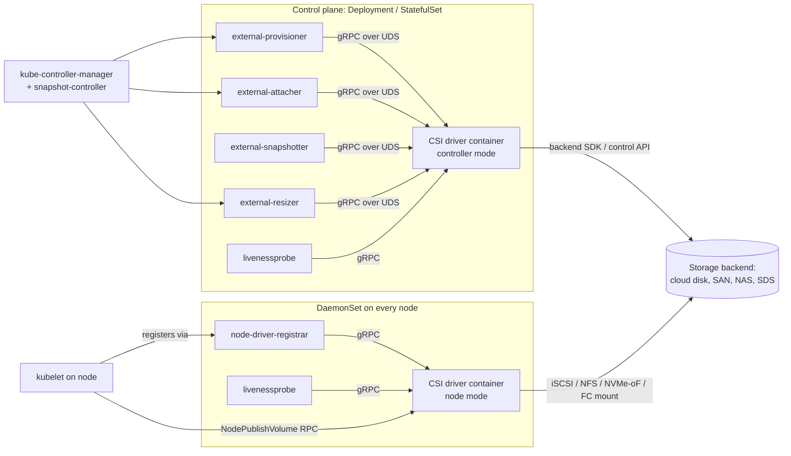

# Container Storage Interface (CSI)

## Summary

The Container Storage Interface (CSI) is a gRPC-based specification that lets a storage vendor write **one** driver and have it work across every container orchestrator (CO) that implements the spec — Kubernetes, Nomad, Cloud Foundry, and historically Mesos. It replaces three older approaches: Kubernetes' in-tree volume plugins (compiled into kubelet, versioned with Kubernetes itself), FlexVolume (an out-of-tree but exec-based, host-installed predecessor), and Docker's REST-over-HTTP Volume Plugin API (Docker-only, no cluster-level concepts). CSI's defining choices are that drivers ship as **containers** the CO deploys, that the contract is **gRPC over a UNIX domain socket** shared between the driver and a set of CO-provided "sidecar" controllers, and that the surface is split into **Identity / Controller / Node** services with capability advertisement so a driver can implement only what makes sense for its backend. The latest spec is **v1.12.0 (October 17, 2024)**; CSI has been GA in Kubernetes since v1.13 (January 2019), and in-tree → CSI migration for the major cloud providers reached GA in Kubernetes v1.25 (September 2022). Pick CSI as the integration point if you are exposing block, file, or hybrid storage to a Kubernetes-like environment in 2026; for object/bucket workloads use the sibling COSI spec instead.

## Comparison: CSI vs. its predecessors and siblings

| Dimension | **CSI** | **In-tree volume plugin (K8s)** | **FlexVolume** | **Docker Volume Plugin v2** | **COSI** |
|---|---|---|---|---|---|
| Type / category | CO-agnostic storage plugin spec | Kubernetes-internal volume driver | K8s out-of-tree exec plugin | Docker Engine plugin API | CO-agnostic object/bucket plugin spec |
| Core architecture | gRPC over UNIX socket; driver runs as pods; CO-side sidecars translate K8s objects to RPCs | Driver code linked into `kubelet` and `kube-controller-manager` | Host-installed binary invoked via fork/exec with JSON args | OCI image registered as a managed plugin; REST/JSON over UNIX socket | gRPC over UNIX socket; bucket-oriented, not volume-oriented |
| Primary interfaces | Identity, Controller, Node gRPC services (proto3) | Internal Go interfaces (`VolumePlugin`, `Provisioner`, `Attacher`, `Mounter`) | `init`, `mount`, `unmount`, `attach`, `detach` shell verbs returning JSON | `/VolumeDriver.Create`, `Mount`, `Unmount`, `Get`, `List`, `Capabilities` REST | `Provisioner`, `Identity` gRPC + Bucket/BucketAccess CRDs |
| Best fit | Any block/file storage exposed to a clustered CO | (legacy) Built-in support for first-party cloud and host volumes | (legacy) Quick K8s drivers when CSI didn't exist | Single-node Docker Engine / classic Swarm volumes | S3/object/bucket provisioning into a K8s namespace |
| Advantages | CO-agnostic; driver ships out-of-band of CO; rich lifecycle (snapshot, clone, expand, group snapshot); containerized — no host install | Zero deployment; ships with cluster | Out-of-tree; simple shell contract | Standard Docker tooling | Brings object storage into the same declarative model as PVs/PVCs |
| Disadvantages | Operationally heavy (≥5 sidecars + driver pods); spec evolves frequently; debugging spans multiple containers | Bug in driver can crash kubelet; version locked to K8s release; SIG-Storage stopped accepting new ones | Requires root on every node to install driver and its OS deps; no dynamic provisioning until v1.0; deprecated | No cluster concept (no attach/publish split); not used by Kubernetes, AKS, EKS, GKE; effectively legacy | Still alpha-ish in most distros; small driver ecosystem vs. CSI |
| License / acquisition | Apache 2.0 spec; drivers themselves vary (Apache, GPL, proprietary) | Apache 2.0 (part of Kubernetes) | Apache 2.0 (part of Kubernetes) | Apache 2.0 (Docker plugin API) | Apache 2.0 spec |
| Cost | Spec is free; cost is the storage backend + ops overhead of running sidecars (one controller Deployment + one DaemonSet per driver) | Free; cost is upgrade coupling to K8s | Free; cost is per-node binary distribution | Free; cost is being on an unsupported integration path | Spec free; backend object-storage cost dominates |
| Status (May 2026) | Spec **v1.12.0** (Oct 2024); de facto standard | Removed for the major cloud providers; replaced by CSI migration shims | **Deprecated**; maintenance-only | Effectively legacy for orchestrated workloads | Spec v1alpha published 2022; adoption growing but narrow |

Cost and status figures above are public/list information as of May 2026 and will drift; verify against the linked sources before committing to a design.

## In-depth implementation report

### 1. Architecture deep-dive

A CSI driver is a gRPC server. The CO is a gRPC client. They communicate over a UNIX domain socket that lives in an `emptyDir` volume shared between the driver container and a set of CO-provided "sidecar" containers in the same pod. The spec defines three services; a driver advertises which it implements via `Identity.GetPluginCapabilities`:

- **Identity** — `GetPluginInfo`, `GetPluginCapabilities`, `Probe`. Required everywhere.
- **Controller** — cluster-wide volume operations: `CreateVolume`, `DeleteVolume`, `ControllerPublishVolume` / `ControllerUnpublishVolume` (cloud "attach"), `ListVolumes`, `CreateSnapshot`, `DeleteSnapshot`, `ControllerExpandVolume`, `ControllerModifyVolume` (GA in v1.12), and group-snapshot RPCs.
- **Node** — per-node operations: `NodeStageVolume` (one-time per node, e.g. `mkfs` + bind-mount to a staging path), `NodePublishVolume` (bind into the pod's target path), `NodeUnpublishVolume`, `NodeUnstageVolume`, `NodeGetVolumeStats`, `NodeExpandVolume`, `NodeGetInfo` (returns the topology key the controller uses to schedule).

A typical Kubernetes deployment of a CSI driver:

The split matters: **`Controller*` RPCs run once per volume from a cluster-wide controller pod** (so they need backend credentials and outbound network), while **`Node*` RPCs run on the node where the workload lands** (so they need mount privileges, `/dev`, `/sys/block`, host network for iSCSI/NVMe-oF, etc.). This is also why CSI drivers ship as two distinct workload kinds in Kubernetes: a Deployment/StatefulSet for the controller plugin and a DaemonSet for the node plugin.

Sidecars (maintained by the Kubernetes-CSI project, reusable across drivers):

- **external-provisioner** — watches `PersistentVolumeClaim`, calls `CreateVolume` / `DeleteVolume`.
- **external-attacher** — watches `VolumeAttachment`, calls `ControllerPublishVolume` / `ControllerUnpublishVolume`.
- **external-snapshotter** + **snapshot-controller** — watches `VolumeSnapshot` / `VolumeSnapshotContent`, calls `CreateSnapshot` / `DeleteSnapshot`; the controller is a single cluster-wide deployment, the sidecar is per-driver.
- **external-resizer** — watches PVC size changes, calls `ControllerExpandVolume`.
- **node-driver-registrar** — registers the driver socket with kubelet's plugin-registration directory; supplies the driver's reported node ID to a node label.
- **livenessprobe** — exposes a `Probe` HTTP endpoint that wraps the gRPC `Identity.Probe`.

Nomad takes a deliberately simpler approach to the same spec: it runs the driver itself and folds the sidecar work into the Nomad client/server, so there is no separate provisioner/attacher container to operate. Drivers that follow the spec strictly run on both COs with the same image.

### 2. Key design patterns and trade-offs

- **gRPC + UNIX socket, not REST/HTTP.** Chosen over FlexVolume's exec model and Docker's REST/JSON because gRPC gives a strongly-typed contract (`.proto`), bi-directional streaming for long ops, and a single long-lived connection — at the cost of needing protoc tooling and a Go/Rust/Python gRPC server. Sockets, not TCP, because the driver and sidecar always share a pod's filesystem and TCP would add an unnecessary auth/TLS problem.
- **Capability advertisement instead of mandatory RPCs.** A driver returns the set of features it supports (`CREATE_DELETE_VOLUME`, `PUBLISH_UNPUBLISH_VOLUME`, `EXPAND_VOLUME`, `CLONE_VOLUME`, `LIST_VOLUMES_PUBLISHED_NODES`, etc.). The CO checks these before invoking optional RPCs. The alternative — making everything mandatory — would have excluded local-disk or read-only-archive drivers; the cost is that CO code is full of `if hasCap(...)` branches and feature parity across drivers is uneven.
- **Two-phase node mount (`NodeStageVolume` → `NodePublishVolume`).** Stage runs **once per node per volume** and does the expensive setup (login to iSCSI target, format filesystem, mount to a global staging path). Publish runs **once per workload** and is just a bind-mount into the pod's target dir. This lets `ReadWriteMany` and multi-pod sharing work without repeating the expensive step. FlexVolume conflated the two and paid the cost on every pod restart.
- **Two-phase volume attach (`ControllerPublishVolume` → `NodeStageVolume`).** Cloud disks need a control-plane "attach this EBS volume to that EC2 instance" step before the node can see the block device. CSI explicitly splits the cloud-attach (Controller, cluster-wide) from the OS-mount (Node, per-node). Backends that don't need a cloud attach (NFS, Ceph) simply don't advertise `PUBLISH_UNPUBLISH_VOLUME` and the CO skips that phase.
- **Out-of-band sidecars instead of CO-internal handlers.** The Kubernetes-CSI project owns the sidecars so that driver authors never reimplement watch-loops, leader election, or retry/backoff. The trade-off is operational: every driver pod has 4-6 containers, and a sidecar bug can break every driver in your cluster simultaneously.
- **Topology as an opaque map, not a fixed schema.** `NodeGetInfo` returns `{topology.kubernetes.io/zone: "us-east-1a", csi.example.com/rack: "r17"}` — arbitrary key/value pairs. The CO then constrains volume provisioning to nodes that match. This was deliberately generic so non-cloud backends (a rack-local SSD pool, a NUMA-affine PMEM tier) could express their own topology dimensions without spec changes.
- **In-tree migration via shims.** Rather than break every existing `kubernetes.io/aws-ebs` `StorageClass`, CSI Migration (GA in K8s v1.25) intercepts in-tree volume operations in `kube-controller-manager` and `kubelet` and reroutes them to the corresponding CSI driver. Users see no API change; operators must install the matching CSI driver and ensure the feature gate is on. This is non-trivial — there are subtle compatibility cases around `volumeAttachment` naming and stale in-tree objects — but it avoided a hard cutover.

### 3. Correctness model

CSI is a control protocol; durability, consistency, and failure semantics live in the **backend** the driver talks to. The spec contributes the following correctness guarantees:

- **Idempotency is mandatory.** Every RPC must be safely retriable with the same arguments. `CreateVolume` with the same `name` must return the same volume; `DeleteVolume` of a non-existent volume must return success. The CO will retry on any non-final error.
- **Concurrency rules per volume.** The spec requires the CO to serialize controller RPCs against the same volume ID; drivers must handle the case where they receive concurrent RPCs (e.g. retry storms) by locking or by relying on backend idempotency.
- **Error model.** gRPC status codes are normative: `ALREADY_EXISTS` for name collisions with different parameters, `OUT_OF_RANGE` for capacity mismatches, `FAILED_PRECONDITION` for missing prerequisites, `ABORTED` to ask the CO to retry. Misusing codes is a real source of CO ↔ driver bugs.
- **Volume content state.** Tracked only weakly: a driver can advertise `VOLUME_CONDITION` so `NodeGetVolumeStats` returns "abnormal" with a message, which the CO surfaces. There is no notion of multi-volume crash consistency in the base spec — **VolumeGroupSnapshot (GA in spec v1.11.0, Nov 2023; beta in Kubernetes 1.32, Dec 2024)** added group-level point-in-time semantics so a multi-PVC application (DB + WAL) can be snapshotted atomically.
- **Snapshot-to-volume guarantees.** Snapshots are read-only sources; `CreateVolume` with `volume_content_source: snapshot` must produce a volume whose content is identical to the snapshot at completion. Drivers that lie about this (e.g. background async copy) violate the spec.
- **Changed-block tracking.** `SnapshotMetadata` service (Alpha in spec v1.10.0, July 2023) standardizes "give me the allocated/changed blocks between two snapshots," which backup vendors previously implemented per-driver.

What CSI does **not** specify: replication, geo-replication, rebuild times, tail latency, RPO/RTO targets, quotas, encryption at rest. All of those are backend concerns. A CSI driver in front of `loopback` and a CSI driver in front of a hyper-converged SAN behave identically from Kubernetes' point of view and very differently in production.

### 4. Performance characteristics

CSI itself is not the bottleneck — gRPC over UNIX socket is sub-millisecond. The interesting performance is at three layers:

- **Provisioning throughput.** Bound by the backend's `CreateVolume` rate and the `external-provisioner`'s `worker-threads` (default 100). For "many small PVCs" scenarios (CI, per-tenant scratch) tune both.
- **Mount latency for a new pod.** Dominated by `NodeStageVolume`: iSCSI login + `mkfs.ext4` of a fresh disk is on the order of seconds to tens of seconds. For backends that pre-format and re-attach existing volumes the cost is hundreds of milliseconds.
- **Data path performance.** Has **nothing** to do with CSI. Once `NodePublishVolume` returns, the pod talks directly to the kernel mount (block device, NFS, FUSE) — the CSI driver is out of the I/O path. So "CSI overhead on reads" is essentially zero; "this CSI driver is slow" almost always means "the underlying backend or kernel mount is slow."

A practical note: CSI drivers for FUSE-based filesystems (s3fs, JuiceFS, MountPoint-for-S3) **do** stay in the data path because FUSE runs the user-space process out of the driver container. Latency and CPU there are the driver's problem, not CSI's.

### 5. Operational model

- **Install.** The driver vendor ships a Helm chart or set of manifests that deploys (a) a `CSIDriver` object describing capabilities, (b) a controller `Deployment` with the sidecars, (c) a node `DaemonSet`, (d) RBAC, and (e) a `StorageClass`. The kubelet plugin directory (`/var/lib/kubelet/plugins/`) needs to be writable by the DaemonSet.
- **Upgrade.** Sidecar images and driver image are versioned independently; the Kubernetes-CSI project publishes a compatibility matrix per K8s release. Skip-level upgrades sometimes require an intermediate sidecar version.
- **Observability.** Each sidecar exposes Prometheus metrics on `/metrics`; the driver exposes its own. Key signals: `csi_sidecar_operations_seconds` (per-RPC latency from the sidecar's view), `csi_operations_seconds` (per-RPC from the driver's view, if instrumented), and CO-side `volume_operation_total_seconds`. Most outages show up as RPC retry storms.
- **Common failure modes.**
  - **Stuck `VolumeAttachment`.** Controller pod down or backend cloud API throttled → pods stuck `ContainerCreating`. Fix: scale controller back up; check cloud quotas.
  - **`MountVolume.SetUp failed`.** Almost always the node plugin can't reach the backend (NFS server down, iSCSI target gone, credentials rotated).
  - **Driver registration race.** `node-driver-registrar` runs before kubelet plugin watcher is ready → driver shows missing from `csinode`. Fix: restart the DaemonSet pod.
  - **CSI Migration drift.** Cluster-wide feature gate flipped but a specific node still has the old in-tree code path → mixed-mode attaches that won't detach. Fix: cordon and roll the node.
- **Day-2 specific to CSI.** Snapshot CRDs and the `snapshot-controller` are **cluster-wide and singleton** — they're installed once, not per driver. Forgetting this leads to "snapshots don't work on driver X" when actually the snapshot controller isn't deployed at all.

### 6. Security & multi-tenancy

- **Driver pods are privileged.** Node plugins typically run with `privileged: true`, host PID, host mount propagation `Bidirectional`, and CAP_SYS_ADMIN. A compromised CSI driver image is a node-level RCE. Pin image digests and use admission policies (Kyverno, Gatekeeper, OPA, K8s ValidatingAdmissionPolicy) to enforce.
- **Credential isolation.** Controller plugins hold backend credentials (cloud IAM keys, SAN admin tokens, NFS Kerberos keytabs). Run them on dedicated nodes if you can; they do not belong on the same nodes as tenant workloads.
- **Tenant isolation in the data path.** CSI does not isolate tenants — `StorageClass` parameters and the backend's own namespace/project/SVM/QoS model do. Treat `allowedTopologies`, `allowVolumeExpansion`, and `mountOptions` on `StorageClass` as the policy surface.
- **Encryption.** Most production drivers support at-rest via backend KMS keys passed as `StorageClass` parameters. In-flight depends on the protocol (NFSv4.2 with Kerberos, NVMe-oF/TCP with TLS, iSCSI with IPsec). CSI does not mandate either.
- **CSI volume secrets.** The spec lets a `StorageClass` reference Kubernetes `Secret`s for per-volume credentials (`csi.storage.k8s.io/provisioner-secret-name`, `…/node-publish-secret-name`). The sidecars read them and inject as request fields; the driver must not log them.

### 7. Ecosystem & integrations

- **Orchestrators that consume CSI.** Kubernetes (since 1.13, GA 2019), Nomad (since 1.1.0, May 2021), Cloud Foundry, and various Kubernetes derivatives (OpenShift, EKS, GKE, AKS, Rancher, K3s, Talos). Mesos work exists but did not reach the maturity Nomad's did.
- **Driver inventory.** The community maintains a list at <https://kubernetes-csi.github.io/docs/drivers.html>. Roughly: every major cloud (EBS, EFS, Disk/Filestore, Azure Disk/Files), every storage vendor (NetApp Trident, Pure, Dell PowerStore/PowerScale, HPE, IBM Spectrum Scale, Hitachi), every CNCF SDS project (Ceph-CSI, Longhorn, OpenEBS, Rook, Portworx, Linstor), and FUSE-based wrappers (JuiceFS-CSI, MountPoint-for-S3-CSI, s3-csi).
- **Snapshot-aware backup tooling.** Velero, Kasten K10, Stash, Trilio, CloudCasa all rely on CSI snapshot CRDs plus the `external-snapshotter`. The `SnapshotMetadata` service is the path forward for incremental backup.
- **Adjacent specs.**
  - **COSI (Container Object Storage Interface)** — sister spec for bucket-oriented object storage. Different API shape (Bucket / BucketAccess / BucketClass / BucketAccessClass), still maturing as of 2026.
  - **CNI / CRI / DRA** — analogous interfaces for networking, runtime, and dynamic resources. CSI predates DRA and is sometimes contrasted with it for GPU/FPGA-style fungible resources, but CSI remains the storage-specific path.

### 8. When to pick CSI

Pick CSI when:

- You ship or operate a storage backend (cloud disk, SAN, NAS, SDS, FUSE-based virtual FS) and you want it usable from Kubernetes, Nomad, or any future CO without rewriting per orchestrator.
- You need any of: dynamic provisioning, snapshots, clones, online expansion, raw block, topology-aware scheduling, or group snapshots.
- You are migrating off an in-tree plugin or FlexVolume; there is no other supported path.

Do **not** stop at CSI when:

- You are storing **objects**, not volumes. Use COSI or the backend's native S3 API.
- You only need ephemeral local scratch on a single node — `emptyDir` or generic ephemeral volumes are simpler.
- You are on Docker Engine outside any orchestrator. CSI requires a CO; the Docker Volume Plugin API is the per-host equivalent (though it's effectively a dead end in 2026).

Practical decision criteria for picking **a CSI driver** (as opposed to picking CSI itself):

- **Capability set required.** Confirm the driver advertises the RPCs your workload needs — `EXPAND_VOLUME`, `CLONE_VOLUME`, `LIST_VOLUMES_PUBLISHED_NODES` are common gotchas.
- **Maturity of the controller logic.** Read the driver's open issues for "stuck attaching" or "volume not detaching" — these are the symptoms of weak idempotency or weak finalizer handling.
- **Sidecar version compatibility.** Match the K8s version, sidecar versions, and driver version against the vendor's matrix before upgrading the cluster.
- **Operational radius.** A driver that runs one privileged DaemonSet pod per node is a node-RCE surface area; weigh that against the backend's value.

### 9. Closing TL;DR

CSI is the de facto, CO-agnostic gRPC contract for plugging block and file storage into Kubernetes-style orchestrators; drivers ship as containers, split into a cluster-wide Controller plugin and a per-node DaemonSet, and rely on a fixed set of sidecars (`external-provisioner`, `external-attacher`, `external-snapshotter`, `external-resizer`, `node-driver-registrar`) to bridge CO objects to Identity / Controller / Node RPCs. As of spec v1.12.0 (October 2024) and Kubernetes 1.32 (December 2024), the surface covers dynamic provisioning, snapshot/clone/expand, raw block, topology-aware scheduling, group snapshots (GA) and changed-block tracking (Alpha) — so the only remaining reasons to look elsewhere are object storage (use COSI) or single-host Docker (use the Docker Volume Plugin). Choose CSI; choose the driver carefully, because a CSI driver is privileged DaemonSet code on every node and inherits all of the backend's failure modes.

## Sources

- [container-storage-interface/spec on GitHub](https://github.com/container-storage-interface/spec) — accessed 2026-05
- [CSI spec releases page](https://github.com/container-storage-interface/spec/releases) — accessed 2026-05
- [CSI spec v1.11.0 release notes (VolumeGroupSnapshot GA)](https://github.com/container-storage-interface/spec/releases/tag/v1.11.0) — accessed 2026-05
- [Kubernetes CSI Developer Documentation](https://kubernetes-csi.github.io/docs/) — accessed 2026-05
- [Kubernetes CSI Drivers list](https://kubernetes-csi.github.io/docs/drivers.html) — accessed 2026-05
- [Kubernetes CSI Sidecar Containers](https://kubernetes-csi.github.io/docs/sidecar-containers.html) — accessed 2026-05
- [Deploying a CSI Driver on Kubernetes](https://kubernetes-csi.github.io/docs/deploying.html) — accessed 2026-05
- [Volume Snapshot & Restore docs](https://kubernetes-csi.github.io/docs/snapshot-restore-feature.html) — accessed 2026-05
- [Volume Group Snapshot & Restore docs](https://kubernetes-csi.github.io/docs/group-snapshot-restore-feature.html) — accessed 2026-05
- [external-provisioner sidecar](https://github.com/kubernetes-csi/external-provisioner) — accessed 2026-05
- [external-snapshotter sidecar](https://github.com/kubernetes-csi/external-snapshotter) — accessed 2026-05
- [Container Storage Interface (CSI) for Kubernetes GA — Kubernetes blog (Jan 2019)](https://kubernetes.io/blog/2019/01/15/container-storage-interface-ga/) — accessed 2026-05
- [Kubernetes 1.25: In-Tree to CSI Volume Migration Status Update](https://kubernetes.io/blog/2022/09/26/storage-in-tree-to-csi-migration-status-update-1.25/) — accessed 2026-05
- [Kubernetes 1.32: Moving Volume Group Snapshots to Beta](https://kubernetes.io/blog/2024/12/18/kubernetes-1-32-volume-group-snapshot-beta/) — accessed 2026-05
- [In-tree Storage Plugin to CSI Migration KEP-625](https://github.com/kubernetes/enhancements/blob/master/keps/sig-storage/625-csi-migration/README.md) — accessed 2026-05
- [Kubernetes Volumes concept docs](https://kubernetes.io/docs/concepts/storage/volumes/) — accessed 2026-05
- [Kubernetes SIG-Storage volume-plugin FAQ](https://github.com/kubernetes/community/blob/main/sig-storage/volume-plugin-faq.md) — accessed 2026-05
- [Kubernetes volume plugins evolution from FlexVolume to CSI (Palark)](https://blog.palark.com/kubernetes-volume-plugins-evolution-from-flexvolume-to-csi/) — accessed 2026-05
- [HashiCorp Nomad CSI Plugins documentation](https://developer.hashicorp.com/nomad/docs/architecture/storage/csi) — accessed 2026-05
- [Docker volume plugins documentation](https://docs.docker.com/engine/extend/plugins_volume/) — accessed 2026-05
- [Introducing COSI: Object Storage Management using Kubernetes APIs](https://kubernetes.io/blog/2022/09/02/cosi-kubernetes-object-storage-management/) — accessed 2026-05
- [Container Object Storage Interface project site](https://container-object-storage-interface.sigs.k8s.io/) — accessed 2026-05
