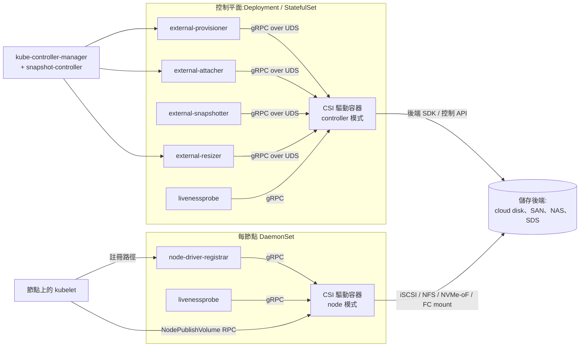

# Container Storage Interface (CSI)

## 摘要

Container Storage Interface (CSI) 是一個以 gRPC 為基礎的規範,讓儲存廠商只需撰寫**一支**驅動程式,即可在任何實作此規範的容器編排器 (Container Orchestrator, CO) 上運作 — Kubernetes、Nomad、Cloud Foundry,以及歷史上的 Mesos。它取代了三種較舊的做法:Kubernetes 的 in-tree volume plugin (編譯進 kubelet,版本綁定 Kubernetes 本身)、FlexVolume (out-of-tree 但採 exec 模式、需在主機上安裝的前身),以及 Docker 的 REST-over-HTTP Volume Plugin API (僅限 Docker、無叢集概念)。CSI 的關鍵設計選擇有三點:驅動程式以**容器**形式由 CO 部署、契約是驅動程式與 CO 提供的 sidecar 控制器之間透過 **UNIX domain socket 的 gRPC**、以及將介面切分為 **Identity / Controller / Node** 三項服務並透過 capability advertisement 機制讓驅動程式只實作對其後端有意義的部分。最新規範為 **v1.12.0 (2024 年 10 月 17 日)**;CSI 在 Kubernetes v1.13 (2019 年 1 月) 達到 GA,主要雲端供應商的 in-tree → CSI 遷移則在 Kubernetes v1.25 (2022 年 9 月) GA。若你在 2026 年要將 block、file 或混合儲存整合到類 Kubernetes 環境,請選擇 CSI;若是 object/bucket 工作負載,請改用其姊妹規範 COSI。

## 比較:CSI vs. 前身與姊妹規範

| 維度 | **CSI** | **In-tree volume plugin (K8s)** | **FlexVolume** | **Docker Volume Plugin v2** | **COSI** |
|---|---|---|---|---|---|
| 類型 / 分類 | CO 中立的儲存外掛規範 | Kubernetes 內建的 volume 驅動 | K8s out-of-tree exec 外掛 | Docker Engine 外掛 API | CO 中立的 object/bucket 外掛規範 |
| 核心架構 | UNIX socket 上的 gRPC;驅動程式以 pod 執行;CO 端 sidecar 將 K8s 物件轉成 RPC | 驅動程式碼編入 `kubelet` 與 `kube-controller-manager` | 主機安裝的二進位檔,透過 fork/exec 以 JSON 參數呼叫 | 註冊為 managed plugin 的 OCI 映像;UNIX socket 上的 REST/JSON | UNIX socket 上的 gRPC;以 bucket 為導向、非 volume |
| 主要介面 | Identity、Controller、Node 三項 gRPC 服務 (proto3) | 內部 Go 介面 (`VolumePlugin`、`Provisioner`、`Attacher`、`Mounter`) | `init`、`mount`、`unmount`、`attach`、`detach` shell 動詞,回傳 JSON | `/VolumeDriver.Create`、`Mount`、`Unmount`、`Get`、`List`、`Capabilities` REST | `Provisioner`、`Identity` gRPC + Bucket/BucketAccess CRD |
| 最適用途 | 任何要暴露給叢集化 CO 的 block/file 儲存 | (歷史) 第一方雲端與主機 volume 的內建支援 | (歷史) CSI 尚未存在時的 K8s 快速驅動 | 單機 Docker Engine / 傳統 Swarm 的 volume | 將 S3/object/bucket 佈建至 K8s namespace |
| 優點 | CO 中立;驅動與 CO 解耦發行;生命週期完整 (snapshot、clone、expand、group snapshot);容器化、無需在主機安裝 | 零部署;隨叢集出貨 | Out-of-tree;簡單的 shell 契約 | 標準 Docker 工具鏈 | 將 object storage 納入與 PV/PVC 相同的宣告式模型 |
| 缺點 | 維運繁重 (至少 5 個 sidecar + 驅動 pod);規範演進頻繁;除錯橫跨多個容器 | 驅動 bug 可能拖垮 kubelet;版本綁定 K8s release;SIG-Storage 已不再接受新插件 | 每個節點皆需 root 安裝驅動及 OS 依賴;v1.0 之前無動態佈建;已 deprecated | 無叢集概念 (沒有 attach/publish 切分);Kubernetes、AKS、EKS、GKE 都未採用;實際上是 legacy | 主要發行版中仍偏 alpha;相較 CSI 驅動生態較小 |
| 授權 / 取得模式 | Apache 2.0 規範;驅動本身授權不一 (Apache、GPL、專有) | Apache 2.0 (Kubernetes 一部分) | Apache 2.0 (Kubernetes 一部分) | Apache 2.0 (Docker plugin API) | Apache 2.0 規範 |
| 成本 | 規範免費;成本來自儲存後端 + sidecar (一個 controller Deployment + 每驅動一個 DaemonSet) 的維運負擔 | 免費;成本是與 K8s 升級綁定 | 免費;成本是每節點二進位檔派送 | 免費;成本是處於不受支援的整合路徑 | 規範免費;成本由後端 object storage 主導 |
| 狀態 (2026 年 5 月) | 規範 **v1.12.0** (2024 年 10 月);事實上的標準 | 主要雲端供應商已移除;由 CSI migration shim 取代 | **Deprecated**;僅維護不增功能 | 對於編排化工作負載已是 legacy | 規範 v1alpha 於 2022 年發布;採用面成長中但仍狹窄 |

> 上表的成本與狀態數字為 2026 年 5 月的公開/定價資訊,會隨時間漂移;在做架構決定前請對照原始來源驗證。

## 深入實作報告

### 1. 架構深度剖析

CSI 驅動程式是一個 gRPC server,CO 是 gRPC client。它們透過一個位於 `emptyDir` volume 中、由驅動容器與 CO 提供的「sidecar」容器共享的 UNIX domain socket 溝通。規範定義三項服務;驅動程式透過 `Identity.GetPluginCapabilities` 公告自己實作了哪些:

- **Identity** — `GetPluginInfo`、`GetPluginCapabilities`、`Probe`,所有驅動都必須實作。
- **Controller** — 叢集層級的 volume 操作:`CreateVolume`、`DeleteVolume`、`ControllerPublishVolume` / `ControllerUnpublishVolume` (雲端「attach」)、`ListVolumes`、`CreateSnapshot`、`DeleteSnapshot`、`ControllerExpandVolume`、`ControllerModifyVolume` (在 v1.12 GA)、以及 group-snapshot 相關 RPC。
- **Node** — 節點層級操作:`NodeStageVolume` (每節點一次,例如 `mkfs` + bind-mount 到 staging path)、`NodePublishVolume` (bind 到 pod 的 target path)、`NodeUnpublishVolume`、`NodeUnstageVolume`、`NodeGetVolumeStats`、`NodeExpandVolume`、`NodeGetInfo` (回傳 controller 用來排程的 topology key)。

典型的 Kubernetes CSI 驅動部署:

這個切分是關鍵:**`Controller*` RPC 在叢集層級的 controller pod 上每個 volume 跑一次** (因此需要後端憑證與對外網路),而 **`Node*` RPC 在工作負載落地的節點上執行** (因此需要 mount 權限、`/dev`、`/sys/block`、iSCSI/NVMe-oF 的 host network 等)。這也是 CSI 驅動程式在 Kubernetes 中以兩種不同 workload 形式出貨的原因:controller plugin 用 Deployment/StatefulSet,node plugin 用 DaemonSet。

Sidecar (由 Kubernetes-CSI 專案維護,跨驅動可重用):

- **external-provisioner** — 監看 `PersistentVolumeClaim`,呼叫 `CreateVolume` / `DeleteVolume`。
- **external-attacher** — 監看 `VolumeAttachment`,呼叫 `ControllerPublishVolume` / `ControllerUnpublishVolume`。
- **external-snapshotter** + **snapshot-controller** — 監看 `VolumeSnapshot` / `VolumeSnapshotContent`,呼叫 `CreateSnapshot` / `DeleteSnapshot`;controller 為全叢集單例 deployment,sidecar 則是每個驅動一份。
- **external-resizer** — 監看 PVC size 變更,呼叫 `ControllerExpandVolume`。
- **node-driver-registrar** — 向 kubelet 的 plugin-registration 目錄註冊驅動 socket;將驅動回報的 node ID 寫入 node label。
- **livenessprobe** — 包裝 gRPC `Identity.Probe` 為 HTTP `Probe` 端點。

Nomad 對同一份規範採取刻意更簡化的做法:由 Nomad 本身執行驅動,並把 sidecar 工作摺入 Nomad client/server 中,因此沒有獨立的 provisioner/attacher 容器需要維運。嚴格遵循規範的驅動可以在兩種 CO 上使用同一映像。

### 2. 關鍵設計模式與權衡

- **gRPC + UNIX socket,而非 REST/HTTP。** 相對 FlexVolume 的 exec 模式與 Docker 的 REST/JSON 而選擇 gRPC,因為它提供強型別契約 (`.proto`)、適合長操作的雙向串流、以及單一長連線 — 代價是需要 protoc 工具鏈與 Go/Rust/Python 的 gRPC server。選 socket 而非 TCP,則是因為驅動與 sidecar 永遠共享 pod 檔案系統,TCP 反而會多出不必要的 auth/TLS 問題。
- **以 capability advertisement 取代強制 RPC。** 驅動回報自己支援的功能集合 (`CREATE_DELETE_VOLUME`、`PUBLISH_UNPUBLISH_VOLUME`、`EXPAND_VOLUME`、`CLONE_VOLUME`、`LIST_VOLUMES_PUBLISHED_NODES` 等)。CO 在呼叫選用 RPC 前先檢查。若改成全部強制,就會排除 local-disk 或唯讀歸檔類驅動;代價是 CO 端程式碼充斥 `if hasCap(...)`,且驅動間的功能完整度參差不齊。
- **節點雙階段 mount (`NodeStageVolume` → `NodePublishVolume`)。** Stage **每節點、每 volume 只執行一次**,做昂貴的初始化 (登入 iSCSI target、`mkfs`、mount 到全域 staging path)。Publish **每個工作負載執行一次**,只是把資料 bind-mount 進 pod 的 target dir。如此 `ReadWriteMany` 與多 pod 共享便不需重複執行昂貴步驟。FlexVolume 將兩者混為一體,於是每次 pod 重啟都付一次成本。
- **Volume 雙階段 attach (`ControllerPublishVolume` → `NodeStageVolume`)。** 雲端 disk 在節點看見 block device 之前需要一個控制平面的「把這顆 EBS volume attach 到那台 EC2 instance」步驟。CSI 明確把雲端 attach (Controller、叢集層級) 與 OS mount (Node、節點層級) 切開。不需雲端 attach 的後端 (NFS、Ceph) 只要不公告 `PUBLISH_UNPUBLISH_VOLUME`,CO 就會跳過該階段。
- **以帶外 sidecar 取代 CO 內部 handler。** Kubernetes-CSI 專案擁有這些 sidecar,使驅動作者不必重新實作 watch loop、leader election、retry/backoff。代價是維運:每個驅動 pod 有 4–6 個容器,且一個 sidecar bug 會同時拖垮叢集中的所有驅動。
- **Topology 是不透明的 key/value map,而非固定 schema。** `NodeGetInfo` 回傳 `{topology.kubernetes.io/zone: "us-east-1a", csi.example.com/rack: "r17"}` — 任意鍵值對。CO 再依此將 volume 佈建限制在符合條件的節點。這是刻意設計得通用,讓非雲端後端 (rack-local SSD pool、NUMA-親和的 PMEM tier) 可以表達自己的 topology 維度,而無需修改規範。
- **以 shim 進行 in-tree migration。** 為了避免讓所有既有的 `kubernetes.io/aws-ebs` `StorageClass` 失效,CSI Migration (K8s v1.25 GA) 在 `kube-controller-manager` 與 `kubelet` 中攔截 in-tree volume 操作,並導向對應的 CSI 驅動。使用者看不到 API 變化;操作者要做的是安裝對應的 CSI 驅動並打開 feature gate。這並非小事 — `volumeAttachment` 命名與舊 in-tree 物件殘留有不少微妙的相容性陷阱 — 但避免了硬切換。

### 3. 正確性模型

CSI 是控制協定;耐久性、一致性與故障語意全部由驅動連接的**後端**負責。規範本身提供的正確性保證有:

- **冪等是強制要求。** 每個 RPC 必須能以相同參數安全重試。`CreateVolume` 以相同 `name` 呼叫必須回傳相同的 volume;對不存在的 volume 呼叫 `DeleteVolume` 必須回傳成功。任何非終局錯誤,CO 都會重試。
- **每個 volume 的並行規則。** 規範要求 CO 對同一個 volume ID 的 controller RPC 必須序列化;驅動必須處理可能收到並行 RPC 的情況 (例如 retry storm),以鎖或依賴後端冪等性來解決。
- **錯誤模型。** gRPC status code 具規範性意義:`ALREADY_EXISTS` 表示名稱碰撞但參數不同、`OUT_OF_RANGE` 表示容量不符、`FAILED_PRECONDITION` 表示前置條件缺失、`ABORTED` 請 CO 重試。誤用 code 是 CO ↔ 驅動互動 bug 的常見來源。
- **Volume 內容狀態。** 僅作弱追蹤:驅動可公告 `VOLUME_CONDITION`,讓 `NodeGetVolumeStats` 在異常時回傳 "abnormal" 與訊息,由 CO 對外呈現。基礎規範不含跨多 volume 的 crash consistency — **VolumeGroupSnapshot (規範 v1.11.0 於 2023 年 11 月 GA;Kubernetes 1.32 於 2024 年 12 月 beta)** 才補上群組層級的時間點一致語意,使多 PVC 應用 (DB + WAL) 可以原子地快照。
- **Snapshot 至 Volume 的保證。** Snapshot 是唯讀來源;以 `volume_content_source: snapshot` 呼叫 `CreateVolume` 必須在完成時產出與 snapshot 內容一致的 volume。對此說謊的驅動 (例如背景非同步複製) 違反規範。
- **Changed-block tracking。** `SnapshotMetadata` 服務 (規範 v1.10.0 於 2023 年 7 月 Alpha) 將「給我兩個 snapshot 之間 allocated/changed 的 block」標準化,先前備份廠商各自實作。

CSI **不**規範:replication、跨地域複寫、rebuild 時間、tail latency、RPO/RTO 目標、配額、靜態加密。這些全部是後端的事。在 Kubernetes 眼中,前面接 `loopback` 的 CSI 驅動與前面接超融合 SAN 的 CSI 驅動行為一致,但在生產環境差異極大。

### 4. 效能特性

CSI 本身不是瓶頸 — UNIX socket 上的 gRPC 在次毫秒級。真正有趣的效能在三個層次:

- **佈建吞吐量。** 受後端 `CreateVolume` 速率與 `external-provisioner` 的 `worker-threads` (預設 100) 限制。對「大量小 PVC」場景 (CI、租戶暫存) 應兩者一起調。
- **新 pod 的 mount 延遲。** 由 `NodeStageVolume` 主導:iSCSI 登入 + 對全新磁碟做 `mkfs.ext4` 大約是秒到數十秒。對於可預先格式化並重新 attach 既有 volume 的後端,成本則在數百毫秒。
- **資料路徑效能。** 與 CSI **無關**。`NodePublishVolume` 回傳後,pod 直接走 kernel mount (block device、NFS、FUSE) 與後端互動 — CSI 驅動不在 I/O 路徑上。所以「CSI 讀取 overhead」本質上是零;「這支 CSI 驅動很慢」幾乎都意味著「底層後端或 kernel mount 很慢」。

實務注意:FUSE 型檔案系統 (s3fs、JuiceFS、MountPoint-for-S3) 的 CSI 驅動**確實**留在資料路徑上,因為 FUSE 使用者空間 process 跑在驅動容器內。那裡的延遲與 CPU 是該驅動的問題,而非 CSI 本身。

### 5. 維運模型

- **安裝。** 廠商通常提供 Helm chart 或一組 manifest,部署 (a) 描述能力的 `CSIDriver` 物件、(b) 含 sidecar 的 controller `Deployment`、(c) node `DaemonSet`、(d) RBAC、(e) `StorageClass`。kubelet 的 plugin 目錄 (`/var/lib/kubelet/plugins/`) 需可由 DaemonSet 寫入。
- **升級。** Sidecar 映像與驅動映像版本各自獨立;Kubernetes-CSI 專案每個 K8s release 都會公告相容性矩陣。跨版升級有時需要中間 sidecar 版本。
- **可觀測性。** 每個 sidecar 在 `/metrics` 上提供 Prometheus 指標,驅動本身另行提供。關鍵訊號:`csi_sidecar_operations_seconds` (sidecar 視角的每 RPC 延遲)、`csi_operations_seconds` (驅動視角,需要 instrumentation)、以及 CO 端的 `volume_operation_total_seconds`。大多數事故會以 RPC retry storm 的樣貌出現。
- **常見故障模式。**
  - **`VolumeAttachment` 卡住。** Controller pod 掛了或雲端 API 被限流 → pod 卡在 `ContainerCreating`。修法:把 controller 擴回去;檢查雲端配額。
  - **`MountVolume.SetUp failed`。** 幾乎都是 node plugin 連不上後端 (NFS server down、iSCSI target 不見、憑證已輪替)。
  - **驅動註冊競爭。** `node-driver-registrar` 在 kubelet plugin watcher 還沒就緒前先起來 → 驅動在 `csinode` 中消失。修法:重啟該 DaemonSet pod。
  - **CSI Migration 不一致。** 叢集層級 feature gate 已切,但特定節點仍走舊 in-tree 路徑 → 出現混合模式 attach 但無法 detach。修法:cordon 並 roll 該節點。
- **CSI 特有的 day-2 注意事項。** Snapshot CRD 與 `snapshot-controller` 是**全叢集單例** — 全叢集只裝一份、不是每個驅動一份。忘了這點就會出現「驅動 X 不能 snapshot」的錯覺,其實是 snapshot controller 根本沒裝。

### 6. 安全與多租戶

- **驅動 pod 是 privileged 的。** Node plugin 通常以 `privileged: true`、host PID、`Bidirectional` 的 host mount propagation、CAP_SYS_ADMIN 執行。被入侵的 CSI 驅動映像等於節點層級 RCE。請 pin image digest,並以 admission policy (Kyverno、Gatekeeper、OPA、K8s ValidatingAdmissionPolicy) 強制檢查。
- **憑證隔離。** Controller plugin 持有後端憑證 (雲端 IAM key、SAN admin token、NFS Kerberos keytab)。若可能,讓它跑在獨立節點上;它不應與租戶 workload 共置。
- **資料路徑的租戶隔離。** CSI 本身不做租戶隔離 — 由 `StorageClass` 參數與後端自身的 namespace/project/SVM/QoS 模型負責。把 `StorageClass` 上的 `allowedTopologies`、`allowVolumeExpansion`、`mountOptions` 視為政策介面。
- **加密。** 多數生產驅動透過 `StorageClass` 參數傳入後端 KMS 金鑰來支援靜態加密。傳輸中則視協定而定 (帶 Kerberos 的 NFSv4.2、帶 TLS 的 NVMe-oF/TCP、帶 IPsec 的 iSCSI)。CSI 本身不強制任何一項。
- **CSI volume secret。** 規範允許 `StorageClass` 參照 Kubernetes `Secret` 作為每 volume 憑證 (`csi.storage.k8s.io/provisioner-secret-name`、`…/node-publish-secret-name`)。Sidecar 讀取後注入請求欄位;驅動不得記錄這些值。

### 7. 生態與整合

- **採用 CSI 的編排器。** Kubernetes (1.13 起,2019 GA)、Nomad (1.1.0 起,2021 年 5 月)、Cloud Foundry,以及各種 Kubernetes 衍生品 (OpenShift、EKS、GKE、AKS、Rancher、K3s、Talos)。Mesos 也有工作,但成熟度未達 Nomad。
- **驅動清單。** 社群於 <https://kubernetes-csi.github.io/docs/drivers.html> 維護列表。粗略涵蓋:每個主要雲端 (EBS、EFS、Disk/Filestore、Azure Disk/Files)、每個儲存廠商 (NetApp Trident、Pure、Dell PowerStore/PowerScale、HPE、IBM Spectrum Scale、Hitachi)、每個 CNCF SDS 專案 (Ceph-CSI、Longhorn、OpenEBS、Rook、Portworx、Linstor),以及 FUSE 包裝器 (JuiceFS-CSI、MountPoint-for-S3-CSI、s3-csi)。
- **支援 snapshot 的備份工具。** Velero、Kasten K10、Stash、Trilio、CloudCasa 全部依賴 CSI snapshot CRD 與 `external-snapshotter`。`SnapshotMetadata` 服務是增量備份的未來路徑。
- **鄰近規範。**
  - **COSI (Container Object Storage Interface)** — 物件儲存的姊妹規範,以 bucket 為單位。API shape 不同 (Bucket / BucketAccess / BucketClass / BucketAccessClass),2026 年仍在成熟中。
  - **CNI / CRI / DRA** — 網路、執行時、動態資源的對應介面。CSI 早於 DRA;在 GPU/FPGA 等可替換資源的場景中常與 DRA 對比,但儲存仍以 CSI 為正道。

### 8. 何時選 CSI

選擇 CSI,當:

- 你要出貨或維運儲存後端 (cloud disk、SAN、NAS、SDS、FUSE 型虛擬 FS),且希望它可被 Kubernetes、Nomad 或未來任何 CO 使用,而不必逐一改寫。
- 你需要其中任何一項:動態佈建、snapshot、clone、線上 expand、raw block、topology-aware 排程、group snapshot。
- 你正在從 in-tree plugin 或 FlexVolume 遷移過去;這是唯一受支援的路徑。

**不要**只停在 CSI,當:

- 你存的是**物件**而非 volume。請用 COSI 或後端原生 S3 API。
- 你只要單節點上短暫的本機暫存空間 — `emptyDir` 或 generic ephemeral volume 更簡單。
- 你跑在編排器之外的 Docker Engine 上。CSI 需要 CO;對應的單機方案是 Docker Volume Plugin API (在 2026 年實際上已是死路)。

挑選**某支 CSI 驅動** (而非 CSI 本身) 的實務判準:

- **必需的能力集。** 確認驅動公告了你工作負載需要的 RPC — `EXPAND_VOLUME`、`CLONE_VOLUME`、`LIST_VOLUMES_PUBLISHED_NODES` 是常見地雷。
- **Controller 邏輯成熟度。** 翻一下驅動的 open issue,搜「stuck attaching」或「volume not detaching」 — 這些是 idempotency 或 finalizer 處理不夠強的徵兆。
- **Sidecar 版本相容性。** 升級叢集前,先對照廠商矩陣比對 K8s 版本、sidecar 版本與驅動版本。
- **維運攻擊面。** 每節點一個 privileged DaemonSet pod 即是一個節點層級 RCE 面積;請與後端帶來的價值權衡。

### 9. Closing TL;DR

CSI 是事實上、CO 中立、用 gRPC 將 block 與 file 儲存接到類 Kubernetes 編排器的契約;驅動以容器出貨,切分為叢集層級的 Controller plugin 與每節點的 DaemonSet,並依賴一組固定 sidecar (`external-provisioner`、`external-attacher`、`external-snapshotter`、`external-resizer`、`node-driver-registrar`) 將 CO 物件橋接到 Identity / Controller / Node RPC。截至規範 v1.12.0 (2024 年 10 月) 與 Kubernetes 1.32 (2024 年 12 月),介面已涵蓋動態佈建、snapshot/clone/expand、raw block、topology-aware 排程、group snapshot (GA) 與 changed-block tracking (Alpha) — 因此唯二仍需另尋他路的場景是 object storage (改用 COSI) 與單機 Docker (用 Docker Volume Plugin)。選擇 CSI;但要慎選驅動,因為 CSI 驅動是每個節點上的 privileged DaemonSet 程式碼,並繼承後端的所有故障模式。

## Sources

- [container-storage-interface/spec on GitHub](https://github.com/container-storage-interface/spec) — accessed 2026-05
- [CSI spec releases page](https://github.com/container-storage-interface/spec/releases) — accessed 2026-05
- [CSI spec v1.11.0 release notes (VolumeGroupSnapshot GA)](https://github.com/container-storage-interface/spec/releases/tag/v1.11.0) — accessed 2026-05
- [Kubernetes CSI Developer Documentation](https://kubernetes-csi.github.io/docs/) — accessed 2026-05
- [Kubernetes CSI Drivers list](https://kubernetes-csi.github.io/docs/drivers.html) — accessed 2026-05
- [Kubernetes CSI Sidecar Containers](https://kubernetes-csi.github.io/docs/sidecar-containers.html) — accessed 2026-05
- [Deploying a CSI Driver on Kubernetes](https://kubernetes-csi.github.io/docs/deploying.html) — accessed 2026-05
- [Volume Snapshot & Restore docs](https://kubernetes-csi.github.io/docs/snapshot-restore-feature.html) — accessed 2026-05
- [Volume Group Snapshot & Restore docs](https://kubernetes-csi.github.io/docs/group-snapshot-restore-feature.html) — accessed 2026-05
- [external-provisioner sidecar](https://github.com/kubernetes-csi/external-provisioner) — accessed 2026-05
- [external-snapshotter sidecar](https://github.com/kubernetes-csi/external-snapshotter) — accessed 2026-05
- [Container Storage Interface (CSI) for Kubernetes GA — Kubernetes blog (Jan 2019)](https://kubernetes.io/blog/2019/01/15/container-storage-interface-ga/) — accessed 2026-05
- [Kubernetes 1.25: In-Tree to CSI Volume Migration Status Update](https://kubernetes.io/blog/2022/09/26/storage-in-tree-to-csi-migration-status-update-1.25/) — accessed 2026-05
- [Kubernetes 1.32: Moving Volume Group Snapshots to Beta](https://kubernetes.io/blog/2024/12/18/kubernetes-1-32-volume-group-snapshot-beta/) — accessed 2026-05
- [In-tree Storage Plugin to CSI Migration KEP-625](https://github.com/kubernetes/enhancements/blob/master/keps/sig-storage/625-csi-migration/README.md) — accessed 2026-05
- [Kubernetes Volumes concept docs](https://kubernetes.io/docs/concepts/storage/volumes/) — accessed 2026-05
- [Kubernetes SIG-Storage volume-plugin FAQ](https://github.com/kubernetes/community/blob/main/sig-storage/volume-plugin-faq.md) — accessed 2026-05
- [Kubernetes volume plugins evolution from FlexVolume to CSI (Palark)](https://blog.palark.com/kubernetes-volume-plugins-evolution-from-flexvolume-to-csi/) — accessed 2026-05
- [HashiCorp Nomad CSI Plugins documentation](https://developer.hashicorp.com/nomad/docs/architecture/storage/csi) — accessed 2026-05
- [Docker volume plugins documentation](https://docs.docker.com/engine/extend/plugins_volume/) — accessed 2026-05
- [Introducing COSI: Object Storage Management using Kubernetes APIs](https://kubernetes.io/blog/2022/09/02/cosi-kubernetes-object-storage-management/) — accessed 2026-05
- [Container Object Storage Interface project site](https://container-object-storage-interface.sigs.k8s.io/) — accessed 2026-05
