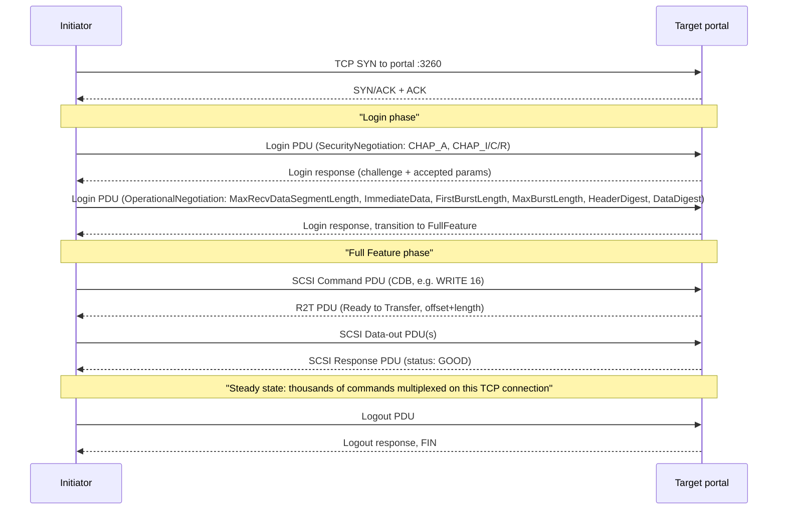

# iSCSI (Internet Small Computer Systems Interface)

## Summary

iSCSI is a block-storage transport that carries SCSI command descriptor blocks (CDBs) inside protocol data units (iSCSI PDUs) on top of TCP, so any host with an Ethernet NIC and an initiator (Linux `open-iscsi`, Windows iSCSI Initiator, VMware ESXi software adapter) can mount a remote LUN as if it were a local disk. The standard is RFC 7143 (April 2014), which consolidated and obsoleted the original RFC 3720 (2004) plus its three amendments; nothing has superseded it since, so iSCSI in 2026 is a stable, frozen protocol. Its defining trade-off versus Fibre Channel (FCP) was "run a SAN on the same Ethernet you already have" — that trade-off has been undercut since ~2020 by NVMe/TCP, which keeps the commodity-Ethernet advantage but drops the SCSI emulation layer for a queue-based NVMe model and consistently delivers 30–50% more 4 KiB IOPS and 20–35% lower latency on the same hardware (Dell H18892, Blockbridge Proxmox benchmark, 2024–2025). Pick iSCSI in 2026 for **brownfield compatibility** — VMware datastores you do not want to disrupt, Windows clusters with mature MPIO playbooks, storage arrays whose firmware does not yet expose NVMe-oF — and pick NVMe/TCP for greenfield block SANs.

## Comparison: iSCSI vs. the other Ethernet/FC block transports

| Dimension | **iSCSI** | **NVMe/TCP** | **NVMe-oF over RDMA (RoCEv2 / iWARP / IB)** | **Fibre Channel (FCP) + FC-NVMe** |
|---|---|---|---|---|
| Type / category | SCSI-over-TCP block protocol | NVMe-command-over-TCP block protocol | NVMe-command-over-RDMA block protocol | Dedicated lossless fabric carrying FCP (SCSI) and/or FC-NVMe |
| Core architecture | Initiator opens TCP sessions to a target portal; SCSI CDBs wrapped in iSCSI PDUs; single command queue per connection | Multiple parallel NVMe submission/completion queues over TCP; no SCSI layer | NVMe queues mapped directly to RDMA queue pairs; zero-copy from host RAM to target | Buffer-credited lossless fabric; HBA encapsulates FCP or FC-NVMe frames |
| Primary interfaces / wire | TCP port 3260, IQN naming (`iqn.YYYY-MM.<reverse-dns>:<id>`), CHAP + optional IPsec | TCP port 4420 (default), NQN naming, NVMe-oF discovery service | RDMA verbs over RoCEv2 / iWARP / InfiniBand; NQN naming | FC-2 framing on dedicated SAN fabric; WWN naming, zoning |
| Best fit | Mid-tier shared block storage on existing Ethernet; VMware/Hyper-V datastores | Same as iSCSI but for all-flash / NVMe arrays, lower latency required | Latency-critical NVMe arrays (≤100 µs targets), AI training data tiers, in-rack storage | Mission-critical enterprise databases, tier-1 VMware, regulated workloads with existing FC investment |
| Advantages | Runs on any TCP/IP network; mature drivers in every OS for 15+ years; cheap (no HBA, no FC switch); rich auth (CHAP/IPsec) | Same Ethernet portability as iSCSI; 30–50% higher 4K IOPS, 20–35% lower latency; multi-queue ends head-of-line blocking | Lowest latency Ethernet block transport; ~85% lower host CPU than iSCSI (vendor figures); zero-copy | Deterministic latency; lossless by design (BB_credit); decades of operational tooling and certifications |
| Disadvantages | SCSI emulation adds ~60–80 µs per I/O; single command queue per TCP connection → head-of-line blocking; very sensitive to RTT (≥80% sequential-write drop at +2 ms in BCS 2026 test) | Newer; not yet uniformly supported by older arrays or by Windows in-box initiator before Server 2025 | Requires lossless Ethernet (PFC/ECN) or InfiniBand; RDMA tuning is a specialty | Expensive (HBAs, switches, optics); separate fabric to operate; fewer skilled admins entering the field |
| License / acquisition | Open standard (IETF RFC 7143); reference initiators are open-source (`open-iscsi`, LIO) | Open standard (NVM Express + TP 8000); native in Linux 5.0+, ESXi 7.0+ | Open standard (NVM Express); same vendor model | Proprietary stack (Brocade, Cisco MDS, HBAs by Marvell/Broadcom); standards body T11 |
| Cost | Commodity Ethernet NICs/switches; near-zero protocol cost; target software is free | Same hardware as iSCSI; SmartNIC offload optional | RDMA-capable NIC (ConnectX-6/7, Intel E810) + lossless switch fabric | $1.5–4k per HBA, $30–80k per 32G FC switch, optics + WWN-zoning licenses |
| Typical TCO (1 PB, 3 yr, block-only) | Lowest: existing Ethernet, software targets — overheads dominated by storage media | Same as iSCSI plus optional SmartNIC | +$50–200k for RDMA NICs + lossless switching | $200–600k extra for dedicated FC fabric vs. an Ethernet-only build |
| Status (May 2026) | Stable, frozen since RFC 7143 (2014); maintenance-only in OS initiators | Production-ready; default block protocol in most new all-flash arrays from 2024 onward | Production-ready in high-end enterprise / HPC | Strong in tier-1 enterprise; 64GFC and 128GFC shipping; mindshare declining |

> Cost and performance numbers above are public-list / published-benchmark estimates as of May 2026; real procurement, especially for FC, depends heavily on incumbency, contract terms, and bundle pricing.

## In-depth implementation report

### 1. Architecture deep-dive

An iSCSI deployment has four named pieces and one critical state machine.

- **Initiator** — the client. A software stack on the host (`open-iscsi` on Linux, the Microsoft iSCSI Initiator service on Windows, the software iSCSI HBA in ESXi) or a hardware iSCSI HBA (TCP offload + iSCSI offload engine). It opens TCP connections, authenticates, logs in, and translates kernel block-I/O requests into iSCSI PDUs.
- **Target** — the server. A SCSI target framework on a storage array or general-purpose host: **LIO** (in-kernel since Linux 2.6.38, March 2011; the canonical reference today), **SCST** (out-of-tree, used by some appliance vendors), or **TGT/STGT** (user-space, older, legacy). The target exposes one or more LUNs (volumes) under a target IQN.
- **Portal** — a `(IP, TCP port)` tuple that an initiator connects to. A target can publish multiple portals for multipathing / HA.
- **LUN** — the actual block device exported. The initiator sees it as `/dev/sdX` (Linux) or a disk in Disk Management (Windows).

Naming uses IQN (iSCSI Qualified Name): `iqn.2026-05.com.example.storage:array01.tgt01`. Hosts and targets each have an IQN; access control lists are usually keyed on the initiator IQN plus, optionally, a CHAP secret.

A session goes through two phases on the wire:

Key state machine details that bite in production:

- **One iSCSI session = one or more TCP connections** ("MC/S" — Multiple Connections per Session). Most deployments use **one TCP connection per session and multiple sessions via dm-multipath / MPIO** instead, because OS multipathing is more battle-tested than MC/S.
- **Inside one TCP connection, commands are tagged with an `ITT` (Initiator Task Tag) and replies match them up,** but the connection itself is FIFO — a slow command at the head holds up everything behind it. This is the head-of-line blocking that NVMe/TCP eliminates with parallel queues.
- **HeaderDigest / DataDigest** (CRC32C on the PDU header and payload) are optional and *off* by default. Turning them on is the only way to detect silent corruption on the wire, but they cost CPU unless offloaded.
- **The R2T (Ready to Transfer) handshake is per-write,** which is why round-trip time has a huge effect on write throughput. `ImmediateData=Yes` and a large `FirstBurstLength` let small writes skip the R2T and ride along with the command — essential tuning.

### 2. Key design patterns and trade-offs

- **SCSI on TCP, not a new protocol.** The 2003-era decision was to wrap an existing, deeply tested storage command set (SCSI) over a ubiquitous transport (TCP/IP), so every OS that already had a SCSI mid-layer just had to grow a new low-level driver. The cost is two layers of framing (SCSI CDB → iSCSI PDU → TCP segment) and a SCSI command set whose synchronous, single-queue model predates flash by decades. NVMe-oF chose the opposite trade-off: design the command set and the transport together, accept that you have to ship new code in every OS.
- **TCP, not UDP or raw Ethernet.** Reliability and congestion control come for free from TCP, and routability across L3 was a deliberate goal so iSCSI could span sites and DR pairs. The cost is per-byte CPU overhead (large segments help via TSO/LRO) and head-of-line blocking. AoE (ATA over Ethernet) chose raw L2 for less overhead and lost on routability and adoption.
- **Login phase as a long parameter negotiation.** Almost every operational knob (digests, burst lengths, immediate-data, max-recv-segment) is set per session at login. The advantage is per-host tuning; the disadvantage is that mismatched defaults between initiator and target are the #1 cause of "iSCSI is slow" tickets.
- **No data integrity at rest required.** iSCSI specifies on-wire optional CRC, nothing for at-rest — that is left to the target. A target backed by `loopback` files and a target backed by a triple-replicated SDS look identical to the initiator.
- **CHAP for auth, not Kerberos or TLS.** RFC 7143 specifies CHAP because in 2003 it was already universal on PPP/RADIUS gear; modern deployments often wrap iSCSI in IPsec (or in a VLAN they trust) rather than relying on CHAP alone. The spec does *not* define TLS-on-iSCSI; that gap is one of the reasons NVMe/TCP (which has both in-band TLS and DH-HMAC-CHAP) is preferred for new builds.
- **Multipath is out-of-band.** iSCSI itself does not load-balance or fail over; that is delegated to `dm-multipath` on Linux or MPIO on Windows. The trade-off is operational complexity (now you have two state machines to debug) for clean separation of concerns.

### 3. Correctness / consistency model

iSCSI inherits SCSI's correctness model, which is straightforward:

- **Per-LUN command ordering.** The target processes commands in the order they pass through its task management layer, subject to SCSI queue tags (`SIMPLE`, `ORDERED`, `HEAD OF QUEUE`). Initiators almost always use `SIMPLE` and rely on the target's serialization plus their own block-layer barriers.
- **Write durability.** A `SCSI Response: GOOD` for a WRITE command means the data is committed to whatever the target promised. For a hardware array with NVRAM, that is durable. For a Linux LIO target backed by a file with default cache settings, it is *not* unless the LUN is configured with `emulate_write_cache=0` or the initiator issues `SYNCHRONIZE CACHE`. Misconfiguring this is the classic iSCSI data-loss scenario.
- **Failure domain.** A TCP connection drop is recoverable: the initiator reconnects, re-logs in, and replays outstanding PDUs using ITT. ERL (Error Recovery Level) 0 (session-level recovery — drop and restart everything in flight) is what virtually every production deployment runs; ERL 1 and 2 (PDU-level recovery) exist in the spec but are rarely implemented or used.
- **Split-brain.** SCSI Persistent Reservations (SPC-3 PR) are how shared-disk clusters (Windows Failover Clustering, VMware VMFS, Oracle RAC) fence each other. LIO and most arrays implement them correctly; bugs here have historically caused some of the nastiest cluster failures.
- **No multi-volume consistency.** Like NVMe and FC, iSCSI is single-LUN. Crash-consistent multi-LUN snapshots are an array feature, not a protocol feature.

### 4. Performance characteristics

iSCSI's performance ceiling is set by three independent factors:

- **Per-I/O fixed overhead.** Each I/O traverses: kernel block layer → SCSI mid-layer → iSCSI PDU formatter → TCP/IP → NIC, then mirror on the target. Vendor measurements consistently put this at ~60–80 µs above NVMe/TCP on the same hardware (Dell H18892 2.0 white paper). For 4 KiB random reads against an all-flash target where the media itself responds in ~50 µs, this overhead doubles end-to-end latency.
- **Connection throughput.** A single TCP connection on a 25 GbE link, with TSO/LRO, easily saturates the wire for large sequential I/O (~24 Gbps). The problem is small random I/O: at queue depth 1, a single connection caps at ~10–15k IOPS regardless of NIC speed because of the per-I/O latency.
- **RTT sensitivity.** Because each write involves at least one R2T round-trip (or one TCP ACK round-trip for inline data), iSCSI throughput collapses on stretched links. A BCS 2026 study measured iSCSI sequential write dropping >80% at +2 ms added RTT, while NVMe/TCP held >700 MB/s at +9 ms — a roughly 16× advantage in the lossy/long-haul case.

Tuning levers that actually matter:

| Lever | Effect | Typical setting |
|---|---|---|
| `MaxRecvDataSegmentLength` | Largest PDU payload | 256 KiB (default 8 KiB is far too small) |
| `FirstBurstLength` + `ImmediateData=Yes` | Lets small writes skip R2T | 64–256 KiB |
| `MaxBurstLength` | Bytes per write burst before R2T | 256 KiB – 1 MiB |
| `HeaderDigest=CRC32C`, `DataDigest=CRC32C` | Wire-corruption detection | On *only* if NIC offloads CRC |
| Jumbo frames (MTU 9000) | Fewer TCP segments per PDU | On for dedicated storage VLAN; off if traversing untrusted L3 |
| `dm-multipath` policies | Path selection, failover | `service-time` or `queue-length`, `path_grouping_policy=multibus` for active-active arrays |

### 5. Operational model

- **Install.** Linux: `apt install open-iscsi` + `targetcli` for LIO. ESXi: enable the software iSCSI adapter, bind to vmkernel ports. Windows: `iscsicpl.exe` or PowerShell `Get-IscsiTarget`.
- **Discovery.** Either static (configure portal IP, target IQN by hand) or **iSNS** (Internet Storage Name Service, RFC 4171) — an LDAP-like discovery service that almost nobody runs in 2026; static config plus DNS is the de facto pattern.
- **Day-2 ops.** Watch for: stuck sessions after a network blip (`iscsiadm -m session -P 3`), MPIO paths failing one-way (initiator marks a path dead but the array still happily serves it), CHAP secret drift after array failover.
- **Observability.** Linux: `/sys/class/iscsi_session/`, `/sys/class/iscsi_connection/`, `iostat -x` on the resulting `/dev/sdX`, `dmesg` for SCSI sense data. Targets expose per-LUN counters via `targetcli` or vendor CLI.
- **Common failure modes.**
  - **`MaxRecvDataSegmentLength` mismatch.** Initiator and target negotiate the minimum; if one side defaults to 8 KiB, every large I/O is fragmented into 32+ PDUs and throughput tanks. Fix: explicitly set on both sides.
  - **No CHAP after array firmware upgrade.** The array reset auth defaults; sessions hang at login. Fix: re-set CHAP on the target and `iscsiadm --update`.
  - **`dm-multipath` flapping.** Underlying TCP retransmits time out before the multipath layer's path-check interval. Fix: tune `replacement_timeout`, `nop-in-interval`, `nop-out-timeout` in `iscsid.conf`.
  - **Silent corruption on a flaky NIC.** Without `DataDigest`, the host sees garbage data with no errors. Fix: turn digests on, or ensure end-to-end NIC offloads (TSO + CRC) are sane.

### 6. Security & multi-tenancy

- **CHAP.** Either one-way (target challenges initiator) or mutual (both ways). Secrets are 12–16+ byte strings. CHAP is in the spec but is, by 2026 standards, weak — challenge/response with MD5 in the canonical form. It defends against random IQN spoofing on a shared L2; it does **not** defend a sniffable network.
- **IPsec.** RFC 7143 specifies IPsec as the "encryption story." In practice almost nobody runs it; the operational pattern is a dedicated, physically- or VLAN-isolated storage network plus CHAP. If your iSCSI traffic crosses an untrusted boundary, IPsec or an overlay (WireGuard, vendor-specific TLS tunnel) is mandatory.
- **No native TLS.** This is a real gap versus NVMe/TCP (which added in-band TLS 1.3 and DH-HMAC-CHAP in TP 8011 and TP 8006). If you need transport encryption on a routable network, prefer NVMe/TCP or wrap iSCSI in IPsec/WireGuard.
- **Tenant isolation.** Per-target ACLs (LUN masking) on the array plus per-initiator CHAP secrets. There is no namespace/projection feature at the protocol level — tenant isolation is policy on the array.
- **Audit.** The array logs login attempts and SCSI commands per LUN; OS initiator logs in `journalctl -u iscsid` / Windows Event Log. Neither side authenticates *users*, only initiator IQNs, so audit granularity stops at the host.

### 7. Ecosystem & integrations

- **OS support.** Universal. Linux (`open-iscsi`, LIO), Windows (in-box), VMware ESXi (software adapter + dependent and independent hardware adapters), FreeBSD, illumos, Solaris.
- **Storage arrays.** Every major mid-range and enterprise array supports iSCSI: NetApp ONTAP, Dell PowerStore / Unity / PowerMax, Pure FlashArray, HPE Alletra / Primera / Nimble, Hitachi VSP, IBM FlashSystem, Huawei OceanStor. Most also support NVMe/TCP now, and most enterprise arrays also support FC and FC-NVMe.
- **Cloud.** Hyperscalers do **not** expose raw iSCSI to tenants; EBS / Azure managed disks / GCE PD use proprietary block protocols (AWS NVMe shim, Azure SCSI-over-VHD, GCE virtio). iSCSI shows up in (a) on-prem-to-cloud bridges like **AWS Storage Gateway Volume Gateway** (exposes S3 as iSCSI to legacy hosts), (b) **Azure Stack HCI** internal storage paths, (c) **Equinix Metal** and a handful of bare-metal hosters offering iSCSI block as a service.
- **Hypervisors.** vSphere VMFS on iSCSI is one of the most widely deployed block-on-IP combinations in existence; Hyper-V CSV on iSCSI is the Windows equivalent. Both remain fully supported in 2026 even as the vendors push customers toward NVMe/TCP.
- **Kubernetes.** Via CSI drivers — `democratic-csi` (TrueNAS), `dell-csi-iscsi`, `pure-csi`, `netapp-trident`, etc. All of these wrap `open-iscsi` calls on the node DaemonSet.
- **iSER (iSCSI Extensions for RDMA, RFC 7145).** Replaces TCP+iSCSI-PDU framing with RDMA verbs, dropping ~85% of host CPU per vendor figures. Supported in LIO, ESXi (vSphere 7+), NetApp E-Series, Nutanix. Real-world adoption is small — most shops that want RDMA block storage in 2026 just go to NVMe-oF/RDMA directly.

### 8. Sub-comparison: iSCSI vs. NVMe/TCP head-to-head

| Aspect | **iSCSI** | **NVMe/TCP** |
|---|---|---|
| Command model | SCSI (CDB), 1 command queue per TCP connection | NVMe (submission + completion queues), up to 65k queues, multiple per connection |
| Per-I/O CPU overhead on host | Higher (kernel SCSI + iSCSI PDU layer) | Lower (NVMe driver + framing) |
| Per-I/O wire overhead | ~48 B iSCSI header + SCSI CDB | ~32 B NVMe-oF capsule |
| Head-of-line blocking | Yes (single queue per connection) | No (multi-queue) |
| 4K random read IOPS (vendor-reported) | Baseline | +30–50% on same hardware |
| 4K random latency | Baseline | −20–35 % |
| RTT tolerance | Poor (sequential writes collapse at +2 ms) | Good (>700 MB/s at +9 ms) |
| In-band TLS | No (use IPsec) | Yes (TP 8011) |
| Authentication | CHAP (MD5) | DH-HMAC-CHAP, optional TLS PSK |
| OS support (default in-box) | Universal since ~2007 | Linux ≥5.0 (2019), ESXi ≥7.0u3, Windows Server 2025 |
| Array support | Every array since ~2005 | Most all-flash arrays since 2022; near-universal new arrays in 2026 |
| Migration cost from each other | Reformat / remap LUNs; preserve data with array-side migration tools | Same |

### 9. When to pick iSCSI

Pick iSCSI in 2026 when:

- You have an **existing iSCSI SAN** with mature MPIO, monitoring, and operational playbooks, and the latency profile is fine for your workload. Migrating to NVMe/TCP is rarely free.
- Your **array firmware does not yet support NVMe/TCP**, or your hypervisor's NVMe-oF support is younger than your change-control board's risk appetite.
- You need **block storage on commodity Ethernet** and you cannot deploy newer kernels / drivers across the fleet (older Windows Servers, embedded appliances, edge sites with frozen images).
- You are building a **DR / archive tier** where latency tolerance is wide and CPU is plentiful, and your existing tooling speaks iSCSI.

Pick something else when:

- **Greenfield all-flash block SAN** — choose NVMe/TCP. Same hardware, materially better IOPS/latency, in-band TLS.
- **Sub-100 µs end-to-end latency** is a hard requirement — choose NVMe-oF/RDMA (RoCEv2 or InfiniBand) or FC-NVMe.
- **Regulated, mission-critical tier-1 with existing FC fabric** — keep Fibre Channel until FC-NVMe is universally available on your arrays.
- **You only need file semantics** — NFS or SMB is operationally simpler than iSCSI + a cluster filesystem.

### 10. Closing TL;DR

iSCSI is the boring, universally supported, frozen-since-2014 way to carry SCSI block I/O over commodity TCP/IP, and it is the right answer when the priority is "works on every OS, every array, every cloud-gateway box, and on the storage VLAN we already have." It is also, by every public benchmark from 2024–2025, slower (30–50% fewer 4K IOPS), higher-latency (60–80 µs extra), and dramatically less RTT-tolerant than NVMe/TCP on the same wire, because the SCSI emulation layer and the single-queue-per-TCP-connection design are showing their age. Treat iSCSI in 2026 as the brownfield default — keep it where it already works, and pick NVMe/TCP for anything new; reach for FC or NVMe-oF/RDMA only when latency or operational politics demand it.

## Sources

- [RFC 7143 — Internet Small Computer System Interface (iSCSI) Protocol (Consolidated)](https://datatracker.ietf.org/doc/html/rfc7143) — accessed 2026-05
- [RFC 7144 — iSCSI SCSI Features Update](https://www.rfc-editor.org/rfc/rfc7144.html) — accessed 2026-05
- [RFC 7145 — iSCSI Extensions for RDMA Specification](https://datatracker.ietf.org/doc/html/rfc7145) — accessed 2026-05
- [SNIA — What is iSCSI?](https://www.snia.org/education/what-is-iscsi) — accessed 2026-05
- [Linux-IO (LIO) project on linux-iscsi.org](http://linux-iscsi.org/wiki/Features) — accessed 2026-05
- [LIO (SCSI target) — Wikipedia](https://en.wikipedia.org/wiki/LIO_(SCSI_target)) — accessed 2026-05
- [SCSI Targets Comparison — SCST.sourceforge.net](https://scst.sourceforge.net/comparison.html) — accessed 2026-05
- [LINBIT — Highly Available SCST & LIO iSCSI Clustering](https://linbit.com/blog/highly-available-scst-lio-iscsi-clustering-how-to-guide-update-comparison/) — accessed 2026-05
- [Dell H18892 — NVMe Transport Performance Comparison white paper](https://www.delltechnologies.com/asset/en-gb/products/storage/industry-market/h18892-nvme-transport-performance-comparison.pdf) — accessed 2026-05
- [Blockbridge Knowledgebase — Proxmox iSCSI and NVMe/TCP shared storage comparison](https://kb.blockbridge.com/technote/proxmox-iscsi-vs-nvmetcp/) — accessed 2026-05
- [StarWind — iSCSI vs NVMe-oF Performance Comparison](https://www.starwindsoftware.com/blog/iscsi-vs-nvme-of-performance-comparison/) — accessed 2026-05
- [Simplyblock — NVMe over TCP vs iSCSI](https://www.simplyblock.io/blog/nvme-over-tcp-vs-iscsi/) — accessed 2026-05
- [WWT — Speed vs. legacy: NVMe and SCSI storage fabrics compared](https://www.wwt.com/blog/speed-vs-legacy-nvme-and-scsi-storage-fabrics-compared) — accessed 2026-05
- [BCS — Storage Speed Test: NVMe/TCP vs iSCSI Under Network Delay (Apr 2026)](https://www.bcs.org/events-calendar/2026/april/hybrid-event-storage-speed-test-nvmetcp-vs-iscsi-under-network-delay/) — accessed 2026-05
- [TechTarget — Fibre Channel vs. iSCSI: differences](https://www.techtarget.com/searchstorage/tip/iSCSI-vs-Fibre-Channel-What-is-best-choice-for-your-SAN) — accessed 2026-05
- [Huawei — Comparison of Fibre Channel, iSCSI, and NVMe-oF](https://support.huawei.com/enterprise/en/doc/EDOC1100253812/b40bc537/comparison-of-fibre-channel-iscsi-and-nvme-of) — accessed 2026-05
- [NVIDIA DOCA — iSER documentation](https://docs.nvidia.com/doca/sdk/iSER+-+iSCSI+Extensions+for+RDMA/index.html) — accessed 2026-05
- [iSCSI Extensions for RDMA — Wikipedia](https://en.wikipedia.org/wiki/ISCSI_Extensions_for_RDMA) — accessed 2026-05
- [Oracle — Configuring CHAP Authentication for an iSCSI Initiator](https://docs.oracle.com/cd/E37838_01/html/E61018/iscsi-9.html) — accessed 2026-05
- [Microsoft Petri — MPIO with the Windows Server iSCSI Initiator](https://petri.com/using-mpio-windows-server-iscsi-initiator/) — accessed 2026-05
- [Ceph documentation — iSCSI Initiator for Linux](https://docs.ceph.com/en/reef/rbd/iscsi-initiator-linux/) — accessed 2026-05
