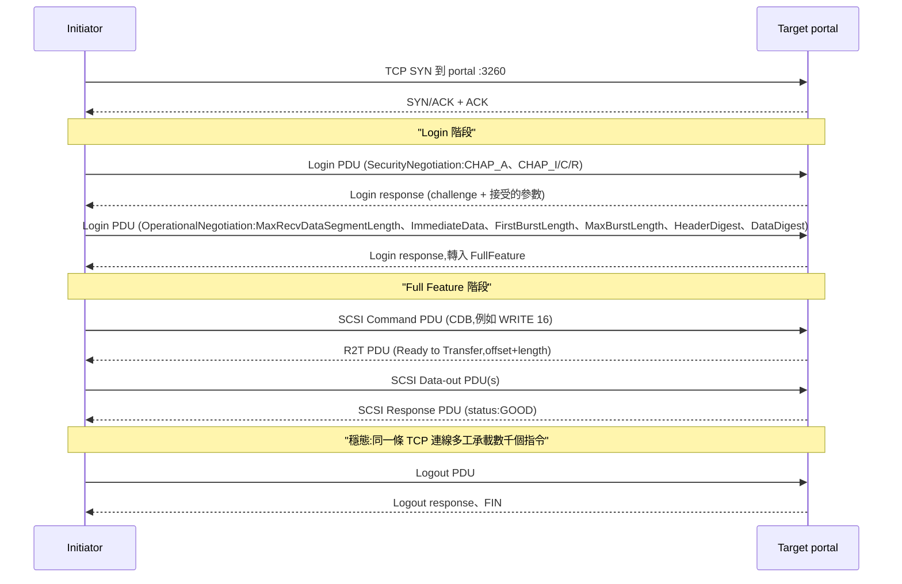

# iSCSI (Internet Small Computer Systems Interface)

## 摘要

iSCSI 是一種 block 儲存傳輸協定,將 SCSI 指令描述區塊 (CDB) 封裝在 iSCSI PDU 中,再透過 TCP 傳送,因此任何擁有乙太網路 NIC 與 initiator 的主機 (Linux `open-iscsi`、Windows iSCSI Initiator、VMware ESXi 軟體 adapter) 都能將遠端 LUN 掛載為本機磁碟。標準為 RFC 7143 (2014 年 4 月),整合並廢止了原始的 RFC 3720 (2004) 與其三份增補;此後未有新版,因此 2026 年的 iSCSI 是穩定且已凍結的協定。它與 Fibre Channel (FCP) 相比的定義性權衡是「直接在你已經有的乙太網路上跑 SAN」 — 但這個權衡自 ~2020 年起被 NVMe/TCP 削弱:NVMe/TCP 同樣跑在商規乙太網路上,卻丟掉了 SCSI 模擬層,改用佇列導向的 NVMe 模型,在相同硬體上一致提供 30–50% 更高的 4 KiB IOPS 與 20–35% 更低的延遲 (Dell H18892、Blockbridge Proxmox benchmark,2024–2025)。在 2026 年選擇 iSCSI 的理由是**既有相容性** — 不想動的 VMware datastore、已有成熟 MPIO 作業手冊的 Windows cluster、韌體尚未支援 NVMe-oF 的儲存陣列;對於全新的 block SAN,直接挑 NVMe/TCP。

## 比較:iSCSI vs. 其他乙太網路/FC block 傳輸

| 維度 | **iSCSI** | **NVMe/TCP** | **NVMe-oF over RDMA (RoCEv2 / iWARP / IB)** | **Fibre Channel (FCP) + FC-NVMe** |
|---|---|---|---|---|
| 類型 / 分類 | SCSI-over-TCP block 協定 | NVMe-over-TCP block 協定 | NVMe-over-RDMA block 協定 | 專屬無損 fabric,承載 FCP (SCSI) 與/或 FC-NVMe |
| 核心架構 | Initiator 對 target portal 開 TCP 連線;SCSI CDB 包進 iSCSI PDU;每連線一個指令佇列 | 多個 NVMe submission/completion 佇列平行跑在 TCP 上;沒有 SCSI 層 | NVMe 佇列直接對應 RDMA queue pair;主機記憶體到 target zero-copy | 有 buffer credit 的無損 fabric;HBA 封裝 FCP 或 FC-NVMe frame |
| 主要介面 / 線路 | TCP port 3260,IQN 命名 (`iqn.YYYY-MM.<reverse-dns>:<id>`),CHAP + 選用 IPsec | TCP port 4420 (預設),NQN 命名,NVMe-oF discovery service | 跑在 RoCEv2 / iWARP / InfiniBand 上的 RDMA verbs;NQN 命名 | 專屬 SAN fabric 上的 FC-2 framing;WWN 命名、zoning |
| 最適用途 | 既有乙太網路上的中階共享 block 儲存;VMware/Hyper-V datastore | 與 iSCSI 同場景但需要更低延遲的 all-flash / NVMe 陣列 | 延遲敏感的 NVMe 陣列 (≤100 µs 目標)、AI 訓練資料層、機櫃內儲存 | 任務關鍵企業資料庫、tier-1 VMware、有既有 FC 投資的法規工作負載 |
| 優點 | 跑在任何 TCP/IP 網路上;15 年以上的成熟驅動;便宜 (不需 HBA 與 FC switch);完整 auth (CHAP/IPsec) | 與 iSCSI 同樣的乙太網路可攜性;4K IOPS 高 30–50%、延遲低 20–35%;多佇列消除 head-of-line blocking | 乙太網路 block 傳輸中延遲最低;主機 CPU 比 iSCSI 少 ~85% (廠商數據);zero-copy | 確定性延遲;設計上無損 (BB_credit);累積數十年的維運工具與認證 |
| 缺點 | SCSI 模擬讓每 I/O 多 ~60–80 µs;每 TCP 連線單一指令佇列 → head-of-line blocking;對 RTT 極敏感 (BCS 2026 測試在 +2 ms 時 sequential write 掉 ≥80%) | 較新;舊陣列或 Server 2025 之前的 Windows in-box initiator 尚未全面支援 | 需無損乙太網路 (PFC/ECN) 或 InfiniBand;RDMA 調校是專業技能 | 昂貴 (HBA、switch、optic);獨立 fabric 需另外維運;熟練管理員逐年減少 |
| 授權 / 取得模式 | 開放標準 (IETF RFC 7143);參考 initiator 為開源 (`open-iscsi`、LIO) | 開放標準 (NVM Express + TP 8000);Linux 5.0+、ESXi 7.0+ 內建 | 開放標準 (NVM Express);相同廠商模型 | 專有 stack (Brocade、Cisco MDS、Marvell/Broadcom HBA);標準組織 T11 |
| 成本 | 商規乙太網路 NIC/switch;協定成本接近零;target 軟體免費 | 與 iSCSI 同硬體;SmartNIC offload 為選用 | 需 RDMA NIC (ConnectX-6/7、Intel E810) + 無損 switch fabric | 每 HBA $1.5–4k、每 32G FC switch $30–80k、optic + WWN-zoning 授權 |
| 典型 TCO (1 PB、3 年、純 block) | 最低:沿用乙太網路與軟體 target — 成本由儲存媒體主導 | 與 iSCSI 同,加上選用 SmartNIC | 加 $50–200k 的 RDMA NIC + 無損 switching | 比純乙太網路方案多 $200–600k 的專屬 FC fabric 費用 |
| 狀態 (2026 年 5 月) | 自 RFC 7143 (2014) 以來穩定且凍結;OS initiator 僅維護 | 已可投入生產;2024 年起多數新 all-flash 陣列預設的 block 協定 | 在高階企業 / HPC 中可投入生產 | 在 tier-1 企業仍強;64GFC 與 128GFC 出貨中;市場聲量下滑 |

> 上表的成本與效能數字為 2026 年 5 月的公開定價/已發布基準估計;實際採購 (尤其是 FC) 受既有客戶關係、合約條款與綁售價格高度影響。

## 深入實作報告

### 1. 架構深度剖析

iSCSI 部署有四個命名物件與一個關鍵狀態機。

- **Initiator** — 客戶端。可以是主機上的軟體 stack (Linux 的 `open-iscsi`、Windows 的 Microsoft iSCSI Initiator service、ESXi 的軟體 iSCSI HBA),也可以是硬體 iSCSI HBA (TCP offload + iSCSI offload engine)。它建立 TCP 連線、認證、login,並將 kernel 的 block I/O 請求轉成 iSCSI PDU。
- **Target** — 伺服器端。可在儲存陣列或一般主機上以 SCSI target framework 形式存在:**LIO** (自 Linux 2.6.38、2011 年 3 月起併入 kernel;當前的事實標準)、**SCST** (out-of-tree,部分 appliance 廠商使用)、**TGT/STGT** (使用者空間,較舊、屬 legacy)。Target 以一個 target IQN 對外暴露一個或多個 LUN (volume)。
- **Portal** — 一組 `(IP, TCP port)`,initiator 連向它。Target 可發布多個 portal 以支援多路徑/HA。
- **LUN** — 實際被匯出的 block device。Initiator 看到的就是 `/dev/sdX` (Linux) 或 Disk Management 中的一顆磁碟 (Windows)。

命名採用 IQN (iSCSI Qualified Name):`iqn.2026-05.com.example.storage:array01.tgt01`。Host 與 target 各自有一個 IQN;存取控制清單通常以 initiator IQN 加上 (選用的) CHAP secret 為鍵。

連線在線路上會經歷兩個階段:

在生產環境會踩到的狀態機關鍵點:

- **一個 iSCSI session = 一條或多條 TCP 連線** (即 "MC/S" — Multiple Connections per Session)。多數部署採**一個 session 一條 TCP 連線、再用 dm-multipath / MPIO 建多個 session**,因為 OS multipathing 比 MC/S 更經得起考驗。
- **單一 TCP 連線內,指令以 `ITT` (Initiator Task Tag) 標記,回覆據此配對**,但連線本身仍是 FIFO — 隊頭一個慢指令會卡住後面所有指令。這就是 NVMe/TCP 以平行佇列消除的 head-of-line blocking。
- **HeaderDigest / DataDigest** (對 PDU header 與 payload 的 CRC32C) 是選用且*預設關閉*。打開才能偵測線上靜默損毀,但若無 NIC offload 就吃 CPU。
- **R2T (Ready to Transfer) 是每筆 write 的握手**,因此 RTT 對寫入吞吐影響極大。`ImmediateData=Yes` 與較大的 `FirstBurstLength` 能讓小寫入隨 command 一起送、略過 R2T — 這是必調的項目。

### 2. 關鍵設計模式與權衡

- **SCSI 跑在 TCP 上,不另造新協定。** 2003 年的決定是把既有、被深度驗證過的儲存指令集 (SCSI) 包在無所不在的傳輸 (TCP/IP) 上,使每個已有 SCSI mid-layer 的 OS 只需新增一個低階驅動。代價是兩層 framing (SCSI CDB → iSCSI PDU → TCP segment),以及一個同步、單佇列的 SCSI 指令集 — 它的設計遠早於 flash。NVMe-oF 反其道而行:指令集與傳輸一起設計,但每個 OS 都得寫新程式碼。
- **TCP,而非 UDP 或裸 Ethernet。** 可靠性與壅塞控制直接從 TCP 來;L3 路由能力是刻意目標,讓 iSCSI 跨站點與 DR 配對都能用。代價是每 byte CPU 開銷 (大封包搭配 TSO/LRO 有幫助) 與 head-of-line blocking。AoE (ATA over Ethernet) 選了裸 L2 換取更低 overhead,但在 routability 與採用度上敗北。
- **Login 階段作為長串參數協商。** 幾乎所有維運旋鈕 (digest、burst length、immediate-data、max-recv-segment) 都在 login 時 per-session 設定。優點是可逐主機調校;缺點是 initiator 與 target 預設值不一致正是「iSCSI 很慢」工單的第一大成因。
- **不要求 at-rest 資料完整性。** iSCSI 只規範線上選用 CRC,at-rest 完全交給 target 處理。Initiator 看不到 target 後面是 loopback 檔還是三副本 SDS。
- **CHAP 作 auth,不採 Kerberos 或 TLS。** RFC 7143 規定 CHAP,因 2003 年它早已在 PPP/RADIUS 設備上普及;現代部署常把 iSCSI 包在 IPsec (或可信 VLAN) 內,而非只靠 CHAP。規範**未**定義 iSCSI 上的 TLS;這個缺口是新建專案偏好 NVMe/TCP (擁有 in-band TLS 與 DH-HMAC-CHAP) 的原因之一。
- **Multipath 為帶外功能。** iSCSI 本身不做 load balancing 或 failover;那交給 Linux 的 `dm-multipath` 或 Windows 的 MPIO。代價是維運複雜 (要除錯兩個狀態機),換取乾淨的關注點分離。

### 3. 正確性 / 一致性模型

iSCSI 繼承 SCSI 的正確性模型,直觀明白:

- **每 LUN 指令排序。** Target 在通過 task management 層後依序處理指令,服從 SCSI queue tag (`SIMPLE`、`ORDERED`、`HEAD OF QUEUE`)。Initiator 幾乎都用 `SIMPLE`,並靠 target 的序列化與自身 block layer 的 barrier 來保證順序。
- **寫入耐久性。** 對 WRITE 指令回 `SCSI Response: GOOD` 意味著資料已落到 target 承諾的位置。對配 NVRAM 的硬體陣列來說是耐久的;對使用預設快取設定、後端為檔案的 Linux LIO target,則**不是** — 除非該 LUN 設定 `emulate_write_cache=0` 或 initiator 發 `SYNCHRONIZE CACHE`。設錯這個就是經典的 iSCSI 資料遺失情境。
- **故障域。** TCP 連線中斷可恢復:initiator 重連、重新 login,並以 ITT 重送在飛指令。ERL (Error Recovery Level) 0 (session 層級恢復 — 直接放棄並重啟所有在飛指令) 幾乎是所有生產部署在用的;ERL 1 與 2 (PDU 層級恢復) 規範雖定義但鮮少實作或使用。
- **Split-brain。** SCSI Persistent Reservation (SPC-3 PR) 是共享磁碟叢集 (Windows Failover Clustering、VMware VMFS、Oracle RAC) 互相 fence 的機制。LIO 與多數陣列正確實作;歷史上此處的 bug 造成過一些最棘手的 cluster 故障。
- **沒有多 volume 一致性。** 與 NVMe、FC 一樣,iSCSI 是單 LUN。跨 LUN 的 crash-consistent 快照是陣列功能、不是協定功能。

### 4. 效能特性

iSCSI 的效能上限由三個獨立因素決定:

- **每 I/O 固定 overhead。** 每筆 I/O 經過:kernel block layer → SCSI mid-layer → iSCSI PDU formatter → TCP/IP → NIC,target 側鏡像一次。廠商量測一致指出在相同硬體上比 NVMe/TCP 多 ~60–80 µs (Dell H18892 2.0 白皮書)。對於媒體本身約 50 µs 響應的 all-flash target 而言,這個 overhead 讓 4 KiB 隨機讀的端到端延遲翻倍。
- **單連線吞吐。** 單一 TCP 連線在 25 GbE 鏈路上,搭配 TSO/LRO 對大型循序 I/O 可輕鬆打滿線路 (~24 Gbps)。問題在小型隨機 I/O:queue depth 1 時,單一連線無論 NIC 速度多快都會卡在 ~10–15k IOPS,因為每 I/O 延遲撐不下去。
- **RTT 敏感度。** 因為每筆 write 至少要一個 R2T 來回 (或 inline data 的一個 TCP ACK 來回),iSCSI 吞吐在長距鏈路上崩潰。BCS 2026 研究量測:+2 ms RTT 時 iSCSI sequential write 掉 >80%;同條件下 NVMe/TCP 在 +9 ms 仍維持 >700 MB/s — 在 lossy / 長距場景大約 16 倍優勢。

實際有用的調校旋鈕:

| 旋鈕 | 影響 | 典型設定 |
|---|---|---|
| `MaxRecvDataSegmentLength` | 最大 PDU payload | 256 KiB (預設 8 KiB 太小) |
| `FirstBurstLength` + `ImmediateData=Yes` | 讓小寫入跳過 R2T | 64–256 KiB |
| `MaxBurstLength` | R2T 之前每次寫 burst 的位元組數 | 256 KiB – 1 MiB |
| `HeaderDigest=CRC32C`、`DataDigest=CRC32C` | 線上損毀偵測 | *只在* NIC 能 offload CRC 時開 |
| Jumbo frame (MTU 9000) | 每 PDU 更少 TCP segment | 專用儲存 VLAN 時開;跨不受信任 L3 時關 |
| `dm-multipath` policy | 路徑選擇、failover | `service-time` 或 `queue-length`,active-active 陣列用 `path_grouping_policy=multibus` |

### 5. 維運模型

- **安裝。** Linux:`apt install open-iscsi` + LIO 的 `targetcli`。ESXi:啟用軟體 iSCSI adapter、bind 到 vmkernel port。Windows:`iscsicpl.exe` 或 PowerShell `Get-IscsiTarget`。
- **Discovery。** 靜態 (手動設定 portal IP、target IQN) 或 **iSNS** (Internet Storage Name Service,RFC 4171) — 類似 LDAP 的 discovery 服務,但 2026 年幾乎沒人在跑;靜態設定 + DNS 是事實上的模式。
- **Day-2 維運。** 注意:網路抖動後卡住的 session (`iscsiadm -m session -P 3`)、MPIO 路徑單向失效 (initiator 標路徑為死但陣列還在服務)、陣列 failover 後的 CHAP secret 漂移。
- **可觀測性。** Linux:`/sys/class/iscsi_session/`、`/sys/class/iscsi_connection/`、對所得 `/dev/sdX` 的 `iostat -x`、`dmesg` 看 SCSI sense data。Target 透過 `targetcli` 或廠商 CLI 提供每 LUN 計數器。
- **常見故障模式。**
  - **`MaxRecvDataSegmentLength` 不一致。** Initiator 與 target 協商出最小值;若一方預設 8 KiB,每筆大 I/O 會被切成 32+ 個 PDU,吞吐崩盤。修法:兩端都明設。
  - **陣列韌體升級後 CHAP 失效。** 陣列重設 auth 預設;session 卡在 login。修法:重設 target 的 CHAP 並 `iscsiadm --update`。
  - **`dm-multipath` 抖動。** 底層 TCP 重傳超時早於 multipath 的 path-check 間隔。修法:調 `iscsid.conf` 的 `replacement_timeout`、`nop-in-interval`、`nop-out-timeout`。
  - **不穩 NIC 上的靜默損毀。** 沒開 `DataDigest` 時,主機看到的是無錯回報的垃圾資料。修法:打開 digest,或確保端到端的 NIC offload (TSO + CRC) 設定正確。

### 6. 安全與多租戶

- **CHAP。** 單向 (target 挑戰 initiator) 或雙向 (兩邊互相挑戰)。Secret 為 12–16+ byte 字串。CHAP 雖在規範中,但以 2026 標準而言偏弱 — 標準形式是 MD5 challenge/response。它能防禦共享 L2 上的 IQN 仿冒,但**無法**防禦可被嗅探的網路。
- **IPsec。** RFC 7143 將 IPsec 列為「加密方案」。實務上幾乎沒人跑;業界慣行是專用、物理或 VLAN 隔離的儲存網路加 CHAP。若 iSCSI 流量跨越不受信任邊界,IPsec 或 overlay (WireGuard、廠商專屬 TLS 隧道) 是必要的。
- **沒有原生 TLS。** 這是相對 NVMe/TCP (TP 8011 加入了 in-band TLS 1.3,TP 8006 加入 DH-HMAC-CHAP) 的真實缺口。若需要在 routable 網路上進行傳輸加密,優先 NVMe/TCP 或把 iSCSI 包進 IPsec/WireGuard。
- **租戶隔離。** 以陣列上的 per-target ACL (LUN masking) 加 per-initiator CHAP secret 來做。協定層級沒有 namespace/projection 功能 — 租戶隔離是陣列的策略。
- **稽核。** 陣列記錄 login 嘗試與每 LUN 的 SCSI 指令;OS initiator 記在 `journalctl -u iscsid` / Windows Event Log。雙方都不認證**使用者**,只認 initiator IQN,因此稽核粒度止於主機。

### 7. 生態與整合

- **OS 支援。** 普及。Linux (`open-iscsi`、LIO)、Windows (內建)、VMware ESXi (軟體 adapter + dependent 與 independent hardware adapter)、FreeBSD、illumos、Solaris。
- **儲存陣列。** 每一個主流中階與企業陣列都支援 iSCSI:NetApp ONTAP、Dell PowerStore / Unity / PowerMax、Pure FlashArray、HPE Alletra / Primera / Nimble、Hitachi VSP、IBM FlashSystem、Huawei OceanStor。多數現在也支援 NVMe/TCP,而企業陣列也常同時支援 FC 與 FC-NVMe。
- **雲端。** 公有雲**不**對租戶暴露原始 iSCSI;EBS / Azure managed disk / GCE PD 採用專有 block 協定 (AWS NVMe shim、Azure SCSI-over-VHD、GCE virtio)。iSCSI 出現在 (a) 地端對雲端橋接,例如 **AWS Storage Gateway Volume Gateway** (對舊主機把 S3 暴露為 iSCSI)、(b) **Azure Stack HCI** 內部儲存路徑、(c) **Equinix Metal** 與少數 bare-metal 主機商提供的 iSCSI block as a service。
- **Hypervisor。** vSphere 在 iSCSI 上的 VMFS 是世界上最廣泛部署的 block-on-IP 組合之一;Hyper-V 在 iSCSI 上的 CSV 是 Windows 對應物。兩者在 2026 年仍完整受支援,即便廠商正把客戶推向 NVMe/TCP。
- **Kubernetes。** 透過 CSI 驅動 — `democratic-csi` (TrueNAS)、`dell-csi-iscsi`、`pure-csi`、`netapp-trident` 等。它們都在節點 DaemonSet 中包裝 `open-iscsi` 呼叫。
- **iSER (iSCSI Extensions for RDMA,RFC 7145)。** 以 RDMA verb 取代 TCP+iSCSI-PDU framing,依廠商數據可省下 ~85% 主機 CPU。LIO、ESXi (vSphere 7+)、NetApp E-Series、Nutanix 都支援。實務採用面狹小 — 2026 年想要 RDMA block 的多數客戶會直接用 NVMe-oF/RDMA。

### 8. 子比較:iSCSI vs. NVMe/TCP 正面對決

| 面向 | **iSCSI** | **NVMe/TCP** |
|---|---|---|
| 指令模型 | SCSI (CDB),每 TCP 連線一個指令佇列 | NVMe (submission + completion 佇列),最多 65k 佇列,單連線可多佇列 |
| 主機端每 I/O CPU overhead | 較高 (kernel SCSI + iSCSI PDU 層) | 較低 (NVMe driver + framing) |
| 每 I/O 線上 overhead | iSCSI header ~48 B + SCSI CDB | NVMe-oF capsule ~32 B |
| Head-of-line blocking | 有 (單一佇列每連線) | 無 (多佇列) |
| 4K 隨機讀 IOPS (廠商實測) | 基準 | 同硬體上 +30–50% |
| 4K 隨機延遲 | 基準 | −20–35% |
| RTT 容忍度 | 差 (+2 ms 時 sequential write 崩盤) | 佳 (+9 ms 時 >700 MB/s) |
| In-band TLS | 無 (用 IPsec) | 有 (TP 8011) |
| 認證 | CHAP (MD5) | DH-HMAC-CHAP,選用 TLS PSK |
| OS 預設內建支援 | 自 ~2007 起普及 | Linux ≥5.0 (2019)、ESXi ≥7.0u3、Windows Server 2025 |
| 陣列支援度 | 自 ~2005 起每個陣列都支援 | 多數 all-flash 陣列自 2022 起;2026 年新陣列幾乎全面支援 |
| 互相遷移成本 | 重新格式化 / remap LUN;以陣列端遷移工具保留資料 | 同 |

### 9. 何時選 iSCSI

在 2026 年選擇 iSCSI,當:

- 你已有**既有 iSCSI SAN**、成熟的 MPIO、監控與作業手冊,且該工作負載的延遲設定可接受。遷移至 NVMe/TCP 鮮少免費。
- 你的**陣列韌體還不支援 NVMe/TCP**,或 hypervisor 的 NVMe-oF 支援比你的變更控制委員會的風險胃納還新。
- 你需要**商規乙太網路上的 block 儲存**,但無法跨整個機隊推較新的 kernel/driver (較舊 Windows Server、嵌入式 appliance、影像凍結的 edge 站點)。
- 你在打造**DR / archive 層**,延遲容忍寬鬆且 CPU 充足,且既有工具鏈說 iSCSI。

不要選 iSCSI,當:

- **全新 all-flash block SAN** — 選 NVMe/TCP。同硬體、IOPS/延遲顯著更好、in-band TLS。
- **端到端延遲 < 100 µs 是硬需求** — 選 NVMe-oF/RDMA (RoCEv2 或 InfiniBand) 或 FC-NVMe。
- **法規、任務關鍵、已有 FC fabric 的 tier-1** — 在你的陣列普遍提供 FC-NVMe 之前,維持 Fibre Channel。
- **你只需要檔案語意** — NFS 或 SMB 比 iSCSI + 叢集檔案系統好維運。

### 10. Closing TL;DR

iSCSI 是無聊、全平台支援、自 2014 年起凍結的方式,把 SCSI block I/O 帶到商規 TCP/IP 上;當優先序是「每個 OS、每個陣列、每個雲閘道盒、以及我們已經有的儲存 VLAN 都能跑」時,它就是正解。但根據 2024–2025 年所有公開基準,它在相同線路上比 NVMe/TCP 慢 (4K IOPS 少 30–50%)、延遲更高 (多 60–80 µs)、對 RTT 的容忍度也顯著更差,因為 SCSI 模擬層與每 TCP 連線單佇列的設計已露出年紀。把 2026 年的 iSCSI 視為棕地預設值 — 既有環境繼續用,新建任何東西選 NVMe/TCP;只有延遲需求或維運政治真的逼到了,才動 FC 或 NVMe-oF/RDMA。

## Sources

- [RFC 7143 — Internet Small Computer System Interface (iSCSI) Protocol (Consolidated)](https://datatracker.ietf.org/doc/html/rfc7143) — accessed 2026-05
- [RFC 7144 — iSCSI SCSI Features Update](https://www.rfc-editor.org/rfc/rfc7144.html) — accessed 2026-05
- [RFC 7145 — iSCSI Extensions for RDMA Specification](https://datatracker.ietf.org/doc/html/rfc7145) — accessed 2026-05
- [SNIA — What is iSCSI?](https://www.snia.org/education/what-is-iscsi) — accessed 2026-05
- [Linux-IO (LIO) project on linux-iscsi.org](http://linux-iscsi.org/wiki/Features) — accessed 2026-05
- [LIO (SCSI target) — Wikipedia](https://en.wikipedia.org/wiki/LIO_(SCSI_target)) — accessed 2026-05
- [SCSI Targets Comparison — SCST.sourceforge.net](https://scst.sourceforge.net/comparison.html) — accessed 2026-05
- [LINBIT — Highly Available SCST & LIO iSCSI Clustering](https://linbit.com/blog/highly-available-scst-lio-iscsi-clustering-how-to-guide-update-comparison/) — accessed 2026-05
- [Dell H18892 — NVMe Transport Performance Comparison white paper](https://www.delltechnologies.com/asset/en-gb/products/storage/industry-market/h18892-nvme-transport-performance-comparison.pdf) — accessed 2026-05
- [Blockbridge Knowledgebase — Proxmox iSCSI and NVMe/TCP shared storage comparison](https://kb.blockbridge.com/technote/proxmox-iscsi-vs-nvmetcp/) — accessed 2026-05
- [StarWind — iSCSI vs NVMe-oF Performance Comparison](https://www.starwindsoftware.com/blog/iscsi-vs-nvme-of-performance-comparison/) — accessed 2026-05
- [Simplyblock — NVMe over TCP vs iSCSI](https://www.simplyblock.io/blog/nvme-over-tcp-vs-iscsi/) — accessed 2026-05
- [WWT — Speed vs. legacy: NVMe and SCSI storage fabrics compared](https://www.wwt.com/blog/speed-vs-legacy-nvme-and-scsi-storage-fabrics-compared) — accessed 2026-05
- [BCS — Storage Speed Test: NVMe/TCP vs iSCSI Under Network Delay (Apr 2026)](https://www.bcs.org/events-calendar/2026/april/hybrid-event-storage-speed-test-nvmetcp-vs-iscsi-under-network-delay/) — accessed 2026-05
- [TechTarget — Fibre Channel vs. iSCSI: differences](https://www.techtarget.com/searchstorage/tip/iSCSI-vs-Fibre-Channel-What-is-best-choice-for-your-SAN) — accessed 2026-05
- [Huawei — Comparison of Fibre Channel, iSCSI, and NVMe-oF](https://support.huawei.com/enterprise/en/doc/EDOC1100253812/b40bc537/comparison-of-fibre-channel-iscsi-and-nvme-of) — accessed 2026-05
- [NVIDIA DOCA — iSER documentation](https://docs.nvidia.com/doca/sdk/iSER+-+iSCSI+Extensions+for+RDMA/index.html) — accessed 2026-05
- [iSCSI Extensions for RDMA — Wikipedia](https://en.wikipedia.org/wiki/ISCSI_Extensions_for_RDMA) — accessed 2026-05
- [Oracle — Configuring CHAP Authentication for an iSCSI Initiator](https://docs.oracle.com/cd/E37838_01/html/E61018/iscsi-9.html) — accessed 2026-05
- [Microsoft Petri — MPIO with the Windows Server iSCSI Initiator](https://petri.com/using-mpio-windows-server-iscsi-initiator/) — accessed 2026-05
- [Ceph documentation — iSCSI Initiator for Linux](https://docs.ceph.com/en/reef/rbd/iscsi-initiator-linux/) — accessed 2026-05
