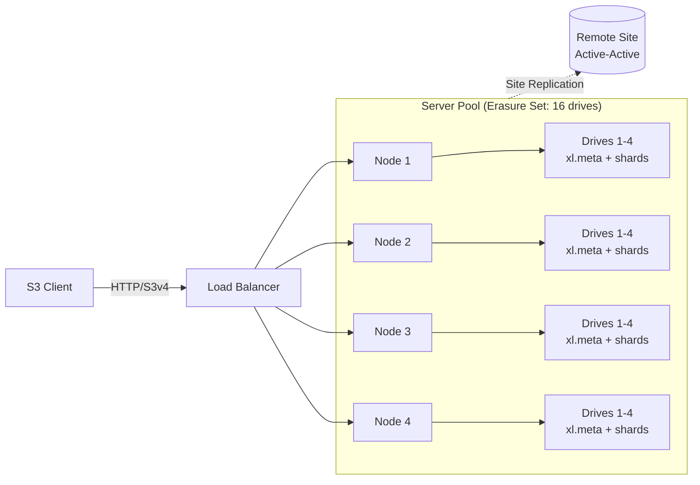

# MinIO — S3-Compatible Object Storage in the Post-OSS Era

## Summary

MinIO is a single-binary, S3-compatible object store written in Go, originally famous for letting a small team stand up a distributed-EC, S3-API cluster in under an hour with no external database. As of May 2026 the picture is very different: the open-source `minio/minio` repository was put into maintenance mode in **December 2025** and **archived (read-only) on 2026-04-25**, pre-compiled community binaries are no longer published, and the web Console was stripped from the AGPLv3 build in February 2025. Active development now lives only in the proprietary **AIStor** product line (Free / Enterprise Lite / Enterprise), with Enterprise list pricing around **$96K/year for ≤400 TB**. The architectural ideas remain sound — per-object Reed-Solomon erasure coding, inline metadata, HighwayHash bitrot detection, single-binary ops — but the build-vs-buy question is no longer "pick MinIO and run it free forever." This report covers the architecture you would learn from MinIO regardless, compares it head-to-head with the three credible self-hosted OSS alternatives (**Ceph RGW**, **SeaweedFS**, **Garage**), and ends with a decision matrix for greenfield deployments in 2026.

> Status note (May 2026): the upstream community fork **`pgsty/minio`** (Pigsty) is now publishing hardened AGPLv3 releases (most recent `RELEASE.2026-04-17T00-00-00Z`). It is the practical "free MinIO" path going forward but is community-maintained, not vendor-supported.

## Feature & Comparison Table

| Dimension | **MinIO (community / AIStor)** | **Ceph RGW (Tentacle 20.2.1)** | **SeaweedFS (4.x)** | **Garage (2.3.0)** |
|---|---|---|---|---|
| **Type / category** | Pure-object, S3 API only | Multi-protocol object/block/file via RGW gateway on RADOS | Object + optional POSIX filer + S3 gateway | Pure-object, S3 API only |
| **Core architecture** | Single Go binary; per-object Reed-Solomon EC across an erasure set; inline `xl.meta` | Stateless RGW HTTP → RADOS pools (BlueStore OSDs); CRUSH placement; per-pool EC or replication | Master (Raft) + volume servers (Haystack needles) + optional filer with pluggable external DB | Peer-to-peer Rust nodes; CRDT metadata; Maglev-style consistent hash with geo zones |
| **License / development status** | Server: AGPLv3 (community archived 2026-04-25). AIStor: proprietary, actively developed | LGPL-2.1; actively developed | Apache-2.0 core (paid Enterprise tier $1/TB/month after 25 TB free) | AGPLv3; actively developed |
| **Primary interfaces** | S3 v4 (full), STS, OIDC, LDAP, IAM-style policies | S3 + Swift; STS; bucket policies + IAM users/subusers | S3, HDFS, WebDAV, FUSE (via filer) | S3 + minimal admin API (v2) |
| **Erasure coding** | Reed-Solomon, 4–16 drives/set, per-object EC | Per-pool EC; typical 4+2, 8+3 | RS(10,4) on warm volumes; replication for hot | None — replication only (typical RF=3) |
| **Bitrot detection** | HighwayHash on every read/write | BlueStore per-block CRC32C | CRC32 per needle | Blake2 per chunk |
| **Consistency model** | Strong read-after-write within a deployment; site replication async | Strong within cluster (RADOS); multi-site async | Strong within master view; filer = DB-dependent | Eventual on metadata (CRDT); per-object monotonic |
| **Min production cluster** | 4 nodes × 4 drives (single erasure set) | 3 mon + 5+ OSD + 2+ RGW (~10 nodes) | 3 masters + 3 volume servers + filer | 3 nodes (ideally 3 zones) |
| **Versioning / Object Lock / Lifecycle** | ✅ / ✅ / ✅ | ✅ / ✅ / ✅ | ✅ / ✅ / partial | ❌ / ❌ / ❌ |
| **Multi-site / geo** | Site Replication (active-active; KMS + versioning forced on) | Realm → zonegroup → zone, async; mature | Cross-DC replication in Enterprise tier | Native geo zones, first-class (the design centerpiece) |
| **Per-node throughput (vendor, NVMe + 100 GbE)** | ~5–6 GB/s read / ~5 GB/s write | ~9 GiB/s read / ~5.5 GiB/s write (EC 2+2, 32 MiB) | No first-party benchmark of comparable rigor | Not throughput-optimized |
| **K8s operator** | MinIO Operator (now in same maintenance limbo) | Rook (mature, active) | Helm charts + community operators | Community operator |
| **Hardware sweet spot** | Homogeneous NVMe pools, 100 GbE | Heterogeneous; SSD metadata pool + HDD/QLC data pool | Mixed; designed for warm/cold tiering | Heterogeneous, modest hardware, geo-distributed |
| **Best fit** | High-throughput AI/ML data lakes, backup targets, S3 endpoint for Trino/Spark — *if* the licensing path is settled | Exabyte-scale enterprises that also need RBD/CephFS; teams with storage ops expertise | Billions of small files; HDFS replacement; backend behind JuiceFS | Self-hosted, geo-distributed, ≤100 TB; cooperatives and homelabs |
| **Cost — 1 PB usable, 3 yr (rough)** | AIStor Enterprise list ~$240/TB/yr ≈ **$720K/3 yr** + hardware. Community/Pigsty: $0 + hardware + your operational risk | OSS free; commercial support (IBM, SUSE, Croit, 42on) ~$50–100K/yr; hardware-heavy (3× repl or EC overhead) | OSS free; Enterprise ~$1/TB/month ≈ **$36K/yr for 1 PB** | OSS free; no commercial support vendor |

> Cost figures are rough public-list estimates as of May 2026. AIStor pricing derives from press coverage of the $96K/400 TB Enterprise quote; expect significant volume discounting at PB scale. Hardware cost is excluded throughout.

## In-Depth Implementation Report

### 1. Architecture Deep-Dive

MinIO's architectural distinctiveness comes from what it *doesn't* have: no separate metadata service, no journal, no consensus quorum on the data path, no external database. Everything an S3 request needs to find an object is encoded in the same erasure-coded shards that hold the data itself.

**Erasure set.** The unit of placement is the *erasure set* — a group of 4 to 16 drives spread across the nodes of a pool. For each PUT, MinIO Reed-Solomon-encodes the object into `K` data shards and `M` parity shards (default ~12+4 on a 16-drive set), writes one shard per drive in the set, and stores a tiny `xl.meta` alongside each shard. Read quorum is `K`; write quorum is `K` (or `K+1` when parity is exactly half the set). There is no per-object index — the deterministic mapping from object name to erasure set and the inline `xl.meta` are enough.

**Server pools.** A deployment is one or more pools; new capacity is added by introducing a new pool with its own (possibly different) erasure-set geometry. Objects are placed in the pool with the most free space at PUT time; existing data is not rebalanced unless the operator runs an explicit decommission. This sidesteps the multi-week rebalance that Ceph admins associate with adding OSDs, at the cost of skewed utilization until the pools converge.

**Site Replication.** Active-active replication of buckets, IAM, KMS keys, and policies across geographically separate clusters. The current implementation requires KMS encryption and force-enables bucket versioning — a constraint worth surfacing before committing, because both have downstream implications for storage overhead and key custody.

**Where this differs from Ceph RGW.** Ceph splits the same problem across three layers: an HTTP gateway (RGW), a placement engine (RADOS + CRUSH), and a per-OSD object store (BlueStore + RocksDB). Bucket metadata lives in a dedicated replicated pool, bucket indexes in another, payload in a third (often EC), and large buckets are auto-sharded across many RADOS PGs. The cost is configuration surface and daemon count; the benefit is the same cluster can serve RBD block volumes to your Kubernetes PVs and CephFS to your HPC users.

**Where this differs from SeaweedFS.** SeaweedFS inverts the small-file problem: the master tracks only volume-to-node mappings (not files), each volume is one large append-mostly file of "needles," and a read is one seek. For billion-file workloads this is a categorical win. The trade-off is that the filer (if used for POSIX/listings) becomes its own external-DB-shaped operational concern, and erasure coding in SeaweedFS is a *warm-storage* feature (objects must stop accepting writes before being EC-encoded).

**Where this differs from Garage.** Garage has no master at all; CRDT metadata replicates between peers via Merkle-tree synchronization, and placement uses a Maglev-style consistent hash that respects user-defined geographic zones. It is intentionally not built to win throughput benchmarks — it is built to keep an S3 endpoint alive on three asymmetric nodes across three home internet connections.

### 2. Key Design Patterns and Trade-Offs

**Per-object EC vs. per-pool EC.** MinIO computes erasure coding object-by-object inside a fixed-shape erasure set. Ceph chooses replication or EC per *pool*, and you can mix pools freely (e.g. replicated bucket-index, EC payload). MinIO's model is simpler to reason about and faster to deploy; Ceph's is more flexible for mixed media and lets you keep small-object indexes on SSD while bulk data lives on QLC or HDD.

| | **MinIO** | **Ceph RGW** |
|---|---|---|
| EC scope | Per object | Per pool |
| Parity geometry | Fixed per erasure set (4–16 drives) | Per-pool (k+m, any sane combo) |
| Metadata media | Same drive as data | Separate fast pool typically |
| Adding capacity | New pool (own geometry) | Add OSDs; rebalance |
| Mental overhead | Low | Higher; PG count, CRUSH map |

**No external database.** The decision to embed metadata in `xl.meta` next to data shards trades operational simplicity for something you'd notice in metadata-heavy workloads: there is no separate fast-media pool to put listings on. A bucket with hundreds of millions of objects puts the same I/O pressure on every drive in the erasure set. Ceph's separate index pool, SeaweedFS's master-of-volumes design, and Garage's CRDT tables all approach this differently.

**Single-binary, no journal.** No write-ahead log means recovery is purely shard-counting against the erasure code, not log replay. This works well for the "most failures are drive failures" model but means there is no central audit log of every write — observability has to come from per-request logs and external monitoring.

**HighwayHash everywhere.** End-to-end checksumming covers the client→network→disk path; the algorithm runs >10 GB/s on a single core so it is not a throughput tax. This is one of the clearer wins of MinIO's design vs. systems that only checksum at the disk layer.

### 3. Correctness, Consistency, and Integrity

- **Read-after-write**: strong within a deployment; write returns only after K (or K+1) shards are durable.
- **Failures**: tolerates loss of `M` drives per erasure set (and `M` whole nodes if drives are well distributed). Healing is per-erasure-set, runs in the background, and competes with client I/O — there is no separate recovery network like Ceph's cluster network.
- **Bitrot**: HighwayHash per shard, verified on every read; silent corruption is detected and repaired from parity on the fly.
- **Multi-site**: site replication is asynchronous; expect seconds-scale lag, conflict resolution by last-writer-wins on versioned objects.

### 4. Performance Characteristics (Vendor Numbers)

MinIO's headline benchmark (NVMe + 100 GbE, 32 nodes) reports ~2.6 Tbps aggregate GET and ~1.6 Tbps PUT — roughly **5.7 GB/s GET / 5.4 GB/s PUT per node**, bottlenecked by the 100 GbE NIC. Ceph's most recent comparable RGW benchmark (12 nodes, EC 2+2, 32 MiB objects, also 100 GbE) reports ~9.25 GiB/s GET / 5.5 GiB/s PUT per node, and ~24.4 GiB/s aggregate small-object IOPS at 64 KiB. Both are vendor-published; both are best case. The practical takeaway is that on cleanly tuned NVMe + 100 GbE the two systems land within a small factor of each other on large-object streaming, and neither is the right tool for small-object hot paths where SeaweedFS's Haystack design dominates.

### 5. Operational Model

- **Install**: single static binary, `minio server <drive-spec>`. Up in minutes.
- **Upgrade**: rolling restart; community now requires `go install github.com/minio/minio@latest` (or building from a fork like Pigsty) since binaries are no longer published.
- **Capacity expansion**: add a new server pool; never rebalance the existing one (intentional).
- **Day-2 ops**: `mc` CLI is the day-to-day tool; the web Console is now stripped to a minimal object browser in the community build, with the rich admin UI available only in AIStor.
- **Common failure modes**: skewed pool utilization (new pool fills first), erasure-set imbalance after a drive replacement, certificate rotation, KMS-key custody (especially with Site Replication).

### 6. Security and Multi-Tenancy

- **AuthN**: STS, OIDC, LDAP, AssumeRole, presigned URLs.
- **AuthZ**: AWS-IAM-compatible JSON policies, including condition keys; bucket policies; service accounts.
- **Encryption**: SSE-S3, SSE-KMS (KES or external KMS — Vault, AWS KMS, GCP KMS, Azure KeyVault), SSE-C. In-flight TLS.
- **Object Lock**: S3-compliant retention + legal hold; suitable for SEC 17a-4 / FINRA WORM use cases when paired with versioning.
- **Tenant isolation**: namespace per bucket + IAM; for hard isolation (separate KMS root, separate quotas, separate replication targets) you typically run separate deployments behind separate endpoints rather than rely on policy alone.

### 7. Ecosystem and Integrations

- **K8s**: MinIO Operator (CRDs for `Tenant`, `PolicyBinding`); now in the same maintenance freeze as the server. For new K8s deployments, Rook + Ceph RGW is the more actively developed alternative.
- **Frameworks**: drop-in replacement for any S3 SDK. Common usage as the object backing for **JuiceFS**, **Trino**, **Spark**, **Iceberg**, **Delta Lake**, **MLflow**, **Hugging Face datasets**, **Kubeflow Pipelines**, **Loki**, **Tempo**, **Mimir**.
- **Hyperscaler equivalents**: AWS S3, GCS, Azure Blob, Cloudflare R2, Backblaze B2 — all S3-compatible to varying degrees; the MinIO API itself targets near-100% S3 compatibility.

### 8. The Licensing Trajectory — What Senior Engineers Need to Know

This is the single most important non-obvious fact for any 2026 evaluation:

1. **April 2021** — server relicensed from Apache-2.0 to **AGPLv3**. First warning sign for embedded/SaaS users.
2. **February 2025** — Console gutted from the community build (commit `27742d...`); only a minimal object browser remains. Bucket management, IAM, monitoring, audit, configuration moved behind AIStor.
3. **December 2025** — repo README updated to declare maintenance mode; no new features, only case-by-case security fixes in the community edition.
4. **February 2026 → April 25, 2026** — repo archived, briefly unarchived, then re-archived. Pre-compiled binaries pulled from `dl.min.io` for the community AGPLv3 build.
5. **Late 2025** — **AIStor** introduced with three tiers:
   - *AIStor Free*: single-node only, full feature set, no HA.
   - *AIStor Enterprise Lite*: distributed, ≤400 TiB, no premium support.
   - *AIStor Enterprise*: unlimited scale, 24/7 support, "Panic Button"; list pricing reported at ~$96K/yr for 400 TB.
6. **April 2026** — community fork `pgsty/minio` (Pigsty) becomes the de facto OSS path, publishing hardened AGPLv3 builds with CVE fixes.

For the technology decision this means: if you are starting fresh today, MinIO-the-AGPLv3-server is a frozen codebase with a community fork picking up critical fixes, and MinIO-the-product is AIStor at commercial pricing. That is a fundamentally different value proposition from the "free, fast S3-in-a-box" reputation MinIO built between 2017 and 2024.

### 9. When to Pick MinIO (Mid-2026 Reality)

**Pick AIStor (commercial) when:**
- You need a turnkey, vendor-supported S3 endpoint with strong SLAs and the listed feature surface (object lock, KMS, site replication, audit) and the cluster will be ≥hundreds of TB.
- You are standardizing on a single object-storage API across edge sites and central DC and want a single vendor on the hook.
- You can absorb the ~$240/TB/yr list cost (with volume discount) into the project's TCO.

**Pick community/Pigsty MinIO when:**
- You are technically comfortable carrying a hardened community fork (CVE tracking, build pipeline, no vendor escalation path).
- The deployment is small-to-medium and the operational simplicity of a single binary remains the deciding factor over licensing risk.

**Do not pick MinIO when:**
- You need exabyte-scale and broad multi-protocol support — **Ceph RGW** is the only credible OSS answer at that tier.
- The dominant workload is billions of small files — **SeaweedFS** will be dramatically more efficient.
- You are building a geo-distributed system on heterogeneous, low-end hardware with high inter-site RTT — **Garage** is purpose-built for this niche and MinIO Site Replication is not.
- Long-term licensing certainty under a non-copyleft, non-vendor-controlled OSS license is a hard requirement — pick **SeaweedFS** (Apache-2.0) or **Ceph** (LGPL-2.1).

### Caveats Worth Surfacing in a Decision Doc

- **SeaweedFS v4.23 (May 2026)** is flagged by its own release notes as unsafe for erasure coding on multi-disk volume servers; pin to **v4.05 (Jan 2026)** in production until v4.24+ ships.
- **Garage** advertises a stub for `GetBucketVersioning` and does **not** support versioning, object lock, or lifecycle rules — disqualifying for most compliance use cases. Treat third-party blogs that claim "limited versioning" as wrong; trust the project's own compat doc.
- **MinIO production scale claims** ("double-digit exabyte" customers, "204 verified companies") are vendor-sourced; no independent disclosures match Ceph's CERN / Bloomberg / DigitalOcean public footprints.

## Sources

- [MinIO repo archival commit (maintenance mode README)](https://github.com/minio/minio/commit/27742d469462e1561c776f88ca7a1f26816d69e2) — accessed 2026-05
- [MinIO Erasure Coding documentation](https://min.io/docs/minio/linux/operations/concepts/erasure-coding.html) — accessed 2026-05
- [MinIO Distributed DESIGN.md](https://github.com/minio/minio/blob/master/docs/distributed/DESIGN.md) — accessed 2026-05
- [MinIO Site Replication docs (AIStor)](https://docs.min.io/enterprise/aistor-object-store/administration/replication/site-replication/) — accessed 2026-05
- [MinIO Data Authenticity & Integrity blog (HighwayHash)](https://blog.min.io/data-authenticity-integrity/) — accessed 2026-05
- [MinIO NVMe benchmark (2.6 Tbps GET / 1.6 Tbps PUT)](https://blog.min.io/nvme_benchmark/) — accessed 2026-05
- [MinIO AIStor pricing page](https://www.min.io/pricing) — accessed 2026-05
- [MinIO press release — AIStor Free / Enterprise Lite tiers](https://www.min.io/press/minio-introduces-aistor-free-and-enterprise-lite-tiers) — accessed 2026-05
- [Blocks & Files — MinIO removes management features from community edition](https://blocksandfiles.com/2025/06/19/minio-removes-management-features-from-basic-community-edition-object-storage-code/) — accessed 2026-05
- [InfoQ — MinIO S3 API Alternatives](https://www.infoq.com/news/2025/12/minio-s3-api-alternatives/) — accessed 2026-05
- [It's FOSS — MinIO moves away from open source](https://itsfoss.com/news/minio-moves-away-from-open-source/) — accessed 2026-05
- [XDA Developers — FOSS community forks MinIO (Pigsty)](https://www.xda-developers.com/the-foss-community-has-made-its-own-minio-fork-after-the-original-went-read-only/) — accessed 2026-05
- [Pigsty MinIO fork release notes](https://github.com/pgsty/minio/releases/tag/RELEASE.2026-04-17T00-00-00Z) — accessed 2026-05
- [Ceph v20.2.1 Tentacle release](https://ceph.io/en/news/blog/2026/v20-2-1-tentacle-released/) — accessed 2026-05
- [Ceph v20.2.0 Tentacle release notes (RGW changes)](https://ceph.io/en/news/blog/2025/v20-2-0-tentacle-released/) — accessed 2026-05
- [Ceph RGW deep dive part 1](https://ceph.io/en/news/blog/2025/rgw-deep-dive-1/) — accessed 2026-05
- [Ceph RGW benchmark part 2 (12 nodes, EC 2+2, 100 GbE)](https://ceph.io/en/news/blog/2025/benchmarking-object-part2/) — accessed 2026-05
- [Rook RGW multisite documentation](https://rook.io/docs/rook/latest-release/Storage-Configuration/Object-Storage-RGW/ceph-object-multisite/) — accessed 2026-05
- [SeaweedFS README](https://github.com/seaweedfs/seaweedfs) — accessed 2026-05
- [SeaweedFS Components wiki](https://github.com/seaweedfs/seaweedfs/wiki/Components) — accessed 2026-05
- [SeaweedFS Amazon S3 API wiki](https://github.com/seaweedfs/seaweedfs/wiki/Amazon-S3-API) — accessed 2026-05
- [SeaweedFS Erasure coding for warm storage](https://github.com/seaweedfs/seaweedfs/wiki/Erasure-coding-for-warm-storage) — accessed 2026-05
- [SeaweedFS releases (v4.23 EC regression note)](https://github.com/seaweedfs/seaweedfs/releases) — accessed 2026-05
- [SeaweedFS Enterprise pricing](https://seaweedfs.com/) — accessed 2026-05
- [Garage features documentation](https://garagehq.deuxfleurs.fr/documentation/reference-manual/features/) — accessed 2026-05
- [Garage S3 compatibility reference](https://garagehq.deuxfleurs.fr/documentation/reference-manual/s3-compatibility/) — accessed 2026-05
- [Garage introduction blog post (architecture)](https://garagehq.deuxfleurs.fr/blog/2022-introducing-garage/) — accessed 2026-05
- [Garage releases page](https://garagehq.deuxfleurs.fr/_releases.html) — accessed 2026-05
- [Garage GitHub compatibility issue #166 (versioning)](https://git.deuxfleurs.fr/Deuxfleurs/garage/issues/166) — accessed 2026-05
