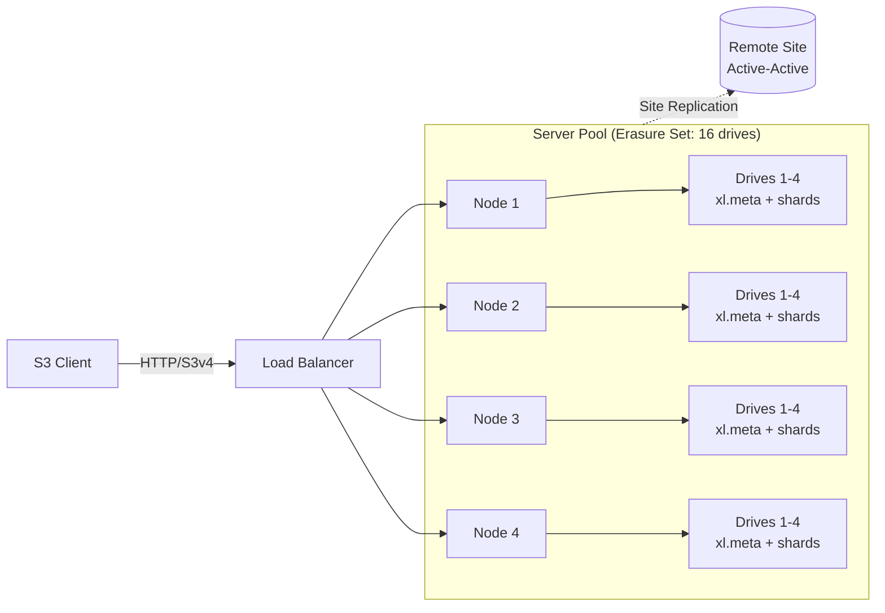

# MinIO — 後開源時代的 S3 相容物件儲存

## 摘要

MinIO 是以 Go 寫成的單一二進位、S3 相容物件儲存系統，曾以「不用外部資料庫，小團隊一小時內就能架起分散式 EC 叢集」聞名。但 2026 年 5 月的局勢已大不相同：開源的 `minio/minio` 儲存庫於 **2025 年 12 月**進入維護模式，並在 **2026-04-25** 正式封存（read-only），社群版預編譯二進位檔不再發布，Web Console 也已於 2025 年 2 月從 AGPLv3 版本中移除。目前活躍開發只存在於專有產品線 **AIStor**（Free / Enterprise Lite / Enterprise），Enterprise 公開報價約為 **≤400 TB 每年 9.6 萬美元**。架構設計本身（per-object Reed-Solomon 抹除碼、中繼資料內嵌、HighwayHash bitrot 偵測、單一二進位運維）仍具參考價值，但「選 MinIO 然後永遠免費跑下去」這個前提已不成立。本報告涵蓋仍值得學習的架構知識、與三套可信賴的自架 OSS 替代方案 — **Ceph RGW**、**SeaweedFS**、**Garage** — 的逐項對比，最後給出 2026 年新部署的選型判斷。

> 狀態註記（2026 年 5 月）：上游社群分支 **`pgsty/minio`**（Pigsty）正在發布加固過的 AGPLv3 release（最新為 `RELEASE.2026-04-17T00-00-00Z`），是目前最務實的「免費 MinIO」路線，但屬社群維護而非廠商支援。

## 功能與比較表

| 維度 | **MinIO（社群版 / AIStor）** | **Ceph RGW（Tentacle 20.2.1）** | **SeaweedFS（4.x）** | **Garage（2.3.0）** |
|---|---|---|---|---|
| **類別** | 純物件儲存，僅 S3 API | RGW gateway 上層多協定（物件/區塊/檔案）建構於 RADOS | 物件 + 選用 POSIX filer + S3 gateway | 純物件儲存，僅 S3 API |
| **核心架構** | 單一 Go 二進位；erasure set 內逐物件做 Reed-Solomon EC；中繼資料內嵌 `xl.meta` | 無狀態 RGW HTTP → RADOS pool（BlueStore OSD）；CRUSH 放置；EC/replication 可按 pool 設定 | Master（Raft）+ Volume Server（Haystack needle）+ 選用 filer 搭配可插拔外部資料庫 | 點對點 Rust 節點；CRDT 中繼資料；Maglev 風格一致性雜湊配合地理 zone |
| **授權 / 開發狀態** | Server：AGPLv3（社群於 2026-04-25 封存）。AIStor：專有，持續開發中 | LGPL-2.1；持續開發 | Apache-2.0 核心（付費 Enterprise 25 TB 後每 TB 每月 $1） | AGPLv3；持續開發 |
| **主要介面** | S3 v4（完整）、STS、OIDC、LDAP、IAM 風格政策 | S3 + Swift；STS；bucket policy + IAM 使用者/子使用者 | S3、HDFS、WebDAV、FUSE（透過 filer） | S3 + 簡化版管理 API（v2） |
| **抹除碼支援** | Reed-Solomon、4–16 drive/set、逐物件 EC | 按 pool 設定 EC；典型 4+2、8+3 | RS(10,4) 用於 warm volume；hot 用 replication | 無 — 僅 replication（典型 RF=3） |
| **Bitrot 偵測** | 每次讀寫皆套用 HighwayHash | BlueStore per-block CRC32C | 每個 needle CRC32 | 每個 chunk Blake2 |
| **一致性模型** | 同一部署內強讀後寫一致；site replication 為非同步 | 叢集內強一致（RADOS）；多站點為非同步 | Master 視角內強一致；filer 依其 DB 而定 | 中繼資料最終一致（CRDT）；單一物件 monotonic |
| **生產最小叢集** | 4 節點 × 4 drive（單一 erasure set） | 3 mon + 5+ OSD + 2+ RGW（約 10 節點） | 3 master + 3 volume server + filer | 3 節點（理想分屬 3 zone） |
| **Versioning / Object Lock / Lifecycle** | ✅ / ✅ / ✅ | ✅ / ✅ / ✅ | ✅ / ✅ / 部分 | ❌ / ❌ / ❌ |
| **多站點 / 地理複製** | Site Replication（active-active；強制啟用 KMS 與 versioning） | Realm → zonegroup → zone，非同步；成熟 | 跨機房複製為 Enterprise 功能 | 原生地理 zone，一級設計 |
| **單節點吞吐（廠商，NVMe + 100 GbE）** | 約 5–6 GB/s 讀 / 約 5 GB/s 寫 | 約 9 GiB/s 讀 / 5.5 GiB/s 寫（EC 2+2，32 MiB） | 無同等嚴謹的第一手 benchmark | 非以吞吐為設計目標 |
| **K8s operator** | MinIO Operator（與 server 同處維護凍結狀態） | Rook（成熟、活躍） | Helm chart + 社群 operator | 社群 operator |
| **硬體甜蜜點** | 同構 NVMe pool、100 GbE | 異構；SSD 中繼資料 pool + HDD/QLC 資料 pool | 混合；設計上就考量 warm/cold 分層 | 異構、低規格、地理分散 |
| **最佳使用情境** | 高吞吐 AI/ML data lake、備份標的、Trino/Spark 的 S3 端點 — *前提是*授權路線已確認 | EB 等級企業、同時需要 RBD/CephFS、有儲存維運能量的團隊 | 數十億小檔案；HDFS 替代品；JuiceFS 後端 | 自架、地理分散、≤100 TB；合作社與 homelab |
| **成本 — 1 PB 可用、3 年（估）** | AIStor Enterprise 公開價約 $240/TB/yr ≈ **3 年 $720K** + 硬體。社群/Pigsty：$0 + 硬體 + 運維風險自負 | OSS 免費；商業支援（IBM、SUSE、Croit、42on）約 $50–100K/yr；硬體吃重（3× 副本或 EC 額外消耗） | OSS 免費；Enterprise 約 $1/TB/月 ≈ **1 PB 每年 $36K** | OSS 免費；無商業支援廠商 |

> 成本數字皆為 2026 年 5 月公開報價的粗估。AIStor 來自媒體報導的 $96K / 400 TB Enterprise 報價，PB 規模實際應有顯著折扣。硬體成本一律未計入。

## 實作深度報告

### 1. 架構深入解析

MinIO 架構上的獨特之處，在於它*沒有*什麼：沒有獨立的 metadata service、沒有 journal、資料路徑上沒有共識仲裁、沒有外部資料庫。一個 S3 請求找到物件所需的一切，都編碼在和資料同一份的 EC 分片裡。

**Erasure set.** 放置的基本單位是 *erasure set* — 跨 pool 各節點分布的 4 到 16 顆 drive 一組。對每個 PUT，MinIO 將物件 Reed-Solomon 編碼為 `K` 份資料分片與 `M` 份同位分片（16 drive 預設約 12+4），每顆 drive 寫一份，並在每個分片旁放一個極小的 `xl.meta`。讀仲裁為 `K`；當同位數正好為 set 一半時，寫仲裁為 `K+1`。沒有任何 per-object index — 物件名到 erasure set 的決定性對映加上內嵌 `xl.meta` 就夠了。

**Server pool.** 一個部署由一或多個 pool 組成；要擴容就引入新的 pool（其 erasure-set 幾何可不同於舊 pool）。PUT 時物件落在空間最多的 pool；現有資料不會 rebalance，除非操作員手動退役某個 pool。這設計避開了 Ceph 管理員熟悉的「加 OSD 之後幾週的 rebalance」風暴，但代價是兩 pool 收斂前使用率會偏斜。

**Site Replication.** 對 bucket、IAM、KMS 金鑰、policy 做地理分隔叢集間的 active-active 複製。目前實作強制啟用 KMS 加密與 bucket versioning — 在正式採用前要先弄清楚，因為兩者對儲存開銷與金鑰託管都有後續影響。

**和 Ceph RGW 的差異.** Ceph 把同樣的問題拆成三層：HTTP gateway（RGW）、placement engine（RADOS + CRUSH）、per-OSD object store（BlueStore + RocksDB）。Bucket 中繼資料落在一個 replicated pool、bucket index 在另一個、payload 在第三個（通常是 EC），大 bucket 又會自動 shard 到多個 RADOS PG。代價是組態介面與 daemon 數量；好處是同一個叢集還能同時對 Kubernetes 提供 RBD 區塊磁碟、對 HPC 提供 CephFS。

**和 SeaweedFS 的差異.** SeaweedFS 把小檔案問題反過來解：master 只追蹤 volume-to-node 對應（不追蹤檔案），每個 volume 是一個由「needle」組成的大型 append-only 檔，讀取只需一次 seek。對數十億檔案的場景這是壓倒性勝利。代價是 filer（若用 POSIX/listing）會變成另一個外部 DB 形狀的運維議題，而 SeaweedFS 的 EC 是「warm storage」功能（物件必須先停止接受寫入，才能轉成 EC）。

**和 Garage 的差異.** Garage 連 master 都沒有；中繼資料是 CRDT，透過 Merkle-tree 同步在 peer 間複製，放置採用考量使用者自訂地理 zone 的 Maglev 風格一致性雜湊。它刻意不為吞吐量榜單而生 — 它要解的是「三條家用網路、三台規格不同的舊筆電」上把 S3 endpoint 撐起來的問題。

### 2. 關鍵設計取捨

**Per-object EC vs. per-pool EC.** MinIO 是在固定形狀的 erasure set 中逐物件做 EC。Ceph 是按 *pool* 選 replication 或 EC，並可自由混搭（replicated bucket-index pool + EC payload pool 是典型）。MinIO 的模型更簡單易懂、部署更快；Ceph 的模型對混合媒體更彈性，讓小物件 index 留在 SSD、大量資料放在 QLC 或 HDD。

| | **MinIO** | **Ceph RGW** |
|---|---|---|
| EC 作用範圍 | 每個物件 | 每個 pool |
| 同位幾何 | 每個 erasure set 固定（4–16 drive） | 每個 pool 自選（k+m，任意合理組合） |
| 中繼資料媒體 | 與資料同 drive | 通常為獨立的快速 pool |
| 擴容 | 新增 pool（可自帶幾何） | 加 OSD；rebalance |
| 心智負擔 | 低 | 較高；PG 計數、CRUSH map |

**沒有外部資料庫.** 把中繼資料和資料分片擺在同一個 `xl.meta` 旁邊，是用運維簡單性換來的東西 — 結果就是 metadata-heavy workload 沒有獨立的快速媒體 pool 可放 listing。一個有上億物件的 bucket，I/O 壓力會均等落在 erasure set 的每顆 drive 上。Ceph 的獨立 index pool、SeaweedFS 的 master-of-volumes 設計、Garage 的 CRDT 表，三家對此的解法各不相同。

**單一二進位、無 journal.** 沒有 WAL 表示復原靠 EC 計算分片，而不是 log replay。對「大部分故障是 drive 故障」的模型很適合，但也代表沒有一個集中的寫入稽核記錄 — observability 必須來自 per-request log 與外部監控。

**HighwayHash 無所不在.** 端到端校驗覆蓋了 client→network→disk 路徑；該演算法單核就能跑 >10 GB/s，所以不是吞吐量稅。比起只在磁碟層做校驗的系統，這是 MinIO 設計上少見的明確優點。

### 3. 正確性、一致性與完整性

- **讀後寫**：同一部署內為強一致；寫入要等 K（或 K+1）份分片落盤才回應。
- **故障**：每個 erasure set 可容忍 `M` 顆 drive 失效（若 drive 分布得宜，亦容忍 `M` 個節點故障）。Healing 以 erasure set 為單位，在背景執行，會和 client I/O 競爭頻寬 — 沒有像 Ceph 那種獨立 recovery network。
- **Bitrot**：每個分片有 HighwayHash，每次讀取都驗；靜默資料損毀會即時被偵測並由同位修復。
- **多站點**：site replication 為非同步；預期秒級延遲，衝突以 versioned 物件 last-writer-wins 解決。

### 4. 效能特性（廠商數字）

MinIO 標誌性 benchmark（NVMe + 100 GbE，32 節點）報出約 2.6 Tbps aggregate GET 與 1.6 Tbps PUT — 約 **每節點 5.7 GB/s GET / 5.4 GB/s PUT**，瓶頸是 100 GbE NIC。Ceph 最近一次同類 RGW benchmark（12 節點、EC 2+2、32 MiB 物件、同樣 100 GbE）報出每節點約 9.25 GiB/s GET / 5.5 GiB/s PUT，以及 64 KiB 小物件總和 IOPS 約 24.4 GiB/s。兩者皆為廠商數字、皆為理想情境。實務結論是：在乾淨調教過的 NVMe + 100 GbE 上，兩者大物件串流落在小幅差距內；而小物件 hot path 兩者都不是最佳工具 — SeaweedFS 的 Haystack 設計才是該場景的勝者。

### 5. 維運模型

- **安裝**：單一 static binary，`minio server <drive-spec>`，分鐘級就緒。
- **升級**：rolling restart；社群版現在需要 `go install github.com/minio/minio@latest`（或從 Pigsty 等分支建置），因為已不再發布二進位檔。
- **擴容**：新增 server pool；現有 pool 永不 rebalance（設計使然）。
- **Day-2 維運**：日常以 `mc` CLI 操作；web Console 在社群版只剩極簡 object browser，完整管理 UI 只在 AIStor。
- **常見故障模式**：pool 使用率偏斜（新 pool 先被塞滿）、drive 更換後 erasure set 不平衡、憑證輪替、KMS 金鑰託管（在開啟 Site Replication 時尤其重要）。

### 6. 安全性與多租戶

- **AuthN**：STS、OIDC、LDAP、AssumeRole、presigned URL。
- **AuthZ**：AWS-IAM 相容 JSON policy（含 condition key）、bucket policy、service account。
- **加密**：SSE-S3、SSE-KMS（KES 或外部 KMS — Vault、AWS KMS、GCP KMS、Azure KeyVault）、SSE-C；傳輸層 TLS。
- **Object Lock**：S3 相容保留期 + legal hold；搭配 versioning 可用於 SEC 17a-4 / FINRA WORM 合規。
- **租戶隔離**：bucket + IAM 命名空間隔離；如需硬隔離（獨立 KMS root、獨立配額、獨立 replication 標的），實務上是部署多套叢集、各自獨立 endpoint，而非僅靠 policy。

### 7. 生態系與整合

- **K8s**：MinIO Operator（提供 `Tenant`、`PolicyBinding` 等 CRD）；現與 server 同處維護凍結。新建 K8s 部署，Rook + Ceph RGW 是開發更活躍的替代方案。
- **框架**：對任何 S3 SDK 都是 drop-in 替換。常見作為 **JuiceFS**、**Trino**、**Spark**、**Iceberg**、**Delta Lake**、**MLflow**、**Hugging Face datasets**、**Kubeflow Pipelines**、**Loki**、**Tempo**、**Mimir** 的物件後端。
- **超大規模雲對應**：AWS S3、GCS、Azure Blob、Cloudflare R2、Backblaze B2 — 各家 S3 相容程度不一；MinIO 自身則以接近 100% S3 相容為目標。

### 8. 授權軌跡 — 資深工程師需要知道的事

這是 2026 年任何 MinIO 評估中最重要、也最不顯眼的一件事：

1. **2021 年 4 月** — server 從 Apache-2.0 改授權為 **AGPLv3**。對嵌入式/SaaS 使用者的第一個警訊。
2. **2025 年 2 月** — Console 從社群版被刪除（commit `27742d...`）；只留下極簡 object browser。Bucket 管理、IAM、監控、稽核、組態都移到 AIStor 後面。
3. **2025 年 12 月** — README 更新宣告進入維護模式；社群版「不收新功能，只 case-by-case 評估關鍵安全修補」。
4. **2026 年 2 月 → 4 月 25 日** — 儲存庫被封存、短暫解封、再度封存；社群 AGPLv3 build 的預編譯二進位檔從 `dl.min.io` 撤除。
5. **2025 年末** — 推出 **AIStor**，三個級別：
   - *AIStor Free*：僅單節點、全功能、不支援 HA。
   - *AIStor Enterprise Lite*：分散式、≤400 TiB、無高級支援。
   - *AIStor Enterprise*：規模不設限、24/7 支援、「Panic Button」；公開報價約 400 TB 每年 9.6 萬美元。
6. **2026 年 4 月** — 社群分支 `pgsty/minio`（Pigsty）成為實質的 OSS 路線，持續發布補上 CVE 修補的加固 AGPLv3 build。

對技術選型的意義：今天若要新建部署，AGPLv3 MinIO 是一個由社群分支接手關鍵修補的凍結 codebase，而真正的「MinIO 產品」是商業價格的 AIStor。這已和 MinIO 在 2017–2024 間建立的「免費、快速、開箱即用」名聲是完全不同的價值主張。

### 9. 何時應該選 MinIO（2026 年中的現實）

**選 AIStor（商業）的時機：**
- 需要一個 turnkey、廠商支援、SLA 強的 S3 endpoint，且具備所列功能面（object lock、KMS、site replication、稽核），叢集規模至少數百 TB 起跳。
- 你要在邊緣站點與中央 DC 統一單一物件儲存 API，並希望責任歸於單一廠商。
- 專案 TCO 能吸收約 $240/TB/yr 公開價（含量大可議價）。

**選社群版／Pigsty MinIO 的時機：**
- 技術上能自負加固社群分支（CVE 追蹤、build pipeline、無廠商升級路徑）。
- 規模中小、運維上「單一二進位」的簡單性仍重於授權風險。

**不要選 MinIO 的時機：**
- 需要 EB 等級、且要廣泛多協定支援 — 該規模唯一可信賴的 OSS 答案是 **Ceph RGW**。
- 主要工作負載是數十億小檔案 — **SeaweedFS** 在這場景效率高出一個數量級。
- 建構在低階異構硬體、跨地高 RTT 的地理分散系統 — **Garage** 正是為這個利基而生，MinIO Site Replication 並不是。
- 長期授權確定性要求 — 必須是非 copyleft、非廠商主控的 OSS 授權 — 應選 **SeaweedFS**（Apache-2.0）或 **Ceph**（LGPL-2.1）。

### 寫進選型文件時值得標註的注意事項

- **SeaweedFS v4.23（2026 年 5 月）** 自家 release note 已標示在多 disk volume server 上做 EC 不安全；生產上應釘在 **v4.05（2026 年 1 月）**，等 v4.24+ 出再升。
- **Garage** `GetBucketVersioning` 回傳的是 stub，**不支援** versioning、object lock、lifecycle rule — 絕大多數合規場景直接出局。第三方部落格說它「有限度支援 versioning」是錯的，以官方相容性文件為準。
- **MinIO 的規模宣稱**（「雙位數 EB 客戶」、「204 家可驗證公司」）皆為廠商說法；目前沒有像 Ceph 那種 CERN／Bloomberg／DigitalOcean 等級的獨立公開揭露。

## Sources

- [MinIO repo archival commit (maintenance mode README)](https://github.com/minio/minio/commit/27742d469462e1561c776f88ca7a1f26816d69e2) — accessed 2026-05
- [MinIO Erasure Coding documentation](https://min.io/docs/minio/linux/operations/concepts/erasure-coding.html) — accessed 2026-05
- [MinIO Distributed DESIGN.md](https://github.com/minio/minio/blob/master/docs/distributed/DESIGN.md) — accessed 2026-05
- [MinIO Site Replication docs (AIStor)](https://docs.min.io/enterprise/aistor-object-store/administration/replication/site-replication/) — accessed 2026-05
- [MinIO Data Authenticity & Integrity blog (HighwayHash)](https://blog.min.io/data-authenticity-integrity/) — accessed 2026-05
- [MinIO NVMe benchmark (2.6 Tbps GET / 1.6 Tbps PUT)](https://blog.min.io/nvme_benchmark/) — accessed 2026-05
- [MinIO AIStor pricing page](https://www.min.io/pricing) — accessed 2026-05
- [MinIO press release — AIStor Free / Enterprise Lite tiers](https://www.min.io/press/minio-introduces-aistor-free-and-enterprise-lite-tiers) — accessed 2026-05
- [Blocks & Files — MinIO removes management features from community edition](https://blocksandfiles.com/2025/06/19/minio-removes-management-features-from-basic-community-edition-object-storage-code/) — accessed 2026-05
- [InfoQ — MinIO S3 API Alternatives](https://www.infoq.com/news/2025/12/minio-s3-api-alternatives/) — accessed 2026-05
- [It's FOSS — MinIO moves away from open source](https://itsfoss.com/news/minio-moves-away-from-open-source/) — accessed 2026-05
- [XDA Developers — FOSS community forks MinIO (Pigsty)](https://www.xda-developers.com/the-foss-community-has-made-its-own-minio-fork-after-the-original-went-read-only/) — accessed 2026-05
- [Pigsty MinIO fork release notes](https://github.com/pgsty/minio/releases/tag/RELEASE.2026-04-17T00-00-00Z) — accessed 2026-05
- [Ceph v20.2.1 Tentacle release](https://ceph.io/en/news/blog/2026/v20-2-1-tentacle-released/) — accessed 2026-05
- [Ceph v20.2.0 Tentacle release notes (RGW changes)](https://ceph.io/en/news/blog/2025/v20-2-0-tentacle-released/) — accessed 2026-05
- [Ceph RGW deep dive part 1](https://ceph.io/en/news/blog/2025/rgw-deep-dive-1/) — accessed 2026-05
- [Ceph RGW benchmark part 2 (12 nodes, EC 2+2, 100 GbE)](https://ceph.io/en/news/blog/2025/benchmarking-object-part2/) — accessed 2026-05
- [Rook RGW multisite documentation](https://rook.io/docs/rook/latest-release/Storage-Configuration/Object-Storage-RGW/ceph-object-multisite/) — accessed 2026-05
- [SeaweedFS README](https://github.com/seaweedfs/seaweedfs) — accessed 2026-05
- [SeaweedFS Components wiki](https://github.com/seaweedfs/seaweedfs/wiki/Components) — accessed 2026-05
- [SeaweedFS Amazon S3 API wiki](https://github.com/seaweedfs/seaweedfs/wiki/Amazon-S3-API) — accessed 2026-05
- [SeaweedFS Erasure coding for warm storage](https://github.com/seaweedfs/seaweedfs/wiki/Erasure-coding-for-warm-storage) — accessed 2026-05
- [SeaweedFS releases (v4.23 EC regression note)](https://github.com/seaweedfs/seaweedfs/releases) — accessed 2026-05
- [SeaweedFS Enterprise pricing](https://seaweedfs.com/) — accessed 2026-05
- [Garage features documentation](https://garagehq.deuxfleurs.fr/documentation/reference-manual/features/) — accessed 2026-05
- [Garage S3 compatibility reference](https://garagehq.deuxfleurs.fr/documentation/reference-manual/s3-compatibility/) — accessed 2026-05
- [Garage introduction blog post (architecture)](https://garagehq.deuxfleurs.fr/blog/2022-introducing-garage/) — accessed 2026-05
- [Garage releases page](https://garagehq.deuxfleurs.fr/_releases.html) — accessed 2026-05
- [Garage GitHub compatibility issue #166 (versioning)](https://git.deuxfleurs.fr/Deuxfleurs/garage/issues/166) — accessed 2026-05
