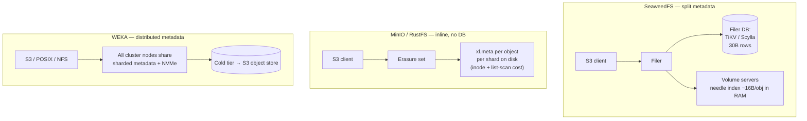

# Object Storage at 30 Billion Small Objects: MinIO vs. SeaweedFS vs. RustFS vs. WEKA

## Summary

For an S3 workload that must hold **~30 billion small objects today** (and grow), the deciding factor is not throughput or even capacity — it is **where object metadata lives and what each object costs in metadata terms**. The four systems here sit at very different points on that axis. **MinIO** (and the Rust drop-in **RustFS**, which copies its design) stores metadata inline as one `xl.meta` per object per erasure shard with no metadata database; this is genuinely fast for *individual* small-object I/O but turns 30B objects into tens of billions of tiny files on the backing disks, where inode pressure and `ListObjects` scan cost become the wall. **SeaweedFS** is the only one of the four *designed* for this exact problem — volume servers pack objects into large append-only "needle" files at ~16 bytes of RAM per object, so the volume layer scales effortlessly; the catch is that S3 forces all 30B keys into the **filer's external metadata DB**, which becomes the real scaling decision (TiKV/ScyllaDB-class, not SQLite). **WEKA** is the only one with a fully distributed-metadata design that handles tens of billions of files with no metadata-server bottleneck and best-in-class small-file latency — but it is a proprietary NVMe-first parallel filesystem where S3 is a secondary presentation layer, and its cost is an order of magnitude above the commodity options. Net: for 30B small objects on a budget, **SeaweedFS** is the default OSS answer (size the filer DB deliberately); **WEKA** wins if small-object *latency* drives an AI/HPC pipeline and budget allows; **MinIO/RustFS** are the riskier picks at this object count and RustFS is additionally pre-GA.

> Versions and dates evaluated, as of **May 2026**: MinIO last community release `RELEASE.2025-10-15`, then source-only; `minio/minio` marked no-longer-maintained 2026-02-12 and archived read-only 2026-04-25 (last AGPL builds now via the **Pigsty** fork); **AIStor** is the proprietary successor. SeaweedFS **v4.29** (2026-05-26; weekly cadence). RustFS **v1.0.0-beta.6** (~2026-05-27), targeting **GA ~July 2026** — distributed mode still marked "under testing." WEKA: WekaFS **4.4 LTS / 5.0** code line, platform rebranded **NeuralMesh** (AI Data Platform GA 2026-03). All cost figures are rough public-list estimates for the dates shown.

## Feature & Comparison Table

| Dimension | **SeaweedFS (4.29)** | **MinIO (community/Pigsty + AIStor)** | **RustFS (1.0 beta)** | **WEKA / NeuralMesh (WekaFS 4.4/5.0)** |
|---|---|---|---|---|
| **Type / category** | Object + POSIX filer + S3 gateway | Pure-object, S3 API | Pure-object, S3 API (MinIO drop-in) | Parallel filesystem + multi-protocol (S3 secondary) |
| **Core architecture** | Raft master (tracks *volumes*) + volume servers (Haystack needles) + filer on pluggable DB | Single Go binary; per-object Reed-Solomon EC; inline `xl.meta`; no metadata DB | Rust; MinIO-style per-object EC + inline metadata | Software-defined; fully **distributed metadata** sharded across all nodes; NVMe tier + object tier |
| **Where object metadata lives** | Volume layer: ~16 B/object RAM. **S3 path→fid in filer DB** (Postgres/TiKV/Redis/Cassandra) | Inline `xl.meta`, one per object per shard on each drive | Inline, MinIO-style (per object per shard) | Distributed metadata across cluster DRAM/NVMe; no metadata server |
| **Per-object overhead at scale** | ~16 B RAM + ~40 B disk per object **+** 1 row/object in filer DB | ~1–4 KB `xl.meta` ×(shards) on disk; tiny objects inline data <128 KiB | Same class as MinIO (reuses `xl.meta` format) | 20 B RAM + 4 KB SSD per metadata unit; distributed |
| **Small-object hot path** | One disk seek per read (needle index in RAM) | One/two file opens per object; metacache for listings | Claims 2.3× MinIO on 4 KB GETs (vendor benchmark) | Sub-ms metadata + data; kernel-bypass (DPDK/SR-IOV) |
| **Scaling ceiling for object COUNT** | Volume layer ~unbounded; **ceiling = filer DB** choice | Backing-FS **inode count + list-scan cost**; metacache mitigates | Same ceiling as MinIO, **unproven at 30B** | Vendor docs: 6.4T files/namespace; 6.4B files/dir |
| **Erasure coding** | RS(10,4) on warm (read-only) volumes; replication for hot | Reed-Solomon, 4–16 drives/set, per-object | Reed-Solomon, MinIO-style | Distributed EC (e.g. N+2/N+4), cluster-wide |
| **Consistency** | Strong (W=N,R=1) on volumes; filer = DB-dependent | Strong read-after-write in deployment | Strong (claimed) | Strong, POSIX-consistent |
| **S3 compatibility** | Broad; a few edges (Object Lock/WORM enforcement gap #7194; no lifecycle *transition*) | Reference-grade S3 v4, STS/IAM/OIDC/LDAP | "100% S3" (claimed); reuses MinIO format; maturing | **Native** S3 front-end, but **secondary** to POSIX/NFS; lifecycle expiration-only |
| **License / acquisition** | Apache-2.0 core; paid Enterprise | Server AGPLv3 (community archived); **AIStor proprietary** | **Apache-2.0** | Proprietary, subscription (capacity-based) |
| **Maturity for 30B today** | Production-proven for billions of small files | Proven at scale, but object-count is the weak axis | **Pre-GA; distributed mode "under testing"; do not bet 30B on it** | Mature, enterprise; billions-of-files deployments |
| **Cost — ~300 TB usable / 3 yr (rough)** | OSS free + commodity HW + filer-DB ops; Enterprise ~$1/TB/mo ≈ **$36K/yr** | Pigsty/community $0 + HW; AIStor ~$240/TB/yr ≈ **$72K/yr** | $0 + HW (Apache-2.0) | NVMe-first; rough public est. **hundreds of $/TB/yr** + premium HW → **highest TCO** |

> Cost figures are rough public-list estimates as of May 2026, hardware excluded except where noted. WEKA pricing is opaque ("contact sales"); treat the $/TB/yr band as an order-of-magnitude sketch. The "300 TB usable" sizing assumes 30B objects averaging ~10 KB; adjust to your real average object size. ✅/❌ avoided here because every cell is qualitative at this scale.

## In-Depth Implementation Report

### 1. The only question that matters at 30B objects: metadata architecture

Capacity is the easy part. 30B objects averaging 10 KB is ~300 TB logical — a few dozen commodity NVMe/HDD nodes. The hard part is that **every one of those 30B objects needs to be located, listed, versioned, and deleted**, and each system pays for that differently:

- **Inline-metadata, no-DB (MinIO, RustFS).** MinIO deliberately has *no* metadata service. For each object it writes an `xl.meta` next to each erasure shard; objects under 128 KiB get their *data* inlined into `xl.meta` too, so a tiny object is a single small file per shard. This is excellent for single-object latency and removes a whole tier of operational complexity. The price is paid on the **backing filesystem**: 30B objects on a 12+4 erasure set materialize as up to ~480B small files across the cluster's drives. That stresses inode tables, directory entry counts, and — most painfully — **`ListObjects`**, which must walk the namespace. MinIO's `metacache` builds compressed, indexed listing snapshots to blunt this, and the project's own messaging is that *avoiding* a metadata DB is what lets it handle small objects ("you cannot list a metadata DB at scale, and you cannot delete from it at scale"). That argument is real for delete/list throughput, but it does not eliminate the inode and scan-cost ceiling; it relocates it onto the local filesystem. At 30B objects you are in territory MinIO can technically serve but where listing latency, scrub/heal time, and drive IOPS-per-object become the operational story.

- **Volume-packing + external filer DB (SeaweedFS).** SeaweedFS splits the problem in two. The **volume layer** is the part built for billions of small files: objects ("needles") are appended into large ~30 GB volume files, and each volume server keeps a flat needle index in RAM at **~16 bytes per object**. A read is one seek. The master only tracks *volumes* (one entry per ~30 GB), so it never sees 30B of anything. But **S3 is not served by the volume layer alone** — it goes through the **filer**, which stores the `path → file-id` mapping in a pluggable external database. So your 30B object keys become **30B rows in the filer DB**. That is the actual scaling decision: SQLite/LevelDB will not do; you want **TiKV, Cassandra/ScyllaDB, or a well-sharded Postgres** for 30B entries. Memory math: the needle indexes alone are ~30B × 16 B ≈ **~480 GB of RAM** spread across however many volume servers you run (distributable, not on one box). This is the most *honest* fit for the requirement, provided you treat the filer DB as a first-class subsystem.

- **Fully distributed metadata (WEKA).** WEKA's defining design choice (versus Lustre/GPFS, which have dedicated metadata servers) is that **metadata is sharded across every node in the cluster** — there is no metadata server to become a bottleneck, and metadata ops scale with cluster size. This is why WEKA markets and demonstrates strong small-file and high-file-count performance and why it appears at the top of IO500/SPECstorage and MLPerf Storage results (vendor and consortium claims). For 30B objects, metadata capacity and ops-rate are simply not the constraint. The constraints are instead (a) **S3 is a secondary protocol** — WEKA is filesystem-first (POSIX/NFS/SMB/GPUDirect); its S3 is a *native* front-end but, being file-backed, exposes fewer S3 features than a purpose-built S3 store (e.g. lifecycle expiration only); and (b) **cost** — its sweet spot is hot NVMe, where $/TB is high, so 30B small objects make sense only when their *access pattern* (AI/ML training, HPC) justifies premium performance, with cold data tiered to a cheap object store underneath.

### 2. SeaweedFS — the purpose-built OSS answer

SeaweedFS is the Facebook-Haystack realization in Go: a small Raft master cluster, volume servers that own needles, and the filer for namespace. For 30B small objects the architecture earns its keep because **the expensive index is bounded by object size, not object count** at the volume layer. The design rationale is exactly the small-file problem: HDFS dies on small files because the NameNode holds ~150 bytes of heap per file; SeaweedFS's master holds nothing per file, only per volume (a 300 TB store at 30 GB volumes is ~10,000 volume entries).

**What you must get right for 30B:**
- **Filer backend.** This is the make-or-break choice. For 30B keys use **TiKV** (the documented petabyte-scale path) or a Cassandra/ScyllaDB store; both shard horizontally and avoid a single-node metadata ceiling. Postgres works into the billions with partitioning and good hardware but becomes the bottleneck and the operational burden earlier.
- **Volume-server RAM.** Budget ~16 B/object for needle maps (~480 GB aggregate at 30B), plus headroom. Spread across enough volume servers that no single box holds an unreasonable index.
- **Erasure coding is warm-only.** EC (fixed RS(10,4) in the community edition; custom ratios like 20+4 in Enterprise) applies to read-only volumes; hot volumes use replication. Plan the warm-tier conversion into your capacity model.

**Honest weaknesses:** a few S3 edges (Object Lock COMPLIANCE mode does not currently enforce WORM — issue #8350), a thin built-in backup story, and a release line where recent production incidents have clustered around multi-disk EC regressions and mount/maintenance bugs (pin to **v4.24/4.25**, avoid v4.23). Smaller company/ecosystem than MinIO or WEKA. None of these touch the core small-object scaling property, which is the reason to choose it here.

### 3. MinIO and RustFS — same design, same small-object caveat, different maturity

**MinIO.** Architecturally elegant for *throughput*: per-object Reed-Solomon across a 4–16-drive erasure set, inline `xl.meta`, HighwayHash bitrot detection, single binary, no external DB. For large-object AI/ML data lakes it is excellent. At **30B objects** the no-DB design is double-edged, as covered above: great per-object latency, but the backing-FS inode count and `ListObjects` scan cost are the ceiling, mitigated but not removed by metacache. AIStor documents a soft limit of ~500,000 buckets and no hard per-bucket object limit, but "no documented limit" is not the same as "comfortable at 30B." The failure mode is concrete and documented in the project's own issues: the background **scanner** (the crawler that walks every `xl.meta` for usage/lifecycle/heal/replication bookkeeping) yields to S3 traffic and **falls behind around ~100M objects** on busy clusters, and users have reported `ListObjects` **deadline-expiration failures at 500M+ small files** on slower media. Extrapolate that to 30B and the implications are clear: NVMe (not HDD) is effectively mandatory, you must lay out many buckets/prefixes to keep listings tractable, and scrub/heal, scanner cycles, and pool decommission times all scale with object *count*. MinIO publishes no authoritative per-cluster object ceiling and defers sizing to its SUBNET service.

The bigger 2026 consideration is **non-technical**: the `minio/minio` community repo was archived (2026-02-12), the web Console was removed from the AGPL build (May 2025), and active development moved to proprietary **AIStor**. The practical free path is the community **Pigsty fork** (`pgsty/minio`), which restores the console and rebuilds binaries but is community-maintained, not vendor-supported. For a multi-year 30B-object commitment, the license/maintenance trajectory is a first-class risk, not a footnote.

**RustFS.** A young Rust, Apache-2.0, S3-compatible store explicitly positioned as a **MinIO drop-in** — it is a *re-implementation* of MinIO's architecture in Rust (not a fork), and it **reuses MinIO's on-disk format**: same `xl.meta` files, same "erasure sets," fixed drive-count-per-set, CRC32-of-key shard placement, Reed-Solomon (Vandermonde) at a 1 MiB block. The drop-in proof is that you can point RustFS at an existing MinIO data directory and it reads the data in place. The headline is **"2.3× faster than MinIO for 4 KB objects"** (vendor benchmark on a 2-core/4 GB box) and an Apache-2.0 license that directly answers MinIO's AGPL/console controversy. Both are genuinely attractive. But several facts dominate the 30B decision and they are not close:
1. **It inherits MinIO's exact small-object design** (inline `xl.meta`, no metadata DB), so it inherits the *same* object-count ceiling. No source claims it solved MinIO's small-object metadata problem, and the shared on-disk format implies it did not. "Exabyte-scale" is marketing, not measured.
2. It is **pre-GA** (v1.0 beta, GA targeted ~July 2026) and — decisively — its **distributed (multi-node) mode is still marked "under testing,"** which a 30B-object cluster fundamentally requires. A community load test reported a **reproducible cluster crash at 512 threads / 1 MiB objects** (discussion #1500), and the codebase already shipped a hard-coded-credentials **CVE** (alpha builds, patched late 2025).
3. Independent data is mixed and pointed: Milvus's evaluation found RustFS ~57% faster on writes and ~57% smaller on disk than MinIO, but **~330% worse search/read latency**; a separate large-object test had MinIO far ahead (~53 vs ~23 Gbps, 24 ms vs 260 ms TTFB on 20 MiB). The advantage is narrowly small-object *writes*, not the listing/metadata behavior 30B objects stress.

RustFS is worth a PoC and a re-evaluation after the July 2026 GA and after independent large-scale benchmarks exist. Betting a 30B-object production system on it today is hard to justify.

### 4. WEKA — the high-end answer when latency, not price, decides

WEKA (the platform is now marketed as **NeuralMesh**; the filesystem is still WekaFS, 4.4 LTS / 5.0 code line) is a software-defined parallel filesystem: front-end and back-end processes pinned to cores, **kernel-bypass networking (DPDK/SR-IOV)**, NVMe hot tier, and transparent tiering to an S3 object store for cold capacity, presenting **POSIX, NFS, SMB, S3, and GPUDirect Storage** over one namespace. Its defining choice is that **both data and metadata are sharded across every node via consistent hashing** — there is no dedicated metadata server, the bottleneck that limits Lustre (MDS) and GPFS. This is why it handles very high file counts at low latency and tops the leaderboards: on a recent IO500 run WEKA reported **~2.75M metadata IOPS** (vs ~520K for a DDN system on the same list), and it held **#1 across all five SPECstorage Solution 2020 workloads** on HPE hardware (Jan 2025). Both figures are vendor-framed against public benchmark lists; verify against io500.org / spec.org for your exact configuration.

The scale headroom is documented and enormous relative to 30B objects: WekaFS docs list **up to 6.4 trillion files per namespace**, **6.4 billion files per directory**, **512 PB** of SSD and **14 EB** including the object tier, at a metadata cost of **~20 bytes RAM + 4 KB SSD per metadata unit**. 30B objects is roughly 0.5% of the documented file ceiling — metadata scale and small-file latency are simply non-issues here. So the fit depends entirely on **why** you have 30B small objects:
- **Good fit:** they are the working set of a GPU/AI training or HPC pipeline where small-file latency and metadata ops/sec directly gate expensive accelerators. Here WEKA's premium pays for itself, and cold data tiers down to cheap object storage.
- **Poor fit:** they are a bulk/archival S3 bucket where cost-per-TB dominates. WEKA's NVMe-first economics make it the most expensive option by a wide margin, and you would be buying parallel-filesystem performance you don't need.

Two caveats for an S3-centric design. First, WEKA's S3 is a **native front-end** (not a third-party gateway): the S3 service runs on top of WekaFS with **buckets mapped to top-level directories and objects to files**, so the same data is reachable via POSIX/NFS/SMB/S3/GPUDirect in one namespace with strong consistency. Because it is file-backed, S3 is still **secondary** to POSIX/NFS in feature coverage — lifecycle supports **expiration only** (no transition rules, ≤1000 rules/bucket), and Object Lock / versioning / cross-region replication parity with AWS is **unconfirmed in the docs** (verify before relying on WORM/compliance). Second, it is **proprietary, subscription-priced** on a usable-capacity basis with opaque list pricing — budget for "contact sales," premium hardware (e.g. **WEKApod** reference appliances), and cloud-marketplace availability (AWS/Azure/GCP/OCI) if you go cloud.

### 5. Sub-comparison: per-object cost model at 30B objects

| Concern | **SeaweedFS** | **MinIO / RustFS** | **WEKA** |
|---|---|---|---|
| Index that grows with object count | Filer DB rows (external) + ~16 B/obj RAM | Files on backing FS (inodes) | Distributed metadata (in-cluster) |
| What you must scale deliberately | The **filer DB** (TiKV/Scylla) | Backing-FS inodes + bucket/prefix layout for listing | Nothing extra — scales with nodes |
| `ListObjects` at 30B | Bounded by filer DB query plan | Metacache snapshots over a huge namespace | Fast (distributed metadata) |
| Delete-at-scale | Filer delete + async volume compaction | Per-object file unlink across shards | Native, fast |
| Dominant risk | Filer DB sizing/ops | Inode/list-scan ceiling; (RustFS: pre-GA) | Cost |

### 6. When to pick which — for the 30B-small-object requirement

- **Pick SeaweedFS** if you want an OSS, cost-efficient store for 30B+ small objects and you are willing to run a real metadata database (TiKV/Scylla) as the filer backend. This is the default recommendation for the stated requirement. Size volume-server RAM (~16 B/object) and the filer DB against object *count*, not TB.
- **Pick WEKA** if the 30B small objects are the hot working set of an AI/ML or HPC pipeline where small-file latency and metadata ops/sec gate expensive GPUs, and budget allows premium NVMe + subscription pricing. Tier cold data to object storage underneath. Confirm its S3 feature set covers your API needs.
- **Pick MinIO (Pigsty/community)** only if object *count* is actually lower than feared (large average object size), you value the no-DB simplicity, and you have a clear stance on the AGPL/AIStor licensing trajectory. Lay out many buckets/prefixes to keep listings tractable.
- **Pilot, don't deploy, RustFS** at this scale today: attractive Apache-2.0 license and small-object throughput claims, but pre-GA and architecturally inherits MinIO's object-count ceiling with no 30B-scale evidence. Re-evaluate after GA.

**Bottom line:** the requirement ("30B small objects") is fundamentally a *metadata-scaling* requirement. SeaweedFS solves it cheaply if you own the filer DB; WEKA solves it best if you can pay for it; MinIO/RustFS solve it least naturally because their no-DB design moves the ceiling onto the backing filesystem, and RustFS is not yet GA.

## Sources

- [SeaweedFS GitHub (README, architecture)](https://github.com/seaweedfs/seaweedfs) — accessed 2026-05
- [SeaweedFS Wiki: Components](https://github.com/seaweedfs/seaweedfs/wiki/Components) — accessed 2026-05
- [SeaweedFS Wiki: Amazon S3 API](https://github.com/seaweedfs/seaweedfs/wiki/Amazon-S3-API) — accessed 2026-05
- [SeaweedFS Wiki: Erasure coding for warm storage](https://github.com/seaweedfs/seaweedfs/wiki/Erasure-coding-for-warm-storage) — accessed 2026-05
- [DeepWiki: SeaweedFS metadata storage and filer stores](https://deepwiki.com/seaweedfs/seaweedfs/2.3.1-metadata-storage-and-filer-stores) — accessed 2026-05
- [SeaweedFS Wiki: Filer Stores (pluggable metadata backends)](https://github.com/seaweedfs/seaweedfs/wiki/Filer-Stores) — accessed 2026-05
- [SeaweedFS issue #7194 — Object Lock / retention enforcement gap](https://github.com/seaweedfs/seaweedfs/issues/7194) — accessed 2026-05
- [JuiceFS blog — SeaweedFS + TiKV (petabyte-scale filer backend)](https://juicefs.com/en/blog/usage-tips/seaweedfs-tikv) — accessed 2026-05
- [MinIO blog — Small objects and inline data (<128 KiB)](https://blog.min.io/minio-optimizes-small-objects/) — accessed 2026-05
- [MinIO blog — Small Objects and their Impact on Storage Systems](https://blog.min.io/small_objects/) — accessed 2026-05
- [MinIO AIStor — Thresholds and Limits (bucket/object/version limits)](https://docs.min.io/enterprise/aistor-object-store/reference/aistor-server/thresholds/) — accessed 2026-05
- [DeepWiki: MinIO metadata management (xl.meta)](https://deepwiki.com/minio/minio/2.4-metadata-management) — accessed 2026-05
- [MinIO issue #21012 — scanner falls behind at ~100M objects](https://github.com/minio/minio/issues/21012) — accessed 2026-05
- [MinIO discussion #19320 / issue #17472 — ListObjects performance at scale](https://github.com/minio/minio/discussions/19320) — accessed 2026-05
- [Blocks & Files — MinIO removes management features from community edition](https://blocksandfiles.com/2025/06/19/minio-removes-management-features-from-basic-community-edition-object-storage-code/) — accessed 2026-05
- [Pigsty — "MinIO Is Dead, Long Live MinIO" (community fork)](https://blog.vonng.com/en/db/minio-resurrect/) — accessed 2026-05
- [Pigsty MinIO fork releases](https://github.com/pgsty/minio/releases) — accessed 2026-05
- [RustFS GitHub (Apache-2.0, "2.3× faster than MinIO for 4KB", MinIO-compatible)](https://github.com/rustfs/rustfs) — accessed 2026-05
- [RustFS — official site](https://rustfs.com/) — accessed 2026-05
- [RustFS Beta announcement](https://rustfs.dev/announcing-rustfs-beta-the-high-performance-s3-compatible-open-source-storage-for-the-ai-era/) — accessed 2026-05
- [Sealos blog — What is RustFS? Apache-2.0 MinIO alternative (2026)](https://sealos.io/blog/what-is-rustfs) — accessed 2026-05
- [RustFS discussion #1500 — cluster crash under concurrent load](https://github.com/orgs/rustfs/discussions/1500) — accessed 2026-05
- [DeepWiki — RustFS erasure coding & data protection (reuses xl.meta)](https://deepwiki.com/rustfs/rustfs/5.2-erasure-coding-and-data-protection) — accessed 2026-05
- [Milvus blog — Evaluating RustFS as an S3 backend (write vs read latency)](https://milvus.io/blog/evaluating-rustfs-as-a-viable-s3-compatible-object-storage-backend-for-milvus.md) — accessed 2026-05
- [WekaFS docs — filesystems, object stores (6.4T files, 14 EB, metadata cost)](https://github.com/weka/docs-weka-io/blob/4.4/weka-system-overview/filesystems.md) — accessed 2026-05
- [WEKA blog — "Blazingly Fast S3 Protocol Front End" (native S3)](https://www.weka.io/blog/cloud-storage/amazon-s3-protocol/) — accessed 2026-05
- [WEKA docs — S3 supported APIs and limitations](https://docs.weka.io/additional-protocols/s3/s3-limitations) — accessed 2026-05
- [WEKA + HPE — SPECstorage Solution 2020 records (Jan 2025)](https://www.weka.io/blog/distributed-file-systems/raising-the-bar-weka-and-hpe-achieve-unmatched-specstorage-performance/) — accessed 2026-05
- [WEKA — IO500 metadata-IOPS results](https://www.weka.io/blog/distributed-file-systems/revolutionizing-research-wekas-io500-benchmark-success-powers-ai-genomics-and-hpc-innovation/) — accessed 2026-05
- [Blocks & Files — WEKA NeuralMesh / WEKApod next-gen appliances (2025)](https://blocksandfiles.com/2025/11/19/wekas-new-appliances-can-run-its-gpu-memory-wall-busting-software/) — accessed 2026-05
