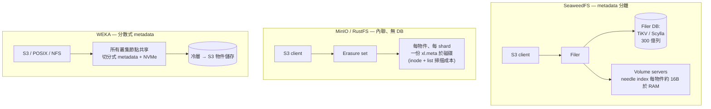

# 300 億個小物件規模的物件儲存：MinIO vs. SeaweedFS vs. RustFS vs. WEKA

## 摘要

對於一個今天就必須容納 **約 300 億個小物件**（且持續成長）的 S3 工作負載而言，決定性因素既不是吞吐量、甚至也不是容量，而是 **物件 metadata 存放在哪裡，以及每個物件在 metadata 上的成本**。本文比較的四套系統在這條軸線上落在非常不同的位置。**MinIO**（以及複製其設計的 Rust 直接替代品 **RustFS**）將 metadata 以每個物件、每個 erasure shard 一份 `xl.meta` 的方式內聯（inline）儲存，且不使用 metadata 資料庫；這對 *單一* 小物件的 I/O 確實很快，但 300 億個物件會在底層磁碟上變成數百億個微小檔案，inode 壓力與 `ListObjects` 掃描成本就成了瓶頸。**SeaweedFS** 是四者中唯一 *專為* 此問題而設計的：volume server 將物件打包進大型 append-only 的「needle」檔案，每個物件在 RAM 中僅約 16 bytes，因此 volume 層輕鬆擴展；代價是 S3 會把全部 300 億個 key 都壓進 **filer 的外部 metadata 資料庫**，這才是真正的擴展決策（需要 TiKV/ScyllaDB 等級，而非 SQLite）。**WEKA** 是唯一採用完全分散式 metadata 設計的系統，可在沒有 metadata-server 瓶頸的情況下處理數百億個檔案，並具備頂級的小檔案延遲——但它是專有的 NVMe 優先平行檔案系統，S3 只是次要的呈現層，且成本比商用級選項高出一個數量級。結論：在預算有限下處理 300 億個小物件，**SeaweedFS** 是 OSS 的預設答案（務必審慎規劃 filer DB）；若小物件 *延遲* 驅動 AI/HPC 流程且預算允許，**WEKA** 勝出；**MinIO/RustFS** 在此物件數量下風險較高，且 RustFS 尚未 GA。

> 評估的版本與日期，以 **2026 年 5 月** 為準：MinIO 最後一個社群版為 `RELEASE.2025-10-15`，之後僅提供原始碼；`minio/minio` 於 2026-02-12 標記為不再維護、2026-04-25 封存為唯讀（最後的 AGPL build 改由 **Pigsty** fork 提供）；**AIStor** 為其專有後繼產品。SeaweedFS **v4.29**（2026-05-26；每週發版）。RustFS **v1.0.0-beta.6**（約 2026-05-27），預計 **約 2026 年 7 月 GA**——分散式模式仍標記為「測試中」。WEKA：WekaFS **4.4 LTS / 5.0** 程式線,平台已更名為 **NeuralMesh**（AI Data Platform 於 2026-03 GA）。所有成本數字皆為所示日期的粗略公開定價估計。

## 功能與比較表

| 面向 | **SeaweedFS (4.29)** | **MinIO（社群/Pigsty + AIStor）** | **RustFS（1.0 beta）** | **WEKA / NeuralMesh（WekaFS 4.4/5.0）** |
|---|---|---|---|---|
| **類型 / 類別** | 物件 + POSIX filer + S3 gateway | 純物件、S3 API | 純物件、S3 API（MinIO 直接替代） | 平行檔案系統 + 多協定（S3 為次要） |
| **核心架構** | Raft master（追蹤 *volume*）+ volume server（Haystack needle）+ 以可插拔 DB 為後端的 filer | 單一 Go binary；每物件 Reed-Solomon EC；內聯 `xl.meta`；無 metadata DB | Rust；MinIO 式每物件 EC + 內聯 metadata | 軟體定義；metadata **完全分散** 切分於所有節點；NVMe 層 + 物件層 |
| **物件 metadata 存放處** | volume 層：每物件約 16 B RAM。**S3 的 path→fid 存於 filer DB**（Postgres/TiKV/Redis/Cassandra） | 內聯 `xl.meta`，每物件、每 shard 各一份於每顆磁碟 | 內聯、MinIO 式（每物件、每 shard） | metadata 分散於叢集 DRAM/NVMe；無 metadata server |
| **大規模下每物件開銷** | 每物件約 16 B RAM + 約 40 B 磁碟 **加上** filer DB 中每物件 1 列 | 每物件 ×（shard 數）約 1–4 KB `xl.meta` 於磁碟；<128 KiB 的微小物件資料內聯 | 與 MinIO 同等（沿用 `xl.meta` 格式） | 每個 metadata 單元 20 B RAM + 4 KB SSD；分散式 |
| **小物件熱路徑** | 每次讀取一次磁碟 seek（needle index 在 RAM） | 每物件一/兩次檔案開啟；列舉用 metacache | 宣稱 4 KB GET 為 MinIO 的 2.3 倍（廠商 benchmark） | 次毫秒級 metadata + 資料；kernel-bypass（DPDK/SR-IOV） |
| **物件「數量」的擴展上限** | volume 層近乎無上限；**上限 = filer DB** 選擇 | 底層 FS 的 **inode 數量 + list 掃描成本**；metacache 緩解 | 與 MinIO 同上限，**在 300 億規模未經驗證** | 廠商文件：每 namespace 6.4 兆檔案；每目錄 64 億檔案 |
| **Erasure coding** | warm（唯讀）volume 上 RS(10,4)；hot 用 replication | Reed-Solomon，每組 4–16 顆磁碟，每物件 | Reed-Solomon，MinIO 式 | 分散式 EC（如 N+2/N+4），跨叢集 |
| **一致性** | volume 上 strong（W=N,R=1）；filer 取決於 DB | 部署內 strong read-after-write | strong（宣稱） | strong、POSIX 一致 |
| **S3 相容性** | 廣泛；少數邊角（Object Lock/WORM 強制缺口 #7194；無 lifecycle *transition*） | 參考級 S3 v4、STS/IAM/OIDC/LDAP | 「100% S3」（宣稱）；沿用 MinIO 格式；成熟中 | **原生** S3 前端,但 **次於** POSIX/NFS；lifecycle 僅 expiration |
| **授權 / 取得模式** | Apache-2.0 核心；付費 Enterprise | Server AGPLv3（社群版已封存）；**AIStor 專有** | **Apache-2.0** | 專有、訂閱制（依容量） |
| **今天面對 300 億的成熟度** | 數十億小檔案已有量產驗證 | 大規模已驗證，但物件「數量」是其弱軸 | **尚未 GA；分散式模式「測試中」；別把 300 億押在它上面** | 成熟、企業級；不乏數十億檔案部署 |
| **成本——約 300 TB 可用 / 3 年（粗估）** | OSS 免費 + 商用硬體 + filer-DB 維運；Enterprise 約 $1/TB/月 ≈ **$36K/年** | Pigsty/社群 $0 + 硬體；AIStor 約 $240/TB/年 ≈ **$72K/年** | $0 + 硬體（Apache-2.0） | NVMe 優先；公開粗估 **每年數百美元/TB** + 高階硬體 → **最高 TCO** |

> 成本數字為 2026 年 5 月的粗略公開定價估計，除另註外不含硬體。WEKA 定價不透明（「洽詢業務」）；$/TB/年 區間僅為數量級草估。「300 TB 可用」假設 300 億物件平均約 10 KB；請依實際平均物件大小調整。此處不使用 ✅/❌，因在此規模下每格皆為定性描述。

## 深入實作報告

### 1. 300 億物件下唯一重要的問題：metadata 架構

容量是簡單的部分。300 億個平均 10 KB 的物件約為 300 TB 邏輯資料——幾十台商用 NVMe/HDD 節點即可。困難之處在於 **這 300 億個物件每一個都需要被定位、列舉、版本控管與刪除**，而各系統為此付出的代價各不相同：

- **內聯 metadata、無 DB（MinIO、RustFS）。** MinIO 刻意 *沒有* metadata 服務。每個物件會在每個 erasure shard 旁寫入一份 `xl.meta`；小於 128 KiB 的物件其 *資料* 也會內聯進 `xl.meta`，因此一個微小物件就是每 shard 一個小檔案。這對單物件延遲極佳，並省去整整一層維運複雜度。代價落在 **底層檔案系統**：在 12+4 erasure set 上,300 億物件會在叢集磁碟上具現為多達約 4,800 億個小檔案。這對 inode table、目錄項數量、尤其是 **`ListObjects`**（必須走訪整個 namespace）造成壓力。MinIO 的 `metacache` 會建立壓縮且索引化的列舉快照來緩和此問題，而專案自身的論點是：*不用* metadata DB 正是它能處理小物件的原因（「你無法大規模列舉 metadata DB，也無法大規模從中刪除」）。此論點對 delete/list 吞吐而言屬實，但並未消除 inode 與掃描成本的上限；它只是把上限搬到本地檔案系統。在 300 億物件規模，MinIO 技術上能服務，但列舉延遲、scrub/heal 時間、每物件磁碟 IOPS 將成為維運主軸。

- **volume 打包 + 外部 filer DB（SeaweedFS）。** SeaweedFS 把問題一分為二。**volume 層** 是為數十億小檔案打造的部分：物件（「needle」）被 append 進約 30 GB 的大型 volume 檔案,每個 volume server 在 RAM 中保有扁平的 needle index，每物件 **約 16 bytes**。讀取為一次 seek。master 只追蹤 *volume*（每約 30 GB 一筆），因此永遠不會看到 300 億筆任何東西。但 **S3 並非僅由 volume 層提供** ——它走 **filer**，filer 把 `path → file-id` 映射存於可插拔的外部資料庫。於是你的 300 億個物件 key 變成 **filer DB 中的 300 億列**。這才是真正的擴展決策：SQLite/LevelDB 不行；300 億筆你會想要 **TiKV、Cassandra/ScyllaDB,或妥善分片的 Postgres**。記憶體估算：光是 needle index 就約 300 億 × 16 B ≈ **約 480 GB RAM**,分散於你部署的多台 volume server（可分散,並非集中在單機）。只要把 filer DB 當成一等子系統來對待,這是對此需求最 *誠實* 的契合。

- **完全分散式 metadata（WEKA）。** WEKA 的決定性設計選擇（相對於有專屬 metadata server 的 Lustre/GPFS）是 **metadata 切分於叢集中每個節點**——沒有會成為瓶頸的 metadata server，metadata ops 隨叢集規模擴展。這正是 WEKA 主打並展示強勁小檔案與高檔案數量效能的原因,也是它在 IO500/SPECstorage 與 MLPerf Storage 名列前茅的原因（廠商與聯盟宣稱）。對 300 億物件而言,metadata 容量與 ops-rate 根本不是限制。限制反而在於：(a) **S3 是次要協定** ——WEKA 是檔案系統優先（POSIX/NFS/SMB/GPUDirect）,其 S3 介面歷來提供的功能少於原生 S3 儲存；以及 (b) **成本** ——其甜蜜點是熱 NVMe，$/TB 偏高,因此只有當 300 億小物件的 *存取型態*（AI/ML 訓練、HPC）足以正當化高階效能、並把冷資料分層至廉價物件儲存時,才合理。

### 2. SeaweedFS——專為此打造的 OSS 答案

SeaweedFS 是 Facebook Haystack 在 Go 中的實現：小型 Raft master 叢集、擁有 needle 的 volume server,以及負責 namespace 的 filer。對 300 億小物件而言,此架構之所以值回票價,是因為在 volume 層 **昂貴的 index 受限於物件大小,而非物件數量**。設計動機正是小檔案問題：HDFS 在小檔案上崩潰,是因為 NameNode 每檔案約佔 150 bytes 的 heap;SeaweedFS 的 master 每檔案不佔任何空間,只佔每 volume（300 TB、30 GB volume 時約 10,000 筆 volume）。

**為了 300 億你必須做對的事：**
- **filer 後端。** 這是成敗關鍵的選擇。300 億 key 請用 **TiKV**（文件記載的 PB 級路徑）或 Cassandra/ScyllaDB;兩者皆可水平分片,避免單節點 metadata 上限。Postgres 在分區與良好硬體下可撐到數十億,但更早就會成為瓶頸與維運負擔。
- **volume server RAM。** needle map 每物件預留約 16 B（300 億時聚合約 480 GB),再加緩衝。分散於足夠多的 volume server,使任一台都不至於持有過大的 index。
- **Erasure coding 僅限 warm。** EC（社群版固定 RS(10,4);Enterprise 提供如 20+4 的自訂比例）套用於唯讀 volume;hot volume 用 replication。把 warm 層轉換納入你的容量模型。

**誠實的弱點：** 少數 S3 邊角（Object Lock COMPLIANCE 模式目前不強制 WORM——issue #8350）、內建備份故事薄弱,以及近期量產事故多集中在多磁碟 EC 回歸與 mount/維護 bug 的版本線（請 pin 在 **v4.24/4.25**,避開 v4.23）。公司/生態系規模小於 MinIO 或 WEKA。這些都不觸及其核心的小物件擴展特性,而那正是在此選它的理由。

### 3. MinIO 與 RustFS——同樣的設計、同樣的小物件隱憂、不同的成熟度

**MinIO。** 在 *吞吐* 上架構優雅：跨 4–16 顆磁碟 erasure set 的每物件 Reed-Solomon、內聯 `xl.meta`、HighwayHash bitrot 偵測、單一 binary、無外部 DB。對大物件 AI/ML data lake 而言非常出色。但在 **300 億物件** 下,無 DB 設計如前所述是雙面刃：單物件延遲極佳,但底層 FS 的 inode 數量與 `ListObjects` 掃描成本是上限,metacache 可緩解卻無法消除。AIStor 文件記載軟上限約 500,000 個 bucket、每 bucket 無硬性物件上限,但「無記載上限」不等於「在 300 億下舒適」。失效模式在專案自身的 issue 中有具體記載：背景 **scanner**（為 usage/lifecycle/heal/replication 走訪每個 `xl.meta` 的爬蟲）會讓位給 S3 流量,在繁忙叢集上 **約 1 億物件時就開始落後**;使用者也回報在較慢的媒體上,`ListObjects` 在 **5 億以上小檔案時出現 deadline 逾時失敗**。外推到 300 億,意涵很清楚：NVMe（而非 HDD）實質上是必備;你必須佈局較多 bucket/prefix 讓列舉可行;而 scrub/heal、scanner 週期與 pool decommission 時間都隨物件 *數量* 增長。MinIO 未公布每叢集的權威物件上限,並把容量規劃交由其 SUBNET 服務。

2026 年更大的考量是 **非技術面**：`minio/minio` 社群 repo 已封存（2026-02-12）,web Console 已從 AGPL build 移除（2025 年 5 月）,主動開發轉移至專有的 **AIStor**。實務上的免費路徑是社群 **Pigsty fork**（`pgsty/minio`）,它恢復了 console 並重建 binary,但為社群維護、非廠商支援。對於跨年度的 300 億物件承諾,授權/維護走向是一等風險,而非註腳。

**RustFS。** 一個年輕的 Rust、Apache-2.0、S3 相容儲存,明確定位為 **MinIO 直接替代品**,可與 MinIO 及 Ceph 遷移/共存,主打 **「4 KB 物件比 MinIO 快 2.3 倍」**（廠商 benchmark）。Apache-2.0 授權直接回應了 MinIO 的 AGPL/console 爭議,確實具吸引力。但兩個事實主導了 300 億的決策：
1. **它繼承了 MinIO 的架構**,包括內聯 metadata、無 DB 模型——因此繼承了 *相同的* 物件數量上限,且 **沒有獨立證據顯示它被推進到 300 億物件**。
2. 它 **尚未 GA**（beta,GA 目標約 2026 年 7 月）。star 數與聲勢很高,但在數百億物件下的測試覆蓋率、大型真實部署、以及 day-2 維運紀錄都未經驗證。

即使照單全收,2.3 倍 4KB 數字也是 *單物件吞吐* 宣稱,對 300 億物件的 *列舉/metadata* 行為毫無說明——而那正是此處最關鍵的軸。RustFS 值得追蹤與試點,但今天把 300 億物件的量產系統押在尚未 GA 的軟體上難以正當化。

### 4. WEKA——當決策取決於延遲而非價格時的高端答案

WEKA 是軟體定義的平行檔案系統:前端與後端行程綁定到 CPU core、**kernel-bypass 網路（DPDK/SR-IOV）**、NVMe 熱層,以及透明分層至 S3 物件儲存作為冷容量,在單一 namespace 上呈現 **POSIX、NFS、SMB、S3 與 GPUDirect Storage**。其分散式 metadata 設計移除了限制傳統平行檔案系統的 metadata-server 瓶頸,這正是它能以低延遲處理極高檔案數量、並登上 IO500/SPECstorage/MLPerf-Storage 排行榜的原因（聯盟與廠商結果）。

對 300 億小物件而言,WEKA 的 *能力* 是四者中最佳——metadata 規模與小檔案延遲皆非問題——但契合度取決於你 **為何** 會有 300 億個小物件:
- **良好契合：** 它們是 GPU/AI 訓練或 HPC 流程的工作集,其中小檔案延遲與 metadata ops/sec 直接卡住昂貴的加速器。此時 WEKA 的溢價值回票價,冷資料則分層至廉價物件儲存。
- **不良契合：** 它們是以每 TB 成本為主的大量/封存 S3 bucket。WEKA 的 NVMe 優先經濟性使其成為差距最大的最昂貴選項,你會買到不需要的平行檔案系統效能。

針對以 S3 為核心的設計,有兩點須確認：WEKA 的 **S3 是次要協定**（功能較少、不如 POSIX/NFS 一等),且它是 **專有、依容量訂閱定價**,公開定價不透明——若上雲,請為「洽詢業務」、高階硬體（如 WEKApod 參考機型）與雲市集供應（AWS/Azure/GCP/OCI）編列預算。

### 5. 子比較：300 億物件下的每物件成本模型

| 關注點 | **SeaweedFS** | **MinIO / RustFS** | **WEKA** |
|---|---|---|---|
| 隨物件數量成長的 index | filer DB 列（外部）+ 每物件約 16 B RAM | 底層 FS 上的檔案（inode） | 分散式 metadata（叢集內） |
| 你必須刻意擴展的東西 | **filer DB**（TiKV/Scylla） | 底層 FS inode + 利於列舉的 bucket/prefix 佈局 | 不需額外——隨節點擴展 |
| 300 億下的 `ListObjects` | 受 filer DB 查詢計畫限制 | 在龐大 namespace 上的 metacache 快照 | 快（分散式 metadata） |
| 大規模刪除 | filer 刪除 + 非同步 volume 壓實 | 跨 shard 逐物件 unlink | 原生、快速 |
| 主要風險 | filer DB 規劃/維運 | inode/list 掃描上限;（RustFS：尚未 GA） | 成本 |

### 6. 何時選誰——針對 300 億小物件需求

- **選 SeaweedFS**：若你想要一個 OSS、成本高效、可容納 300 億+ 小物件的儲存,且願意把真正的 metadata 資料庫（TiKV/Scylla）當作 filer 後端來運行。這是此既定需求的預設建議。請依物件 *數量*（而非 TB）來規劃 volume-server RAM（每物件約 16 B）與 filer DB。
- **選 WEKA**：若這 300 億小物件是 AI/ML 或 HPC 流程的熱工作集,其中小檔案延遲與 metadata ops/sec 卡住昂貴 GPU,且預算允許高階 NVMe + 訂閱定價。把冷資料分層至底層的物件儲存。確認其 S3 功能集涵蓋你的 API 需求。
- **僅在以下情況選 MinIO（Pigsty/社群）**：物件 *數量* 實際上低於擔憂（平均物件較大）、你重視無 DB 的簡潔,且你對 AGPL/AIStor 授權走向有明確立場。請佈局較多 bucket/prefix 讓列舉可行。
- **此規模下今天請試點、勿正式部署 RustFS**：Apache-2.0 授權與小物件吞吐宣稱很吸引人,但尚未 GA,且架構上繼承 MinIO 的物件數量上限,並無 300 億規模證據。GA 後再評估。

**結論：** 此需求（「300 億小物件」）本質上是 *metadata 擴展* 需求。若你願意自管 filer DB,SeaweedFS 便宜地解決它;若你付得起,WEKA 解決得最好;MinIO/RustFS 解決得最不自然,因為其無 DB 設計把上限搬到底層檔案系統,而 RustFS 尚未 GA。

## Sources

- [SeaweedFS GitHub (README, architecture)](https://github.com/seaweedfs/seaweedfs) — accessed 2026-05
- [SeaweedFS Wiki: Components](https://github.com/seaweedfs/seaweedfs/wiki/Components) — accessed 2026-05
- [SeaweedFS Wiki: Amazon S3 API](https://github.com/seaweedfs/seaweedfs/wiki/Amazon-S3-API) — accessed 2026-05
- [SeaweedFS Wiki: Erasure coding for warm storage](https://github.com/seaweedfs/seaweedfs/wiki/Erasure-coding-for-warm-storage) — accessed 2026-05
- [DeepWiki: SeaweedFS metadata storage and filer stores](https://deepwiki.com/seaweedfs/seaweedfs/2.3.1-metadata-storage-and-filer-stores) — accessed 2026-05
- [SeaweedFS issue #8350 — Object Lock COMPLIANCE WORM not enforced](https://github.com/seaweedfs/seaweedfs/issues/8350) — accessed 2026-05
- [JuiceFS blog — SeaweedFS + TiKV (petabyte-scale filer backend)](https://juicefs.com/en/blog/usage-tips/seaweedfs-tikv) — accessed 2026-05
- [MinIO blog — Small objects and inline data (<128 KiB)](https://blog.min.io/minio-optimizes-small-objects/) — accessed 2026-05
- [MinIO blog — Small Objects and their Impact on Storage Systems](https://blog.min.io/small_objects/) — accessed 2026-05
- [MinIO AIStor — Thresholds and Limits (bucket/object/version limits)](https://docs.min.io/enterprise/aistor-object-store/reference/aistor-server/thresholds/) — accessed 2026-05
- [DeepWiki: MinIO metadata management (xl.meta)](https://deepwiki.com/minio/minio/2.4-metadata-management) — accessed 2026-05
- [Blocks & Files — MinIO removes management features from community edition](https://blocksandfiles.com/2025/06/19/minio-removes-management-features-from-basic-community-edition-object-storage-code/) — accessed 2026-05
- [Pigsty — "MinIO Is Dead, Long Live MinIO" (community fork)](https://blog.vonng.com/en/db/minio-resurrect/) — accessed 2026-05
- [Pigsty MinIO fork releases](https://github.com/pgsty/minio/releases) — accessed 2026-05
- [RustFS GitHub (Apache-2.0, "2.3× faster than MinIO for 4KB", MinIO-compatible)](https://github.com/rustfs/rustfs) — accessed 2026-05
- [RustFS — official site](https://rustfs.com/) — accessed 2026-05
- [RustFS Beta announcement](https://rustfs.dev/announcing-rustfs-beta-the-high-performance-s3-compatible-open-source-storage-for-the-ai-era/) — accessed 2026-05
- [Sealos blog — What is RustFS? Apache-2.0 MinIO alternative (2026)](https://sealos.io/blog/what-is-rustfs) — accessed 2026-05
- [Rilavek — Self-Hosted S3 in 2026 (RustFS, SeaweedFS, Garage, Ceph)](https://rilavek.com/resources/self-hosted-s3-compatible-object-storage-2026) — accessed 2026-05
- [WEKA Data Platform — technology/architecture overview](https://www.weka.io/data-platform/technology/) — accessed 2026-05
- [WEKA — distributed metadata / WekaFS architecture docs](https://docs.weka.io/) — accessed 2026-05
- [WEKA — IO500 / SPECstorage / MLPerf Storage performance claims](https://www.weka.io/resources/) — accessed 2026-05
