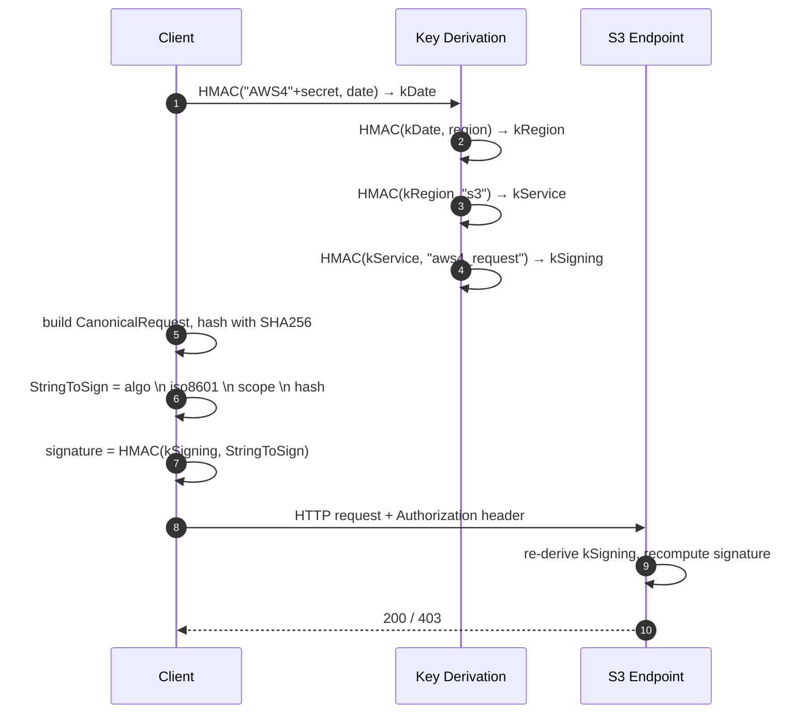

# The S3 Protocol — Wire-Level Reference and Comparison

## Summary

"S3" today refers to two distinct things: AWS's hosted object-storage service, and the **HTTP REST API** it speaks — a vendor-controlled spec that has become the de-facto industry standard, implemented by Cloudflare R2, Wasabi, Backblaze B2, Ceph RadosGW, MinIO/AIStor, Garage, SeaweedFS, Hetzner, Cloudian, NetApp StorageGRID, and the GCS XML endpoint. This report is about the **protocol**, not the AWS service. As of May 2026 the wire surface is mature and stable on the basics — strong read-after-write consistency since 2020, conditional writes since 2024 — and the recent additions (SigV4a for Multi-Region Access Points, session-based auth for S3 Express One Zone directory buckets, Object Lock per-object retention) are aimed at new workloads rather than closing protocol gaps. The natural comparison peers are the three other object-storage REST APIs anyone actually deploys: **OpenStack Swift**, **Azure Blob REST**, and **GCS JSON/XML**. Two changes since 2024 are worth knowing before writing any new S3 code: **PutObject now supports `If-None-Match` and `If-Match`** (closing a decade-old race-condition gap), and **S3 Select / S3 Object Lambda are in maintenance mode** (closed to new customers — much older architecture content is now misleading).

## Feature & Comparison Table

| Dimension | **S3 protocol** | **OpenStack Swift** | **Azure Blob REST** | **GCS JSON/XML** |
|---|---|---|---|---|
| **Specification status** | Vendor-documented (AWS); de-facto standard via dozens of compatible implementations | Genuine open spec under OpenStack governance | Vendor-documented (Microsoft); explicit `x-ms-version` header per API version | Vendor-documented (Google); native JSON + S3-shaped XML for migration |
| **Data model** | Bucket → Object (flat) | Account → Container → Object (flat) | Account → Container → Blob (flat); HNS for true directories | Bucket → Object (flat) |
| **Addressing** | `bucket.s3.<region>.amazonaws.com` (virtual-hosted style); path-style is deprecated | `/v1/<account>/<container>/<object>` | `<account>.blob.core.windows.net` (blob) / `<account>.dfs.core.windows.net` (DFS endpoint for HNS) | `storage.googleapis.com/<bucket>/<object>` (XML) or `/storage/v1/...` (JSON) |
| **Primary signing scheme** | **SigV4** (HMAC-SHA256); **SigV4a** (ECDSA P-256) for Multi-Region Access Points | Keystone token in `X-Auth-Token`; HMAC `TempURL` | Shared Key (HMAC-SHA256), three flavours of SAS, Microsoft Entra OAuth Bearer | OAuth 2.0 Bearer (JSON); HMAC keys for XML/S3 compat |
| **Anonymous / pre-signed access** | Query-string SigV4 (≤7 days IAM, ≤12 h console, bounded by STS lifetime); browser POST policy | TempURL (HMAC; arbitrary expiry) | SAS (account / service / user-delegation) | Signed URL (≤7 days) |
| **Consistency** | Strong read-after-write everywhere since Dec 2020 | Strong on object; container listings eventually consistent | Strong since launch | Strong since launch |
| **Multipart / chunked upload** | MPU: 5 MiB–5 GiB parts, ≤10000 parts, 5 TiB total (rolling out to **50 TiB** per re:Invent 2025); ETag = MD5-of-MD5s. Plus streaming SigV4 chunked PUT | SLO (static manifest, ≤1000 segments) and DLO (dynamic prefix-based); 5 GiB single-object cap | Block blob: `Put Block` (stage) + `Put Block List` (commit); ≤50000 blocks; blocks reorderable before commit | Single-session **resumable upload** (`x-goog-resumable: start`); also S3-style MPU on XML; **`Compose`** to stitch up to 32 existing objects server-side |
| **Conditional create (create-only)** | `If-None-Match: *` (Aug 2024) | RFC `If-None-Match` via s3api | `If-None-Match: *` since launch | `ifGenerationMatch=0` since launch |
| **Conditional update (CAS)** | `If-Match: <etag>` (Nov 2024) | `If-Match` per RFC | `If-Match: <etag>` since launch | `ifGenerationMatch=<gen>` since launch |
| **Range reads** | `Range: bytes=` | `Range: bytes=` | `Range: bytes=` and `x-ms-range` | `Range: bytes=` |
| **Hierarchical namespace** | No (flat) — even Express One Zone "directory buckets" still use key prefixes | No | **Yes** via ADLS Gen2 HNS + DFS endpoint (atomic rename, POSIX-ish ACLs) | No (flat) |
| **Immutable retention** | Object Lock: Governance + Compliance + Legal Hold; SEC 17a-4(f) compliant | None native | Container-level WORM and version-level WORM + Legal Hold; SEC 17a-4(f) | Bucket retention + Bucket Lock + per-object retention + temp/event holds |
| **Event notifications** | SQS / SNS / Lambda / EventBridge | None native (middleware) | Event Grid + Change Feed (durable log) | Pub/Sub (Object Change Notifications **deprecated 2026-01-30**) |
| **Server-side compute** | S3 Select + Object Lambda — both **in maintenance mode**, closed to new customers | None | None native | None native |
| **Encryption (server-side)** | SSE-S3, SSE-KMS, DSSE-KMS, SSE-C (**SSE-C disabled by default on new buckets since 2025-11**) | Keymaster + Barbican (KMS) | MMK, CMK (Key Vault), customer-provided key | Google-managed, CMEK (Cloud KMS), CSEK (customer-supplied) |
| **Ecosystem / clients** | AWS SDKs, `aws s3`, `boto3`, `rclone`, `s5cmd`, `mc`; ~dozen third-party compatible servers | `python-swiftclient`; small native ecosystem; typically fronted by `s3api` | Azure SDKs, AzCopy, ABFS (Hadoop/Spark), Azurite emulator | `google-cloud-storage`, `gcloud storage`, `rclone`; boto3 works via XML endpoint |
| **License / governance** | Proprietary spec; no standards body | Apache-2.0 reference impl; OpenStack TC governance | Proprietary spec | Proprietary spec |

> The table records protocol surface as of May 2026. Pricing and per-region availability are intentionally out of scope — this is a protocol comparison, not a service comparison.

## In-Depth Implementation Report

### 1. Architecture — the Wire-Level Surface

S3 is a REST-over-HTTPS protocol with a small set of conventions layered on top:

- **Virtual-hosted addressing** — `bucket.s3.<region>.amazonaws.com/<key>`. Path-style (`s3.<region>.amazonaws.com/<bucket>/<key>`) was deprecated in 2020 but most S3-compatible servers still accept both.
- **Signature in headers or query string** — every request carries either `Authorization: AWS4-HMAC-SHA256 ...` (header-mode) or the equivalent `X-Amz-Algorithm`/`X-Amz-Credential`/`X-Amz-Signature` query parameters (presigned mode).
- **XML response bodies for control-plane ops** — `ListObjectsV2`, `CompleteMultipartUpload`, error envelopes; payload ops (`GetObject`, `PutObject`) use raw bodies.
- **`x-amz-*` request/response headers** — the namespace where everything S3-specific lives: storage class, server-side encryption, copy source, request-payer, content-SHA256, etc.

The protocol's clarity comes from the small core. A working client needs roughly: SigV4, GET, PUT, DELETE, HEAD, `ListObjectsV2`, and the three multipart calls. Everything else is layered on top.

### 2. Request Signing — SigV4 and SigV4a

SigV4 has been the only accepted signing version on new buckets since 2020. The canonical request that the signature covers is:

```
HTTPMethod \n CanonicalURI \n CanonicalQueryString \n
CanonicalHeaders \n SignedHeaders \n HashedPayload
```

The signing key is derived by chaining HMAC-SHA256 across `(date, region, service, "aws4_request")` — meaning the key is naturally scoped to a single region and a single day. That scoping is why **SigV4a** had to be invented: Multi-Region Access Points need a signature valid across regions, which a region-scoped HMAC cannot provide. SigV4a switches the inner primitive to **ECDSA-P256**: scoped credentials seed an ECDSA keypair, the client signs with the private half, and any region's S3 endpoint verifies with the public half. The region scope in the credential string is the literal `*`. SDKs upgrade to SigV4a transparently when the target is an MRAP ARN; everything else continues to use HMAC SigV4.

The `x-amz-content-sha256` header has three S3-specific literals you will encounter in the wild:

- `UNSIGNED-PAYLOAD` — body excluded from the signature. Used for very large uploads when TLS is treated as the integrity boundary.
- `STREAMING-AWS4-HMAC-SHA256-PAYLOAD` — each chunk carries its own per-chunk signature chained to a seed signature. Framing is `<hex-size>;chunk-signature=<sig>\r\n<chunk-data>\r\n`, ending with a zero-length chunk. This is how SDKs PUT objects of unknown final length.
- `STREAMING-UNSIGNED-PAYLOAD-TRAILER` — chunked, with a CRC32/CRC32C/SHA1/SHA256 in an HTTP trailer that the signature scope covers.



### 3. Multipart Upload — The Three-Call Choreography

Three calls, in order:

1. **`CreateMultipartUpload`** — returns an opaque `UploadId`.
2. **`UploadPart`** — repeated, with `partNumber` (1–10000) and `UploadId`. Each response returns the part's ETag (the MD5 of that part's bytes); the client keeps the ordered list.
3. **`CompleteMultipartUpload`** — posts the ordered `<Part><PartNumber/><ETag/></Part>` list; S3 assembles the final object.

Constraints worth remembering: 5 MiB minimum per part (last part exempt), 5 GiB max per part, 10000 parts max, 5 TiB per object — **raised to 50 TiB per object at re:Invent 2025** and rolling out across regions and SDKs through 2026. The final-object ETag is **not** the MD5 of the data; it is `MD5(concat(MD5(part1), MD5(part2), ...))-<partCount>`. Clients that use ETag for integrity must special-case multipart.

`AbortMultipartUpload` releases parts; lifecycle rules can auto-abort stale uploads — worth configuring because abandoned MPUs accrue storage charges silently.

### 4. Conditional Writes — The 2024 Change That Mattered

For most of S3's history, "create object only if it does not exist" required a HEAD-then-PUT pattern with an unavoidable race window. Two AWS releases closed this:

- **Aug 2024**: `PutObject` accepts `If-None-Match: *` — write fails with `412 Precondition Failed` if the key already exists. Also extends to `CompleteMultipartUpload`.
- **Nov 2024**: `If-Match: "<etag>"` on `PutObject`/`CompleteMultipartUpload` — compare-and-swap semantics. Same release added the bucket-policy condition keys `s3:if-none-match` and `s3:if-match`, so an administrator can *require* conditional writes for a bucket.

Both require SigV4 (anonymous and SigV2 are rejected). Pre-signed URLs work but must be generated with SigV4.

This is the single most impactful protocol change in the last several years for systems that build on S3 — distributed locks, leader election via "first writer wins" markers, idempotent ingestion, and Delta Lake / Iceberg style metadata commits all become considerably less ugly. Azure Blob, GCS, and even s3api-fronted Swift had supported equivalent semantics for years.

A scoped sub-comparison of the conditional-write surface:

| | **S3** | **Azure Blob** | **GCS** | **Swift** |
|---|---|---|---|---|
| Create-only | `If-None-Match: *` (Aug 2024) | `If-None-Match: *` (since launch) | `ifGenerationMatch=0` (since launch) | `If-None-Match` (RFC) |
| CAS update | `If-Match: <etag>` (Nov 2024) | `If-Match: <etag>` (since launch) | `ifGenerationMatch=<gen>` (since launch) | `If-Match` (RFC) |
| Metadata-only CAS | Use `CopyObject` with conditional | Same blob, `If-Match` covers metadata | `ifMetagenerationMatch` (separate counter) | Limited |
| Enforce via policy | `s3:if-none-match` / `s3:if-match` condition keys | Per-container policy | Per-bucket IAM condition | n/a |

### 5. S3 Express One Zone — Session-Based Auth and Directory Buckets

S3 Express One Zone (GA since 2024) is the most significant protocol delta in S3 itself in years. Wire-level differences from "general-purpose" S3:

- **DNS shape encodes the AZ**: `<bucket>--<azid>--x-s3` (e.g. `mybucket--use1-az5--x-s3`); endpoint is `s3express-<azid>.<region>.amazonaws.com`.
- **Session-based auth via `CreateSession`** — returns short-lived credentials (≤5 min) scoped to the bucket. Subsequent ops carry `x-amz-s3session-token` *in addition to* a normal SigV4 signature. The point: IAM evaluation happens once at session creation, not on every request. Latency saving is real (the headline number is sub-millisecond first-byte).
- **Subset of features**: no Object Lock, no versioning, no replication, single AZ only. The trade-off is explicit — directory buckets target shuffle-heavy ML training and rendering workloads, not archival.
- **Same SDK / CLI surface for most ops**, with two exceptions: `CopyObject` and `HeadBucket` still use plain SigV4 even against directory buckets.

The "directory bucket" naming is a misnomer; the namespace is still flat. The optimisation is in the request path, not in the data model.

### 6. Versioning, Object Lock, and the Compliance Path

Bucket versioning is a one-way state machine: `Unversioned → Enabled → Suspended` (no return to Unversioned). Each PUT after enable yields a new `VersionId`; DELETE inserts a *delete marker* that hides the object from `ListObjectsV2`. Recovery is `DELETE ?versionId=...` against the marker. Cost note: every version is independently billed; mass-deletes against versioned buckets are an easy way to *grow* spend.

Object Lock requires the bucket to be opted in (creation-time historically; existing-bucket opt-in since 2023). The two modes differ in how absolute the lock is:

- **Governance** — lock enforceable but liftable by principals holding `s3:BypassGovernanceRetention`.
- **Compliance** — lock cannot be removed by anyone, including the AWS account root, until the retention timer expires.

**Legal Hold** is orthogonal — a binary flag with no timer, lifted only by an authorised principal. The combination of Compliance-mode retention + Legal Hold underwrites SEC 17a-4(f) / CFTC 1.31 / FINRA 4511 WORM use cases (per Cohasset Associates' assessment).

### 7. Storage Classes — Protocol Visible, Restore Asynchronous

The `x-amz-storage-class` header values you'll see in the wild: `STANDARD`, `STANDARD_IA`, `ONEZONE_IA`, `INTELLIGENT_TIERING`, `GLACIER_IR`, `GLACIER`, `DEEP_ARCHIVE`, `EXPRESS_ONEZONE`. The protocol-relevant fact is that Glacier *Flexible* and *Deep Archive* objects cannot be read directly: a `RestoreObject` POST creates a temporary copy in STANDARD; the response is asynchronous (minutes-to-hours for Flexible, up to 12 h for Deep Archive). `GLACIER_IR` and `INTELLIGENT_TIERING` are read-direct.

### 8. Bucket Policy, IAM, and the End of ACL-as-Primary-Access-Control

Many older S3 tutorials describe ACLs (canned ACLs, grants on `x-amz-acl`) as the primary access mechanism. That is no longer accurate. Since April 2023, new buckets default to **Bucket-owner-enforced** Object Ownership, which disables ACLs entirely — only IAM and bucket policy apply, and any ACL header other than `bucket-owner-full-control` is rejected. New code should not emit ACL headers at all.

Bucket policy is a standard IAM JSON document with `Principal` allowed at the resource side and supports condition keys including `aws:SourceIp`, `aws:SourceVpc`, `aws:RequestedRegion`, `s3:x-amz-server-side-encryption`, and the new `s3:if-none-match` / `s3:if-match`.

### 9. Encryption on the Wire

Four modes, distinguished by request headers:

| Mode | Trigger headers | Notes |
|---|---|---|
| **SSE-S3** | `x-amz-server-side-encryption: AES256` | AES-256 with AWS-owned keys. Default on all new objects since Jan 2023. |
| **SSE-KMS** | `aws:kms` + `x-amz-server-side-encryption-aws-kms-key-id` | Per-customer KMS CMK; Bucket Keys amortise KMS calls. |
| **DSSE-KMS** | `aws:kms:dsse` | Two independent AES-256 layers; for compliance regimes demanding envelope-on-envelope. |
| **SSE-C** | `x-amz-server-side-encryption-customer-algorithm/key/key-MD5` | Customer supplies the key per request; key not stored. **Disabled by default on new buckets since Nov 2025** — must be re-enabled explicitly. |

### 10. Maintenance-Mode Features Worth Flagging

Two server-side-compute features are closed to new customers and should not be designed into new architectures:

- **S3 Select** (SQL over object contents) — closed to new customers **July 25, 2024**. Substitute: Athena, or Lambda with `Range` GET.
- **S3 Object Lambda** (custom transform on GET) — closed to new customers **Nov 7, 2025**, with limited APN-partner exceptions. Substitute: presigned URLs through a Lambda/Function URL.

Existing usage continues to be supported with no new features. Most architecture content predating these dates still recommends them — treat older S3 cookbooks with suspicion.

### 11. How S3-Compatible Implementations Differ

"S3-compatible" is a coverage gradient, not a binary. Across the major third-party implementations the things most often missing or different:

- **SigV4a / MRAP** — almost no third-party implements asymmetric signing; clients that target both AWS and on-prem need to disable MRAP-aware codepaths.
- **Conditional writes** — supported by Ceph RGW, MinIO, Garage; coverage in older or niche implementations is patchy.
- **Object Lock Compliance mode** — supported by Ceph RGW, MinIO/AIStor, NetApp StorageGRID, Cloudian; absent in Garage.
- **Storage classes** — only `STANDARD` is universal. Glacier-class restore is rarely implemented outside true tiered systems.
- **Event notifications** — third parties typically forward to Kafka or a webhook rather than SQS/SNS/Lambda.
- **STS / OIDC / LDAP federation** — MinIO and Ceph implement; many lighter implementations do not.

For portability, design against the intersection: SigV4 header-mode auth, MPU, conditional writes, versioning, Object Lock governance, SSE-S3 — and exercise the target server in CI rather than trusting the "S3-compatible" badge.

### 12. Where the Peers Differ in Ways That Matter

- **Swift's open spec** is its only structural advantage; the surface is otherwise smaller and slower to evolve. Most production deployments now front Swift with the **`s3api`** middleware and treat the result as an S3-compatible store. The native account-container-object model and TempURL HMAC are still operationally sound but ecosystem mass has moved on.
- **Azure Blob's hierarchical namespace** (ADLS Gen2 / DFS endpoint) is the only first-class true-directory option among the four. For lakehouse workloads that hate slow flat-rename, this is a genuine reason to pick Azure over an S3-shaped target. Block-blob's stage/commit pattern is also more flexible than S3 MPU — blocks can be reordered before commit. Azure had conditional writes from launch; the **Change Feed** (a durable, replayable log of every change) has no S3 equivalent without building it on EventBridge replays plus CloudTrail.
- **GCS's `Compose`** operation concatenates up to 32 existing objects server-side in seconds. Paired with parallel resumable uploads, it lets clients implement an arbitrarily large object upload faster than S3 MPU in some shapes. The **generation + metageneration** counters are richer than S3's single ETag for concurrency control.

### 13. When the S3 Protocol Is the Right Choice

**Pick S3 (or an S3-compatible target) when:**
- You need broad client/SDK ecosystem reach — every data tool ships an S3 backend.
- You're standardising on one object API across cloud and on-prem; the S3 protocol is the only one with credible self-hosted implementations.
- The workload is bulk object I/O without atomic-rename or POSIX-like semantics.

**Look at peer protocols when:**
- The workload demands true directories and atomic rename — **Azure Blob ADLS Gen2** is the only first-class option.
- You need a durable change log without building one — Azure **Change Feed**.
- You need fast server-side object composition — **GCS `Compose`**.
- You're already inside OpenStack and the operational ecosystem is tied to Keystone — native **Swift** plus s3api on the side.

### Caveats for 2026 Decision Docs

- The "MinIO is free and easy" reflex is out of date — community MinIO is archived as of April 2026; treat any new build as either AIStor commercial or a hardened community fork (Pigsty).
- "S3 doesn't support conditional writes" is out of date since August 2024.
- "S3 Select" and "S3 Object Lambda" are in maintenance mode — do not design new systems around them.
- "Use ACLs for S3 access control" is out of date since April 2023 (object-ownership change).
- The **5 TiB per-object limit** is being raised to **50 TiB**; SDKs and docs are still catching up, so verify the upper bound in your SDK version before promising headroom.

## Sources

- [S3 SigV4 canonical request reference](https://docs.aws.amazon.com/AmazonS3/latest/API/sig-v4-header-based-auth.html) — accessed 2026-05
- [S3 streaming SigV4 with payload signing](https://docs.aws.amazon.com/AmazonS3/latest/API/sigv4-streaming.html) — accessed 2026-05
- [SigV4 vs SigV4a overview (IAM docs)](https://docs.aws.amazon.com/IAM/latest/UserGuide/reference_sigv.html) — accessed 2026-05
- [Multi-Region Access Point request signing](https://docs.aws.amazon.com/AmazonS3/latest/userguide/MultiRegionAccessPointRequests.html) — accessed 2026-05
- [Shuffle Sharding — SigV4 and SigV4a deep-dive](https://shufflesharding.com/posts/aws-sigv4-and-sigv4a) — accessed 2026-05
- [S3 conditional writes documentation](https://docs.aws.amazon.com/AmazonS3/latest/userguide/conditional-writes.html) — accessed 2026-05
- [AWS What's New — S3 conditional writes (Aug 2024)](https://aws.amazon.com/about-aws/whats-new/2024/08/amazon-s3-conditional-writes/) — accessed 2026-05
- [AWS What's New — S3 conditional writes If-Match (Nov 2024)](https://aws.amazon.com/about-aws/whats-new/2024/11/amazon-s3-functionality-conditional-writes/) — accessed 2026-05
- [S3 CreateSession (Express One Zone)](https://docs.aws.amazon.com/AmazonS3/latest/API/API_CreateSession.html) — accessed 2026-05
- [S3 Express One Zone auth model](https://docs.aws.amazon.com/AmazonS3/latest/userguide/s3-express-create-session.html) — accessed 2026-05
- [S3 Object Lock](https://docs.aws.amazon.com/AmazonS3/latest/userguide/object-lock.html) — accessed 2026-05
- [S3 Object Lock SEC 17a-4 compliance assessment (PDF)](https://d1.awsstatic.com/r2018/b/S3-Object-Lock/Amazon-S3-Compliance-Assessment.pdf) — accessed 2026-05
- [S3 Object Ownership / bucket-owner-enforced](https://docs.aws.amazon.com/AmazonS3/latest/userguide/about-object-ownership.html) — accessed 2026-05
- [S3 Object Lambda maintenance-mode notice](https://docs.aws.amazon.com/AmazonS3/latest/userguide/amazons3-ol-change.html) — accessed 2026-05
- [S3 storage classes](https://aws.amazon.com/s3/storage-classes/) — accessed 2026-05
- [ListObjectsV2 API reference](https://docs.aws.amazon.com/AmazonS3/latest/API/API_ListObjectsV2.html) — accessed 2026-05
- [S3 strong read-after-write consistency announcement (Dec 2020)](https://aws.amazon.com/about-aws/whats-new/2020/12/amazon-s3-now-delivers-strong-read-after-write-consistency-automatically-for-all-applications/) — accessed 2026-05
- [OpenStack Swift API reference](https://docs.openstack.org/api-ref/object-store/) — accessed 2026-05
- [Swift Keystone auth overview](https://docs.openstack.org/swift/latest/overview_auth.html) — accessed 2026-05
- [Swift TempURL middleware](https://docs.openstack.org/swift/latest/api/temporary_url_middleware.html) — accessed 2026-05
- [Swift large objects (DLO / SLO)](https://docs.openstack.org/swift/latest/overview_large_objects.html) — accessed 2026-05
- [Swift S3 compatibility / s3api](https://docs.openstack.org/swift/latest/s3_compat.html) — accessed 2026-05
- [Swift 2025.2 release notes](https://docs.openstack.org/releasenotes/swift/2025.2.html) — accessed 2026-05
- [Azure Blob REST API root](https://learn.microsoft.com/en-us/rest/api/storageservices/blob-service-rest-api) — accessed 2026-05
- [Azure Put Block List](https://learn.microsoft.com/en-us/rest/api/storageservices/put-block-list) — accessed 2026-05
- [Azure user-delegation SAS](https://learn.microsoft.com/en-us/rest/api/storageservices/create-user-delegation-sas) — accessed 2026-05
- [Azure Blob immutable storage overview](https://learn.microsoft.com/en-us/azure/storage/blobs/immutable-storage-overview) — accessed 2026-05
- [Azure Blob concurrency / conditional headers](https://learn.microsoft.com/en-us/azure/storage/blobs/concurrency-manage) — accessed 2026-05
- [Azure Blob Change Feed](https://learn.microsoft.com/en-us/azure/storage/blobs/storage-blob-change-feed) — accessed 2026-05
- [ADLS Gen2 hierarchical namespace](https://learn.microsoft.com/en-us/azure/storage/blobs/data-lake-storage-namespace) — accessed 2026-05
- [GCS signatures (HMAC vs RSA)](https://docs.cloud.google.com/storage/docs/authentication/signatures) — accessed 2026-05
- [GCS request preconditions](https://docs.cloud.google.com/storage/docs/request-preconditions) — accessed 2026-05
- [GCS resumable uploads](https://docs.cloud.google.com/storage/docs/resumable-uploads) — accessed 2026-05
- [GCS Pub/Sub notifications](https://docs.cloud.google.com/storage/docs/pubsub-notifications) — accessed 2026-05
- [GCS Bucket Lock](https://docs.cloud.google.com/storage/docs/bucket-lock) — accessed 2026-05
- [GCS Object Lock](https://docs.cloud.google.com/storage/docs/using-object-lock) — accessed 2026-05
- [Google Next '26 storage announcements](https://cloud.google.com/blog/products/storage-data-transfer/next26-storage-announcements) — accessed 2026-05
- [Cloudian — top S3-compatible providers 2026](https://cloudian.com/guides/s3-storage/best-s3-compatible-storage-providers-top-5-options-in-2026/) — accessed 2026-05
- [rclone S3 providers list (compatibility catalogue)](https://rclone.org/s3/) — accessed 2026-05
