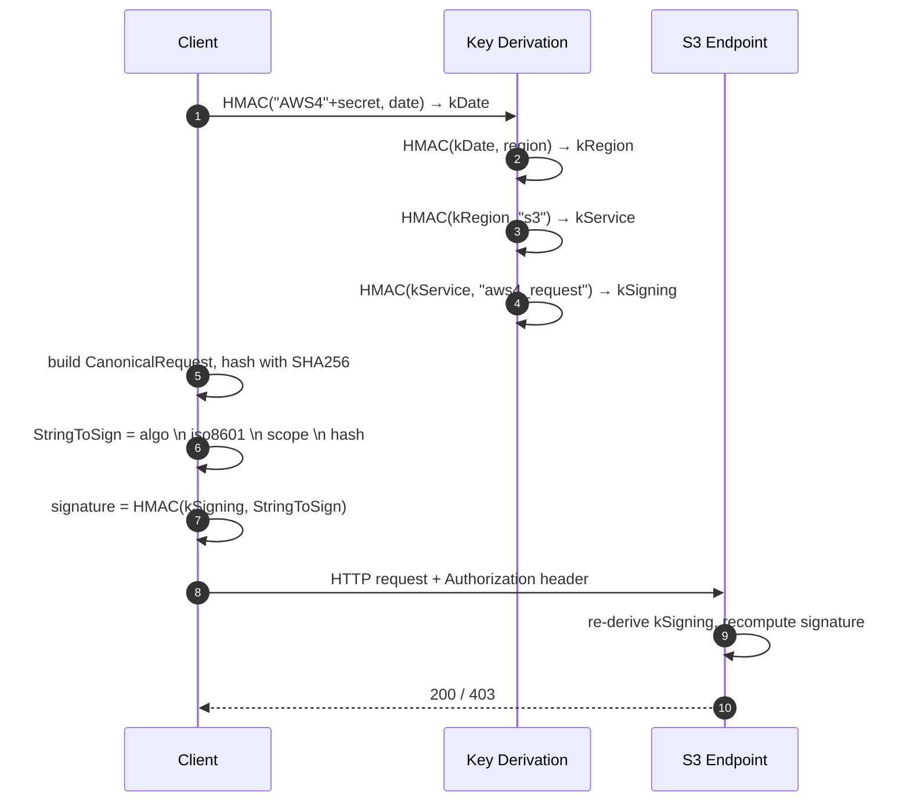

# S3 通訊協定 — Wire-Level 參考與對比

## 摘要

今天的「S3」其實指兩件事：AWS 的代管物件儲存服務，以及它所使用的 **HTTP REST API** — 一份由廠商主導、卻已成為事實上產業標準的規格，現有 Cloudflare R2、Wasabi、Backblaze B2、Ceph RadosGW、MinIO/AIStor、Garage、SeaweedFS、Hetzner、Cloudian、NetApp StorageGRID，以及 GCS 的 XML endpoint 都實作之。本報告談的是**協定**，不是 AWS 該項服務。截至 2026 年 5 月，wire 介面在基本盤已成熟穩定 — 自 2020 年起支援強讀後寫一致性、自 2024 年起支援條件式寫入 — 而近期新增（Multi-Region Access Points 的 SigV4a、S3 Express One Zone directory bucket 的 session 認證、Object Lock per-object 保留）都是針對新興工作負載，而非補協定缺口。自然的對比對象是另外三套有人真正部署的物件儲存 REST API：**OpenStack Swift**、**Azure Blob REST**、**GCS JSON/XML**。在 2024 年後撰寫任何新 S3 程式碼前，有兩件事務必知道：**PutObject 現在支援 `If-None-Match` 與 `If-Match`**（補上沿用十年的競態條件缺口），以及 **S3 Select / S3 Object Lambda 已進入維護模式**（停止接受新客戶 — 許多舊有的架構文章現在已是誤導）。

## 功能與比較表

| 維度 | **S3 protocol** | **OpenStack Swift** | **Azure Blob REST** | **GCS JSON/XML** |
|---|---|---|---|---|
| **規格狀態** | 廠商文件（AWS）；事實標準，靠數十家相容實作支撐 | 真正的開放規格，OpenStack 治理下 | 廠商文件（Microsoft）；以 `x-ms-version` header 明示 API 版本 | 廠商文件（Google）；原生 JSON + 為遷移而設的 S3 形 XML |
| **資料模型** | Bucket → Object（扁平） | Account → Container → Object（扁平） | Account → Container → Blob（扁平）；啟用 HNS 即有真目錄 | Bucket → Object（扁平） |
| **位址形式** | `bucket.s3.<region>.amazonaws.com`（virtual-hosted style）；path-style 已棄用 | `/v1/<account>/<container>/<object>` | `<account>.blob.core.windows.net`（Blob）／`<account>.dfs.core.windows.net`（HNS 的 DFS endpoint） | `storage.googleapis.com/<bucket>/<object>`（XML）或 `/storage/v1/...`（JSON） |
| **主要簽章機制** | **SigV4**（HMAC-SHA256）；Multi-Region Access Points 用 **SigV4a**（ECDSA P-256） | `X-Auth-Token` 攜 Keystone token；HMAC `TempURL` | Shared Key（HMAC-SHA256）、三種 SAS、Microsoft Entra OAuth Bearer | OAuth 2.0 Bearer（JSON）；XML/S3 相容路徑用 HMAC keys |
| **匿名／預先簽署存取** | Query-string SigV4（IAM 上限 7 天、Console 12 小時、STS 為憑證壽命所限）；瀏覽器 POST policy | TempURL（HMAC；過期時間任設） | SAS（account／service／user-delegation） | Signed URL（≤7 天） |
| **一致性** | 自 2020 年 12 月起全面強讀後寫一致 | 物件強一致；container listing 為最終一致 | 自推出即強一致 | 自推出即強一致 |
| **Multipart／分段上傳** | MPU：5 MiB–5 GiB 一份、最多 10000 份、單物件 5 TiB（依 re:Invent 2025，正在逐步放寬到 **50 TiB**）；ETag = MD5 of MD5s。另支援 SigV4 streaming chunked PUT | SLO（靜態 manifest，≤1000 段）與 DLO（動態前綴比對）；單一物件 5 GiB 上限 | Block blob：`Put Block`（暫存）+ `Put Block List`（commit）；≤50000 個 block；commit 前可重排 | 單一 session 的 **resumable upload**（`x-goog-resumable: start`）；XML 同時支援 S3 形 MPU；**`Compose`** 可將最多 32 個既有物件於伺服器端拼接 |
| **條件式建立（create-only）** | `If-None-Match: *`（2024 年 8 月） | 透過 s3api 走 RFC `If-None-Match` | `If-None-Match: *`（自推出即支援） | `ifGenerationMatch=0`（自推出即支援） |
| **條件式更新（CAS）** | `If-Match: <etag>`（2024 年 11 月） | RFC `If-Match` | `If-Match: <etag>`（自推出即支援） | `ifGenerationMatch=<gen>`（自推出即支援） |
| **範圍讀取** | `Range: bytes=` | `Range: bytes=` | `Range: bytes=` 與 `x-ms-range` | `Range: bytes=` |
| **階層命名空間** | 沒有（扁平）— 連 Express One Zone 的「directory bucket」仍以 key 前綴模擬 | 沒有 | **有**：ADLS Gen2 HNS + DFS endpoint（atomic rename、POSIX 風格 ACL） | 沒有（扁平） |
| **不可變保留** | Object Lock：Governance + Compliance + Legal Hold；符合 SEC 17a-4(f) | 原生不支援 | Container 層 WORM 與 version 層 WORM + Legal Hold；符合 SEC 17a-4(f) | Bucket retention + Bucket Lock + per-object retention + temp/event hold |
| **事件通知** | SQS／SNS／Lambda／EventBridge | 原生無（靠 middleware） | Event Grid + Change Feed（耐久化日誌） | Pub/Sub（Object Change Notifications **於 2026-01-30 棄用**） |
| **伺服器端計算** | S3 Select + Object Lambda — 皆**進入維護模式**，停止接受新客戶 | 無 | 原生無 | 原生無 |
| **加密（伺服器端）** | SSE-S3、SSE-KMS、DSSE-KMS、SSE-C（**新 bucket 於 2025-11 起預設停用 SSE-C**） | Keymaster + Barbican（KMS） | MMK、CMK（Key Vault）、客戶提供金鑰 | Google-managed、CMEK（Cloud KMS）、CSEK（客戶提供） |
| **生態系／客戶端** | AWS SDK、`aws s3`、`boto3`、`rclone`、`s5cmd`、`mc`；約十餘家第三方相容伺服器 | `python-swiftclient`；原生生態系小，常以 `s3api` 對外 | Azure SDK、AzCopy、ABFS（Hadoop／Spark）、Azurite 模擬器 | `google-cloud-storage`、`gcloud storage`、`rclone`；boto3 可走 XML endpoint |
| **授權／治理** | 廠商私有規格；無標準組織 | Apache-2.0 參考實作；OpenStack TC 治理 | 廠商私有規格 | 廠商私有規格 |

> 表格反映 2026 年 5 月的協定面貌。價格與地區可用性刻意排除 — 這是協定對比，不是服務對比。

## 實作深度報告

### 1. 架構 — Wire-Level 介面

S3 是疊在 HTTPS 上的 REST 協定，加上一小組約定：

- **Virtual-hosted 位址** — `bucket.s3.<region>.amazonaws.com/<key>`。Path-style（`s3.<region>.amazonaws.com/<bucket>/<key>`）已於 2020 年棄用，但多數 S3 相容伺服器仍兩種都接。
- **簽章放 header 或 query string** — 每次請求帶 `Authorization: AWS4-HMAC-SHA256 ...`（header 模式）或同義的 `X-Amz-Algorithm`／`X-Amz-Credential`／`X-Amz-Signature` query 參數（presigned 模式）。
- **控制面操作回 XML body** — `ListObjectsV2`、`CompleteMultipartUpload`、錯誤封包；payload 操作（`GetObject`、`PutObject`）則為 raw body。
- **`x-amz-*` 請求／回應 header** — 所有 S3 特有的東西都在此 namespace：storage class、伺服器端加密、copy source、request-payer、content-SHA256 等等。

協定之所以清晰，是因為核心很小。一個能用的 client 大約只需要：SigV4、GET、PUT、DELETE、HEAD、`ListObjectsV2`，以及三個 multipart 呼叫。其餘都是疊上去的。

### 2. 請求簽章 — SigV4 與 SigV4a

自 2020 年起，新 bucket 只接 SigV4。簽章涵蓋的 canonical request 為：

```
HTTPMethod \n CanonicalURI \n CanonicalQueryString \n
CanonicalHeaders \n SignedHeaders \n HashedPayload
```

簽署金鑰由 HMAC-SHA256 鏈式衍生，輸入 `(date, region, service, "aws4_request")` — 也就是說金鑰天生綁定單一 region、單一日期。這正是 **SigV4a** 必須被發明的原因：Multi-Region Access Points 需要的簽章必須跨 region 可驗，這是 region-scoped HMAC 做不到的事。SigV4a 把內層原語換成 **ECDSA-P256**：scoped credential 為 seed 衍生出 ECDSA keypair，client 以私鑰簽，任一 region 的 S3 endpoint 都能以公鑰驗。Credential 字串裡的 region 是字面 `*`。SDK 在目標為 MRAP ARN 時會透明升級為 SigV4a，其餘仍用 HMAC SigV4。

`x-amz-content-sha256` 在實務上會看到三種 S3 專屬字面值：

- `UNSIGNED-PAYLOAD` — body 不納入簽章。大型上傳常用，依賴 TLS 作為完整性邊界。
- `STREAMING-AWS4-HMAC-SHA256-PAYLOAD` — 每個 chunk 都有自己的簽章，鏈式接到 seed signature。Framing 為 `<hex-size>;chunk-signature=<sig>\r\n<chunk-data>\r\n`，以零長 chunk 結尾。SDK 對未知總長物件做 PUT 時就是用這個。
- `STREAMING-UNSIGNED-PAYLOAD-TRAILER` — chunked 傳輸並在 HTTP trailer 帶 CRC32/CRC32C/SHA1/SHA256，簽章涵蓋 trailer。



### 3. Multipart Upload — 三次呼叫的編排

順序固定為三次呼叫：

1. **`CreateMultipartUpload`** — 回傳 opaque 的 `UploadId`。
2. **`UploadPart`** — 重複呼叫，帶 `partNumber`（1–10000）與 `UploadId`。每次回傳該段的 ETag（該段位元組的 MD5）；client 自行保存有序列表。
3. **`CompleteMultipartUpload`** — POST 有序的 `<Part><PartNumber/><ETag/></Part>` 列表；S3 將最終物件組裝起來。

需要記住的限制：每段最小 5 MiB（最後一段豁免）、每段最大 5 GiB、最多 10000 段、單物件 5 TiB — **2025 re:Invent 將上限提升至 50 TiB**，2026 年間逐步落地到各 region 與 SDK。最終物件的 ETag **不是**整個資料的 MD5，而是 `MD5(concat(MD5(part1), MD5(part2), ...))-<partCount>`。以 ETag 作為完整性檢查的 client 必須對 multipart 做特例處理。

`AbortMultipartUpload` 釋放分段；可用 lifecycle rule 自動 abort 過期上傳 — 強烈建議設定，因為被遺忘的 MPU 會無聲計費。

### 4. 條件式寫入 — 2024 年那次真正重要的變更

S3 歷史上絕大多數時間，「只在物件不存在時建立」必須用 HEAD-then-PUT 模式，並承受不可避免的競態窗。AWS 兩次釋出彌補了這個缺口：

- **2024 年 8 月**：`PutObject` 接受 `If-None-Match: *` — 若 key 已存在則回 `412 Precondition Failed`。亦延伸到 `CompleteMultipartUpload`。
- **2024 年 11 月**：`PutObject`／`CompleteMultipartUpload` 上的 `If-Match: "<etag>"` — compare-and-swap 語意。同次釋出新增了 bucket-policy condition key `s3:if-none-match` 與 `s3:if-match`，讓管理員可以*強制*條件式寫入。

兩者都要求 SigV4（拒絕匿名與 SigV2）。Pre-signed URL 可以但必須以 SigV4 產生。

這是建構於 S3 之上的系統近年來最有感的協定變更 — 分散式鎖、以「first writer wins」標記做的選主、idempotent ingestion、以及 Delta Lake／Iceberg 風格的 metadata commit，從此都顯著乾淨許多。Azure Blob、GCS、甚至搭 s3api 的 Swift 多年前就具備這些語意。

四家在條件式寫入面的對比：

| | **S3** | **Azure Blob** | **GCS** | **Swift** |
|---|---|---|---|---|
| Create-only | `If-None-Match: *`（2024-08） | `If-None-Match: *`（自推出） | `ifGenerationMatch=0`（自推出） | `If-None-Match`（RFC） |
| CAS 更新 | `If-Match: <etag>`（2024-11） | `If-Match: <etag>`（自推出） | `ifGenerationMatch=<gen>`（自推出） | `If-Match`（RFC） |
| 純 metadata CAS | 以 `CopyObject` 配條件 | `If-Match` 同時涵蓋 metadata | `ifMetagenerationMatch`（獨立計數器） | 有限 |
| Policy 強制 | `s3:if-none-match`／`s3:if-match` condition key | Container policy | Bucket IAM condition | 無 |

### 5. S3 Express One Zone — Session 認證與 Directory Bucket

S3 Express One Zone（自 2024 年 GA）是 S3 本身近年最重要的協定差異。Wire-level 上與「general-purpose」S3 的不同：

- **DNS 名稱把 AZ 編碼進去**：`<bucket>--<azid>--x-s3`（如 `mybucket--use1-az5--x-s3`）；endpoint 為 `s3express-<azid>.<region>.amazonaws.com`。
- **以 `CreateSession` 做 session 認證** — 回傳壽命短（≤5 分鐘）的 bucket-scoped 憑證。後續操作除了 SigV4 簽章外，還要帶 `x-amz-s3session-token`。重點：IAM 評估在 session 建立時做一次，而非每個請求都評估。延遲改善是真的（口號是子毫秒首位元組）。
- **功能子集**：無 Object Lock、無 versioning、無 replication、僅單一 AZ。取捨明確 — directory bucket 鎖定 ML 訓練 shuffle 與 rendering 等繁重 I/O，不是封存。
- **SDK／CLI 介面大致相同**，但兩個例外：`CopyObject` 與 `HeadBucket` 即使對 directory bucket 仍用一般 SigV4。

「directory bucket」這名字其實是誤導；命名空間仍為扁平。優化在請求路徑，而不是資料模型。

### 6. Versioning、Object Lock 與合規路徑

Bucket versioning 是單向狀態機：`Unversioned → Enabled → Suspended`（不能回 Unversioned）。Enable 後每次 PUT 產生新的 `VersionId`；DELETE 插入 *delete marker*，會在 `ListObjectsV2` 中隱藏該物件。要還原則對 marker 做 `DELETE ?versionId=...`。成本注意事項：每個 version 各自計費；對已啟用 versioning 的 bucket 做大量刪除，是讓帳單*膨脹*的常見方式。

Object Lock 需 bucket 先 opt-in（過去只能建立時設定；自 2023 年起既有 bucket 亦可 opt-in）。兩種模式絕對程度不同：

- **Governance** — 鎖可由具備 `s3:BypassGovernanceRetention` 的 principal 解除。
- **Compliance** — 任何身分（含 AWS 帳號 root）在保留期滿前都無法解除鎖。

**Legal Hold** 是正交的 — 一個沒有時鐘的旗標，僅授權 principal 可解除。Compliance 保留 + Legal Hold 組合，依 Cohasset Associates 評估，可滿足 SEC 17a-4(f)／CFTC 1.31／FINRA 4511 WORM 用途。

### 7. Storage Class — 協定可見，restore 為非同步

實務上會看到的 `x-amz-storage-class` 取值：`STANDARD`、`STANDARD_IA`、`ONEZONE_IA`、`INTELLIGENT_TIERING`、`GLACIER_IR`、`GLACIER`、`DEEP_ARCHIVE`、`EXPRESS_ONEZONE`。協定相關的事實是：Glacier *Flexible* 與 *Deep Archive* 物件不能直接讀，必須以 `RestoreObject` POST 在 STANDARD 建立暫時副本；回應為非同步（Flexible 為分鐘到小時，Deep Archive 最久 12 小時）。`GLACIER_IR` 與 `INTELLIGENT_TIERING` 為直讀。

### 8. Bucket Policy、IAM，以及「ACL 已不是主要存取控制」

許多舊 S3 教學把 ACL（canned ACL、`x-amz-acl` 上的 grant）描述為主要存取機制。**這已不正確**。自 2023 年 4 月起，新 bucket 預設為 **Bucket-owner-enforced** Object Ownership，徹底停用 ACL — 只有 IAM 與 bucket policy 生效，任何不是 `bucket-owner-full-control` 的 ACL header 都會被拒。新程式碼根本不應發送 ACL header。

Bucket policy 是標準 IAM JSON 文件，resource 側允許 `Principal`，並支援 `aws:SourceIp`、`aws:SourceVpc`、`aws:RequestedRegion`、`s3:x-amz-server-side-encryption`，以及新增的 `s3:if-none-match`／`s3:if-match` 等 condition key。

### 9. 加密在 wire 上的呈現

四種模式由 request header 區分：

| 模式 | 觸發 header | 註 |
|---|---|---|
| **SSE-S3** | `x-amz-server-side-encryption: AES256` | AWS 持有金鑰的 AES-256。自 2023 年 1 月起為新物件預設。 |
| **SSE-KMS** | `aws:kms` + `x-amz-server-side-encryption-aws-kms-key-id` | 客戶 KMS CMK；Bucket Key 可攤平 KMS 呼叫成本。 |
| **DSSE-KMS** | `aws:kms:dsse` | 兩層獨立 AES-256；用於要求「信封套信封」的合規場景。 |
| **SSE-C** | `x-amz-server-side-encryption-customer-algorithm/key/key-MD5` | 客戶每次請求自帶金鑰；金鑰不儲存。**自 2025 年 11 月起，新 bucket 預設停用 SSE-C** — 必須明示重新啟用。 |

### 10. 已進入維護模式的功能

兩個伺服器端計算功能已停止接受新客戶，新架構不應再依賴：

- **S3 Select**（對物件內容跑 SQL）— **2024 年 7 月 25 日**停止接受新客戶。替代方案：Athena，或對物件做 `Range` GET 加 Lambda。
- **S3 Object Lambda**（GET 時自訂轉換）— **2025 年 11 月 7 日**停止接受新客戶，APN 合作夥伴有限度例外。替代方案：以 Lambda／Function URL 做 presigned URL 中介。

既有用法繼續支援但不再有新功能。早於這兩個日期的多數架構文章仍會推薦它們 — 對舊 S3 cookbook 保持懷疑。

### 11. S3 相容實作的差異

「S3 相容」是覆蓋率漸層，不是二元。各主流第三方實作最常缺漏或差異之處：

- **SigV4a／MRAP** — 幾乎沒有第三方實作非對稱簽章；同時打 AWS 與 on-prem 的 client 必須關掉 MRAP-aware 程式路徑。
- **條件式寫入** — Ceph RGW、MinIO、Garage 已支援；較舊或冷門實作覆蓋率不一。
- **Object Lock Compliance 模式** — Ceph RGW、MinIO/AIStor、NetApp StorageGRID、Cloudian 支援；Garage 無。
- **Storage class** — 只有 `STANDARD` 在所有實作上都通用。Glacier 類的 restore 在真正分層的系統之外幾乎不見實作。
- **事件通知** — 第三方通常轉到 Kafka 或 webhook，而非 SQS／SNS／Lambda。
- **STS／OIDC／LDAP 聯邦** — MinIO 與 Ceph 有；輕量實作多半沒有。

要做到可攜，請以交集為目標：SigV4 header-mode、MPU、條件式寫入、versioning、Object Lock governance、SSE-S3 — 並在 CI 對目標伺服器做實測，不要相信「S3-compatible」這塊招牌。

### 12. 對等協定上真正會影響選擇的差異

- **Swift 的開放規格**是其唯一結構性優勢；其餘介面較小、演進較慢。多數生產部署現在都在 Swift 前面套 **`s3api`** middleware，把結果當作 S3 相容儲存用。原生的 account-container-object 模型與 TempURL HMAC 在維運上仍合理，但生態系重心已偏離。
- **Azure Blob 的階層命名空間**（ADLS Gen2／DFS endpoint）是四家中唯一具備一級 true-directory 的選項。對厭惡慢速 flat-rename 的 lakehouse 工作負載，這是寧捨 S3 形目標而選 Azure 的真實理由。Block blob 的 stage／commit 模式也比 S3 MPU 更彈性 — block 在 commit 前可重排。Azure 自推出即具備條件式寫入；**Change Feed**（一份耐久、可重播的變更日誌）在 S3 沒有對應，必須以 EventBridge replay 加 CloudTrail 自行拼湊。
- **GCS 的 `Compose`** 可在伺服器端把最多 32 個既有物件秒級拼接。配合平行 resumable upload，client 可實作出在某些形狀下比 S3 MPU 更快的大物件上傳。**generation + metageneration** 雙計數器在併發控制上比 S3 單一 ETag 更豐富。

### 13. 何時 S3 協定是對的選擇

**選 S3（或 S3 相容目標）的時機：**
- 需要最廣的 client／SDK 生態 — 每個資料工具都附 S3 backend。
- 雲與 on-prem 都要統一一套物件 API；S3 是唯一具備可信自架實作的協定。
- 工作負載是 bulk object I/O，不要求 atomic rename 或 POSIX 風格語意。

**該看對等協定的時機：**
- 需要真目錄與 atomic rename — 一級選項只有 **Azure Blob ADLS Gen2**。
- 需要耐久的變更日誌而不想自行拼湊 — Azure **Change Feed**。
- 需要快速的伺服器端物件組合 — **GCS `Compose`**。
- 已在 OpenStack 內、維運生態已綁 Keystone — 原生 **Swift** 再加 s3api。

### 寫進 2026 年選型文件時的注意事項

- 「MinIO 又免費又簡單」這個直覺已過時 — 2026 年 4 月後社群 MinIO 已封存；任何新建部署不是 AIStor 商業就是社群分支（Pigsty）。
- 「S3 不支援條件式寫入」自 2024 年 8 月起已不正確。
- 「S3 Select」與「S3 Object Lambda」已進入維護模式 — 新系統不要圍繞它們設計。
- 「用 ACL 做 S3 存取控制」自 2023 年 4 月（Object Ownership 變更）後已不正確。
- 單物件 **5 TiB** 上限正在放寬到 **50 TiB**；SDK 與文件仍在跟進，承諾 headroom 之前請先驗證你 SDK 版本的真正上限。

## Sources

- [S3 SigV4 canonical request reference](https://docs.aws.amazon.com/AmazonS3/latest/API/sig-v4-header-based-auth.html) — accessed 2026-05
- [S3 streaming SigV4 with payload signing](https://docs.aws.amazon.com/AmazonS3/latest/API/sigv4-streaming.html) — accessed 2026-05
- [SigV4 vs SigV4a overview (IAM docs)](https://docs.aws.amazon.com/IAM/latest/UserGuide/reference_sigv.html) — accessed 2026-05
- [Multi-Region Access Point request signing](https://docs.aws.amazon.com/AmazonS3/latest/userguide/MultiRegionAccessPointRequests.html) — accessed 2026-05
- [Shuffle Sharding — SigV4 and SigV4a deep-dive](https://shufflesharding.com/posts/aws-sigv4-and-sigv4a) — accessed 2026-05
- [S3 conditional writes documentation](https://docs.aws.amazon.com/AmazonS3/latest/userguide/conditional-writes.html) — accessed 2026-05
- [AWS What's New — S3 conditional writes (Aug 2024)](https://aws.amazon.com/about-aws/whats-new/2024/08/amazon-s3-conditional-writes/) — accessed 2026-05
- [AWS What's New — S3 conditional writes If-Match (Nov 2024)](https://aws.amazon.com/about-aws/whats-new/2024/11/amazon-s3-functionality-conditional-writes/) — accessed 2026-05
- [S3 CreateSession (Express One Zone)](https://docs.aws.amazon.com/AmazonS3/latest/API/API_CreateSession.html) — accessed 2026-05
- [S3 Express One Zone auth model](https://docs.aws.amazon.com/AmazonS3/latest/userguide/s3-express-create-session.html) — accessed 2026-05
- [S3 Object Lock](https://docs.aws.amazon.com/AmazonS3/latest/userguide/object-lock.html) — accessed 2026-05
- [S3 Object Lock SEC 17a-4 compliance assessment (PDF)](https://d1.awsstatic.com/r2018/b/S3-Object-Lock/Amazon-S3-Compliance-Assessment.pdf) — accessed 2026-05
- [S3 Object Ownership / bucket-owner-enforced](https://docs.aws.amazon.com/AmazonS3/latest/userguide/about-object-ownership.html) — accessed 2026-05
- [S3 Object Lambda maintenance-mode notice](https://docs.aws.amazon.com/AmazonS3/latest/userguide/amazons3-ol-change.html) — accessed 2026-05
- [S3 storage classes](https://aws.amazon.com/s3/storage-classes/) — accessed 2026-05
- [ListObjectsV2 API reference](https://docs.aws.amazon.com/AmazonS3/latest/API/API_ListObjectsV2.html) — accessed 2026-05
- [S3 strong read-after-write consistency announcement (Dec 2020)](https://aws.amazon.com/about-aws/whats-new/2020/12/amazon-s3-now-delivers-strong-read-after-write-consistency-automatically-for-all-applications/) — accessed 2026-05
- [OpenStack Swift API reference](https://docs.openstack.org/api-ref/object-store/) — accessed 2026-05
- [Swift Keystone auth overview](https://docs.openstack.org/swift/latest/overview_auth.html) — accessed 2026-05
- [Swift TempURL middleware](https://docs.openstack.org/swift/latest/api/temporary_url_middleware.html) — accessed 2026-05
- [Swift large objects (DLO / SLO)](https://docs.openstack.org/swift/latest/overview_large_objects.html) — accessed 2026-05
- [Swift S3 compatibility / s3api](https://docs.openstack.org/swift/latest/s3_compat.html) — accessed 2026-05
- [Swift 2025.2 release notes](https://docs.openstack.org/releasenotes/swift/2025.2.html) — accessed 2026-05
- [Azure Blob REST API root](https://learn.microsoft.com/en-us/rest/api/storageservices/blob-service-rest-api) — accessed 2026-05
- [Azure Put Block List](https://learn.microsoft.com/en-us/rest/api/storageservices/put-block-list) — accessed 2026-05
- [Azure user-delegation SAS](https://learn.microsoft.com/en-us/rest/api/storageservices/create-user-delegation-sas) — accessed 2026-05
- [Azure Blob immutable storage overview](https://learn.microsoft.com/en-us/azure/storage/blobs/immutable-storage-overview) — accessed 2026-05
- [Azure Blob concurrency / conditional headers](https://learn.microsoft.com/en-us/azure/storage/blobs/concurrency-manage) — accessed 2026-05
- [Azure Blob Change Feed](https://learn.microsoft.com/en-us/azure/storage/blobs/storage-blob-change-feed) — accessed 2026-05
- [ADLS Gen2 hierarchical namespace](https://learn.microsoft.com/en-us/azure/storage/blobs/data-lake-storage-namespace) — accessed 2026-05
- [GCS signatures (HMAC vs RSA)](https://docs.cloud.google.com/storage/docs/authentication/signatures) — accessed 2026-05
- [GCS request preconditions](https://docs.cloud.google.com/storage/docs/request-preconditions) — accessed 2026-05
- [GCS resumable uploads](https://docs.cloud.google.com/storage/docs/resumable-uploads) — accessed 2026-05
- [GCS Pub/Sub notifications](https://docs.cloud.google.com/storage/docs/pubsub-notifications) — accessed 2026-05
- [GCS Bucket Lock](https://docs.cloud.google.com/storage/docs/bucket-lock) — accessed 2026-05
- [GCS Object Lock](https://docs.cloud.google.com/storage/docs/using-object-lock) — accessed 2026-05
- [Google Next '26 storage announcements](https://cloud.google.com/blog/products/storage-data-transfer/next26-storage-announcements) — accessed 2026-05
- [Cloudian — top S3-compatible providers 2026](https://cloudian.com/guides/s3-storage/best-s3-compatible-storage-providers-top-5-options-in-2026/) — accessed 2026-05
- [rclone S3 providers list (compatibility catalogue)](https://rclone.org/s3/) — accessed 2026-05
