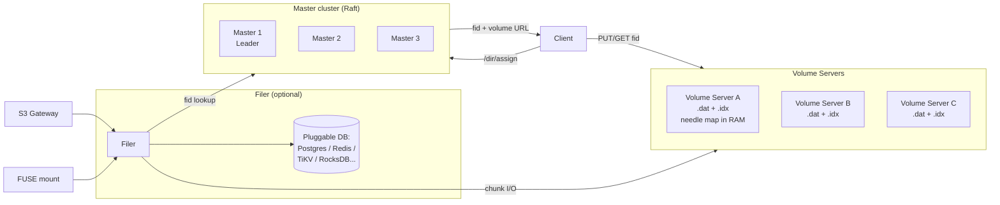
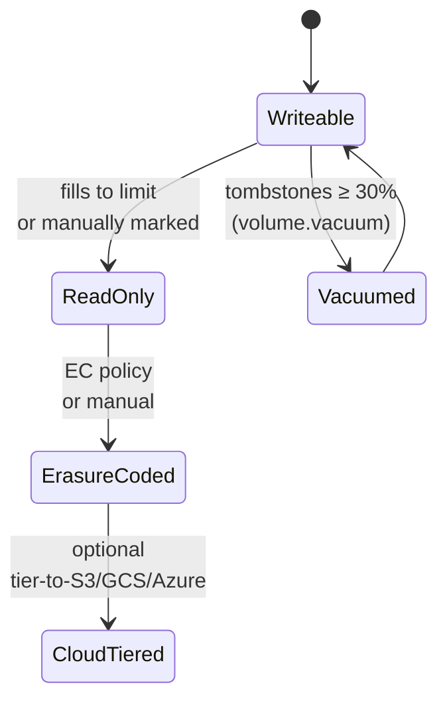

# SeaweedFS — Haystack-Style Object Storage for Billions of Small Files

## Summary

SeaweedFS is an Apache-2.0, Haystack-inspired object store written in Go: a small Raft master cluster that tracks **volumes** rather than files, a fleet of volume servers that pack many small objects into a few append-mostly 30 GB "volume" files, and an optional filer service that adds POSIX, S3, HDFS, and WebDAV interfaces on top by storing path-to-fid maps in a pluggable external database. The architectural punchline is the master's state model: master memory grows with **volume count** (one entry per ~30 GB), not file count, while each volume server keeps a flat needle index at ~**16 bytes per file** in RAM. That makes billions-of-small-files workloads tractable in a way MinIO's per-object `xl.meta` and Ceph RGW's PG-per-object mapping are not — and the recent v4.x line added native **S3 Tables and an Iceberg REST catalog** that turn SeaweedFS into a self-contained lakehouse without Hive Metastore or Glue. The honest weaknesses are equally specific: a handful of S3 edges (notably Object Lock COMPLIANCE mode does not currently enforce WORM, issue #8350), a weak built-in backup story, and an upgrade-path track record where most production incidents in the last year have been multi-disk EC regressions or maintenance-worker startup bugs rather than data-loss. Peer set for this report is the other self-hosted OSS S3 stores: **MinIO**, **Ceph RGW**, **Garage**.

> Version note (May 2026): **v4.24 / v4.25 (2026-05-14)** are the current safe pins. v4.23 had a multi-disk EC distribution regression; advice elsewhere to pin to v4.05 is outdated. Apache-2.0 community edition is fully featured (S3, POSIX, HDFS, CSI, EC at fixed RS(10,4)); the **Enterprise** tier adds custom EC ratios (e.g. 20+4 at 1.2× overhead), automatic EC shard repair, planned bitrot detection, and commercial support. Pricing is currently "contact sales" on `seaweedfs.com`; community-reported figures cluster around **$1/TB/month after the 25 TB free tier** but this is not formally posted.

## Feature & Comparison Table

| Dimension | **SeaweedFS (4.24+)** | **MinIO (community / AIStor)** | **Ceph RGW (Tentacle 20.2.1)** | **Garage (2.3.0)** |
|---|---|---|---|---|
| **Type / category** | Object + optional POSIX filer + S3 gateway + Iceberg REST | Pure-object, S3 API only | Multi-protocol via RGW on RADOS | Pure-object, S3 API only |
| **Core architecture** | Master (Raft, tracks volumes) + Volume Servers (Haystack needles) + optional Filer (pluggable DB) | Single Go binary, per-object Reed-Solomon EC, inline `xl.meta` | Stateless RGW HTTP → RADOS pools (BlueStore OSDs); CRUSH placement | Peer-to-peer Rust, CRDT metadata, no master |
| **Master / metadata state** | Master tracks volume-to-server mapping only; per-cluster O(volumes), not O(files) | None — inline with data | Dedicated RADOS pools; bucket index sharding | CRDT tables on every node |
| **Per-file overhead** | ~16 bytes in volume-server RAM (needle map) | ~1–4 KB on disk per object (`xl.meta`) | Bucket-index entry + PG mapping | CRDT row |
| **License** | Apache-2.0 core; paid Enterprise tier | AGPLv3 (community archived 2026-04); AIStor commercial | LGPL-2.1 | AGPLv3 |
| **Primary interfaces** | S3, HDFS, WebDAV, FUSE, Iceberg REST, S3 Tables | S3 v4 (full), STS, OIDC, LDAP, IAM | S3 + Swift, STS | S3 + minimal admin API |
| **Erasure coding** | RS(10,4) on warm (read-only) volumes; 1 GB chunk, single-shard reads | Reed-Solomon, 4–16 drives/set, per-object | Per-pool EC; typical 4+2, 8+3 | None — replication only |
| **Replication topology string** | `XYZ` — extra copies across DC / rack / same-rack server | Per-pool replication factor | CRUSH map | Geographic zones (Maglev-style) |
| **Write consistency** | Synchronous to all N replicas (W=N, R=1); strong | Strong within deployment (K-of-N quorum) | Strong (RADOS) | Eventual (CRDT) |
| **S3 Object Lock** | Yes, but **COMPLIANCE mode does not currently enforce WORM** (issue #8350) | Yes (full) | Yes | No |
| **Bucket versioning / lifecycle** | Yes / partial | Yes / yes | Yes / yes | No / no |
| **Min production cluster** | 3 masters + 3 volume servers + 1+ filer with HA DB | 4 nodes × 4 drives | 3 mon + 5+ OSD + 2+ RGW (~10 nodes) | 3 nodes |
| **Multi-site / geo** | `weed filer.sync` async, active-passive recommended | Site Replication active-active (KMS + versioning forced) | Realm → zonegroup → zone async | Native geo zones (first-class) |
| **K8s** | Helm chart + seaweedfs-operator + CSI driver | MinIO Operator (now in maintenance) | Rook (mature, active) | Community operator |
| **Lakehouse fit** | **Built-in Iceberg REST catalog + S3 Tables (v4.x)** | Iceberg via external catalog | Iceberg via external catalog | Not designed for this |
| **Best fit** | Billions of small files; small-object hot path; self-contained Iceberg; HDFS replacement | Large-object NVMe throughput; AI/ML data lake; backup target | EB-scale, multi-protocol, ops-rich teams | Geo-distributed, modest hardware, ≤100 TB |
| **Cost — 1 PB, 3 yr (rough)** | OSS free; Enterprise informal $1/TB/mo ≈ **$36K/yr for 1 PB**, formally "contact sales" | AIStor Enterprise ~$240/TB/yr ≈ **$720K/3 yr**; community/Pigsty free | OSS free; commercial support $50–100K/yr | OSS free; no commercial support vendor |

> Cost figures are public-list estimates as of May 2026; hardware excluded throughout.

## In-Depth Implementation Report

### 1. Architecture Deep-Dive

SeaweedFS's design choice that decides everything downstream is **where state lives**: the master cluster owns *cluster topology and volume placement* and nothing else, the volume server owns *which needles are in its volumes* and nothing else, and the filer (if you use it) owns *path → list of fid chunks* in an external database. There is no global file index anywhere.

**Master server.** Raft cluster, typically 3 or 2n+1 nodes; only the leader assigns file IDs (`fid = volumeId,fileKey,cookie`) and serves volume-allocation requests. The cluster view it replicates contains: volume-to-server mappings, per-volume file count and free space, replication policy, and the topology tree (DC → rack → node). It never indexes individual files. A 1 PB cluster at the 30 GB default volume size needs only ~33,000 volume entries — comfortably in-memory even on small hardware. This is the central scaling property and the reason SeaweedFS does not hit the NameNode wall that HDFS hits.

**Volume server.** Each "volume" is one append-mostly file (`<id>.dat`) capped at the master's `volumeSizeLimitMB` (default **30 GB**; `large_disk`-tagged binaries allow larger, with community reports of 50–200 GB in production). Inside the .dat each object is a **needle**: cookie, needle ID (= fileKey), data size, name, MIME type, last-modified, TTL, flags, payload, checksum, plus alignment padding. The volume server keeps the needle map (key → offset → size) **entirely in RAM** at roughly **16 bytes per needle**. The arithmetic that follows is the planning rule for the whole system: 1 M files ≈ 16 MB RAM, 100 M files ≈ 1.6 GB, 1 B files ≈ 16 GB per volume server.

**File assignment and read path.** A PUT is: client asks master `/dir/assign` → master returns `(fid, volumeServerURL)` → client uploads the bytes directly to that volume server. The cookie in the fid is a random 32-bit value that prevents enumeration of fileKey values. A GET is symmetric: client asks master `/dir/lookup?volumeId=X` → master returns volume server URLs → client GETs from one. The master is only in the request path long enough to do an O(1) lookup; the data path is direct to the volume server.

**Filer.** Stateless. Stores path-to-fid-chunks mappings in an external database. As of May 2026 the supported backends are **LevelDB(2/3), RocksDB, SQLite, MySQL, PostgreSQL, Redis, Cassandra, HBase, MongoDB, ElasticSearch, TiKV, TiDB, CockroachDB, FoundationDB, Etcd, YDB**. The choice is the real scaling decision for filer-fronted workloads — see §5.

**S3 gateway and FUSE mount.** Both are thin clients of the filer. `weed s3` translates S3 ops; `weed mount` (FUSE) provides POSIX. FUSE is slower than local disk (the usual FUSE + network round-trip cost), has a `-writebackCache` mode that trades crash-safety for speed, and has no native Windows support.

### 2. The Volume Lifecycle

Volumes are not eternal containers — they move through a state machine that is worth understanding before sizing the cluster.

**Writeable → Read-only.** When `.dat` reaches `volumeSizeLimitMB`, or an operator runs `volume.markReadonly`. Newly assigned file IDs land on a different volume; reads continue normally.

**Read-only → Erasure-coded.** Once a volume is read-only it can be RS(10,4) encoded into 14 shards spread across the cluster. The original .dat is deleted after EC shards are durable. EC only runs on read-only volumes, deliberately — encoding an append-mostly file isn't free.

**Cloud-tiered.** EC'd volumes (or read-only volumes) can be pushed to S3/GCS/Azure via the cloud-tier feature. Hot reads can be served from a configurable local cache; cold reads pull from the cloud.

**Vacuum.** Deletions on a writeable .dat mark needles as tombstones; the bytes don't go away. When the garbage ratio exceeds the threshold (default **30%**) the **vacuum** background job rewrites the volume into a new compact .dat. Vacuum *temporarily marks the volume read-only* during the rewrite — expect a write blip. The Sentry production incident (#4106) was essentially "the admin/worker subprocess wasn't running, vacuum never fired, tombstones accumulated, the cluster ran out of free volumes." Operational lesson: confirm the admin worker is healthy and that vacuum thresholds match your churn rate.

### 3. Replication and Erasure Coding

**Replication string.** Volumes carry a three-digit replication code `XYZ` where each digit is the number of *extra* copies at a layer of the topology:

| Code | Total copies | Layout |
|---|---|---|
| `000` | 1 | single copy, no redundancy |
| `001` | 2 | +1 same-rack peer |
| `010` | 2 | +1 cross-rack same-DC |
| `100` | 2 | +1 cross-DC |
| `110` | 3 | one cross-rack, one cross-DC |
| `200` | 3 | two extra DCs (3 DCs total) |

Crucially, writes are **synchronous to all N replicas (W=N, R=1)** — a PUT only acks after every replica has confirmed. This is unusual versus quorum systems like Ceph (R=2-of-3 / W=2-of-3) but it is what allows reads to go to a single replica without staleness windows. The trade-off is exactly what you'd expect: writes are slower under degraded conditions, since one slow replica blocks the ack.

**Erasure coding.** Sealed (read-only) volumes can be encoded as **RS(10,4)** — 10 data + 4 parity = 14 shards at 1.4× overhead, tolerating 4 shard losses. A 30 GB volume becomes 14 × 3 GB shards, internally striped in 1 GB blocks (1 MB blocks for sub-10 GB volumes). The design choice that matters: because each 1 GB block lives entirely on one shard, *most reads still hit one shard server, one disk seek*. EC adds no steady-state read latency cost. Reconstruction only kicks in when a shard is offline, and is when latency spikes (~35% throughput drop in vendor benchmarks). Repair is whole-volume, not per-needle.

Custom EC ratios (e.g. 20+4 at 1.2× overhead) and **automatic EC shard repair** are Enterprise-only features. The OSS edition is fixed at RS(10,4) and uses manual repair tooling.

### 4. The Scaling Math — Where Billions of Small Files Actually Cost You

The "billions of small files" claim is real, but the cost is distributed across three components and capping the wrong one will hurt you.

- **Master**: state is O(volumes), not O(files). A 1 B-file × 100 KB-avg cluster ≈ 100 TB ≈ ~3,400 volumes at 30 GB. The master is never the bottleneck at any plausible scale.
- **Volume server**: state is O(needles in this server's volumes) at 16 B each. A node with 30 TB of 1 KB files would need ~30 B objects × 16 B = ~480 GB RAM — **not feasible**. So "billions of small files" works per-*cluster*, not per-*node*. Realistic dense node: **~50–200 M needles per server**, depending on RAM.
- **Filer DB**: only paid if you route through the filer/S3 path. Per-object cost is whatever your backing DB charges (a Postgres row, a Redis entry, a Cassandra cell). At a billion entries this becomes a real DB-operations problem — exactly the same shape as JuiceFS's metadata-engine concern.

Comparison to peers at 1 B objects:

- **MinIO** writes one `xl.meta` file (~1–4 KB) per object alongside the data shards on disk. At 1 B small objects this is TB of metadata files plus inode-table pressure on the underlying filesystem.
- **Ceph RGW** stores bucket-index entries in a replicated pool; large buckets require auto-sharding and OSDs scale linearly with object count.
- **Garage** keeps CRDT tables on every node — it is not designed for this scale and the docs say so.

SeaweedFS's 16 B-in-RAM-per-needle and one-`.dat`-file-per-30 GB-volume design genuinely dominates the small-object tail when you stay below the per-node needle ceiling.

### 5. Filer Backends — The Real Scaling Decision

The master is rarely the limit. The filer's metadata store is what you actually have to plan for if S3/POSIX paths are in your hot path. Community/production guidance as of May 2026:

| Backend | Sweet spot | Caveat |
|---|---|---|
| LevelDB / LevelDB2 / LevelDB3 | Single-filer demos and small deployments | Cannot do multi-filer; `filer.sync` cross-DC replication will not work |
| **PostgreSQL** | Default multi-filer choice; most production blog posts use it | Standard Postgres ops apply — tune `shared_buffers`, set up replication |
| MySQL | Same role as Postgres | Slightly less common; community examples thinner |
| **Redis** | Highest filer throughput; used by the Software Heritage mirror | Must be persistent and sized for the full directory tree |
| **TiKV** | JuiceFS-on-SeaweedFS PB-scale deployments (e.g. SmartMore ~1.5 PB) | Adds a TiKV cluster to operate |
| Cassandra / FoundationDB | Possible at large scale | Under-used in the wild; expect to debug edge cases |

The first concrete sizing question for a SeaweedFS deployment that fronts users with S3 or POSIX is "**which filer backend, and is it correctly capacity-planned**" — more than the volume servers themselves.

### 6. S3 Tables and Iceberg REST — The v4.x Strategic Shift

Between v4.05 and v4.20 SeaweedFS shipped a **native S3 Tables API** and a **built-in Iceberg REST catalog**. This is the strategically most important addition in the last year because it removes a whole external component from lakehouse stacks: no Hive Metastore, no AWS Glue, no Nessie. Tools that speak Iceberg REST (Spark, Trino, Doris, DuckDB via the iceberg extension, Polaris/Unity Catalog OSS) point at SeaweedFS as both the metadata catalog and the object store. Automatic Iceberg manifest and data-file compaction also landed in this window.

For self-hosted lakehouse workloads this is the cleanest of the four peer options — MinIO/Ceph/Garage do not ship a catalog; you bring your own. The trade-off is that the Iceberg REST surface is younger than the rest of the S3 stack, so workloads with heavy DDL churn should still validate carefully.

### 7. Operational Model

**Roles in one binary.** `weed master`, `weed volume`, `weed filer`, `weed s3`, `weed mount`, `weed shell`, `weed admin`, `weed iam`. The newer `weed admin` server (v4.0+) coordinates background workers (EC, balance, vacuum, replication-fix) under a managed framework — operationally this is a big improvement over the older ad-hoc `weed shell` scripts.

**Typical 3-node prod topology.** Each node runs `master + volume + filer + s3`; PostgreSQL (or chosen filer backend) on a dedicated HA pair; volume replication `010` if the three nodes are in separate racks. Kubernetes path is the official Helm chart or the seaweedfs-operator, with a CSI driver for PV provisioning.

**Day-2 operations.**
- **Add nodes**: start `weed volume` pointing at the master; new volumes go there automatically. No rebalance required for new writes.
- **Drain**: `weed shell` → `volume.move <volumeId> -target=...` or `volume.balance` for bulk.
- **EC conversion**: `volume.tier.upload` or admin-worker policy on sealed volumes.
- **Vacuum/GC**: automatic when garbage ≥ 30%; manual via `volume.vacuum -garbageThreshold=0.0001`. Confirm the admin worker is running — this is the most common silent-failure mode.

**Backup.** Honestly weak. The official `weed backup` is per-volume; the wiki's own "Data Backup" page is upfront that pausing writes is the safe path. Real production practice is a combination of: (a) snapshot the filer DB (e.g. `pg_basebackup`), (b) volume-level rsync of read-only/EC'd volumes or `weed filer.sync` to a passive remote cluster, (c) treat that passive cluster as the de facto backup. If your compliance posture requires point-in-time consistent backups across the namespace, this is a real gap and worth flagging in the design doc.

### 8. Production Reliability — Honest Read

The pattern in the last 12 months of upstream issues: most disruptive bugs are **upgrade-path** and **multi-disk EC**, not data-loss. Pinning a known-good minor and avoiding the cutting edge has produced uneventful operation for users who do it.

Specific known issues to factor in:

- **v4.23 (2026-05-04)**: EC shards distributed across multiple disks on a single volume server fail to load. **Fixed in v4.24 (2026-05-14)**; v4.25 (same day) adds cleanup of EC artifacts left by failed v4.23 conversions. Current safe pin: **v4.24+**.
- **v3.96 → v4.00 read perf regression** (#7462): 23–34% slower on some workloads. Status open; relevant if you upgrade across this boundary.
- **Memory growth in 4.18+** (#9035): operators report higher RSS on volume/filer post-4.18. Open.
- **Mount unresponsive 4.12 → 4.17** (#8696): hangs with no logs. Open.
- **S3 Object Lock COMPLIANCE WORM not enforced** (#8350): deletes succeed before retention expiry. **Disqualifying for SEC 17a-4 / FINRA 4511 compliance use cases** — for that workload pick Ceph RGW or MinIO/AIStor today.
- **Volume-fills-and-stalls under high churn** (Sentry #4106): root cause was the all-in-one container not spawning admin/worker subprocesses. Fixed by deploying admin and worker as separate containers.
- **`chrislusf/seaweedfs-enterprise:4.20` image broken** (#9071): missing blob; pin 4.19 if you're on Enterprise images.

The Sentry self-hosted thread (#4071, "SeaweedFS doesn't seem production ready", Dec 2025) was a maintainer concern about the backup gap. It remained open at the time of writing with no Sentry-side switch away from SeaweedFS — patches have continued to ship. The narrative of an "official Sentry deprecation" that circulates in community comparisons is not accurate; treat it as production-readiness concerns flagged by experienced operators, not a directional decision.

### 9. Performance Characteristics

Published numbers are thin and the maintainers note that "benchmarks are misleading" given the variety of workload shapes the system targets.

**First-party** (Wiki Benchmarks, MacBook SSD, single node, 1M × 1 KB files):
- Write: 5,747 req/s, avg 10.9 ms, P50 10.2 ms, P99 17.3 ms
- Read: 12,988 req/s, avg 4.7 ms, P50 2.6 ms, P99 34.8 ms

**Third-party**:
- Onidel 2025 comparison reports ~2.1 ms avg on a small-object mix, with SeaweedFS leading MinIO and RustFS at small-file workloads.
- Community benchmark: 30 M small files read 2.5× faster than MooseFS (356 min vs 874 min) — workload-specific but illustrative.

There is **no public vendor benchmark** on 25/100 GbE NVMe clusters at the scale MinIO and Ceph publish. For large-object high-throughput streaming, MinIO and Ceph RGW will outperform SeaweedFS on identical hardware; SeaweedFS wins on the small-object hot path where one-seek-per-read dominates.

### 10. Head-to-Head — When to Pick SeaweedFS Over Each Peer

**vs. MinIO.** Pick SeaweedFS when small-file workloads dominate, when you need POSIX/HDFS/WebDAV alongside S3, or when Apache-2.0 with an active OSS community matters (MinIO archived its community repo in April 2026). Pick MinIO/AIStor when large-object throughput on NVMe + 100 GbE is the primary metric, when you need rock-solid S3 conformance including Object Lock COMPLIANCE, or when commercial support is mandatory.

**vs. Ceph RGW.** Pick SeaweedFS when scale is 1 PB to mid-tens-of-PB, single-DC or simple cross-DC, the team doesn't have dedicated storage SRE, and the workload is dominated by small-object reads. Pick Ceph when the same cluster also serves block (RBD) and POSIX (CephFS), when scale is hundreds of PB, when true multi-site with conflict resolution is required, or when regulatory/multitenant compliance demands a battle-tested compliance posture. Ceph is the only peer that genuinely scales past 100 PB with strong consistency.

**vs. Garage.** Pick SeaweedFS when single-DC throughput matters, when you need >tens of TB per node, or when you need POSIX/HDFS/Iceberg interfaces. Pick Garage when nodes are *geographically scattered on consumer internet links*, the cluster is small (sub-100 TB), and you want CRDT-based metadata with no consensus on the hot path. Garage trades performance for resilience on flaky links; SeaweedFS does the opposite.

### 11. When to Pick SeaweedFS / When Not To

**Pick it when:**
- The dominant access pattern is small-to-medium object reads, especially with hot-tail latency sensitivity.
- You need a unified store with S3 + POSIX/FUSE + HDFS + Iceberg REST behind a single deployment.
- You want a self-contained lakehouse (S3 Tables + built-in Iceberg catalog) without standing up Hive Metastore / Glue / Nessie.
- License posture must be permissive Apache-2.0 with an active OSS community.
- Scale fits comfortably in single-DC operations and per-node needle counts stay under ~100–200 M.

**Don't pick it when:**
- The workload requires SEC 17a-4 / FINRA / MiFID II-compliant WORM — Object Lock COMPLIANCE doesn't currently enforce (#8350). Use Ceph RGW or MinIO/AIStor.
- You need rock-solid large-object throughput on NVMe + 100 GbE as the single performance metric. MinIO and Ceph publish stronger numbers.
- You're operating at hundreds of PB or need multi-protocol RBD + CephFS + RGW from one cluster. Ceph is the answer.
- The deployment is geo-distributed on consumer internet links with high RTT. Garage is purpose-built for that.
- Your team cannot tolerate occasional upgrade-path regressions and lacks the SRE bandwidth to pin minors and validate.

### Caveats Worth Surfacing in a Decision Doc

- **v4.24+ is the current safe pin** — older guidance pointing at v4.05 is outdated.
- **Object Lock COMPLIANCE mode does not enforce WORM** (#8350) — disqualifying for compliance workloads.
- **Backup story is weak** — plan to back up filer DB and read-only volumes separately, and validate restore drills.
- **Enterprise pricing is "contact sales" today** — the informally-reported $1/TB/month figure is a community number, not a posted price.
- **Per-node needle ceiling is RAM-bounded** at ~16 B per file; size volume-server hardware against your billions-of-files plan, not your TB plan.
- **Filer backend choice is the real scaling decision** when S3 or POSIX is the hot path; pick Postgres or Redis for most cases, TiKV at petabyte scale.

## Sources

- [SeaweedFS GitHub releases](https://github.com/seaweedfs/seaweedfs/releases) — accessed 2026-05
- [SeaweedFS Wiki: Production Setup](https://github.com/seaweedfs/seaweedfs/wiki/Production-Setup) — accessed 2026-05
- [SeaweedFS Wiki: Replication](https://github.com/seaweedfs/seaweedfs/wiki/Replication) — accessed 2026-05
- [SeaweedFS Wiki: Erasure coding for warm storage](https://github.com/seaweedfs/seaweedfs/wiki/Erasure-coding-for-warm-storage) — accessed 2026-05
- [SeaweedFS Wiki: Filer Active-Active cross-cluster sync](https://github.com/seaweedfs/seaweedfs/wiki/Filer-Active-Active-cross-cluster-continuous-synchronization) — accessed 2026-05
- [SeaweedFS Wiki: FUSE Mount](https://github.com/seaweedfs/seaweedfs/wiki/FUSE-Mount) — accessed 2026-05
- [SeaweedFS Wiki: Benchmarks](https://github.com/seaweedfs/seaweedfs/wiki/Benchmarks) — accessed 2026-05
- [SeaweedFS Wiki: Data Backup](https://github.com/seaweedfs/seaweedfs/wiki/Data-Backup) — accessed 2026-05
- [SeaweedFS Wiki: FAQ](https://github.com/seaweedfs/seaweedfs/wiki/FAQ) — accessed 2026-05
- [DeepWiki: SeaweedFS Architecture Overview](https://deepwiki.com/seaweedfs/seaweedfs/1.1-architecture-overview) — accessed 2026-05
- [DeepWiki: Volume Organization](https://deepwiki.com/seaweedfs/seaweedfs/4.2-volume-organization) — accessed 2026-05
- [DeepWiki: Needle Storage Format](https://deepwiki.com/seaweedfs/seaweedfs/4.1-volume-structure) — accessed 2026-05
- [DeepWiki: Metadata Storage and Filer Stores](https://deepwiki.com/seaweedfs/seaweedfs/2.3.1-metadata-storage-and-filer-stores) — accessed 2026-05
- [seaweedfs.com — Open Source vs Enterprise comparison](https://seaweedfs.com/docs/comparison/) — accessed 2026-05
- [seaweedfs.com — Enterprise Pricing](https://seaweedfs.com/docs/pricing/) — accessed 2026-05
- [seaweedfs.com — Customizable Erasure Coding](https://seaweedfs.com/docs/erasure_coding/) — accessed 2026-05
- [Sentry self-hosted issue #4071 — "SeaweedFS doesn't seem production ready"](https://github.com/getsentry/self-hosted/issues/4071) — accessed 2026-05
- [Sentry self-hosted issue #4106 — volumes / read-only / GC](https://github.com/getsentry/self-hosted/issues/4106) — accessed 2026-05
- [SeaweedFS issue #7462 — v3.96→v4.00 read regression](https://github.com/seaweedfs/seaweedfs/issues/7462) — accessed 2026-05
- [SeaweedFS issue #8350 — Object Lock COMPLIANCE WORM not enforced](https://github.com/seaweedfs/seaweedfs/issues/8350) — accessed 2026-05
- [SeaweedFS issue #8696 — mount unresponsive 4.12→4.17](https://github.com/seaweedfs/seaweedfs/issues/8696) — accessed 2026-05
- [SeaweedFS issue #9035 — memory growth in 4.18+](https://github.com/seaweedfs/seaweedfs/issues/9035) — accessed 2026-05
- [SeaweedFS issue #9071 — Enterprise 4.20 image broken](https://github.com/seaweedfs/seaweedfs/issues/9071) — accessed 2026-05
- [SeaweedFS discussion #5397 — 1 petabyte storage report](https://github.com/seaweedfs/seaweedfs/discussions/5397) — accessed 2026-05
- [SeaweedFS discussion #5984 — volume size 30 GB default](https://github.com/seaweedfs/seaweedfs/discussions/5984) — accessed 2026-05
- [Software Heritage docs — SeaweedFS mirror operations](https://docs.softwareheritage.org/sysadm/mirror-operations/seaweedfs.html) — accessed 2026-05
- [Kubeflow 1.11 release — SeaweedFS as default object store](https://blog.kubeflow.org/kubeflow-1.11-release/) — accessed 2026-05
- [Kubeflow Pipelines — Object Store Configuration](https://www.kubeflow.org/docs/components/pipelines/operator-guides/configure-object-store/) — accessed 2026-05
- [JuiceFS blog — SeaweedFS + TiKV for JuiceFS](https://juicefs.com/en/blog/usage-tips/seaweedfs-tikv) — accessed 2026-05
- [JuiceFS — SmartMore AI training storage case study](https://juicefs.com/en/blog/user-stories/ai-training-storage-selection-seaweedfs-juicefs) — accessed 2026-05
- [JuiceFS vs SeaweedFS comparison](https://juicefs.com/docs/community/comparison/juicefs_vs_seaweedfs/) — accessed 2026-05
- [Onidel 2025 — MinIO vs Ceph RGW vs SeaweedFS vs Garage benchmark](https://onidel.com/blog/minio-ceph-seaweedfs-garage-2025) — accessed 2026-05
- [Rilavek 2026 — Self-Hosted S3 in 2026](https://rilavek.com/resources/self-hosted-s3-compatible-object-storage-2026) — accessed 2026-05
- [The Moonfires blog — Recovering SeaweedFS](https://d.moonfire.us/blog/2024/10/25/recovering-seaweedfs/) — accessed 2026-05
