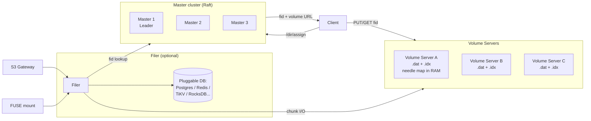
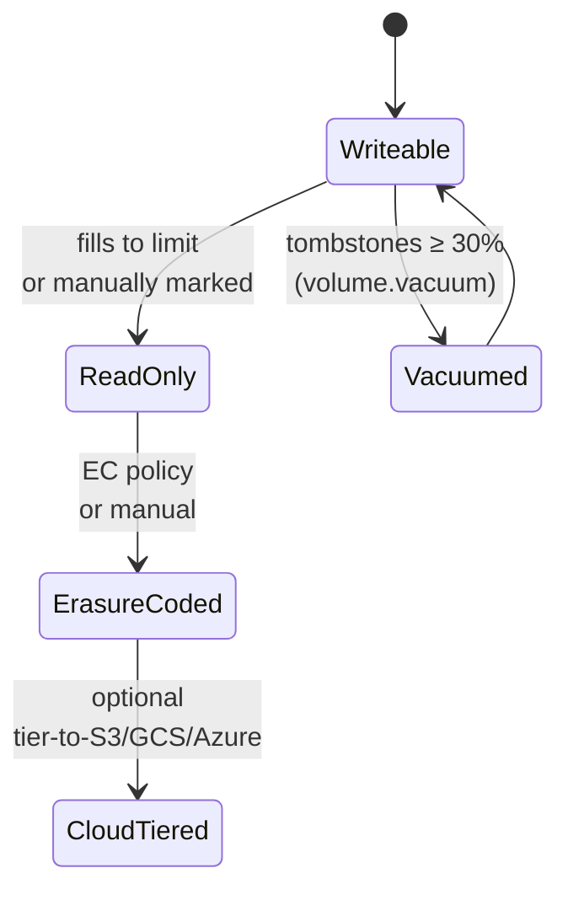

# SeaweedFS — 為數十億小檔案而生的 Haystack 風格物件儲存

## 摘要

SeaweedFS 是以 Go 寫成、Apache-2.0 授權、設計取材自 Haystack 的物件儲存：一個小型的 Raft master 叢集只追蹤 **volume**（不追蹤檔案）；一批 volume server 把大量小物件打包進少數預設 30 GB 的 append-mostly 「volume」檔；以及一個選用的 filer 服務，靠可插拔的外部資料庫儲存 path-to-fid 對應，在上層暴露 POSIX、S3、HDFS、WebDAV 介面。架構上的關鍵句是 master 的狀態模型：master 記憶體隨 **volume 數量**增長（每 ~30 GB 一筆），而非檔案數；每台 volume server 在 RAM 中以 ~**16 bytes per file** 維護一張扁平的 needle index。這讓「數十億小檔案」的工作負載變得可行，是 MinIO 每物件 `xl.meta`、Ceph RGW 每物件 PG mapping 都無法企及的；而 v4.x 線最近加入了原生的 **S3 Tables 與 Iceberg REST catalog**，讓 SeaweedFS 不必再依賴 Hive Metastore 或 Glue，就能自成一個 lakehouse。誠實的弱點同樣具體：S3 邊角有少數瑕疵（特別是 Object Lock COMPLIANCE 模式目前不會強制 WORM，issue #8350）、內建備份故事偏弱、過去一年生產事故多為多碟 EC 退步或維護 worker 啟動 bug，並非資料遺失。本報告對比的對等對象是另外三套自架 OSS S3：**MinIO**、**Ceph RGW**、**Garage**。

> 版本註記（2026 年 5 月）：**v4.24 / v4.25（2026-05-14）** 是目前的安全版本。v4.23 有多碟 EC 分布的退步；他處建議釘在 v4.05 的指引已過時。Apache-2.0 社群版功能完整（S3、POSIX、HDFS、CSI、固定 RS(10,4) EC）；**Enterprise** 層新增自訂 EC 比例（如 20+4，1.2× overhead）、自動 EC shard 修復、規劃中的 bitrot 偵測、以及商業支援。`seaweedfs.com` 上的價格目前是「contact sales」；社群常引用的數字約 **25 TB 之後每 TB 每月 1 美元**，但官網未正式公告。

## 功能與比較表

| 維度 | **SeaweedFS (4.24+)** | **MinIO（社群版／AIStor）** | **Ceph RGW（Tentacle 20.2.1）** | **Garage (2.3.0)** |
|---|---|---|---|---|
| **類別** | 物件 + 選用 POSIX filer + S3 gateway + Iceberg REST | 純物件儲存，僅 S3 API | 多協定，RGW 建構於 RADOS 上 | 純物件儲存，僅 S3 API |
| **核心架構** | Master（Raft，追蹤 volume）+ Volume Server（Haystack needle）+ 選用 Filer（可插拔 DB） | 單一 Go 二進位、per-object Reed-Solomon EC、中繼資料內嵌 `xl.meta` | 無狀態 RGW HTTP → RADOS pool（BlueStore OSD）；CRUSH 放置 | 點對點 Rust、CRDT 中繼資料、無 master |
| **Master／中繼資料狀態** | Master 只追蹤 volume-to-server；叢集級 O(volumes)，非 O(files) | 無 — 與資料同位 | 專用 RADOS pool；bucket index sharding | 每節點存 CRDT 表 |
| **每檔案 overhead** | 約 16 bytes 在 volume server RAM（needle map） | 每物件 1–4 KB 在磁碟（`xl.meta`） | Bucket-index 一筆 + PG mapping | CRDT row |
| **授權** | Apache-2.0 核心；付費 Enterprise 層 | AGPLv3（社群版 2026-04 已封存）；AIStor 商業版 | LGPL-2.1 | AGPLv3 |
| **主要介面** | S3、HDFS、WebDAV、FUSE、Iceberg REST、S3 Tables | S3 v4（完整）、STS、OIDC、LDAP、IAM | S3 + Swift、STS | S3 + 簡化版管理 API |
| **抹除碼** | warm（read-only）volume 上的 RS(10,4)；1 GB 區塊、單 shard 讀取 | Reed-Solomon、4–16 drive/set、逐物件 | 按 pool 設定；典型 4+2、8+3 | 無 — 僅 replication |
| **Replication topology 字串** | `XYZ` — DC ／ rack ／ 同 rack server 各增加幾份 | 每 pool replication factor | CRUSH map | 地理 zone（Maglev 風格） |
| **寫一致性** | 同步寫到所有 N 份 replica（W=N、R=1）；強 | 部署內強一致（K-of-N quorum） | 強一致（RADOS） | 最終一致（CRDT） |
| **S3 Object Lock** | 有，但 **COMPLIANCE 模式目前不會強制 WORM**（issue #8350） | 有（完整） | 有 | 無 |
| **Versioning／Lifecycle** | 有／部分 | 有／有 | 有／有 | 無／無 |
| **生產最小叢集** | 3 master + 3 volume server + 1 個以上 filer（搭 HA DB） | 4 節點 × 4 drive | 3 mon + 5+ OSD + 2+ RGW（約 10 節點） | 3 節點 |
| **多站點／地理** | `weed filer.sync` 非同步，建議 active-passive | Site Replication active-active（強制 KMS + versioning） | Realm → zonegroup → zone，非同步 | 原生地理 zone（一級設計） |
| **K8s** | Helm chart + seaweedfs-operator + CSI driver | MinIO Operator（已進入維護） | Rook（成熟、活躍） | 社群 operator |
| **Lakehouse 適配** | **內建 Iceberg REST catalog + S3 Tables（v4.x）** | Iceberg 需外部 catalog | Iceberg 需外部 catalog | 非為此設計 |
| **最佳使用情境** | 數十億小檔案；小物件熱路徑；自含 Iceberg；HDFS 替代 | 大物件 NVMe 吞吐；AI／ML data lake；備份標的 | EB 等級、多協定、有儲存維運能量的團隊 | 地理分散、低規格硬體、≤100 TB |
| **成本 — 1 PB、3 年（估）** | OSS 免費；Enterprise 社群價約 $1/TB/月 ≈ **1 PB 每年 $36K**，官方為「contact sales」 | AIStor Enterprise 約 $240/TB/yr ≈ **3 年 $720K**；社群／Pigsty 免費 | OSS 免費；商業支援 $50–100K/yr | OSS 免費；無商業支援廠商 |

> 成本數字為 2026 年 5 月公開價估算；硬體成本均未計入。

## 實作深度報告

### 1. 架構深入解析

SeaweedFS 真正決定下游一切設計的，是**狀態存在哪裡**：master 叢集只擁有*叢集拓撲與 volume placement*，volume server 只擁有*自己 volume 內有哪些 needle*，filer（若使用）只擁有*path → fid chunk 列表*（在外部資料庫裡）。系統各處皆無全域檔案索引。

**Master server.** Raft 叢集，典型 3 或 2n+1 節點；僅 leader 指派 file ID（`fid = volumeId,fileKey,cookie`）並回應 volume 分配請求。它複寫的叢集視圖含：volume-to-server 對應、每個 volume 的檔案數與剩餘空間、replication policy、以及拓撲樹（DC → rack → node）。它從不索引個別檔案。一個 1 PB 叢集若採預設 30 GB volume，只需約 33,000 筆 volume 記錄 — 即使在小型硬體上也輕鬆裝進記憶體。這是核心擴展屬性，也是 SeaweedFS 不會像 HDFS NameNode 撞牆的原因。

**Volume server.** 每個「volume」是一份 append-mostly 檔（`<id>.dat`），上限由 master 的 `volumeSizeLimitMB` 控制（預設 **30 GB**；以 `large_disk` 編譯的二進位可放更大，社群實測 50–200 GB 可行）。`.dat` 裡每個物件是一個 **needle**：cookie、needle ID（= fileKey）、資料大小、檔名、MIME、最後修改時間、TTL、flag、payload、checksum，外加對齊 padding。Volume server 把 needle map（key → offset → size）**完全放在 RAM**，每筆約 **16 bytes**。後續所有規畫都靠這個算式：1 M 檔 ≈ 16 MB RAM、100 M 檔 ≈ 1.6 GB、1 B 檔 ≈ 16 GB/volume server。

**檔案分配與讀取路徑.** PUT 流程：client 對 master 發 `/dir/assign` → master 回傳 `(fid, volumeServerURL)` → client 直接把 bytes 上傳到該 volume server。fid 中的 cookie 是 32-bit 隨機值，避免 fileKey 被列舉。GET 對稱：client 對 master 發 `/dir/lookup?volumeId=X` → master 回傳 volume server URL → client 從中一個 GET。Master 只在 O(1) 查找的瞬間出現在請求路徑；資料路徑直達 volume server。

**Filer.** 無狀態。把 path-to-fid-chunks 對應存進外部資料庫。截至 2026 年 5 月，支援後端包含 **LevelDB(2/3)、RocksDB、SQLite、MySQL、PostgreSQL、Redis、Cassandra、HBase、MongoDB、ElasticSearch、TiKV、TiDB、CockroachDB、FoundationDB、Etcd、YDB**。這個選擇是 filer-fronted 工作負載下真正的擴展決策 — 詳見 §5。

**S3 gateway 與 FUSE mount.** 兩者都是 filer 的 thin client。`weed s3` 把 S3 op 轉成 filer op；`weed mount`（FUSE）提供 POSIX。FUSE 比本地碟慢（標準的 FUSE + 網路 RTT 成本）、有 `-writebackCache` 模式以 crash-safety 換速度、無原生 Windows 支援。

### 2. Volume 生命週期

Volume 並非永恆容器 — 它走過一條狀態機，建模叢集容量前值得先理解。

**Writeable → Read-only.** 當 `.dat` 達到 `volumeSizeLimitMB`，或操作員下 `volume.markReadonly`。新指派的 fid 落到別的 volume；讀取照舊。

**Read-only → Erasure-coded.** Volume 變唯讀後，可被 RS(10,4) 編碼為 14 個 shard 分散到叢集。EC shard 落實後刪除原 .dat。EC 刻意只跑在唯讀 volume 上 — 編碼 append-mostly 檔不便宜。

**Cloud-tiered.** EC 過（或唯讀的）volume 可透過 cloud-tier 推到 S3／GCS／Azure。熱讀可由可設定的本地快取服務；冷讀從雲端拉。

**Vacuum.** 對 writeable .dat 的刪除把 needle 標為 tombstone；位元組不會立刻消失。當垃圾比超過門檻（預設 **30%**），背景的 **vacuum** 工作把該 volume 重寫成新的緊湊 .dat。Vacuum 期間*該 volume 暫時變為唯讀* — 預期會有寫入卡頓。Sentry 的生產事故（#4106）本質就是「admin/worker 子程序沒在跑、vacuum 從未觸發、tombstone 累積到沒有可用 volume」。維運啟示：確認 admin worker 健康，且 vacuum 門檻和你的變更率對齊。

### 3. Replication 與 Erasure Coding

**Replication 字串.** Volume 帶一個三位數字字串 `XYZ`，每一位代表該層拓撲的「額外」副本數：

| 代碼 | 總副本 | 拓撲 |
|---|---|---|
| `000` | 1 | 單副本，無冗餘 |
| `001` | 2 | +1 同 rack peer |
| `010` | 2 | +1 同 DC 跨 rack |
| `100` | 2 | +1 跨 DC |
| `110` | 3 | 一個跨 rack、一個跨 DC |
| `200` | 3 | 兩個額外 DC（共 3 DC） |

關鍵：寫入為**同步寫到所有 N 份 replica（W=N、R=1）** — 每份 replica 都確認才 ack。與 Ceph 等 quorum 系統（R=2-of-3 / W=2-of-3）不同，但這正是讀取可只打單一 replica 而不必擔心 staleness 視窗的原因。代價如你預期：degraded 狀態下寫入較慢，因為任何一份慢 replica 都會卡 ack。

**Erasure coding.** 唯讀（sealed）volume 可編成 **RS(10,4)** — 10 資料 + 4 同位 = 14 shard，1.4× 容量 overhead，可容忍 4 shard 損失。一份 30 GB volume 變成 14 × 3 GB shard，內部以 1 GB 區塊條帶化（小於 10 GB 的 volume 改用 1 MB 區塊）。設計上的關鍵：因為每個 1 GB 區塊完整落在單一 shard 上，*大多數讀取仍只打一個 shard server、一次磁碟 seek*。**EC 在穩態下不增加讀延遲**。只有當某個 shard 離線時才會觸發重建，並造成延遲尖峰（廠商 benchmark 報吞吐下滑約 35%）。修復為全 volume 操作，不是 per-needle。

自訂 EC 比例（如 20+4，1.2× overhead）與**自動 EC shard 修復**屬 Enterprise 功能。OSS 版固定 RS(10,4)，靠手動工具修復。

### 4. 規模上的算式 — 數十億小檔案真正的成本在哪

「數十億小檔案」的宣稱是真的，但成本分散在三個元件上，限制錯誤的元件會吃到苦頭。

- **Master**：狀態為 O(volumes)，非 O(files)。1 B 檔案 × 平均 100 KB ≈ 100 TB ≈ 30 GB 共 ~3,400 個 volume。Master 在任何合理規模下都不是瓶頸。
- **Volume server**：狀態為 O(本機 volume 內的 needle 數) × 每個 16 B。一個放 30 TB 1 KB 檔案的節點，需 ~30 B 物件 × 16 B = ~480 GB RAM — **不可行**。所以「數十億小檔案」對*叢集*成立、對*單一節點*不成立。實務上每節點密度上限：**~50–200 M needle**，取決於 RAM。
- **Filer DB**：只有走 filer／S3 路徑才會付出。每物件成本是後端 DB 的一筆 row／entry／cell。十億筆就是真正的 DB ops 問題 — 與 JuiceFS 對 metadata engine 的擔心同形。

對等對象在 1 B 物件下：

- **MinIO** 每物件會在磁碟上額外寫一份 `xl.meta`（約 1–4 KB），加上資料 shard。10 億個小物件，就是 TB 級的 metadata 檔加上 inode-table 壓力在底層檔案系統。
- **Ceph RGW** 把 bucket-index 條目存進複寫的 pool；大 bucket 需要自動 sharding，OSD 隨物件數線性擴展。
- **Garage** 每節點都有 CRDT 表 — 不為此規模設計，文件也明說。

只要你維持在單節點 needle 上限以內，SeaweedFS 的「RAM 中 16 B/needle、每 30 GB volume 一份 .dat」設計在小物件 tail 是真正的勝者。

### 5. Filer 後端 — 真正的擴展決策

Master 很少是上限。當 S3／POSIX 路徑在熱路徑時，必須認真規畫的是 filer 的中繼資料儲存。2026 年 5 月的社群／生產指引：

| 後端 | 適用情境 | 注意事項 |
|---|---|---|
| LevelDB / LevelDB2 / LevelDB3 | 單一 filer 的 demo 與小型部署 | 不能多 filer；`filer.sync` 跨 DC 複寫不會運作 |
| **PostgreSQL** | 預設的多 filer 選擇；大部分生產部落格使用 | 標準 Postgres 維運適用 — 調 `shared_buffers`、設好 replication |
| MySQL | 與 Postgres 同角色 | 略少見；社群範例較稀疏 |
| **Redis** | filer 吞吐最高；Software Heritage 鏡像使用 | 必須持久化並依目錄樹大小估好容量 |
| **TiKV** | JuiceFS-on-SeaweedFS PB 級部署（如 SmartMore 約 1.5 PB） | 多加一座 TiKV 叢集要運維 |
| Cassandra / FoundationDB | 大規模可行 | 實務上少見；準備 debug 邊角 |

SeaweedFS 部署若要對使用者暴露 S3 或 POSIX，第一個具體的規模問題其實是「**用哪個 filer 後端，容量規畫是否正確**」— 比 volume server 本身更值得先想清楚。

### 6. S3 Tables 與 Iceberg REST — v4.x 的戰略轉折

v4.05 到 v4.20 之間，SeaweedFS 加入了原生 **S3 Tables API** 與內建 **Iceberg REST catalog**。這是過去一年戰略上最重要的新增，因為它從 lakehouse 堆疊中拔掉一整個外部元件：不需要 Hive Metastore、不需要 AWS Glue、不需要 Nessie。任何說 Iceberg REST 的工具（Spark、Trino、Doris、DuckDB iceberg extension、Polaris／Unity Catalog OSS）都能把 SeaweedFS 同時當 metadata catalog 與物件儲存。此期同時加入 Iceberg 自動 manifest 與資料檔的 compaction。

對自架 lakehouse 工作負載，這在四家對等選項中是最乾淨的 — MinIO／Ceph／Garage 都不附帶 catalog，需要你自帶。代價是 Iceberg REST 介面比 S3 介面年輕，DDL 變動劇烈的工作負載仍應審慎驗證。

### 7. 維運模型

**單一二進位的多角色.** `weed master`、`weed volume`、`weed filer`、`weed s3`、`weed mount`、`weed shell`、`weed admin`、`weed iam`。較新（v4.0+）的 `weed admin` 服務以受管框架協調背景 worker（EC、balance、vacuum、replication-fix）— 比舊有 ad-hoc 的 `weed shell` 腳本是一大進步。

**典型 3 節點生產拓撲.** 每節點跑 `master + volume + filer + s3`；PostgreSQL（或你選的 filer 後端）跑在獨立的 HA pair；如果三節點分屬不同 rack 就設 volume replication `010`。Kubernetes 走官方 Helm chart 或 seaweedfs-operator，PV 由 CSI driver 提供。

**Day-2 操作.**
- **加節點**：啟動 `weed volume` 指到 master 即可；新 volume 會自動落到那裡，無需 rebalance。
- **drain**：`weed shell` → `volume.move <volumeId> -target=...`，或批次用 `volume.balance`。
- **EC 轉換**：對 sealed volume 跑 `volume.tier.upload` 或 admin worker 的 policy。
- **Vacuum／GC**：垃圾 ≥ 30% 自動執行；手動 `volume.vacuum -garbageThreshold=0.0001`。確認 admin worker 在跑 — 這是最常見的「靜默失靈」模式。

**備份.** 老實說很弱。官方的 `weed backup` 是 per-volume；wiki 的「Data Backup」頁也直接承認「暫停寫入」是最安全的路。實務上生產的做法是：(a) 對 filer DB 做快照（如 `pg_basebackup`）、(b) 用 `weed filer.sync` 或對 read-only/EC'd volume 做 volume 層 rsync 到 passive 遠端叢集、(c) 把該 passive 叢集當實質備份。如果你的合規要求是命名空間 point-in-time 一致的備份，這就是一個真實落差，值得在設計文件中標註。

### 8. 生產可靠性 — 老實說

過去 12 個月 upstream issue 的模式：多數造成生產事故的 bug 是**升級路徑**與**多碟 EC**，並非資料遺失。釘住已知良好的 minor、避開最前沿邊角，已產生不少穩定運行的紀錄。

具體須納入考量的已知問題：

- **v4.23（2026-05-04）**：多碟 volume server 上分布 EC shard 失敗載入。**v4.24（2026-05-14）已修**；同日 v4.25 額外清理 v4.23 失敗轉換留下的 EC 痕跡。**目前安全版本：v4.24+**。
- **v3.96 → v4.00 讀取效能回退**（#7462）：部分工作負載慢 23–34%。狀態 open；跨此邊界升級時相關。
- **4.18+ 記憶體成長**（#9035）：4.18 後 volume／filer RSS 上升的報告。Open。
- **Mount 4.12 → 4.17 後失應答**（#8696）：無 log 卡死。Open。
- **S3 Object Lock COMPLIANCE 不強制 WORM**（#8350）：保留期屆滿前 delete 仍會成功。**這對 SEC 17a-4／FINRA 4511 合規場景直接出局** — 今天那種工作負載請選 Ceph RGW 或 MinIO/AIStor。
- **高變動下 volume 被填滿並卡住**（Sentry #4106）：根因是 all-in-one container 沒生 admin/worker 子程序。透過把 admin 與 worker 拆獨立 container 修復。
- **`chrislusf/seaweedfs-enterprise:4.20` image 壞掉**（#9071）：缺 blob；走 Enterprise image 請釘 4.19。

Sentry self-hosted 的串（#4071、「SeaweedFS doesn't seem production ready」，2025 年 12 月）是維運者對備份落差的擔憂。撰寫此文時 issue 仍 open，Sentry 也沒實際換掉 SeaweedFS — 補丁仍在出。社群比較裡流傳的「Sentry 已官方棄用」並不正確；視為**有經驗的維運者對生產就緒度的擔憂**，而非方向性決策。

### 9. 效能特性

公開數字偏少，維護者也明說「benchmark 易誤導」，因為系統涵蓋的工作負載形狀差異太大。

**第一手**（Wiki Benchmarks，MacBook SSD、單節點、1M × 1 KB 檔）：
- 寫：5,747 req/s、平均 10.9 ms、P50 10.2 ms、P99 17.3 ms
- 讀：12,988 req/s、平均 4.7 ms、P50 2.6 ms、P99 34.8 ms

**第三方**：
- Onidel 2025 比較報出小物件混合工作負載下平均約 2.1 ms，SeaweedFS 在小檔場景領先 MinIO 與 RustFS。
- 社群 benchmark：3 千萬小檔讀取比 MooseFS 快 2.5 倍（356 分 vs 874 分）— 工作負載特定但有代表性。

目前**沒有同等規模 25/100 GbE NVMe 叢集的廠商公開 benchmark**。在大物件高吞吐串流上，MinIO 與 Ceph RGW 在同硬體上會贏 SeaweedFS；SeaweedFS 在小物件熱路徑勝出，因為「一次 seek 一個讀」主導。

### 10. 對等比較 — 何時選 SeaweedFS 勝過各家

**vs. MinIO.** 選 SeaweedFS 的時機：小檔工作負載為主、需要 POSIX/HDFS/WebDAV 與 S3 同時上場，或在意 Apache-2.0 與活躍 OSS 社群（MinIO 已於 2026 年 4 月封存社群 repo）。選 MinIO/AIStor 的時機：大物件吞吐在 NVMe + 100 GbE 是首要指標、需要極穩的 S3 一致性與 Object Lock COMPLIANCE、或商業支援為必要。

**vs. Ceph RGW.** 選 SeaweedFS 的時機：規模 1 PB 至幾十 PB、單 DC 或簡單跨 DC、團隊沒有專職儲存 SRE、工作負載以小物件讀取為主。選 Ceph 的時機：同一叢集還要服務區塊（RBD）與 POSIX（CephFS）、規模到數百 PB、需要有衝突解決的真正多站點、或合規／多租戶要求一個久經沙場的合規姿態。Ceph 是這個對等組中唯一能真正擴展到 100 PB 以上仍保有強一致性的選項。

**vs. Garage.** 選 SeaweedFS 的時機：單 DC 吞吐重要、單節點需要超過數十 TB、或需要 POSIX/HDFS/Iceberg 介面。選 Garage 的時機：節點*地理分散在消費級網際網路*、叢集小（&lt;100 TB）、想要 CRDT 中繼資料而完全避開熱路徑共識。Garage 拿效能換不穩連線的韌性；SeaweedFS 走相反方向。

### 11. 何時選 SeaweedFS／何時不選

**選的時機：**
- 主要存取模式是中小物件讀取，尤其在意 tail latency。
- 需要一個部署同時提供 S3 + POSIX/FUSE + HDFS + Iceberg REST。
- 想要自含 lakehouse（S3 Tables + 內建 Iceberg catalog），不必另建 Hive Metastore／Glue／Nessie。
- 授權上要 Apache-2.0 並擁有活躍 OSS 社群。
- 規模能放在單 DC 維運範圍內，每節點 needle 數維持在約 100–200 M 以下。

**不選的時機：**
- 工作負載要符合 SEC 17a-4／FINRA／MiFID II 等 WORM 合規 — Object Lock COMPLIANCE 目前不強制（#8350）。改用 Ceph RGW 或 MinIO/AIStor。
- 唯一性能指標是 NVMe + 100 GbE 上的大物件吞吐。MinIO 與 Ceph 數字更強。
- 要在數百 PB 等級運作，或要從同一叢集出 RBD + CephFS + RGW 多協定。答案是 Ceph。
- 部署是地理分散、走高 RTT 消費級網路。Garage 正是為此而生。
- 團隊無法容忍偶發的升級路徑 regression、也沒有 SRE 頻寬釘 minor 與驗證。

### 寫進選型文件時值得標註的注意事項

- **目前安全版本為 v4.24+** — 釘在 v4.05 的舊指引已過時。
- **Object Lock COMPLIANCE 模式不強制 WORM**（#8350）— 合規工作負載直接出局。
- **備份故事偏弱** — 規畫上請將 filer DB 與 read-only volume 分開備份，並實際演練還原。
- **Enterprise 價格目前為「contact sales」** — 社群流傳的 $1/TB/月是非正式數字，並非官網公告。
- **每節點 needle 數受 RAM 限制**，約 16 B/檔；volume server 硬體要對「數十億檔案」規畫，不只是 TB 量。
- **Filer 後端的選擇是真正的擴展決策**（當 S3 或 POSIX 在熱路徑）；多數情境選 Postgres 或 Redis，PB 級選 TiKV。

## Sources

- [SeaweedFS GitHub releases](https://github.com/seaweedfs/seaweedfs/releases) — accessed 2026-05
- [SeaweedFS Wiki: Production Setup](https://github.com/seaweedfs/seaweedfs/wiki/Production-Setup) — accessed 2026-05
- [SeaweedFS Wiki: Replication](https://github.com/seaweedfs/seaweedfs/wiki/Replication) — accessed 2026-05
- [SeaweedFS Wiki: Erasure coding for warm storage](https://github.com/seaweedfs/seaweedfs/wiki/Erasure-coding-for-warm-storage) — accessed 2026-05
- [SeaweedFS Wiki: Filer Active-Active cross-cluster sync](https://github.com/seaweedfs/seaweedfs/wiki/Filer-Active-Active-cross-cluster-continuous-synchronization) — accessed 2026-05
- [SeaweedFS Wiki: FUSE Mount](https://github.com/seaweedfs/seaweedfs/wiki/FUSE-Mount) — accessed 2026-05
- [SeaweedFS Wiki: Benchmarks](https://github.com/seaweedfs/seaweedfs/wiki/Benchmarks) — accessed 2026-05
- [SeaweedFS Wiki: Data Backup](https://github.com/seaweedfs/seaweedfs/wiki/Data-Backup) — accessed 2026-05
- [SeaweedFS Wiki: FAQ](https://github.com/seaweedfs/seaweedfs/wiki/FAQ) — accessed 2026-05
- [DeepWiki: SeaweedFS Architecture Overview](https://deepwiki.com/seaweedfs/seaweedfs/1.1-architecture-overview) — accessed 2026-05
- [DeepWiki: Volume Organization](https://deepwiki.com/seaweedfs/seaweedfs/4.2-volume-organization) — accessed 2026-05
- [DeepWiki: Needle Storage Format](https://deepwiki.com/seaweedfs/seaweedfs/4.1-volume-structure) — accessed 2026-05
- [DeepWiki: Metadata Storage and Filer Stores](https://deepwiki.com/seaweedfs/seaweedfs/2.3.1-metadata-storage-and-filer-stores) — accessed 2026-05
- [seaweedfs.com — Open Source vs Enterprise comparison](https://seaweedfs.com/docs/comparison/) — accessed 2026-05
- [seaweedfs.com — Enterprise Pricing](https://seaweedfs.com/docs/pricing/) — accessed 2026-05
- [seaweedfs.com — Customizable Erasure Coding](https://seaweedfs.com/docs/erasure_coding/) — accessed 2026-05
- [Sentry self-hosted issue #4071 — "SeaweedFS doesn't seem production ready"](https://github.com/getsentry/self-hosted/issues/4071) — accessed 2026-05
- [Sentry self-hosted issue #4106 — volumes / read-only / GC](https://github.com/getsentry/self-hosted/issues/4106) — accessed 2026-05
- [SeaweedFS issue #7462 — v3.96→v4.00 read regression](https://github.com/seaweedfs/seaweedfs/issues/7462) — accessed 2026-05
- [SeaweedFS issue #8350 — Object Lock COMPLIANCE WORM not enforced](https://github.com/seaweedfs/seaweedfs/issues/8350) — accessed 2026-05
- [SeaweedFS issue #8696 — mount unresponsive 4.12→4.17](https://github.com/seaweedfs/seaweedfs/issues/8696) — accessed 2026-05
- [SeaweedFS issue #9035 — memory growth in 4.18+](https://github.com/seaweedfs/seaweedfs/issues/9035) — accessed 2026-05
- [SeaweedFS issue #9071 — Enterprise 4.20 image broken](https://github.com/seaweedfs/seaweedfs/issues/9071) — accessed 2026-05
- [SeaweedFS discussion #5397 — 1 petabyte storage report](https://github.com/seaweedfs/seaweedfs/discussions/5397) — accessed 2026-05
- [SeaweedFS discussion #5984 — volume size 30 GB default](https://github.com/seaweedfs/seaweedfs/discussions/5984) — accessed 2026-05
- [Software Heritage docs — SeaweedFS mirror operations](https://docs.softwareheritage.org/sysadm/mirror-operations/seaweedfs.html) — accessed 2026-05
- [Kubeflow 1.11 release — SeaweedFS as default object store](https://blog.kubeflow.org/kubeflow-1.11-release/) — accessed 2026-05
- [Kubeflow Pipelines — Object Store Configuration](https://www.kubeflow.org/docs/components/pipelines/operator-guides/configure-object-store/) — accessed 2026-05
- [JuiceFS blog — SeaweedFS + TiKV for JuiceFS](https://juicefs.com/en/blog/usage-tips/seaweedfs-tikv) — accessed 2026-05
- [JuiceFS — SmartMore AI training storage case study](https://juicefs.com/en/blog/user-stories/ai-training-storage-selection-seaweedfs-juicefs) — accessed 2026-05
- [JuiceFS vs SeaweedFS comparison](https://juicefs.com/docs/community/comparison/juicefs_vs_seaweedfs/) — accessed 2026-05
- [Onidel 2025 — MinIO vs Ceph RGW vs SeaweedFS vs Garage benchmark](https://onidel.com/blog/minio-ceph-seaweedfs-garage-2025) — accessed 2026-05
- [Rilavek 2026 — Self-Hosted S3 in 2026](https://rilavek.com/resources/self-hosted-s3-compatible-object-storage-2026) — accessed 2026-05
- [The Moonfires blog — Recovering SeaweedFS](https://d.moonfire.us/blog/2024/10/25/recovering-seaweedfs/) — accessed 2026-05
