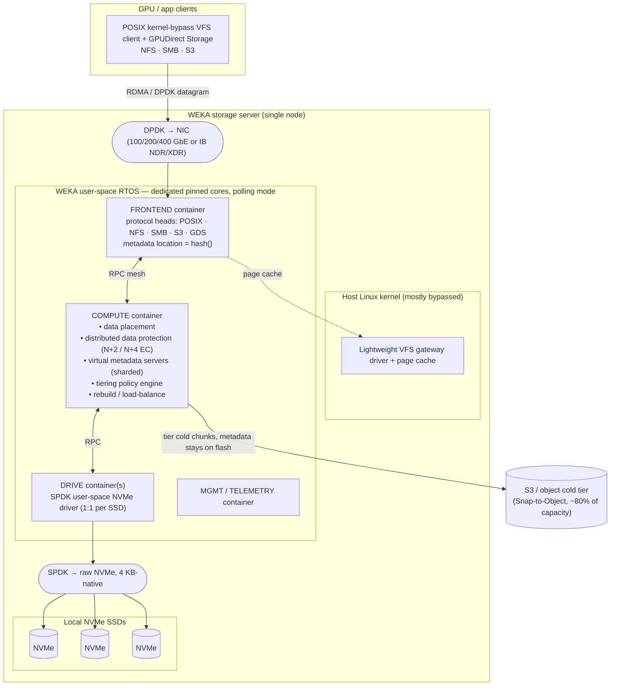
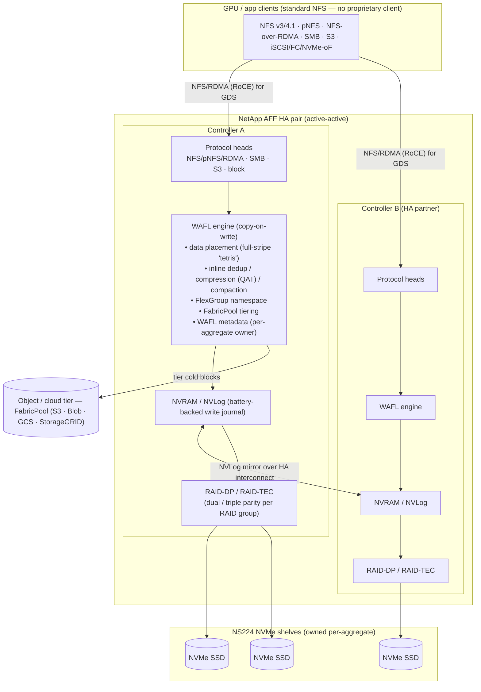
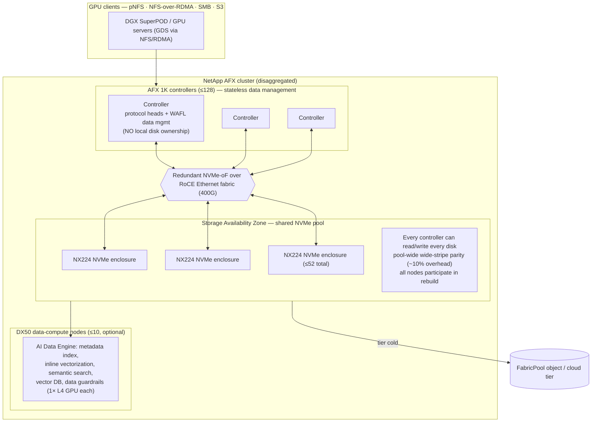

# WekaFS (WEKA NeuralMesh) vs NetApp ONTAP — Architecture Comparison for AI/GPU Storage

*Evaluated as of June 2026. WEKA software v5.1.x / NeuralMesh (rebranded June 2025); NetApp ONTAP 9.18.1 (May 2026), AFF A-Series (2024), AFX disaggregated ONTAP (GA on ONTAP 9.17.1, Oct 2025). Performance and price figures are public/vendor estimates, dated inline — see notes and `## Sources`.*

## Summary

WekaFS — now packaged as the **WEKA NeuralMesh** platform — is a **shared-nothing, fully-distributed parallel file system** that runs as a user-space RTOS on commodity NVMe x86 servers, bypasses the Linux kernel for both networking (DPDK) and storage (SPDK), and distributes *both data and metadata* across every core in the cluster with no dedicated metadata server. Its single differentiator versus enterprise NAS is that it was engineered to keep thousands of GPUs saturated: a kernel-bypass POSIX client, a first-class NVIDIA GPUDirect Storage (GDS) path, and — most recently — an **Augmented Memory Grid** that spills LLM KV-cache from GPU HBM to NVMe over RDMA. **NetApp ONTAP** is the opposite philosophy: a mature, unified enterprise data-management platform (snapshots, SnapMirror replication, multi-protocol NAS+SAN+S3, ransomware protection) whose AI story is delivered through **standard pNFS / NFS-over-RDMA — deliberately *no* proprietary client** — on either the classic dual-controller **AFF** HA-pair appliance (WAFL + NVRAM + RAID-DP/TEC) or the new **AFX** disaggregated design that decouples controllers from NVMe shelves over an NVMe-oF/RoCE fabric to chase parallel-FS bandwidth. Pick WEKA when raw GPU-feeding throughput, metadata-heavy small-file performance, and inference KV-cache offload are the goal and you can fund all-NVMe; pick NetApp when you want one platform that also does enterprise data services, hates proprietary clients, and values operational maturity over peak benchmark numbers. The honest catch: the two barely share a benchmark — WEKA leads MLPerf Storage and IO500 (which NetApp does not enter), NetApp leads SPECstorage 2020 (which WEKA no longer submits), so no controlled head-to-head exists.

## Comparison table

| Dimension | **WEKA NeuralMesh / WekaFS** | **NetApp AFF (classic ONTAP)** | **NetApp AFX (disaggregated ONTAP)** |
|---|---|---|---|
| Type / category | Shared-nothing parallel distributed file system (software-defined) | Unified scale-out NAS+SAN appliance | Disaggregated scale-out file/object platform |
| Core architecture | User-space RTOS on x86+NVMe; data+metadata sharded across all cores; kernel-bypass (DPDK+SPDK) | Dual-controller HA pairs; WAFL copy-on-write; NVRAM-journaled; cluster of up to 24 NAS nodes | Stateless-ish controllers (≤128) over RoCE/NVMe-oF fabric to a shared pool of NX224 NVMe shelves (≤52) |
| Data protection | Distributed erasure coding (DDP), **N+2 or N+4**, cluster-wide stripes, anti-fragile, data-only prioritized rebuild | **RAID-DP** (dual-parity) / **RAID-TEC** (triple-parity) within RAID groups | Pool-wide wide-stripe parity; **"≤10% overhead"** (NetApp has not publicly named EC vs RAID) |
| Metadata model | Fully distributed; virtual metadata servers on every core; **location computed by hash**, no central MDS | WAFL metadata owned per-aggregate by one controller (HA failover) | Decoupled from disks; every controller can read/write every disk in the Storage Availability Zone |
| Primary interfaces / protocols | POSIX (kernel-bypass VFS client), **GPUDirect Storage**, NFS v3/4.1, SMB 2/3, S3 | NFS v3/4.x + **pNFS** + **NFS-over-RDMA**, SMB, S3, iSCSI/FC/**NVMe-oF** | **pNFS**, NFS, **NFS/RDMA**, SMB, S3 (no block; no proprietary client) |
| GPU/AI feeding | First-class GDS (`fs:weka` in NVIDIA cufile.json); kernel-bypass client; **Augmented Memory Grid** KV-cache offload | GDS via generic NFS-over-RDMA + pNFS + session trunking (not a named cufile tier) | Same NFS/RDMA+pNFS GDS path, higher bandwidth; AI Data Engine (vector/semantic) on DX50 nodes |
| Hot tier / media | NVMe-only hot tier (all metadata on flash) + S3 object cold tier (FabricPool-equivalent: Snap-to-Object) | NVMe SSD (+ QLC C-series) + FabricPool tiering to object/cloud | NVMe SSD pool + FabricPool tiering |
| Scale-out namespace | Single namespace to **14 EB / 6.4 trillion files**; clusters to hundreds–thousands of nodes | FlexGroup tested to **20–60 PB / 400 B files**; NAS cluster cap **24 nodes** | >1 EB effective; **128 controllers + 52 shelves** (initial release may impose lower limits) |
| Best fit | GPU training/inference, HPC, metadata-heavy small-file, checkpointing, KV-cache offload | Enterprise NAS/SAN, mixed workloads, data services + moderate AI on standard NFS | AI factories wanting parallel-FS bandwidth + ONTAP data services, no proprietary client |
| Advantages | Highest published GPU-feeding throughput; distributed metadata; fast rebuilds; cloud-portable; inference memory grid | Mature data mgmt (Snapshot/SnapMirror/ARP/QoS); multi-protocol; operational simplicity; no client to deploy | Independent scale of compute vs capacity; ONTAP services at EB scale; ~457 GiB/s with few SSDs |
| Disadvantages | All-NVMe cost; needs 100GbE+/RDMA, dedicated cores, SR-IOV; complex; quote-only pricing; vendor-reported AI numbers | 24-node NAS ceiling; RAID overhead & narrower rebuild parallelism; no kernel-bypass client; no MLPerf result | v1 product (Oct 2025); protection scheme unnamed; "1 EB effective" assumes optimistic reduction; new failure modes |
| License / acquisition | Software subscription per usable TB; PAYG via AWS Marketplace (private offer); WEKApod appliance; BYOL on AWS/Azure/GCP/OCI | Appliance purchase + ONTAP One licensing; Keystone STaaS; FSx for ONTAP / Azure NetApp Files / CVO in cloud | Appliance (AFX 1K + NX224 + optional DX50) + ONTAP; Keystone "STaaS for Enterprise AI" |
| Cost (rough, public, dated) | **No public list price** — quote-only. WEKApod Nitro: 640 GB/s read / 320 GB/s write per node start, 17M IOPS/42U rack (datasheet, Nov 2025). Cloud: PAYG hourly, private offer | No public on-prem list. Cloud proxy: **FSx ONTAP $0.125/GB-mo SSD** + $0.017/IOPS-mo + $0.72/MBps-mo (us-east-1, 2026-06) | No public list; via Keystone STaaS (min 50 TiB committed, Extreme tier) |

*Cost and performance figures are approximate public-list or vendor-datasheet estimates as of the dates shown and will drift; verify against a current quote. On-prem list prices for both WEKA and NetApp AFF/AFX are quote-only — only NetApp's cloud rates are publicly exact.*

---

## In-depth report

### 1. The one differentiator that frames everything

The entire comparison reduces to a single design fork: **does the client talk to storage through a proprietary kernel-bypass parallel-FS stack, or through standard NFS?**

- **WEKA chose the proprietary path.** A DPDK/SPDK user-space RTOS, a custom POSIX VFS driver, and a named GDS integration let WEKA move data NIC→GPU with the CPU and kernel out of the loop. The reward is the highest published per-client GPU-feeding numbers; the price is operational complexity, all-NVMe economics, and lock-in.
- **NetApp deliberately refused it.** ONTAP's AI pitch is literally "parallel access to data *without* a complex parallel file system and *without* proprietary clients" — it rides pNFS + NFS-over-RDMA instead. The reward is that any standard NFS client works and you keep ONTAP's enterprise data services; the price is a per-client efficiency ceiling and (until AFX) a 24-node NAS scaling cap.

Everything below — metadata model, data protection, rebuild behavior, GDS maturity — is downstream of that fork.

### 2. Architecture deep-dive — WEKA storage server

A WEKA server runs a **user-space RTOS beside the Linux kernel**, using LXC containers + cgroups to carve dedicated CPU cores, NVMe devices, and NIC ports away from Linux. Both the network path (DPDK) and the storage path (SPDK) bypass the kernel and run in **polling** mode, eliminating the interrupt/syscall serialization that throttles parallel I/O on a normal NAS. Functions are split into containerized microservices that communicate by RPC even when co-located:

- **Frontend (FE) container** — client entry point; hosts the POSIX path plus NFS/SMB/S3 handlers; talks to the NIC via DPDK; computes metadata location by hash.
- **Compute (backend) container** — the "brain": virtual metadata servers, data placement, distributed erasure-coding parity math, tiering, rebuilds, load balancing.
- **Drive container** — last mile to NVMe via SPDK (user-space, zero-copy); typically one drive container per SSD.
- **Management / telemetry containers** — GUI/CLI/REST, quotas, snapshots, audit.

**Why this is fast for GPUs.** Three mechanisms compound: (1) kernel bypass removes per-I/O syscall/interrupt overhead so a single client can drive tens of GB/s; (2) **fully distributed metadata** — every 1 MB chunk of even a single file maps to a different virtual metadata server slice, so metadata-heavy AI patterns (millions of small files, listing, random read) don't bottleneck on a central MDS; (3) **GPUDirect Storage** moves bytes NIC→GPU HBM directly via RDMA, skipping the CPU bounce buffer.

**Data protection (WEKA DDP).** Distributed erasure coding with **N data + 2 or +4 parity**, striped at 4 KB-chunk granularity across cluster-wide *failure domains* (typically whole servers; configurable to drive/rack/AZ). A 16+2 layout yields ~83% usable NVMe. The scheme is *anti-fragile*: more failure domains lower the combinatorial probability that two chunks of a stripe share a domain, so bigger clusters are **more** resilient. Rebuilds touch only the affected file's flash-resident data, are prioritized, and engage every healthy domain in parallel — a sharp contrast to RAID-group-local rebuild.

**Tiering & namespace.** A single namespace spans NVMe flash and S3 object; **metadata always stays on flash**, cold file chunks tier out to object (typical customers keep ~20% on flash). Snapshots are copy-on-write metadata pointers (instantaneous); **Snap-to-Object** commits full snapshots to S3 for DR and cloud-bursting.

### 3. Architecture deep-dive — NetApp, two designs

NetApp now ships *two* node architectures. The classic **AFF HA pair** is what most ONTAP deployments run; **AFX** is the 2025 disaggregated design aimed squarely at AI factories. Both run ONTAP and both feed GPUs over NFS — never a proprietary client.

#### 3a. Classic AFF controller (HA-pair model)

The defining traits: **WAFL never overwrites in place** (copy-on-write → instant snapshots, but read fragmentation over time); writes are journaled to **NVRAM and mirrored to the HA partner** so the failure domain is the *HA pair*, not the cluster; protection is **parity RAID**, not erasure coding, so rebuilds are bounded by the RAID group's drives and the owning controller; and each **aggregate is owned by exactly one controller** — metadata is *not* cluster-wide-distributed the way WEKA's is. FlexGroup stitches many FlexVol constituents into one namespace, but each constituent still has a single owning node, and NAS clusters cap at **24 nodes**.

#### 3b. AFX disaggregated ONTAP (the AI-targeted design)

AFX is NetApp's structural answer to parallel filesystems: **decouple controllers from capacity** so you scale GPU-feeding bandwidth (add controllers) independently of capacity (add shelves), pool all NVMe into one **Storage Availability Zone** where *every controller can address every disk*, and remove aggregates/RAID groups as admin objects in favor of pool-wide wide-stripe protection (datasheet claims **≤10% overhead**, which implies EC-like wide striping — though NetApp has not publicly named the scheme; treat as unconfirmed). Optional **DX50** nodes run the **AI Data Engine** (vector indexing, semantic search) on dedicated GPUs so it doesn't steal data-path cycles. It still presents **standard pNFS/NFS** — no proprietary client — keeping ONTAP snapshots, SnapMirror, security, and multi-protocol intact.

**The architectural convergence to note:** AFX moves NetApp *toward* WEKA's shared-everything, distributed-protection, independent-scaling model — while still refusing the proprietary kernel-bypass client that is WEKA's core efficiency lever. AFX is, however, a v1 product (GA on ONTAP 9.17.1, Oct 2025) with initial limits the datasheet itself caveats.

### 4. Why WEKA claims to outperform for GPU/AI

These are WEKA's stated mechanisms; numbers are vendor/partner-reported unless noted:

- **Kernel-bypass client + GDS** — single client drives tens of GB/s; data lands directly in GPU HBM. NVIDIA lists `fs:weka` as a first-class GDS tier in cufile.json; NetApp's GDS rides the generic `fs:nfs` (RDMA) path, a real integration-maturity gap.
- **Distributed metadata for small-file/random AI patterns** — WEKA claims 4×–16× lower small-file/metadata read latency vs legacy large-block NAS, because no central MDS bottlenecks listing/random-read-heavy training pipelines.
- **Checkpointing** — write-to-new-location (no read-modify-write) + single-hop striped large writes suit bursty checkpoint storms.
- **Augmented Memory Grid (the 2025–26 headline)** — offloads LLM **KV-cache** from GPU HBM to an NVMe "Token Warehouse" over GDS+RDMA, persisting context across sessions and eliminating prefill recompute. Vendor/partner claims: ~1000× the KV-cache capacity of DRAM; **TTFT up to 41× faster** (20× observed in OCI joint testing); GTC 2026 figures of **6.5× more tokens/GPU** and **320 GB/s read / 150 GB/s write** memory throughput with NVIDIA BlueField/STX integration. These are not independently audited.
- **NVIDIA certification** — WEKApod Nitro is **DGX SuperPOD-certified** and NCP-aligned.

NetApp's counter is not to win those micro-benchmarks but to argue most enterprises don't need a proprietary client to keep GPUs fed: AFX hit **457 GiB/s** on an 8-node cluster with a *single* NX224 shelf via pNFS+NFS/RDMA+GDS, and ONTAP brings data services WEKA doesn't focus on.

### 5. Performance — public data (and why it doesn't line up)

The blunt truth: **WEKA and NetApp do not share a benchmark.** WEKA submits MLPerf Storage and IO500 (which NetApp does not enter); NetApp submits SPECstorage 2020 (which WEKA no longer does). Pick the benchmark and either vendor "wins." All figures below carry different configs and dates — do **not** treat any cross-vendor row as controlled.

| Benchmark | WEKA | NetApp | Notes |
|---|---|---|---|
| **MLPerf Storage v1.0** (2024-09) | 3D-UNet/H100: **13 accelerators** @ >90% util, 34.57 GB/s; ResNet50/H100: **74 accelerators**, 13.72 GB/s (single client) | **No submission** (MLCommons flagged absence of scale-out NAS vendors) | Vendor configs differ; WEKA per-single-client |
| **MLPerf Storage v2.0** (2025-08) | No submission | No submission | Neither entered; DDN led (208 simulated H100/node) |
| **IO500 production** | Samsung rank #4: score **826.86**, 248.67 GiB/s BW, 291 nodes; MSKCC #7: 665.49, 261 nodes | **No entry** | Independent (IO500), but no NetApp baseline |
| **SPECstorage 2020 eda_blended** | No recent result | 8-node AFF A90: **8,100 job sets**, 1.17 ms ORT, 58,809 MB/s peak | Independent (SPEC); NetApp leads here |
| **SPECstorage 2020 swbuild** | No recent result | 8-node AFF A90: **11,040 builds**, 1.42 ms ORT, 44,906 MB/s | Independent (SPEC) |
| **SPEC EDA (older)** | 3,600 job sets (6× Dell R7515 + 90 NVMe) | 6,300 job sets (4× A900) | ~2023, *different hardware each side* — not controlled |
| **GPUDirect Storage** | **113 GB/s** to one DGX-2 (16× V100), ~5M IOPS — *2020–21, V100 era* | **351 GiB/s** on 4× AFF A90 (NFS/RDMA, 2024); **457 GiB/s** AFX 8-node, single shelf (2025) | Completely non-comparable scope/epoch |
| **Appliance peak** | WEKApod Nitro: 640 GB/s read / 320 GB/s write per node start; **17M IOPS / 42U rack** (2025-11) | AFF A90: **2.4M IOPS / HA pair**, ~100 µs latency; ~1 TB/s at cluster scale | Vendor datasheets, different units |

**Independent analyst view:** GigaOm's 2024 Scale-Out File Storage Radar names *both* as Leaders — NetApp "Mature/Platform Play," WEKA "Innovative/Platform Play" and an Outperformer on cadence. No public, controlled, $/GB/s head-to-head on identical AI workloads exists.

### 6. Operational model, security, ecosystem

- **WEKA day-2:** Multi-Container Backend enables non-disruptive rolling upgrades; RAFT-elected metadata leaders fail over in a split-second; rebuilds are admin-tunable and data-only. But you must dedicate cores/NICs, configure SR-IOV/DPDK, and run a min 8-node cluster (25 for converged Axon, which forces +4 parity). The WEKApod appliance exists precisely to hide this complexity.
- **NetApp day-2:** This is NetApp's home turf — Snapshot, SnapMirror sync/async replication, MetroCluster, AI-driven Autonomous Ransomware Protection (ONTAP 9.16+), QoS, secure multi-tenancy, BlueXP/Console management, decades of operational tooling. No client to deploy on GPU hosts.
- **Security:** Both do at-rest and in-flight encryption and multi-tenancy. NetApp adds mature ransomware detection, MetroCluster sync DR, and SnapLock WORM compliance — areas WEKA does not target.
- **Ecosystem:** Both are NVIDIA DGX SuperPOD/BasePOD certified and Kubernetes-native (CSI). WEKA leans into the NVIDIA inference stack (Dynamo, NIXL, TensorRT-LLM, the Augmented Memory Grid). NetApp leans into hyperscaler-native ONTAP (FSx for NetApp ONTAP, Azure NetApp Files, Cloud Volumes ONTAP) and enterprise data fabric.

### 7. When to pick which

**Pick WEKA NeuralMesh when:**
- You are saturating large GPU fleets (training or inference) and per-client throughput is the binding constraint.
- Your workload is metadata/small-file heavy (many-file datasets, random read) or checkpoint-write bursty.
- You want LLM inference KV-cache offload (Augmented Memory Grid) to cut TTFT and grow effective context.
- You can fund all-NVMe + 100/200/400 GbE/IB with RDMA, and accept a proprietary client and quote-only pricing.
- You need cloud portability with identical software on AWS/Azure/GCP/OCI.

**Pick NetApp ONTAP (AFF or AFX) when:**
- You want one platform that does AI *and* enterprise NAS/SAN with snapshots, replication, ransomware protection, and multi-protocol.
- You refuse to deploy proprietary kernel-bypass clients on every GPU host; standard pNFS/NFS-over-RDMA is a hard requirement.
- Operational maturity, support, and data-management breadth outweigh peak benchmark numbers.
- (AFX specifically) You need parallel-FS-class bandwidth and EB-scale capacity with independent compute/capacity scaling, but still inside the ONTAP ecosystem — and you can tolerate a v1 product.
- You value transparent cloud pricing (FSx for ONTAP, Azure NetApp Files) for hybrid deployments.

**Honest caveats for the decision:**
- No controlled WEKA-vs-NetApp AI benchmark exists; treat every cross-vendor number as indicative, not decisive.
- WEKA's headline AI-inference multipliers (41× TTFT, 6.5× tokens, 1000× KV capacity) are vendor/partner-reported, several from OCI joint testing — not independently audited.
- AFX is new (Oct 2025); its data-protection scheme is publicly unnamed and "1 EB effective" assumes optimistic data reduction that AI's already-compressed data rarely achieves.
- Both vendors' on-prem list prices are quote-only; only NetApp's cloud rates are public and exact.

## Sources

- [WEKA NeuralMesh Architecture White Paper (WKA431-02, 07/25)](https://www.weka.io/wp-content/uploads/resources/2023/03/weka-architecture-white-paper.pdf) — accessed 2026-06
- [WEKA Distributed Data Protection white paper](https://www.weka.io/resources/white-paper/distributed-data-protection/) — accessed 2026-06
- [WEKA containers architecture overview (docs)](https://docs.weka.io/4.2/overview/weka-containers-architecture-overview) — accessed 2026-06
- [NeuralMesh by WEKA documentation (v5.1.x)](https://docs.weka.io/) — accessed 2026-06
- [WEKA release support and commitments](https://docs.weka.io/support/release-support-and-commitments) — accessed 2026-06
- [WEKA Introduces NeuralMesh (rebrand, Jun 18 2025)](https://www.weka.io/company/weka-newsroom/press-releases/weka-introduces-neuralmesh/) — accessed 2026-06
- [WEKA Augmented Memory Grid product page](https://www.weka.io/product/augmented-memory-grid/) — accessed 2026-06
- [WEKA Breaks the AI Memory Barrier with Augmented Memory Grid (GTC 2026)](https://www.prnewswire.com/news-releases/weka-breaks-the-ai-memory-barrier-with-augmented-memory-grid-on-neuralmesh-302618093.html) — accessed 2026-06
- [WEKA NeuralMesh AIDP & STX Integration, GTC 2026 (NAND Research)](https://nand-research.com/weka-neuralmesh-aidp-stx-integration-gtc-2026/) — accessed 2026-06
- [WEKApod product/environment page](https://www.weka.io/data-platform/environment/wekapod/) — accessed 2026-06
- [WEKApod next-generation AI storage appliances datasheet (WKA446-01, Nov 2025)](https://www.weka.io/wp-content/uploads/files/resources/2025/11/wekapod-next-generation-ai-storage-appliances-datasheet.pdf) — accessed 2026-06
- [NVIDIA DGX SuperPOD with WEKApod reference architecture](https://www.weka.io/resources/reference-architecture/nvidia-dgx-superpod-with-wekapod-data-platform-appliance/) — accessed 2026-06
- [WEKApod SuperPOD integration (Blocks & Files, Mar 19 2024)](https://blocksandfiles.com/2024/03/19/wekapod-storage-integration-for-superpod/) — accessed 2026-06
- [WEKApod appliance built for Nvidia GPUs (TechTarget, Mar 21 2024)](https://www.techtarget.com/searchstorage/news/366574918/WEKApod-appliance-built-for-Nvidia-GPUs-a-first-for-company) — accessed 2026-06
- [WEKA Fit-for-Purpose GPU Utilization (MLPerf v1.0 numbers)](https://www.weka.io/blog/gpu/fit-for-purpose-gpu-utilization/) — accessed 2026-06
- [WEKA + Micron 6500 ION — 256 AI accelerators](https://www.micron.com/about/blog/storage/partners/weka-storage-with-micron-6500-ion-ssd-supports-256-ai-accelerators) — accessed 2026-06
- [WEKA Microsoft Research GPUDirect performance (113 GB/s)](https://www.weka.io/blog/gpu/microsoft-performance-gpudirect/) — accessed 2026-06
- [WEKApod Prime and Nitro (StorageReview, Nov 2025)](https://www.storagereview.com/news/wekapod-prime-and-nitro-next-generation-storage-platforms-for-ai-factories) — accessed 2026-06
- [WEKA's new appliances (Blocks & Files, Nov 19 2025)](https://blocksandfiles.com/2025/11/19/wekas-new-appliances-can-run-its-gpu-memory-wall-busting-software/) — accessed 2026-06
- [NeuralMesh by WEKA — AWS Marketplace](https://aws.amazon.com/marketplace/pp/prodview-2mfqnh6p4yurs) — accessed 2026-06
- [NetApp ONTAP release notes](https://docs.netapp.com/us-en/ontap/release-notes/) — accessed 2026-06
- [NetApp AFX / AI Data Engine launch (press, Oct 14 2025)](https://www.netapp.com/newsroom/press-releases/news-rel-20251014-129058/) — accessed 2026-06
- [NetApp disaggregates ONTAP + AI Data Engine (Blocks & Files, Oct 14 2025)](https://blocksandfiles.com/2025/10/14/netapp-disaggregates-ontap-storage-and-provides-an-ai-data-engine/) — accessed 2026-06
- [NetApp disaggregated ONTAP AI analysis (StorageMath)](https://storagemath.com/posts/netapp-disaggregated-ontap-ai-analysis/) — accessed 2026-06
- [NetApp ONTAP AFX software architecture (docs)](https://docs.netapp.com/us-en/ontap-afx/get-started/software-architecture.html) — accessed 2026-06
- [NetApp ONTAP AFX FAQ](https://docs.netapp.com/us-en/ontap-afx/faq-ontap-afx.html) — accessed 2026-06
- [AFF A90 validation for NVIDIA DGX SuperPOD](https://www.netapp.com/product-updates/aff-a90-validation-nvidia-dgx-superpod/) — accessed 2026-06
- [NetApp DGX SuperPOD / NCP / NVIDIA-Certified validation (press, Mar 18 2025)](https://www.netapp.com/newsroom/press-releases/news-rel-20250318-592455/) — accessed 2026-06
- [ONTAP reaches 171 GiB/s GPUDirect Storage (NetApp blog, Apr 28 2023)](https://www.netapp.com/blog/ontap-reaches-171-gpudirect-storage/) — accessed 2026-06
- [Optimize GPU-accelerated workloads on NetApp (351 GiB/s, 4× A90)](https://community.netapp.com/t5/Tech-ONTAP-Blogs/Optimize-GPU-Accelerated-Workloads-on-NetApp-Storage-Systems-using-NVIDIA/ba-p/432583) — accessed 2026-06
- [AFX AI-ready storage (457 GiB/s, NetApp blog, Oct 2025)](https://www.netapp.com/blog/afx-ai-ready-storage-enterprise-ai-innovation/) — accessed 2026-06
- [SPECstorage 2020 — 8-node AFF A90 swbuild result](https://www.spec.org/storage2020/results/res2025q2/storage2020-20250414-00125.html) — accessed 2026-06
- [SPECstorage 2020 — 8-node AFF A90 eda_blended result](https://www.spec.org/storage2020/results/res2024q3/storage2020-20240708-00080.html) — accessed 2026-06
- [NVIDIA GPUDirect Storage configuration guide (supported FS list)](https://docs.nvidia.com/gpudirect-storage/configuration-guide/index.html) — accessed 2026-06
- [NetApp NFS over RDMA documentation](https://docs.netapp.com/us-en/ontap/nfs-rdma/) — accessed 2026-06
- [NetApp AIPod Mini TR-5010](https://www.netapp.com/media/136916-tr-5010-netapp-aipod-mini.pdf) — accessed 2026-06
- [FlexGroup Volumes: A Distributed WAFL File System (USENIX ATC'19)](https://www.usenix.org/system/files/atc19-kesavan.pdf) — accessed 2026-06
- [Back to Basics: RAID-DP (NetApp community)](https://community.netapp.com/t5/Tech-ONTAP-Articles/Back-to-Basics-RAID-DP/ta-p/86123) — accessed 2026-06
- [WAFL / NVLog / CP internals (whydoyoulikewafls)](https://whydoyoulikewafls.wordpress.com/) — accessed 2026-06
- [NetApp updates mid- and high-end A-Series (blog.iops.ca, May 2024)](https://blog.iops.ca/2024/05/14/netapp-updates-their-mid-and-high-end-a-series/) — accessed 2026-06
- [NetApp FlexGroup definition/limits (docs)](https://docs.netapp.com/us-en/ontap/flexgroup/definition-concept.html) — accessed 2026-06
- [MLPerf Storage v1.0 results (MLCommons)](https://mlcommons.org/2024/09/mlperf-storage-v1-0-benchmark-results/) — accessed 2026-06
- [MLPerf Storage v2.0 results (MLCommons)](https://mlcommons.org/2025/08/mlperf-storage-v2-0-results/) — accessed 2026-06
- [IO500 production list (SC25)](https://io500.org/list/sc25/production) — accessed 2026-06
- [NetApp trounces WEKA in SPC EDA benchmark (Blocks & Files, May 2023)](https://blocksandfiles.com/2023/05/05/netapp-trounces-weka-in-spc-electronic-design-automation-benchmark/) — accessed 2026-06
- [GigaOm Scale-Out File Storage Radar (Blocks & Files summary, Dec 2024)](https://blocksandfiles.com/2024/12/11/gigaoms-scaled-out-scale-out-storage-supplier-radar-review/) — accessed 2026-06
- [Amazon FSx for NetApp ONTAP pricing](https://aws.amazon.com/fsx/netapp-ontap/pricing/) — accessed 2026-06
- [Azure NetApp Files pricing](https://azure.microsoft.com/en-us/pricing/details/netapp/) — accessed 2026-06
- [NetApp Keystone STaaS pricing](https://docs.netapp.com/us-en/keystone-staas/concepts/pricing.html) — accessed 2026-06
