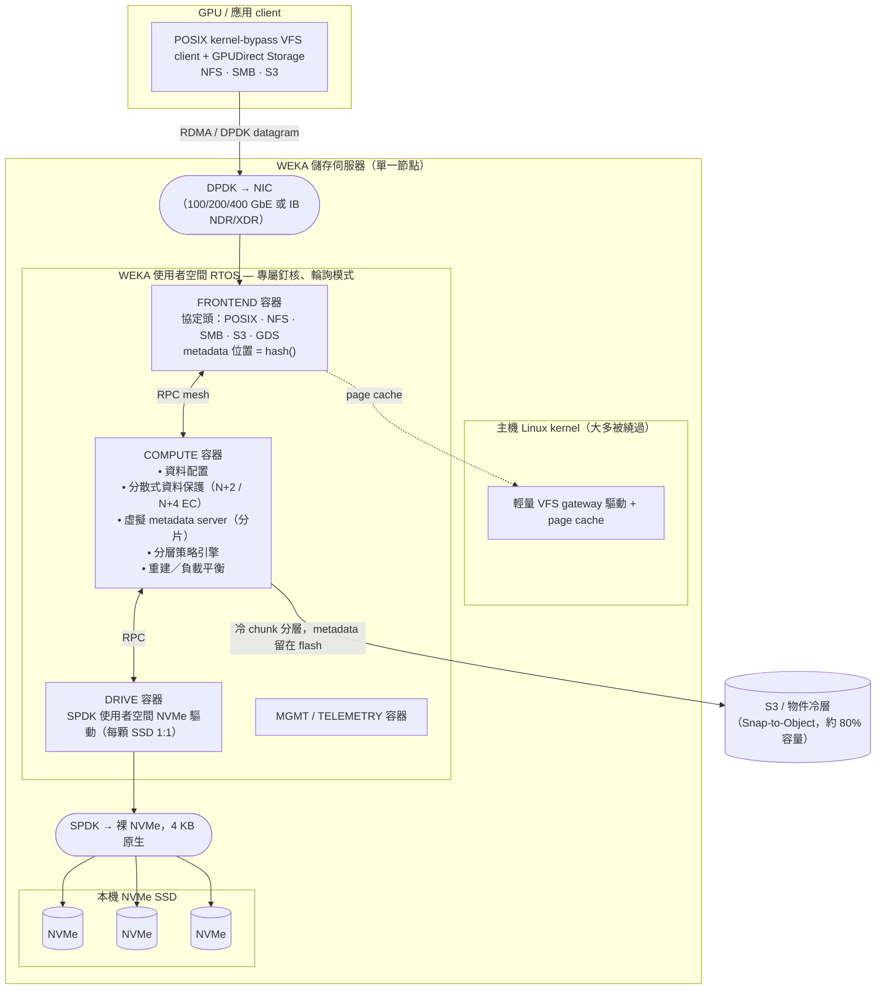
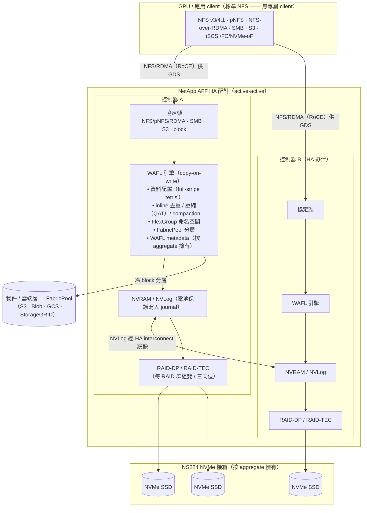
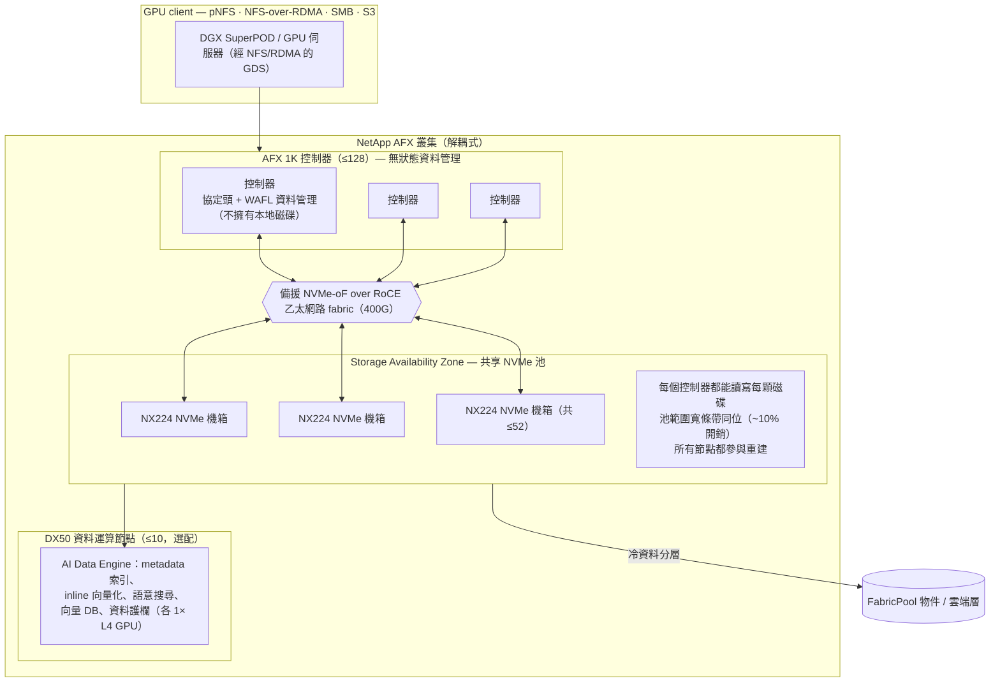

# WekaFS (WEKA NeuralMesh) vs NetApp ONTAP — 面向 AI/GPU 儲存的架構比較

*評估時間為 2026 年 6 月。WEKA 軟體 v5.1.x / NeuralMesh（2025 年 6 月改名）；NetApp ONTAP 9.18.1（2026 年 5 月）、AFF A 系列（2024）、AFX 解耦式 ONTAP（隨 ONTAP 9.17.1 於 2025 年 10 月 GA）。效能與價格數字皆為公開／廠商估計值，已於文中標註日期，詳見備註與 `## 來源`。*

## 摘要

WekaFS —— 現以 **WEKA NeuralMesh** 平台包裝 —— 是一套 **無共享（shared-nothing）、完全分散式的平行檔案系統**，以使用者空間 RTOS 形式執行於商規 NVMe x86 伺服器上，在網路（DPDK）與儲存（SPDK）兩條路徑上皆繞過 Linux kernel，並把*資料與 metadata 兩者*都分片散佈到叢集中的每一顆核心上，沒有專屬的 metadata server。它相對於企業 NAS 的單一差異化點在於：它是為了讓數千顆 GPU 持續飽載而設計的 —— 繞過 kernel 的 POSIX client、第一級的 NVIDIA GPUDirect Storage（GDS）路徑，以及最新的 **Augmented Memory Grid**，可把 LLM 的 KV-cache 從 GPU HBM 透過 RDMA 溢流到 NVMe。**NetApp ONTAP** 則是相反的哲學：一套成熟、統一的企業資料管理平台（快照、SnapMirror 複寫、NAS+SAN+S3 多協定、勒索軟體防護），其 AI 路線是透過 **標準 pNFS / NFS-over-RDMA —— 刻意*不用*專屬 client** 來達成，可跑在傳統雙控制器 **AFF** HA 配對設備上（WAFL + NVRAM + RAID-DP/TEC），或跑在新的 **AFX** 解耦式設計上 —— 後者透過 NVMe-oF/RoCE fabric 把控制器與 NVMe 機箱解耦，以追平平行檔案系統的頻寬。當目標是純粹的 GPU 餵食吞吐量、metadata 密集的小檔效能、以及推論 KV-cache 卸載，且你有預算上全 NVMe 時，選 WEKA；當你想要一個同時提供企業資料服務、厭惡專屬 client、且重視營運成熟度勝過尖峰跑分的平台時，選 NetApp。誠實的代價是：這兩者幾乎沒有共用的基準測試 —— WEKA 在 MLPerf Storage 與 IO500 領先（NetApp 不參加），NetApp 在 SPECstorage 2020 領先（WEKA 已不再提交），因此並不存在受控的正面對決。

## 比較表

| 維度 | **WEKA NeuralMesh / WekaFS** | **NetApp AFF（傳統 ONTAP）** | **NetApp AFX（解耦式 ONTAP）** |
|---|---|---|---|
| 類型 / 類別 | 無共享平行分散式檔案系統（軟體定義） | 統一橫向擴展 NAS+SAN 設備 | 解耦式橫向擴展檔案／物件平台 |
| 核心架構 | x86+NVMe 上的使用者空間 RTOS；資料+metadata 分片到所有核心；kernel-bypass（DPDK+SPDK） | 雙控制器 HA 配對；WAFL copy-on-write；NVRAM journal；最多 24 個 NAS 節點叢集 | 近乎無狀態的控制器（≤128）透過 RoCE/NVMe-oF fabric 連到共享的 NX224 NVMe 機箱池（≤52） |
| 資料保護 | 分散式抹除碼（DDP），**N+2 或 N+4**，叢集範圍條帶化，抗脆弱，僅重建資料、可優先化 | RAID 群組內 **RAID-DP**（雙同位）／ **RAID-TEC**（三同位） | 池範圍寬條帶同位；**「≤10% 開銷」**（NetApp 未公開說明是 EC 或 RAID） |
| Metadata 模型 | 完全分散；每顆核心皆有虛擬 metadata server；**位置以 hash 計算**，無中央 MDS | WAFL metadata 由單一控制器按 aggregate 擁有（HA 故障接管） | 與磁碟解耦；每個控制器都能讀寫 Storage Availability Zone 內的每顆磁碟 |
| 主要介面 / 協定 | POSIX（kernel-bypass VFS client）、**GPUDirect Storage**、NFS v3/4.1、SMB 2/3、S3 | NFS v3/4.x + **pNFS** + **NFS-over-RDMA**、SMB、S3、iSCSI/FC/**NVMe-oF** | **pNFS**、NFS、**NFS/RDMA**、SMB、S3（無 block；無專屬 client） |
| GPU/AI 餵食 | 第一級 GDS（NVIDIA cufile.json 中的 `fs:weka`）；kernel-bypass client；**Augmented Memory Grid** KV-cache 卸載 | 透過通用 NFS-over-RDMA + pNFS + session trunking 的 GDS（非具名 cufile tier） | 同樣 NFS/RDMA+pNFS GDS 路徑，頻寬更高；DX50 節點上的 AI Data Engine（向量／語意） |
| 熱層 / 媒體 | 僅 NVMe 熱層（所有 metadata 在 flash）+ S3 物件冷層（相當於 FabricPool：Snap-to-Object） | NVMe SSD（+ QLC C 系列）+ FabricPool 分層到物件／雲端 | NVMe SSD 池 + FabricPool 分層 |
| 橫向擴展命名空間 | 單一命名空間達 **14 EB / 6.4 兆檔案**；叢集達數百～數千節點 | FlexGroup 測試到 **20–60 PB / 4000 億檔案**；NAS 叢集上限 **24 節點** | >1 EB 有效容量；**128 控制器 + 52 機箱**（初版可能設較低上限） |
| 最佳適用 | GPU 訓練/推論、HPC、metadata 密集小檔、checkpoint、KV-cache 卸載 | 企業 NAS/SAN、混合工作負載、資料服務 + 標準 NFS 上的中度 AI | 想要平行檔案系統頻寬 + ONTAP 資料服務、且不要專屬 client 的 AI factory |
| 優勢 | 最高的已公開 GPU 餵食吞吐；分散式 metadata；快速重建；可雲端遷移；推論記憶體網格 | 成熟資料管理（Snapshot/SnapMirror/ARP/QoS）；多協定；營運簡單；無需部署 client | 運算與容量可獨立擴展；EB 級規模下的 ONTAP 服務；以極少 SSD 達 ~457 GiB/s |
| 劣勢 | 全 NVMe 成本；需 100GbE+/RDMA、專屬核心、SR-IOV；複雜；僅報價制；AI 數字為廠商自報 | 24 節點 NAS 上限；RAID 開銷與重建並行度較窄；無 kernel-bypass client；無 MLPerf 成績 | v1 產品（2025 年 10 月）；保護機制未具名；「1 EB 有效」假設樂觀壓縮比；新的故障模式 |
| 授權 / 取得模式 | 依可用 TB 訂閱軟體；經 AWS Marketplace PAYG（私有 offer）；WEKApod 設備；AWS/Azure/GCP/OCI 上 BYOL | 設備採購 + ONTAP One 授權；Keystone STaaS；雲端 FSx for ONTAP / Azure NetApp Files / CVO | 設備（AFX 1K + NX224 + 選配 DX50）+ ONTAP；Keystone「Enterprise AI STaaS」 |
| 成本（粗略、公開、標日期） | **無公開定價** —— 僅報價制。WEKApod Nitro：每節點起始讀 640 GB/s ／寫 320 GB/s，17M IOPS/42U 機櫃（datasheet，2025-11）。雲端：PAYG 時計、私有 offer | 地端無公開定價。雲端代理：**FSx ONTAP SSD $0.125/GB-月** + $0.017/IOPS-月 + $0.72/MBps-月（us-east-1，2026-06） | 無公開定價；經 Keystone STaaS（Extreme 層最低承諾 50 TiB） |

*成本與效能數字皆為所示日期下的公開定價或廠商 datasheet 估計值，會隨時間變動；請以最新報價核對。WEKA 與 NetApp AFF/AFX 的地端定價皆為報價制 —— 只有 NetApp 的雲端費率公開且精確。*

---

## 深入報告

### 1. 框定一切的單一差異化點

整個比較可化約為單一設計分岔：**client 是透過專屬的 kernel-bypass 平行檔案系統堆疊與儲存溝通，還是透過標準 NFS？**

- **WEKA 選了專屬路線。** DPDK/SPDK 使用者空間 RTOS、自製 POSIX VFS 驅動，以及具名的 GDS 整合，讓 WEKA 能在 CPU 與 kernel 都不介入的情況下把資料從 NIC 搬到 GPU。回報是已公開中最高的單 client GPU 餵食數字；代價則是營運複雜度、全 NVMe 的經濟成本與廠商鎖定。
- **NetApp 刻意拒絕了它。** ONTAP 的 AI 訴求字面上就是「對資料的平行存取，*不需要*複雜的平行檔案系統、*也不需要*專屬 client」—— 它改用 pNFS + NFS-over-RDMA。回報是任何標準 NFS client 都能用，並保留 ONTAP 的企業資料服務；代價是單 client 效率天花板，以及（在 AFX 之前）24 節點的 NAS 擴展上限。

底下所有內容 —— metadata 模型、資料保護、重建行為、GDS 成熟度 —— 都是這個分岔的下游結果。

### 2. 架構深入 —— WEKA 儲存伺服器

一台 WEKA 伺服器在 Linux kernel 旁執行一套**使用者空間 RTOS**，用 LXC 容器 + cgroups 把專屬的 CPU 核心、NVMe 裝置與 NIC 埠從 Linux 切走。網路路徑（DPDK）與儲存路徑（SPDK）都繞過 kernel，並以**輪詢（polling）**模式執行，消除了在一般 NAS 上掐住平行 I/O 的中斷／系統呼叫序列化。各功能被切成以容器化的微服務，即使同機共置也以 RPC 互通：

- **Frontend（FE）容器** —— client 進入點；承載 POSIX 路徑與 NFS/SMB/S3 處理器；透過 DPDK 直接與 NIC 對話；以 hash 計算 metadata 位置。
- **Compute（後端）容器** —— 「大腦」：虛擬 metadata server、資料配置、分散式抹除碼同位運算、分層、重建、負載平衡。
- **Drive 容器** —— 透過 SPDK（使用者空間、zero-copy）連到 NVMe 的最後一哩；通常每顆 SSD 一個 drive 容器。
- **Management／Telemetry 容器** —— GUI/CLI/REST、配額、快照、稽核。

**為何這對 GPU 很快。** 三個機制疊加：(1) kernel-bypass 移除每次 I/O 的系統呼叫／中斷開銷，使單一 client 即可推動數十 GB/s；(2) **完全分散的 metadata** —— 即使是單一檔案，每 1 MB chunk 也對應到不同的虛擬 metadata server 分片，因此 metadata 密集的 AI 模式（數百萬小檔、列目錄、隨機讀）不會卡在中央 MDS；(3) **GPUDirect Storage** 透過 RDMA 把位元組從 NIC 直送 GPU HBM，略過 CPU bounce buffer。

**資料保護（WEKA DDP）。** 分散式抹除碼，**N 個資料 + 2 或 +4 同位**，以 4 KB chunk 粒度跨叢集範圍的*故障域*（通常是整台伺服器；可設為磁碟／機櫃／AZ）條帶化。16+2 配置約有 83% 可用 NVMe。此機制是*抗脆弱的*：故障域越多，條帶中兩個 chunk 落在同一故障域的組合機率就越低，因此較大的叢集**更**有韌性。重建只觸及受影響檔案位於 flash 的資料、可優先化，並讓每個健康故障域並行參與 —— 與 RAID 群組本地重建形成鮮明對比。

**分層與命名空間。** 單一命名空間橫跨 NVMe flash 與 S3 物件；**metadata 永遠留在 flash**，冷檔 chunk 分層到物件（典型客戶約留 20% 在 flash）。快照是 copy-on-write 的 metadata 指標（瞬間完成）；**Snap-to-Object** 把完整快照提交到 S3 供 DR 與雲端突發使用。

### 3. 架構深入 —— NetApp 的兩種設計

NetApp 現在出貨*兩種*節點架構。傳統 **AFF HA 配對**是多數 ONTAP 部署所跑的；**AFX** 則是 2025 年針對 AI factory 的解耦式設計。兩者都跑 ONTAP，且都透過 NFS 餵 GPU —— 從不使用專屬 client。

#### 3a. 傳統 AFF 控制器（HA 配對模型）

關鍵特性：**WAFL 從不就地覆寫**（copy-on-write → 瞬間快照，但長期會有讀取碎片化）；寫入會 journal 到 **NVRAM 並鏡像到 HA 夥伴**，因此故障域是 *HA 配對*，而非整個叢集；保護是**同位 RAID**而非抹除碼，因此重建受限於 RAID 群組的磁碟數與擁有它的控制器；且每個 **aggregate 恰由一個控制器擁有** —— metadata *並非*像 WEKA 那樣全叢集分散。FlexGroup 把許多 FlexVol 組成份縫成單一命名空間，但每個組成份仍只有一個擁有節點，且 NAS 叢集上限為 **24 節點**。

#### 3b. AFX 解耦式 ONTAP（針對 AI 的設計）

AFX 是 NetApp 對平行檔案系統的結構性回應：**把控制器與容量解耦**，使你能獨立擴展 GPU 餵食頻寬（加控制器）與容量（加機箱），把所有 NVMe 匯入單一 **Storage Availability Zone**，其中*每個控制器都能定址每顆磁碟*，並移除 aggregate/RAID 群組這類管理物件，改用池範圍的寬條帶保護（datasheet 宣稱**≤10% 開銷**，暗示類似 EC 的寬條帶 —— 但 NetApp 未公開說明該機制，視為未證實）。選配的 **DX50** 節點在專屬 GPU 上跑 **AI Data Engine**（向量索引、語意搜尋），以免偷走資料路徑的運算週期。它仍提供**標準 pNFS/NFS** —— 無專屬 client —— 並完整保留 ONTAP 的快照、SnapMirror、安全性與多協定。

**值得注意的架構收斂：** AFX 把 NetApp *推向* WEKA 的全共享、分散式保護、獨立擴展模型 —— 但仍拒絕作為 WEKA 核心效率槓桿的專屬 kernel-bypass client。不過 AFX 是 v1 產品（隨 ONTAP 9.17.1 於 2025 年 10 月 GA），datasheet 本身也對初版上限有所保留。

### 4. WEKA 為何宣稱在 GPU/AI 上勝出

以下是 WEKA 陳述的機制；除另註明外，數字皆為廠商／合作夥伴自報：

- **Kernel-bypass client + GDS** —— 單一 client 推動數十 GB/s；資料直接落入 GPU HBM。NVIDIA 在 cufile.json 中把 `fs:weka` 列為第一級 GDS tier；NetApp 的 GDS 走通用的 `fs:nfs`（RDMA）路徑，存在真實的整合成熟度落差。
- **針對小檔／隨機 AI 模式的分散式 metadata** —— WEKA 宣稱相較傳統大區塊 NAS，小檔／metadata 讀取延遲低 4×–16×，因為沒有中央 MDS 卡住列目錄／隨機讀密集的訓練管線。
- **Checkpoint** —— write-to-new-location（無 read-modify-write）+ 單跳條帶化大寫入，適合突發的 checkpoint 風暴。
- **Augmented Memory Grid（2025–26 年主打）** —— 透過 GDS+RDMA 把 LLM 的 **KV-cache** 從 GPU HBM 卸載到 NVMe「Token Warehouse」，跨 session 持久化 context 並消除 prefill 重算。廠商／合作夥伴宣稱：KV-cache 容量約為 DRAM 的 1000 倍；**TTFT 最快 41×**（OCI 聯合測試觀察到 20×）；GTC 2026 數字為 **每 GPU token 量 6.5×** 與在 NVIDIA BlueField/STX 整合下 **320 GB/s 讀 / 150 GB/s 寫** 的記憶體吞吐。這些未經獨立稽核。
- **NVIDIA 認證** —— WEKApod Nitro 已取得 **DGX SuperPOD 認證**並與 NCP 對齊。

NetApp 的反駁不是去贏這些 micro-benchmark，而是主張多數企業不需要專屬 client 也能餵飽 GPU：AFX 在 8 節點叢集、僅*單一* NX224 機箱下，透過 pNFS+NFS/RDMA+GDS 達到 **457 GiB/s**，而 ONTAP 帶來 WEKA 不專注的資料服務。

### 5. 效能 —— 公開數據（以及為何對不上）

直白的事實：**WEKA 與 NetApp 沒有共用的基準測試。** WEKA 提交 MLPerf Storage 與 IO500（NetApp 不參加）；NetApp 提交 SPECstorage 2020（WEKA 已不再提交）。挑哪個基準，哪邊就「贏」。下表所有數字配置與日期皆不同 —— **切勿**把任何跨廠商列當成受控比較。

| 基準測試 | WEKA | NetApp | 備註 |
|---|---|---|---|
| **MLPerf Storage v1.0**（2024-09） | 3D-UNet/H100：**13 個加速器** @ >90% 使用率，34.57 GB/s；ResNet50/H100：**74 個加速器**，13.72 GB/s（單 client） | **未提交**（MLCommons 點名橫向 NAS 廠商缺席） | 廠商配置不同；WEKA 為單 client |
| **MLPerf Storage v2.0**（2025-08） | 未提交 | 未提交 | 雙方皆未參加；DDN 領先（每節點模擬 208 顆 H100） |
| **IO500 production** | Samsung 第 4 名：分數 **826.86**，248.67 GiB/s 頻寬，291 節點；MSKCC 第 7：665.49，261 節點 | **無條目** | 獨立（IO500），但無 NetApp 基線 |
| **SPECstorage 2020 eda_blended** | 無近期成績 | 8 節點 AFF A90：**8,100 job sets**，1.17 ms ORT，58,809 MB/s 尖峰 | 獨立（SPEC）；NetApp 在此領先 |
| **SPECstorage 2020 swbuild** | 無近期成績 | 8 節點 AFF A90：**11,040 builds**，1.42 ms ORT，44,906 MB/s | 獨立（SPEC） |
| **SPEC EDA（較舊）** | 3,600 job sets（6× Dell R7515 + 90 NVMe） | 6,300 job sets（4× A900） | 約 2023，*兩邊硬體不同* —— 非受控 |
| **GPUDirect Storage** | 對單台 DGX-2（16× V100）**113 GB/s**，約 5M IOPS —— *2020–21，V100 世代* | 4× AFF A90 上 **351 GiB/s**（NFS/RDMA，2024）；AFX 8 節點單機箱 **457 GiB/s**（2025） | 範圍／世代完全不可比 |
| **設備尖峰** | WEKApod Nitro：每節點起始讀 640 GB/s / 寫 320 GB/s；**17M IOPS / 42U 機櫃**（2025-11） | AFF A90：**每 HA 配對 2.4M IOPS**，約 100 µs 延遲；叢集規模約 1 TB/s | 廠商 datasheet，單位不同 |

**獨立分析師觀點：** GigaOm 2024 年 Scale-Out File Storage Radar 將兩者都列為 Leaders —— NetApp 為「成熟／平台型」，WEKA 為「創新／平台型」且在迭代節奏上為 Outperformer。並不存在以相同 AI 工作負載、受控的公開 $/GB/s 正面對決。

### 6. 營運模型、安全性、生態系

- **WEKA day-2：** Multi-Container Backend 支援不中斷的滾動升級；RAFT 選出的 metadata leader 在瞬間故障接管；重建可由管理員調速且僅針對資料。但你必須專屬切出核心／NIC、設定 SR-IOV/DPDK，並跑最少 8 節點叢集（融合式 Axon 需 25 節點，且強制 +4 同位）。WEKApod 設備的存在正是為了隱藏這份複雜度。
- **NetApp day-2：** 這是 NetApp 的主場 —— Snapshot、SnapMirror 同步/非同步複寫、MetroCluster、AI 驅動的自主勒索軟體防護（ONTAP 9.16+）、QoS、安全多租戶、BlueXP/Console 管理，以及數十年的營運工具。GPU 主機上無需部署任何 client。
- **安全性：** 兩者皆提供靜態與傳輸加密與多租戶。NetApp 另加成熟的勒索軟體偵測、MetroCluster 同步 DR、SnapLock WORM 合規 —— 皆非 WEKA 鎖定的領域。
- **生態系：** 兩者皆通過 NVIDIA DGX SuperPOD/BasePOD 認證且為 Kubernetes 原生（CSI）。WEKA 深耕 NVIDIA 推論堆疊（Dynamo、NIXL、TensorRT-LLM、Augmented Memory Grid）。NetApp 深耕超大規模雲端原生 ONTAP（FSx for NetApp ONTAP、Azure NetApp Files、Cloud Volumes ONTAP）與企業 data fabric。

### 7. 該選哪一個

**在以下情況選 WEKA NeuralMesh：**
- 你正在餵飽大型 GPU 叢集（訓練或推論），且單 client 吞吐是綁定約束。
- 你的工作負載是 metadata/小檔密集（多檔資料集、隨機讀）或 checkpoint 寫入突發。
- 你想要 LLM 推論的 KV-cache 卸載（Augmented Memory Grid）以縮短 TTFT 並擴大有效 context。
- 你有預算上全 NVMe + 帶 RDMA 的 100/200/400 GbE/IB，並能接受專屬 client 與報價制定價。
- 你需要在 AWS/Azure/GCP/OCI 上以相同軟體做雲端遷移。

**在以下情況選 NetApp ONTAP（AFF 或 AFX）：**
- 你想要一個同時做 AI *與*企業 NAS/SAN、含快照、複寫、勒索軟體防護與多協定的平台。
- 你拒絕在每台 GPU 主機上部署專屬 kernel-bypass client；標準 pNFS/NFS-over-RDMA 是硬性要求。
- 營運成熟度、支援與資料管理廣度勝過尖峰跑分。
- （特別是 AFX）你需要平行檔案系統等級的頻寬與 EB 級容量、運算/容量可獨立擴展，但仍在 ONTAP 生態系內 —— 且能容忍 v1 產品。
- 你重視混合部署下透明的雲端定價（FSx for ONTAP、Azure NetApp Files）。

**決策時的誠實提醒：**
- 不存在受控的 WEKA-vs-NetApp AI 基準；請把每個跨廠商數字當成指示性而非決定性。
- WEKA 的主打 AI 推論倍數（41× TTFT、6.5× token、1000× KV 容量）為廠商／合作夥伴自報，多來自 OCI 聯合測試 —— 未經獨立稽核。
- AFX 仍新（2025 年 10 月）；其資料保護機制未公開具名，且「1 EB 有效」假設了 AI 已壓縮資料鮮少達到的樂觀壓縮比。
- 兩家廠商的地端定價皆為報價制；只有 NetApp 的雲端費率公開且精確。

## 來源

- [WEKA NeuralMesh Architecture White Paper (WKA431-02, 07/25)](https://www.weka.io/wp-content/uploads/resources/2023/03/weka-architecture-white-paper.pdf) — accessed 2026-06
- [WEKA Distributed Data Protection white paper](https://www.weka.io/resources/white-paper/distributed-data-protection/) — accessed 2026-06
- [WEKA containers architecture overview (docs)](https://docs.weka.io/4.2/overview/weka-containers-architecture-overview) — accessed 2026-06
- [NeuralMesh by WEKA documentation (v5.1.x)](https://docs.weka.io/) — accessed 2026-06
- [WEKA release support and commitments](https://docs.weka.io/support/release-support-and-commitments) — accessed 2026-06
- [WEKA Introduces NeuralMesh (rebrand, Jun 18 2025)](https://www.weka.io/company/weka-newsroom/press-releases/weka-introduces-neuralmesh/) — accessed 2026-06
- [WEKA Augmented Memory Grid product page](https://www.weka.io/product/augmented-memory-grid/) — accessed 2026-06
- [WEKA Breaks the AI Memory Barrier with Augmented Memory Grid (GTC 2026)](https://www.prnewswire.com/news-releases/weka-breaks-the-ai-memory-barrier-with-augmented-memory-grid-on-neuralmesh-302618093.html) — accessed 2026-06
- [WEKA NeuralMesh AIDP & STX Integration, GTC 2026 (NAND Research)](https://nand-research.com/weka-neuralmesh-aidp-stx-integration-gtc-2026/) — accessed 2026-06
- [WEKApod product/environment page](https://www.weka.io/data-platform/environment/wekapod/) — accessed 2026-06
- [WEKApod next-generation AI storage appliances datasheet (WKA446-01, Nov 2025)](https://www.weka.io/wp-content/uploads/files/resources/2025/11/wekapod-next-generation-ai-storage-appliances-datasheet.pdf) — accessed 2026-06
- [NVIDIA DGX SuperPOD with WEKApod reference architecture](https://www.weka.io/resources/reference-architecture/nvidia-dgx-superpod-with-wekapod-data-platform-appliance/) — accessed 2026-06
- [WEKApod SuperPOD integration (Blocks & Files, Mar 19 2024)](https://blocksandfiles.com/2024/03/19/wekapod-storage-integration-for-superpod/) — accessed 2026-06
- [WEKApod appliance built for Nvidia GPUs (TechTarget, Mar 21 2024)](https://www.techtarget.com/searchstorage/news/366574918/WEKApod-appliance-built-for-Nvidia-GPUs-a-first-for-company) — accessed 2026-06
- [WEKA Fit-for-Purpose GPU Utilization (MLPerf v1.0 numbers)](https://www.weka.io/blog/gpu/fit-for-purpose-gpu-utilization/) — accessed 2026-06
- [WEKA + Micron 6500 ION — 256 AI accelerators](https://www.micron.com/about/blog/storage/partners/weka-storage-with-micron-6500-ion-ssd-supports-256-ai-accelerators) — accessed 2026-06
- [WEKA Microsoft Research GPUDirect performance (113 GB/s)](https://www.weka.io/blog/gpu/microsoft-performance-gpudirect/) — accessed 2026-06
- [WEKApod Prime and Nitro (StorageReview, Nov 2025)](https://www.storagereview.com/news/wekapod-prime-and-nitro-next-generation-storage-platforms-for-ai-factories) — accessed 2026-06
- [WEKA's new appliances (Blocks & Files, Nov 19 2025)](https://blocksandfiles.com/2025/11/19/wekas-new-appliances-can-run-its-gpu-memory-wall-busting-software/) — accessed 2026-06
- [NeuralMesh by WEKA — AWS Marketplace](https://aws.amazon.com/marketplace/pp/prodview-2mfqnh6p4yurs) — accessed 2026-06
- [NetApp ONTAP release notes](https://docs.netapp.com/us-en/ontap/release-notes/) — accessed 2026-06
- [NetApp AFX / AI Data Engine launch (press, Oct 14 2025)](https://www.netapp.com/newsroom/press-releases/news-rel-20251014-129058/) — accessed 2026-06
- [NetApp disaggregates ONTAP + AI Data Engine (Blocks & Files, Oct 14 2025)](https://blocksandfiles.com/2025/10/14/netapp-disaggregates-ontap-storage-and-provides-an-ai-data-engine/) — accessed 2026-06
- [NetApp disaggregated ONTAP AI analysis (StorageMath)](https://storagemath.com/posts/netapp-disaggregated-ontap-ai-analysis/) — accessed 2026-06
- [NetApp ONTAP AFX software architecture (docs)](https://docs.netapp.com/us-en/ontap-afx/get-started/software-architecture.html) — accessed 2026-06
- [NetApp ONTAP AFX FAQ](https://docs.netapp.com/us-en/ontap-afx/faq-ontap-afx.html) — accessed 2026-06
- [AFF A90 validation for NVIDIA DGX SuperPOD](https://www.netapp.com/product-updates/aff-a90-validation-nvidia-dgx-superpod/) — accessed 2026-06
- [NetApp DGX SuperPOD / NCP / NVIDIA-Certified validation (press, Mar 18 2025)](https://www.netapp.com/newsroom/press-releases/news-rel-20250318-592455/) — accessed 2026-06
- [ONTAP reaches 171 GiB/s GPUDirect Storage (NetApp blog, Apr 28 2023)](https://www.netapp.com/blog/ontap-reaches-171-gpudirect-storage/) — accessed 2026-06
- [Optimize GPU-accelerated workloads on NetApp (351 GiB/s, 4× A90)](https://community.netapp.com/t5/Tech-ONTAP-Blogs/Optimize-GPU-Accelerated-Workloads-on-NetApp-Storage-Systems-using-NVIDIA/ba-p/432583) — accessed 2026-06
- [AFX AI-ready storage (457 GiB/s, NetApp blog, Oct 2025)](https://www.netapp.com/blog/afx-ai-ready-storage-enterprise-ai-innovation/) — accessed 2026-06
- [SPECstorage 2020 — 8-node AFF A90 swbuild result](https://www.spec.org/storage2020/results/res2025q2/storage2020-20250414-00125.html) — accessed 2026-06
- [SPECstorage 2020 — 8-node AFF A90 eda_blended result](https://www.spec.org/storage2020/results/res2024q3/storage2020-20240708-00080.html) — accessed 2026-06
- [NVIDIA GPUDirect Storage configuration guide (supported FS list)](https://docs.nvidia.com/gpudirect-storage/configuration-guide/index.html) — accessed 2026-06
- [NetApp NFS over RDMA documentation](https://docs.netapp.com/us-en/ontap/nfs-rdma/) — accessed 2026-06
- [NetApp AIPod Mini TR-5010](https://www.netapp.com/media/136916-tr-5010-netapp-aipod-mini.pdf) — accessed 2026-06
- [FlexGroup Volumes: A Distributed WAFL File System (USENIX ATC'19)](https://www.usenix.org/system/files/atc19-kesavan.pdf) — accessed 2026-06
- [Back to Basics: RAID-DP (NetApp community)](https://community.netapp.com/t5/Tech-ONTAP-Articles/Back-to-Basics-RAID-DP/ta-p/86123) — accessed 2026-06
- [WAFL / NVLog / CP internals (whydoyoulikewafls)](https://whydoyoulikewafls.wordpress.com/) — accessed 2026-06
- [NetApp updates mid- and high-end A-Series (blog.iops.ca, May 2024)](https://blog.iops.ca/2024/05/14/netapp-updates-their-mid-and-high-end-a-series/) — accessed 2026-06
- [NetApp FlexGroup definition/limits (docs)](https://docs.netapp.com/us-en/ontap/flexgroup/definition-concept.html) — accessed 2026-06
- [MLPerf Storage v1.0 results (MLCommons)](https://mlcommons.org/2024/09/mlperf-storage-v1-0-benchmark-results/) — accessed 2026-06
- [MLPerf Storage v2.0 results (MLCommons)](https://mlcommons.org/2025/08/mlperf-storage-v2-0-results/) — accessed 2026-06
- [IO500 production list (SC25)](https://io500.org/list/sc25/production) — accessed 2026-06
- [NetApp trounces WEKA in SPC EDA benchmark (Blocks & Files, May 2023)](https://blocksandfiles.com/2023/05/05/netapp-trounces-weka-in-spc-electronic-design-automation-benchmark/) — accessed 2026-06
- [GigaOm Scale-Out File Storage Radar (Blocks & Files summary, Dec 2024)](https://blocksandfiles.com/2024/12/11/gigaoms-scaled-out-scale-out-storage-supplier-radar-review/) — accessed 2026-06
- [Amazon FSx for NetApp ONTAP pricing](https://aws.amazon.com/fsx/netapp-ontap/pricing/) — accessed 2026-06
- [Azure NetApp Files pricing](https://azure.microsoft.com/en-us/pricing/details/netapp/) — accessed 2026-06
- [NetApp Keystone STaaS pricing](https://docs.netapp.com/us-en/keystone-staas/concepts/pricing.html) — accessed 2026-06
